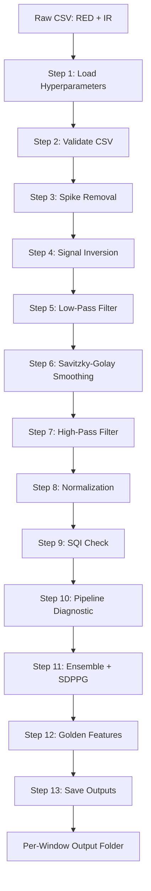

# Automated PPG Signal Processing Pipeline

> A 12-stage automated pipeline that processes raw photoplethysmography (PPG) signals into clean ensemble-averaged beats with comprehensive quality assessment, designed for non-invasive glucose estimation research.

---

## TL;DR

This Python tool takes raw PPG sensor data (RED + IR channels from MAX30102 or similar) and produces clean, ensemble-averaged single-beat templates ready for feature extraction and machine learning. It handles filtering, beat detection, signal quality assessment, and outputs everything in a fully-traceable folder structure.

**Quick Stats:**
- 12-stage processing pipeline
- ~3,000 lines of code
- 3 processing modes (BATCH / SINGLE / MULTI)
- Per-window quality assessment (5 SQI metrics)
- Adaptive beat rejection with detailed diagnostics
- ~30 seconds processing time per 15-second window

---

## Table of Contents

1. [TL;DR](#tldr)
2. [Quick Start](#quick-start)
3. [Background & Motivation](#background--motivation)
4. [Pipeline Overview](#pipeline-overview)
5. [Features & Capabilities](#features--capabilities)
6. [Installation & Prerequisites](#installation--prerequisites)
7. [Input Data Format](#input-data-format)
8. [Output Structure](#output-structure)
9. [Usage Examples](#usage-examples)
10. [Pipeline Stages — Detailed Methodology](#pipeline-stages--detailed-methodology)
11. [Hyperparameter Reference](#hyperparameter-reference)
12. [Key Functions & Architecture](#key-functions--architecture)
13. [Quality Assessment](#quality-assessment)
14. [Troubleshooting & Tuning Guide](#troubleshooting--tuning-guide)

---

## Quick Start

### Minimum Steps to Run

```bash
# 1. Clone or download the script
# 2. Create a virtual environment
python -m venv ppg_env

# 3. Activate it (Windows)
ppg_env\Scripts\activate

# 4. Install dependencies
pip install numpy pandas scipy matplotlib

# 5. Open the script and set your paths at the top:
#    INPUT_ROOT_PATH  = r"path/to/your/windowed/csv/folders"
#    OUTPUT_ROOT_PATH = r"path/where/you/want/output"

# 6. Run the script
python Automated_Signal_Processing_Code.py

# 7. Choose a processing mode when prompted:
#    [1] BATCH  - process all subjects
#    [2] SINGLE - pick one folder via popup
#    [3] MULTI  - pick multiple folders one by one

# 8. Wait for processing. Check the output folder.
```

### Expected First Run Output

You should see:
- Terminal output showing per-window processing progress
- An output folder structure with CSVs, JSONs, and PNG plots for each window
- A combined report JSON per subject

If beats are being rejected, see the [Troubleshooting](#troubleshooting--tuning-guide) section.

---

## Background & Motivation

### What is a PPG Signal?

Photoplethysmography (PPG) is an optical technique that measures volumetric changes in blood circulation. A small sensor (e.g., MAX30102) shines two wavelengths of light (RED ~660 nm and Infrared ~880 nm) into a finger and measures how much light is reflected back. As blood pulses through capillaries, the absorbed light varies — producing a characteristic waveform with one peak per heartbeat.

### Why Does Raw PPG Need Processing?

A raw PPG signal contains:
- **High-frequency noise** from electrical interference and sensor jitter
- **Low-frequency drift** from breathing, body movement, and temperature changes
- **Motion artifacts** that can completely distort beat morphology
- **Inverted polarity** depending on whether the sensor measures transmission or reflection
- **DC offset** that needs separation from the AC (pulsatile) component

Without processing, raw PPG is unusable for any downstream analysis (heart rate, blood oxygen, glucose estimation, etc.).

### Why Automation?

Manual signal processing works for a single recording but becomes impossible at scale:
- A typical study has 50+ subjects
- Each subject has 10-20 windows (15 seconds each)
- That's 500-1000 windows requiring identical processing
- Manual processing introduces inconsistency between recordings

This pipeline automates the entire workflow with **full traceability** — every output file is linked to its inputs, hyperparameters, and processing date via JSON metadata.

### Where This Fits in the Glucose Estimation Pipeline

```
[Raw Sensor Data] -> [THIS PIPELINE] -> [Clean Ensemble Beats] -> [Feature Extraction] -> [ML Model] -> [Glucose Prediction]
                          ^
                     You are here
```

This module produces the clean ensemble-averaged beat templates that feed into the feature extraction module.

---

## Pipeline Overview

### Text-Based Flowchart

```
   +-----------------------------------------+
   |  Raw CSV File (RED + IR samples)        |
   +------------------+----------------------+
                      |
                      v
   +-----------------------------------------+
   |  STEP 1: Hyperparameter Loading         |   Configuration
   +------------------+----------------------+
                      v
   +-----------------------------------------+
   |  STEP 2: CSV Validation & Selection     |   Input Validation
   +------------------+----------------------+
                      v
   +-----------------------------------------+
   |  STEP 3: Spike Removal (Median Filter)  |   Pre-processing
   +------------------+----------------------+
                      v
   +-----------------------------------------+
   |  STEP 4: Signal Inversion               |   Pre-processing
   +------------------+----------------------+
                      v
   +-----------------------------------------+
   |  STEP 5: Low-Pass Filter (16 Hz)        |   Filtering
   +------------------+----------------------+
                      v
   +-----------------------------------------+
   |  STEP 6: Savitzky-Golay Smoothing       |   Filtering (optional)
   +------------------+----------------------+
                      v
   +-----------------------------------------+
   |  STEP 7: High-Pass Filter (0.5 Hz)      |   Filtering
   +------------------+----------------------+
                      v
   +-----------------------------------------+
   |  STEP 8: Normalization (MinMax/ZScore)  |   Scaling
   +------------------+----------------------+
                      v
   +-----------------------------------------+
   |  STEP 9: Signal Quality Index (SQI)     |   Quality Check
   +------------------+----------------------+
                      v
   +-----------------------------------------+
   |  STEP 10: Pipeline Diagnostic           |   All-stages quality
   +------------------+----------------------+
                      v
   +-----------------------------------------+
   |  STEP 11: Ensemble Detection + SDPPG    |   Beat detection
   +------------------+----------------------+
                      v
   +-----------------------------------------+
   |  STEP 12: Golden Standard Features      |   Feature extraction
   +------------------+----------------------+
                      v
   +-----------------------------------------+
   |  STEP 13: Save Outputs + Validate       |   File I/O
   +------------------+----------------------+
                      v
   +-----------------------------------------+
   |  Per-Window Output Folder               |
   |  (CSVs + Config JSON + Plots)           |
   +-----------------------------------------+
```

### Mermaid Version (renders on GitHub)



### Stage Summary

| # | Stage | What It Does |
|---|---|---|
| 1 | Hyperparameter Loading | Loads all configurable parameters at startup |
| 2 | CSV Validation | Verifies input format and applies thresholds |
| 3 | Spike Removal | Removes single-sample noise using median filter |
| 4 | Signal Inversion | Flips signal so systolic peaks point up |
| 5 | Low-Pass Filter | Removes noise above 16 Hz |
| 6 | Savitzky-Golay | Optional polynomial smoothing |
| 7 | High-Pass Filter | Removes baseline drift below 0.5 Hz |
| 8 | Normalization | Scales signal to 0-1 or zero-mean unit-variance |
| 9 | Signal Quality | Computes 5 metrics (skewness, kurtosis, PI, ZCR, SNR) |
| 10 | Pipeline Diagnostic | Tracks quality through every stage |
| 11 | Ensemble Detection | Detects beats, builds averaged single-beat template |
| 12 | Golden Features | Extracts morphological features from ensemble |
| 13 | Save Outputs | Writes CSVs, JSON, and plots to organized folder |

### Suggested Diagram to Create

```
DIAGRAM 1: System Architecture Flowchart

Create a horizontal flowchart with:
  - 13 colored boxes (one per pipeline stage)
  - Arrows showing data flow from left to right
  - Color groups:
    * GRAY:    Input/Output (Steps 1, 13)
    * BLUE:    Pre-processing (Steps 2-4)
    * GREEN:   Filtering (Steps 5-7)
    * YELLOW:  Normalization (Step 8)
    * ORANGE:  Quality assessment (Steps 9-10)
    * PURPLE:  Feature extraction (Steps 11-12)
  - Below each box: 1-line description
  - Tool suggestion: Excalidraw, draw.io, or PowerPoint
  - Size: Landscape, 1920x1080
```

---

## Features & Capabilities

### Core Functionality

- **End-to-end processing** — Raw CSV in, analyzed beats out
- **Dual-channel handling** — Processes RED and IR simultaneously
- **Automatic beat detection** — Foot-to-foot segmentation using VPG zero-crossing
- **Ensemble averaging** — Aligns and averages all beats into one clean template
- **SDPPG fiducial detection** — Locates a, b, c, d, e points on second derivative

### Three Processing Modes

| Mode | Use Case | How to Trigger |
|---|---|---|
| **BATCH** | Process all subjects at once | Enter `1` when prompted |
| **SINGLE** | Process one subject via folder picker | Enter `2` when prompted |
| **MULTI** | Pick several specific folders one by one | Enter `3` when prompted |

### Quality Assurance

- **5-metric Signal Quality Index** at every stage
- **Per-pulse rejection logging** with reasons (foot-to-peak too short, beat duration out of range, etc.)
- **Adaptive outlier filter** rejects beats deviating from median duration
- **Window-level rejection** if not enough valid beats found
- **Numerical validation** of saved CSVs against in-memory data

### Configurability

- **All hyperparameters at top of code** — No need to dig through functions
- **Toggle-able stages** — Enable/disable filters individually
- **Per-channel beat thresholds** — Different minimums for IR vs RED
- **Adjustable rejection criteria** — Tune for any subject's heart rate range

### Output Traceability

- **JSON metadata per window** — Records all hyperparameters used
- **Combined per-subject report** — Aggregates all windows for a subject
- **Pipeline chain tracking** — Links output back to source CSV
- **Stage-by-stage plots** — PNG visualizations for every processing step
- **Rejection plots** — Saved even for failed windows for debugging

### Failure Handling

- **Graceful rejection** — Bad windows don't crash the pipeline
- **Detailed rejection diagnostics** — See exactly why each beat/window failed
- **Continue-on-failure** — Other windows process even if one fails
- **Verbose diagnostic mode** — Toggle for deep debugging


---

## Installation & Prerequisites

### System Requirements

| Requirement | Minimum | Recommended |
|---|---|---|
| **Python** | 3.10 | 3.11 or 3.12 |
| **OS** | Windows 10 / Ubuntu 20.04 / macOS 11 | Windows 11 / Ubuntu 22.04 |
| **RAM** | 4 GB | 8 GB |
| **Disk Space** | 500 MB per subject | 5 GB for batch processing |
| **CPU** | Dual-core 2.0 GHz | Quad-core 2.5+ GHz |

### Python Dependencies

The pipeline requires these libraries:

```
numpy >= 1.24.0
pandas >= 2.0.0
scipy >= 1.10.0
matplotlib >= 3.7.0
```

All other imports (`os`, `json`, `glob`, `shutil`, `tkinter`, `datetime`, etc.) are part of the Python standard library and require no separate installation.

### Setup Instructions

#### Step 1: Create a Virtual Environment

```bash
# Navigate to your project folder
cd /path/to/your/project

# Create virtual environment
python -m venv ppg_env
```

#### Step 2: Activate the Environment

**Windows (Command Prompt):**
```bash
ppg_env\Scripts\activate
```

**Windows (PowerShell):**
```powershell
ppg_env\Scripts\Activate.ps1
```

**Linux / macOS:**
```bash
source ppg_env/bin/activate
```

You'll know it's active when you see `(ppg_env)` in your terminal prompt.

#### Step 3: Install Dependencies

**Option A: Direct install**
```bash
pip install numpy pandas scipy matplotlib
```

**Option B: Using requirements.txt**

Create a `requirements.txt` file with:
```
numpy>=1.24.0
pandas>=2.0.0
scipy>=1.10.0
matplotlib>=3.7.0
```

Then install:
```bash
pip install -r requirements.txt
```

#### Step 4: Verify Installation

```bash
python -c "import numpy, pandas, scipy, matplotlib; print('All dependencies OK')"
```

If you see `All dependencies OK`, you're ready to go.

### Tkinter (for GUI folder pickers)

Tkinter is included with Python on Windows and macOS by default. On some Linux distributions, you may need to install it separately:

**Ubuntu / Debian:**
```bash
sudo apt-get install python3-tk
```

**Fedora / RHEL:**
```bash
sudo dnf install python3-tkinter
```

---

## Input Data Format

### Expected CSV Structure

The pipeline expects CSV files with two required columns: `RED` and `IR`. Column names are case-insensitive and the code automatically renames common variations.

**Accepted column name variations:**
- `RED`, `IR` (preferred)
- `RED_VALUE`, `IR_VALUE`
- `RED VALUE`, `IR VALUE`
- `RED_RAW`, `IR_RAW`

### Sample Input File

```csv
RED,IR
324132,412856
324518,413102
324612,413289
324845,413567
325120,413892
...
```

Each row is one sample from the PPG sensor. The pipeline assumes a sampling rate of **400 Hz** by default (configurable via the `FS` hyperparameter).

### Window Duration

Each input CSV should represent a **15-second window**:
- 15 seconds × 400 Hz = **6,000 samples per channel**
- The pipeline accepts other lengths but is optimized for this duration

### File Naming Convention

Files should be named with the pattern:
```
{subject_id}_Win{n}.csv
```

**Examples:**
- `Ali(22-enc-12)v1_Win0.csv`
- `Jamil(23-enc-46)v2_Win10.csv`
- `Subject_001_Win5.csv`

The pipeline uses the `_Win` suffix to extract the subject prefix for organizing outputs.

### Expected Folder Structure

The pipeline expects each subject's windows to be in their own folder:

```
INPUT_ROOT_PATH/
├── Ali(22-enc-12)v1_Windowed/
│   ├── Ali(22-enc-12)v1_Win0.csv
│   ├── Ali(22-enc-12)v1_Win1.csv
│   ├── Ali(22-enc-12)v1_Win2.csv
│   └── ... (more windows)
│
├── Jamil(23-enc-46)v2_Windowed/
│   ├── Jamil(23-enc-46)v2_Win0.csv
│   ├── Jamil(23-enc-46)v2_Win1.csv
│   └── ... (more windows)
│
└── Mirzan(23-enc-12)v3_Windowed/
    ├── Mirzan(23-enc-12)v3_Win0.csv
    └── ... (more windows)
```

### Data Quality Requirements

For best results, input data should:
- ✅ Have minimum 50 valid samples (after threshold filtering)
- ✅ Contain reasonable PPG morphology (visible heartbeats)
- ✅ Be free of complete signal dropouts (all zeros)
- ✅ Be sampled at a consistent rate

The pipeline includes threshold filters (`THRESHOLD_RED`, `THRESHOLD_IR`) to remove invalid readings before processing.

---

## Output Structure

### Per-Subject Output Folder

For each subject processed, the pipeline creates this structure:

```
OUTPUT_ROOT_PATH/
└── {subject_id}_Filtered/                              <- Subject folder
    │
    ├── {subject_id}_Win0_Filtered/                     <- Per-window folder
    │   ├── {subject_id}_Win0_Filtered_Full.csv         <- Filtered signal data
    │   ├── {subject_id}_Win0_Filtered_Ensemble.csv     <- Ensemble + derivatives
    │   ├── {subject_id}_Win0_Filtered_Configuration.json  <- Per-window config
    │   ├── 09_Debug/                                   <- Foot detection plots
    │   │   ├── {subject_id}_Win0_IR_09_FootCheck.png
    │   │   └── {subject_id}_Win0_RED_09_FootCheck.png
    │   ├── 10_Ensemble/                                <- Ensemble waveform plots
    │   │   ├── {subject_id}_Win0_IR_10_Ensemble.png
    │   │   └── {subject_id}_Win0_RED_10_Ensemble.png
    │   └── 11_PulseNumbering/                          <- Pulse-by-pulse plots
    │       ├── {subject_id}_Win0_IR_11_Numbering.png
    │       └── {subject_id}_Win0_RED_11_Numbering.png
    │
    ├── {subject_id}_Win1_Filtered/                     <- More windows...
    │   └── (same structure)
    │
    ├── {subject_id}_Win2_Filtered/
    │   └── (same structure)
    │
    └── {subject_id}_Additional/                        <- Subject-level extras
        ├── {subject_id}_Combined_Report.json           <- All windows summary
        └── Plots/                                       <- Stage-by-stage plots
            ├── 02_Raw_Selection/
            │   ├── {subject_id}_Win0_02_Raw.png
            │   └── ...
            ├── 03_Despiked/
            ├── 04_Inverted/
            ├── 05_LowPass_Filtered/
            ├── 06_SG_Smoothed/
            ├── 07_HighPass_Filtered/
            └── 08_Normalized/
```

### Output File Contents

#### 1. `*_Filtered_Full.csv` (per-window)

Contains the full-resolution filtered signal data for both channels at every processing stage:

| Column | Description |
|---|---|
| `Red_AC_HighPass` | RED channel after high-pass (AC component) |
| `IR_AC_HighPass` | IR channel after high-pass (AC component) |
| `Red_DC_LowPass` | RED channel after low-pass (DC + baseline) |
| `IR_DC_LowPass` | IR channel after low-pass (DC + baseline) |
| `Red_Normalized` | RED channel after normalization |
| `IR_Normalized` | IR channel after normalization |

**Row count:** Same as input (typically 6,000 for a 15-second window)

#### 2. `*_Filtered_Ensemble.csv` (per-window)

Contains the ensemble-averaged single beat template plus derivatives:

| Column | Description |
|---|---|
| `Time_Red_s` | Time axis for RED ensemble (seconds) |
| `Red_Ensemble_Avg` | Averaged RED beat (amplitude) |
| `Red_VPG` | First derivative of RED beat |
| `Red_SDPPG` | Second derivative of RED beat |
| `Time_IR_s` | Time axis for IR ensemble (seconds) |
| `IR_Ensemble_Avg` | Averaged IR beat (amplitude) |
| `IR_VPG` | First derivative of IR beat |
| `IR_SDPPG` | Second derivative of IR beat |

**Row count:** Typically 220 (configurable via `ENSEMBLE_TARGET_LEN`)

#### 3. `*_Filtered_Configuration.json` (per-window)

Comprehensive JSON containing:
- **Metadata:** Source file, timestamps, status
- **Hyperparameters:** All configurable values used for this window
- **Folder structure:** Output paths
- **Signal quality:** SQI metrics per channel
- **Pipeline diagnostic:** Stage-by-stage quality tracking
- **PPG features:** Per-channel feature extraction
- **Golden standard features:** Ensemble-based features
- **Ensemble metadata:** Beats used, fiducials, etc.

#### 4. `*_Combined_Report.json` (per-subject)

Subject-level aggregated report containing:
- **Subject info:** Name, processing date, mode
- **Hyperparameters used:** For traceability
- **Window summaries:** Success / Rejected / Failed counts
- **Detailed rejection reasons:** For each rejected window
- **Validation reports:** Numerical integrity checks
- **Per-window metrics:** Quality and feature summaries

### Plot Files

All plots are saved as PNG images at 100 DPI. Each plot has a descriptive filename indicating:
- The subject and window
- The channel (IR or RED)
- The pipeline stage
- The plot type

**Example plot names:**
- `Ali(22-enc-12)v1_Win0_02_Raw.png` — Raw signal visualization
- `Ali(22-enc-12)v1_Win0_05_LowPass.png` — After low-pass filter
- `Ali(22-enc-12)v1_Win0_IR_10_Ensemble.png` — IR ensemble waveform
- `Ali(22-enc-12)v1_Win0_RED_REJECTED.png` — Rejected window with reasons

### Suggested Diagram to Create

```
DIAGRAM 2: Folder Structure Tree

Create a hierarchical tree diagram showing:
  - Top level: INPUT_ROOT_PATH and OUTPUT_ROOT_PATH side-by-side
  - INPUT side: Show 3 sample subject folders with CSV files inside
  - OUTPUT side: Show full output hierarchy for one subject
  - Use folder icons for directories, file icons for files
  - Color coding:
    * GRAY: Folders
    * BLUE: CSV files
    * GREEN: JSON files
    * PURPLE: PNG plots
  - Tool suggestion: TreeView.app, Excalidraw, or PowerPoint
  - Size: Portrait, 1080x1920
```

---

## Usage Examples

### Example 1: BATCH Mode (Process All Subjects)

**Scenario:** You have 10 subject folders ready and want to process all of them.

**Steps:**

```bash
# 1. Open the script in your editor
# 2. Verify the paths at the top of the file:
INPUT_ROOT_PATH = r"C:\Users\YourName\Documents\fyp\05_Data_Storage\03_Windowed"
OUTPUT_ROOT_PATH = r"C:\Users\YourName\Documents\fyp\05_Data_Storage\04_Filtered"

# 3. Run the script
python Automated_Signal_Processing_Code.py

# 4. When prompted, enter: 1

# 5. Wait for processing (typical: 30 seconds × number of windows)
```

**Expected terminal output:**
```
======================================================================
  SELECT PROCESSING MODE
======================================================================
  1) BATCH  - Process ALL subfolders inside:
              C:\Users\YourName\Documents\fyp\05_Data_Storage\03_Windowed
  2) SINGLE - Pop up dialog to choose ONE folder
  3) MULTI  - Pop up dialog to choose MULTIPLE folders one by one
======================================================================
  Enter choice [1, 2, or 3]: 1

BATCH MODE - found 10 subject folder(s) to process:
   * Ali(22-enc-12)v1_Windowed
   * Hammadh(23-enc-08)v2_Windowed
   * Jamil(23-enc-46)v2_Windowed
   * Majid(24-mct-59)v2_Windowed
   ...

[1/10] STARTING SUBJECT: Ali(22-enc-12)v1_Windowed
[1/15] Processing: Ali(22-enc-12)v1_Win0.csv
   DONE - RED beats: 18, IR beats: 19 | Validation: PASS
[2/15] Processing: Ali(22-enc-12)v1_Win1.csv
   DONE - RED beats: 17, IR beats: 18 | Validation: PASS
...

FINAL BATCH SUMMARY
   Total files     : 150
   Successful      : 142
   Rejected        : 7
   Failed          : 1
```

### Example 2: SINGLE Mode (Process One Subject)

**Scenario:** You collected new data from one subject and want to test it before batch processing.

**Steps:**

```bash
# 1. Run the script
python Automated_Signal_Processing_Code.py

# 2. When prompted, enter: 2

# 3. A folder picker popup will appear
# 4. Navigate to the desired subject folder (e.g., Subject_New_Windowed/)
# 5. Click "Select Folder"

# 6. Processing begins for that single subject
```

**Use when:**
- Testing new data collection
- Re-processing one subject after parameter changes
- Debugging issues with specific data

### Example 3: MULTI Mode (Process Selected Subjects)

**Scenario:** You want to re-process only 3 specific subjects without affecting others.

**Steps:**

```bash
# 1. Run the script
python Automated_Signal_Processing_Code.py

# 2. When prompted, enter: 3

# 3. For each subject you want to process:
#    - Folder picker popup appears
#    - Select the desired subject folder
#    - Click "Select Folder"
#    - Terminal asks: "Add another folder? [Y/n]:"
#    - Type Y to add more, N to finish

# 4. Once you say N, processing begins for all selected subjects
```

**Expected terminal flow:**
```
MULTI MODE - SELECT FOLDERS ONE BY ONE
  Each popup opens at: C:\Users\YourName\Documents\fyp\05_Data_Storage\03_Windowed
  Cancel any popup to finish selecting.

[Popup opens, you pick Ali folder]
  Added [1]: Ali(22-enc-12)v1_Windowed  (15 CSV files)
  Currently selected: 1 folder(s)
  Add another folder? [Y/n]: y

[Popup opens, you pick Jamil folder]
  Added [2]: Jamil(23-enc-46)v2_Windowed  (15 CSV files)
  Currently selected: 2 folder(s)
  Add another folder? [Y/n]: y

[Popup opens, you pick Majid folder]
  Added [3]: Majid(24-mct-59)v2_Windowed  (15 CSV files)
  Currently selected: 3 folder(s)
  Add another folder? [Y/n]: n
  Finished selecting folders.

FINAL SELECTION - 3 folder(s):
      1. Ali(22-enc-12)v1_Windowed
      2. Jamil(23-enc-46)v2_Windowed
      3. Majid(24-mct-59)v2_Windowed
```

**Use when:**
- Re-running specific subjects after data correction
- Processing only new subjects added to your dataset
- Quality-checking a subset before full batch

### Example 4: Tuning Hyperparameters for a Difficult Subject

**Scenario:** One subject's data keeps getting rejected. You need to tune parameters.

**Steps:**

```python
# 1. Open the script in your editor

# 2. Enable diagnostic mode at the top:
VERBOSE_BEAT_DETECTION_DIAG = True

# 3. Adjust the relevant parameters
# Example: subject has slow heart rate (slow upstrokes)
MAX_FOOT_TO_PEAK_SEC = 0.50         # was 0.40
MAIN_PEAK_SEARCH_WINDOW_SEC = 0.50  # was 0.30

# 4. Run in SINGLE mode (option 2) to test just that subject

# 5. Check the terminal diagnostic output:
#    - peaks found: 15, valleys found: 15
#    - candidate_pairs: 14, rejected_candidates: 1
#    - rejection reasons: {...}

# 6. If beats are now detected correctly, run BATCH mode (option 1)
#    to process all subjects with the new parameters
```

**See the [Troubleshooting](#troubleshooting--tuning-guide) section for a complete tuning guide.**

### Output After Successful Run

After running, you'll find:
- An output folder per subject with all CSVs, JSONs, and plots
- A combined report JSON summarizing all windows for that subject
- Terminal output showing per-window status (success/rejected/failed)
- A final summary table with overall statistics

**Sample terminal summary:**
```
FINAL BATCH SUMMARY
======================================================================
  Subjects processed       : 10
  Successful windows       : 142
  Rejected windows         : 7
  Failed windows           : 1
  Output root              : C:\Users\YourName\Documents\fyp\05_Data_Storage\04_Filtered
```

You can then inspect:
- **Successful windows** to verify clean beat detection
- **Rejected windows** in the per-window rejection plots to understand why
- **JSON files** to see exact hyperparameters used
- **Plots in `Additional/Plots/`** to verify each pipeline stage worked correctly


---

## Pipeline Stages — Detailed Methodology

### Step 1: Hyperparameter Loading

**Purpose:** Load all configurable parameters from the top of the script into memory before processing begins.

**Method:** Direct variable assignment at module load time. All hyperparameters are centralized at the top of the script under labeled sections (filters, beat detection, quality limits, etc.).

**Why this design:** Centralized configuration makes tuning easy without hunting through functions. A single edit at the top changes the entire pipeline behavior. This is critical when tuning for different subjects or experiments.

**Output:** A configured runtime environment ready for processing.

---

### Step 2: CSV Validation & Selection

**Purpose:** Load the input CSV file, validate its structure, and apply optional value thresholds to remove invalid samples.

**Method:**
- Loads CSV via `pandas.read_csv()`
- Normalizes column names (handles `RED`, `RED_VALUE`, `RED_RAW`, etc.)
- Applies validity thresholds (`THRESHOLD_RED`, `THRESHOLD_IR`) to filter zero/invalid readings
- Optionally selects a subset of samples (`SAMPLE_START`, `SAMPLE_END`) for testing

**Why this design:** Real sensor data often contains sensor-off readings (zeros), I/O errors, or column naming inconsistencies. Validating upfront prevents downstream crashes.

**Input:** Raw CSV file with RED and IR columns
**Output:** Validated `DataFrame` ready for processing
**Visualization:** `02_Raw.png` — Shows full signal + selected region + FFT for both channels

---

### Step 3: Spike Removal (Median Filter)

**Purpose:** Remove isolated single-sample spikes caused by electrical noise or sensor glitches.

**Method:** Applies a 1-D median filter (`scipy.signal.medfilt`) with a small kernel size (default 3 samples). Each output sample is the median of itself and its neighbors.

**Why median over mean?** A mean filter smooths spikes but also smooths real peaks. A median filter completely removes single-sample spikes while preserving sharp edges of real PPG features (like the systolic upstroke).

**Why kernel size 3?** Small enough to preserve sub-100ms PPG features, large enough to eliminate isolated spikes. Larger kernels (5, 7, 9) over-smooth the signal.

**Input:** Selected RED and IR signals
**Output:** Despiked signals
**Visualization:** `03_Despiked.png` — Shows raw vs despiked overlay + FFT comparison

---

### Step 4: Signal Inversion

**Purpose:** Flip the signal vertically so that systolic peaks point UP (standard convention for PPG analysis).

**Method:** Multiplies the signal by -1 if `INVERT_ENABLE = True`.

**Why this matters:** Reflective PPG sensors (like MAX30102) measure how much light is reflected back. More blood = more absorption = LESS reflected light. So when a heartbeat causes blood volume to increase, the raw signal DECREASES. The result is an upside-down waveform. Inversion fixes this so subsequent peak detection works correctly.

**When to disable:** If your sensor produces already-upright signals (transmission-mode PPG, some custom hardware), set `INVERT_ENABLE = False`.

**Input:** Despiked signals
**Output:** Properly-oriented signals (systolic peaks pointing up)
**Visualization:** `04_Inverted.png` — Shows before/after side-by-side

---

### Step 5: Low-Pass Filter (Butterworth)

**Purpose:** Remove high-frequency noise above 16 Hz.

**Method:** Applies a 4th-order Butterworth filter in SOS (Second-Order Sections) form using `scipy.signal.sosfiltfilt()` for zero-phase forward-backward filtering.

**Why Butterworth?** Provides the flattest frequency response in the passband (no ripple) — critical for preserving the morphological shape of PPG beats. Other filters (Chebyshev, elliptic) have steeper rolloff but introduce ripple that distorts the waveform.

**Why 16 Hz cutoff?** PPG signals contain:
- Heart rate fundamental: 0.5-3 Hz
- Pulse harmonics: up to ~10 Hz
- Dicrotic notch features: up to ~12 Hz

16 Hz preserves all physiological information while removing electrical noise, motion artifacts, and quantization noise.

**Why zero-phase (sosfiltfilt)?** Filters introduce phase delay, which would shift the timing of peaks and feet. Forward-backward filtering cancels the phase delay completely, preserving exact timing.

**Why 4th order?** Higher orders have steeper rolloff but more potential for numerical instability. 4th order provides a good balance.

**Input:** Inverted signals
**Output:** Low-pass filtered signals (high-frequency noise removed)
**Visualization:** `05_LowPass.png` — Time series + FFT before/after

---

### Step 6: Savitzky-Golay Smoothing (Optional)

**Purpose:** Apply polynomial-based smoothing to further reduce noise while preserving signal shape.

**Method:** Fits a polynomial of degree `SG_POLY` (default 3) to a window of `SG_WINDOW` samples (default 31), using `scipy.signal.savgol_filter()`.

**Why Savitzky-Golay?** Unlike simple moving averages, SG smoothing preserves higher moments of the signal (peaks, inflection points). It's specifically designed for biomedical signals where the shape matters.

**Why disabled by default?** For most PPG data, the low-pass filter alone is sufficient. SG is a "belt and suspenders" optional step for very noisy data. Enabling it on clean data can over-smooth and lose subtle features (dicrotic notch).

**When to enable:** Very noisy recordings with high-frequency content that survives the low-pass filter. Set `SG_ENABLE = True`.

**Input:** Low-pass filtered signals
**Output:** Optionally smoothed signals (same as input if disabled)
**Visualization:** `06_SG_Smoothed.png` + `06b_SG_Spectrum.png`

---

### Step 7: High-Pass Filter (Butterworth)

**Purpose:** Remove baseline drift and DC offset (frequencies below 0.5 Hz).

**Method:** Applies a 4th-order Butterworth high-pass filter using `scipy.signal.filtfilt()` (zero-phase).

**Why high-pass at all?** PPG signals have two components:
- **DC component:** Slow baseline (breathing, body movement, sensor pressure)
- **AC component:** The actual pulsatile heartbeat signal

For beat detection and morphology analysis, we need to isolate the AC component. The high-pass filter removes the DC drift, leaving a clean pulsatile signal centered around zero.

**Why 0.5 Hz cutoff?** The slowest possible heart rate (30 BPM = 0.5 Hz) sets the lower limit. Anything below 0.5 Hz is not a heartbeat — it's baseline drift, breathing artifacts, or motion. Cutting at 0.5 Hz removes all of these without affecting actual beats.

**Important note:** The pipeline keeps BOTH the AC (high-pass) and DC (low-pass) signals separately. AC is used for beat detection and ensemble averaging. DC is used for Perfusion Index calculation and feature engineering.

**Input:** Smoothed signals from Step 6
**Output:** AC-only signals (baseline removed)
**Visualization:** `07_HighPass.png` — Shows DC input vs AC output + frequency response zoom

---

### Step 8: Normalization

**Purpose:** Scale signal amplitude to a standard range for consistent processing.

**Method:** Two options selected by `NORM_SELECTION`:
- **MinMax (default):** Scales to [0, 1] range using `(x - min) / (max - min)`
- **Z-Score:** Scales to mean=0, std=1 using `(x - mean) / std`

**Why normalize?** Different recordings have different signal amplitudes due to sensor pressure, skin pigmentation, and finger anatomy. Without normalization:
- Beat detection thresholds become subject-dependent
- Feature values can't be compared across subjects
- ML models become biased toward high-amplitude subjects

**Why MinMax over Z-Score?** MinMax produces predictable [0, 1] range, making thresholds intuitive (e.g., "detect peaks above 0.5"). Z-Score is better when comparing to a Gaussian distribution, less useful for PPG morphology.

**Input:** AC signals from Step 7
**Output:** Normalized signals in [0, 1] or standardized
**Visualization:** `08_Normalized.png` — Both channels overlaid

---

### Step 9: Signal Quality Index (SQI)

**Purpose:** Compute 5 quality metrics to assess if the signal is good enough for downstream analysis.

**Method:** Computes per-channel:
- **Skewness:** Distribution asymmetry (PPG beats are right-skewed)
- **Kurtosis:** Peak sharpness (higher = sharper peaks)
- **Perfusion Index (PI):** AC amplitude / DC value × 100% (blood pulsatility strength)
- **Zero Crossing Rate (ZCR):** Frequency of sign changes (related to noise)
- **SNR:** Signal-to-noise ratio (0.5-5 Hz band power vs noise power)

Each metric is compared against `SQI_LIMITS` and marked PASS/FAIL.

**Why these 5 metrics?**
- Skewness/Kurtosis verify the signal has PPG-like shape
- PI confirms strong blood pulsation (low PI = cold finger or poor sensor contact)
- ZCR detects excessive noise (high ZCR = noisy or motion-corrupted signal)
- SNR quantifies signal quality directly

**Why limit ranges?** Each metric has an expected physiological range. Values outside indicate non-PPG content (motion artifacts, sensor failure, no finger).

**Input:** Both normalized AC signal and raw signal (for DC reference)
**Output:** Dictionary of metrics + PASS/FAIL status per metric
**Visualization:** None (printed in terminal)

---

### Step 10: Pipeline Diagnostic

**Purpose:** Track signal quality changes through every pipeline stage to identify where degradation occurs.

**Method:** Computes the same SQI metrics at each pipeline stage (Raw → Despiked → Inverted → LowPass → SG → HighPass) and logs them all to JSON.

**Why this matters:** If the final output has poor quality, the diagnostic shows exactly which stage caused the problem. For example, if SNR is good after low-pass but bad after high-pass, the HP cutoff might be too aggressive.

**Output:** Nested dictionary in JSON showing all metrics across all stages, plus R-ratio (RED PI / IR PI) for SpO2 cross-check.

---

### Step 11: Ensemble Detection + SDPPG

**Purpose:** Detect individual heartbeats, validate them, and build a clean ensemble-averaged single-beat template with first and second derivatives.

**Method:** Multi-phase beat detection:

1. **Peak/valley detection** via `scipy.signal.find_peaks` with prominence thresholds
2. **Candidate building** — pair each peak with its left valley
3. **Foot refinement** — use VPG (1st derivative) zero-crossing to find true beat foot
4. **Candidate validation** — check geometry, timing, amplitude
5. **Pulse formation** — segment foot-to-foot
6. **Pulse validation** — beat duration, peak presence, edge completeness
7. **Adaptive outlier filter** — reject beats deviating from median duration
8. **Ensemble building** — resample all beats to fixed length, align by VPG peak, average
9. **SDPPG fiducial detection** — locate a, b, c, d, e characteristic points on second derivative

**Why foot-to-foot segmentation?** Provides physiologically meaningful boundaries (one full cardiac cycle). The foot is well-defined (zero VPG crossing) and stable across beats.

**Why VPG-based alignment?** The VPG peak (maximum slope) is the most consistent landmark across beats. Aligning by this point produces clean ensembles even when beats have slight timing variations.

**Why adaptive outlier filter?** Motion artifacts can create "fake" beats that pass individual checks but are clearly outliers relative to the subject's normal heart rate. The adaptive filter rejects beats with duration outside `median ± BEAT_DURATION_MEDIAN_TOLERANCE × median`.

**Input:** Normalized AC signal
**Output:**
- Ensemble-averaged single beat waveform
- VPG (first derivative)
- SDPPG (second derivative)
- Fiducial points (a, b, c, d, e on SDPPG)
- Metadata (beats used, rejection reasons)

**Visualization:**
- `09_Debug/*_FootCheck.png` — Foot detection verification
- `10_Ensemble/*_Ensemble.png` — Final ensemble waveform with derivatives
- `11_PulseNumbering/*_Numbering.png` — Individual beat acceptance/rejection

---

### Step 12: Golden Standard Features

**Purpose:** Extract morphological features from the ensemble waveform that serve as "ground truth" features for ML.

**Method:** Computes from the ensemble average:
- Global heart rate
- Pulse width (FWHM)
- Pulse area (integration)
- Amplitude (max - min)
- Skewness, kurtosis
- Perfusion Index

**Why "Golden Standard"?** These features come from the averaged beat (denoised), not individual beats (noisy). They represent the subject's most stable beat morphology.

**Input:** Ensemble average + raw signal (for DC reference)
**Output:** Dictionary of 7 morphological features

---

### Step 13: Save Outputs + Validate

**Purpose:** Write all outputs to organized folder structure and validate that saved data matches in-memory data.

**Method:**
- Creates per-window output folder
- Saves Full CSV, Ensemble CSV, Configuration JSON
- Re-reads saved files and numerically compares to original arrays
- Reports any mismatches due to file I/O errors

**Why validate?** CSV serialization can introduce subtle precision loss. Validation catches any anomalies before downstream pipeline stages use corrupted data.

**Output:** Confirmed-correct files on disk + validation report in JSON

---

## Hyperparameter Reference

All hyperparameters are at the top of the script. Below they're grouped by category for easier navigation.

### File I/O Parameters

| Parameter | Default | Description |
|---|---|---|
| `INPUT_ROOT_PATH` | `r"C:\..."` | Folder containing subject windowed CSV folders |
| `OUTPUT_ROOT_PATH` | `r"C:\..."` | Where processed outputs will be saved |
| `SAVE_ROOT_FIXED` | `OUTPUT_ROOT_PATH` | Alias used in code (don't change separately) |

### Signal Properties

| Parameter | Default | Description |
|---|---|---|
| `FS` | `400.0` | Sampling frequency in Hz. Must match your sensor's actual rate |
| `USE_FULL_FILE` | `True` | Process entire CSV. Set False to use SAMPLE_START/END |

### Data Selection

| Parameter | Default | Description |
|---|---|---|
| `SAMPLE_START` | `0` | Start sample index (only used if USE_FULL_FILE=False) |
| `SAMPLE_END` | `0` | End sample index (0 means use full length) |
| `THRESHOLD_RED` | `0` | Minimum valid RED value (samples below this are rejected) |
| `THRESHOLD_IR` | `0` | Minimum valid IR value (samples below this are rejected) |

### Pre-Processing

| Parameter | Default | Description |
|---|---|---|
| `SPIKE_ENABLE` | `True` | Toggle median filter for spike removal |
| `KERNEL_SIZE` | `3` | Median filter window size (odd integer: 3, 5, 7, 9) |
| `INVERT_ENABLE` | `True` | Flip signal so systolic peaks point up (MAX30102 = True) |

### Filters

| Parameter | Default | Description |
|---|---|---|
| `LP_ENABLE` | `True` | Toggle low-pass filter |
| `LP_CUTOFF` | `16.0` | Low-pass cutoff frequency in Hz. Typical: 10-20 |
| `LP_ORDER` | `4` | Butterworth filter order. Higher = steeper rolloff |
| `HP_ENABLE` | `True` | Toggle high-pass filter |
| `HP_CUTOFF` | `0.5` | High-pass cutoff in Hz. Typical: 0.3-1.0 (must be below 30 BPM) |
| `HP_ORDER` | `4` | Butterworth filter order |
| `SG_ENABLE` | `False` | Toggle Savitzky-Golay smoothing (off by default) |
| `SG_WINDOW` | `31` | SG window size (odd integer, must be > SG_POLY) |
| `SG_POLY` | `3` | Polynomial order. Typical: 2-4 |

### Normalization

| Parameter | Default | Description |
|---|---|---|
| `NORM_SELECTION` | `1` | 1 = MinMax (0-1), 2 = Z-Score (mean=0, std=1) |

### Ensemble Settings

| Parameter | Default | Description |
|---|---|---|
| `ENSEMBLE_TARGET_LEN` | `220` | Length of resampled ensemble beat (samples) |
| `MIN_VALID_BEATS_IR` | `8` | Minimum IR beats required for ensemble. Window rejected if less |
| `MIN_VALID_BEATS_RED` | `8` | Minimum RED beats required for ensemble |

### Beat Detection — Peak/Valley

| Parameter | Default | Description |
|---|---|---|
| `PEAK_MIN_DISTANCE_SEC` | `0.40` | Minimum time between peaks (controls max BPM = 150) |
| `PEAK_PROM_FACTOR` | `0.20` | Peak prominence threshold as fraction of signal range. Lower = more peaks detected |
| `VALLEY_MIN_DISTANCE_SEC` | `0.35` | Minimum time between valleys |
| `VALLEY_PROM_FACTOR` | `0.10` | Valley prominence threshold |

### Beat Detection — Validation

| Parameter | Default | Description |
|---|---|---|
| `MIN_FOOT_TO_PEAK_SEC` | `0.08` | Minimum upstroke duration (rejects very fast spikes) |
| `MAX_FOOT_TO_PEAK_SEC` | `0.40` | Maximum upstroke duration (rejects very slow rises) |
| `MAX_VALLEY_TO_FOOT_SEC` | `0.20` | Maximum gap between valley and refined foot |
| `MAX_FOOT_REL_HEIGHT` | `0.20` | Maximum relative height of foot within pulse |
| `MAX_ABS_VPG_AT_FOOT` | `0.5` | Maximum VPG value at foot (should be near zero-crossing) |

### Beat Detection — Pulse Validation

| Parameter | Default | Description |
|---|---|---|
| `MIN_BEAT_DURATION_SEC` | `0.35` | Minimum valid beat duration (~170 BPM upper) |
| `MAX_BEAT_DURATION_SEC` | `1.50` | Maximum valid beat duration (~40 BPM lower) |
| `BEAT_DURATION_MEDIAN_TOLERANCE` | `1.35` | Adaptive: reject beats > median × this. 0 = disabled |
| `MAIN_PEAK_SEARCH_WINDOW_SEC` | `0.30` | Search window for main peak after foot. Must be >= MAX_FOOT_TO_PEAK_SEC |
| `MAIN_PEAK_MIN_DELAY_SEC` | `0.02` | Minimum delay before searching for main peak |

### Edge Handling

| Parameter | Default | Description |
|---|---|---|
| `EDGE_EXCLUSION_SEC` | `0.10` | Reject candidates within this distance of signal edges |
| `START_INCOMPLETE_MARGIN_SEC` | `0.10` | Margin for start-edge incompleteness check |
| `END_INCOMPLETE_MARGIN_SEC` | `0.01` | Margin for end-edge incompleteness check |

### Diagnostic Toggles

| Parameter | Default | Description |
|---|---|---|
| `VERBOSE_REJECTION` | `True` | Print each rejected pulse to terminal |
| `VERBOSE_BEAT_DETECTION_DIAG` | `False` | Print detailed beat detection internals (for tuning) |

### Plotting

| Parameter | Default | Description |
|---|---|---|
| `SUBPLOT_HEIGHT` | `4.0` | Height of each subplot in inches |
| `TIME_VERTICAL_LINE_INTERVAL` | `1.0` | Grid spacing for time axis (seconds) |
| `FREQ_VERTICAL_LINE_INTERVAL` | `1.0` | Grid spacing for frequency axis (Hz) |

### Quality Control Limits

`SQI_LIMITS` dictionary contains acceptable ranges for each quality metric:

| Metric | Min | Max | Meaning |
|---|---|---|---|
| `SKEWNESS_MIN/MAX` | 0.0 | 2.5 | Right-skewed (PPG morphology) |
| `KURTOSIS_MIN/MAX` | 1.5 | 7.0 | Peak sharpness |
| `PI_MIN/MAX` | 0.1 | 10.0 | Perfusion Index (%) — blood pulsation strength |
| `SNR_MIN_DB/MAX_DB` | 5.0 | 25.0 | Signal-to-noise ratio (dB) |
| `ZCR_MIN/MAX` | 1.0 | 4.0 | Zero-crossing rate (Hz) — noise indicator |

---

## Key Functions & Architecture

### Main Imports

```python
import numpy as np                                  # Numerical arrays, vectorized math operations
import pandas as pd                                 # DataFrame I/O for CSV reading/writing
import scipy.signal as signal                       # Butterworth filters, median filter, peak detection
from scipy.fft import fft, fftfreq                  # Fast Fourier Transform for spectrum analysis
from scipy.stats import skew, kurtosis              # Statistical metrics for SQI computation
from scipy.signal import find_peaks, welch, savgol_filter  # Beat detection, PSD, polynomial smoothing
import matplotlib.pyplot as plt                     # Plot generation (PNG outputs for each stage)
import os                                           # File path operations, directory handling
import json                                         # Serialize configuration & metadata to JSON
import glob                                         # Pattern-based file searching (*.csv)
import shutil                                       # Folder copy/delete operations (wipe old outputs)
import tkinter as tk                                # GUI window for folder selection popups
from tkinter import filedialog                      # File/folder browser dialogs
from datetime import datetime                       # Timestamp generation for output folders
```

### Top-Level Functions

```python
def prompt_processing_mode():
    """Console prompt to choose BATCH / SINGLE / MULTI mode."""

def collect_folders_to_process(mode):
    """Returns list of folders to process based on selected mode."""

def multi_folder_selector():
    """Sequential popup loop for MULTI mode folder selection."""

def process_single_window(filepath, output_root, file_idx, total_files):
    """Main orchestrator: runs all 12 steps for one CSV file."""
```

### Signal Processing Functions (Steps 2-8)

```python
def load_and_validate_csv(filepath):
    """Step 2: Load CSV, normalize column names, apply thresholds."""

def step3_spike_removal(selected_df, save_path, base_name):
    """Step 3: Apply median filter for spike removal."""

def step4_inversion(ir_despiked, red_despiked, save_path, base_name):
    """Step 4: Invert signals if INVERT_ENABLE = True."""

def step5_lowpass(ir_inverted, red_inverted, save_path, base_name):
    """Step 5: 4th-order Butterworth low-pass at 16 Hz."""

def step6_savgol(ir_filtered, red_filtered, save_path, base_name):
    """Step 6: Optional Savitzky-Golay smoothing."""

def step7_highpass(ir_smoothed, red_smoothed, save_path, base_name):
    """Step 7: 4th-order Butterworth high-pass at 0.5 Hz."""

def step8_normalize(ir_hpf, red_hpf, save_path, base_name):
    """Step 8: MinMax or Z-Score normalization."""
```

### Quality & Feature Functions (Steps 9-12)

```python
def step9_quality_check(clean_sig, raw_sig_for_dc, fs):
    """Step 9: Compute 5 SQI metrics with PASS/FAIL status."""

def step10_pipeline_diagnostic(stages_dict, raw_ir, raw_red, fs):
    """Step 10: Track SQI through all pipeline stages."""

def extract_glucose_features(clean_ppg, raw_ppg, fs):
    """Step 11a: Per-channel feature extraction."""

def extract_features_from_ensemble_wave(beat_wave, global_hr, raw_signal_for_dc, fs_eff):
    """Step 12: Golden standard features from ensemble."""
```

### Ensemble Detection Functions (Step 11)

```python
def detect_beats_foot_to_foot(signal_data, fs):
    """Core beat detector: returns peaks, feet, beats, validation logs."""

def build_candidate_foot_peak_pairs(smooth_sig, vpg, sdppg, peaks, valleys, fs):
    """Build peak-valley-foot candidate triplets with validation."""

def refine_foot_zero_crossing(valley_idx, peak_idx, smooth_sig, vpg, sdppg, fs):
    """Refine foot position using VPG zero-crossing."""

def build_ensemble_from_beats(beats, target_len=200):
    """Resample beats to fixed length and average."""

def align_beats_by_vpg(beats_rs, fs_eff):
    """Align all beats by VPG peak before averaging."""

def detect_sdppg_abcde(sdppg, fs_eff):
    """Find a, b, c, d, e fiducial points on second derivative."""

def run_step11_ensemble(signal_data, fs, channel_name, plot_root, base_name, ...):
    """Full Step 11 wrapper: detects beats, builds ensemble, saves plots."""
```

### Output & Validation Functions (Step 13)

```python
def build_window_paths(filepath, output_root):
    """Build all output paths for one window file."""

def validate_saved_data(window_path, paths, expected_lengths, in_memory_arrays):
    """Verify saved CSVs match in-memory data within tolerance."""

def save_all_outputs(model, train_table, test_table, ...):
    """Write all CSVs, JSON, and report files."""
```

### Helper Functions

```python
def apply_normalization(data, selection=1):
    """Apply MinMax or Z-Score normalization."""

def compute_fft(signal_data, fs):
    """Compute FFT magnitude spectrum."""

def calculate_snr(signal_data, fs):
    """Calculate signal-to-noise ratio (0.5-5 Hz band)."""

def calculate_zcr(signal_data, fs):
    """Calculate zero crossing rate."""

def safe_savgol(x, win, poly=3):
    """Savitzky-Golay with automatic boundary handling."""

def resample_1d(sig, target_len):
    """Linear resampling to target length."""

def to_json_safe(obj):
    """Convert numpy/pandas types to JSON-serializable types."""
```

### Suggested Diagram to Create

```
DIAGRAM 3: Function Call Graph

Create a hierarchical diagram showing:
  - Top: main() function
  - Second level: prompt_processing_mode, collect_folders_to_process
  - Third level: process_single_window (the orchestrator)
  - Fourth level: All step functions branching out
  - Use arrows to show "calls" relationship
  - Color code:
    * BLUE: Main orchestrators
    * GREEN: Signal processing steps (Steps 2-8)
    * ORANGE: Quality functions (Steps 9-10)
    * PURPLE: Ensemble functions (Step 11)
    * GRAY: Helpers
  - Tool suggestion: draw.io or PlantUML
  - Size: Landscape, 1920x1080
```

---

## Quality Assessment

### Signal Quality Index (SQI) Explained

The pipeline computes 5 quality metrics for each channel:

#### 1. Skewness
Measures the asymmetry of the signal distribution. PPG beats have a sharp upstroke and slow decline, producing a right-skewed distribution (positive skewness).

- **Good range:** 0.0 to 2.5
- **Low value:** Symmetric or square signal (not PPG)
- **High value:** Extremely asymmetric (could be artifact)

#### 2. Kurtosis
Measures the "peakedness" of the signal. Sharp PPG peaks produce high kurtosis.

- **Good range:** 1.5 to 7.0
- **Low value:** Flat signal (no sharp peaks)
- **High value:** Spikes or outliers dominating

#### 3. Perfusion Index (PI)
Ratio of AC component (pulsatile) to DC component (steady-state) expressed as a percentage. Indicates blood pulsation strength.

- **Good range:** 0.1% to 10.0%
- **Low value:** Cold finger, poor sensor contact, peripheral vascular issues
- **High value:** Excellent perfusion (very strong signal)

#### 4. Zero Crossing Rate (ZCR)
Frequency of sign changes in the centered signal. Used as a noise indicator.

- **Good range:** 1.0 to 4.0 Hz
- **Low value:** Signal too smooth (over-filtered)
- **High value:** Too much noise

#### 5. Signal-to-Noise Ratio (SNR)
Power in the heart rate band (0.5-5 Hz) relative to power outside that band.

- **Good range:** 5.0 to 25.0 dB
- **Low value:** Noisy signal
- **High value:** Clean signal (excellent quality)

### How Rejection Works

Windows can be rejected at two levels:

#### Window-Level Rejection
If fewer than `MIN_VALID_BEATS_IR` (or `MIN_VALID_BEATS_RED`) valid beats are detected, the entire window is rejected. The rejection reason is logged in JSON and a rejection plot is saved.

#### Beat-Level Rejection
Within a window, individual beats can be rejected for many reasons:
- Beat duration out of physiological range
- Foot-to-peak duration invalid
- Amplitude too small
- Peak not found in expected location
- Edge incomplete (too close to signal start/end)
- Adaptive outlier (deviates from median duration)

### Sample Terminal Output

```
SIGNAL QUALITY INDEX (SQI) - STEP 9
Window                              | CH  | Skew  | Kurt | PI%  | ZCR Hz | SNR dB | Pass
Ali(22-enc-12)v1_Win0              | IR  | 0.85  | 3.21 | 1.82 | 2.41   | 12.50  | 5/5
Ali(22-enc-12)v1_Win0              | RED | 0.92  | 3.45 | 2.13 | 2.22   | 13.15  | 5/5

ENSEMBLE SUMMARY - STEP 11
Window                              | CH  | Beats | Segmented | RejPulses | AvgDur(s)
Ali(22-enc-12)v1_Win0              | IR  |    18 |        19 |         1 |     0.823
Ali(22-enc-12)v1_Win0              | RED |    19 |        19 |         0 |     0.824

REJECTED WINDOWS - INSUFFICIENT BEATS
Window                              | CH  | Beats | Required | Reason
Jamil(23-enc-46)v2_Win10           | IR  |    3  |       8  | Not enough valid beats for ensemble
Jamil(23-enc-46)v2_Win10           | RED |    7  |       8  | Not enough valid beats for ensemble
```

---

## Troubleshooting & Tuning Guide

### Common Symptoms and Fixes

| Symptom | Likely Cause | Parameter to Adjust |
|---|---|---|
| All windows rejected | Signal upside down | Toggle `INVERT_ENABLE` |
| Few beats detected | Peak threshold too strict | Lower `PEAK_PROM_FACTOR` (e.g., 0.20 → 0.10) |
| Too many false peaks | Peak threshold too lenient | Raise `PEAK_PROM_FACTOR` (e.g., 0.10 → 0.20) |
| "Foot-to-peak too long" rejections | Slow upstrokes (slow HR) | Increase `MAX_FOOT_TO_PEAK_SEC` (e.g., 0.40 → 0.50) |
| "Foot-to-peak too short" rejections | Fast upstrokes | Decrease `MIN_FOOT_TO_PEAK_SEC` (e.g., 0.12 → 0.08) |
| "No main peak after foot" | Search window too narrow | Increase `MAIN_PEAK_SEARCH_WINDOW_SEC` (must be >= MAX_FOOT_TO_PEAK_SEC) |
| Beat duration out of range | Missed beats in middle | Lower `PEAK_PROM_FACTOR` to catch more peaks |
| Adaptive filter rejecting valid beats | Threshold too strict | Increase `BEAT_DURATION_MEDIAN_TOLERANCE` (e.g., 1.35 → 1.50) |
| Plots not generated | Matplotlib backend issue | Check `matplotlib.use("Agg")` is set |
| Tkinter dialog errors | GUI issue | Code auto-falls back to manual path entry |

### Debugging Workflow

When a subject's windows are getting rejected:

#### Step 1: Enable Verbose Diagnostics
```python
VERBOSE_BEAT_DETECTION_DIAG = True
```

This will print detailed information for every window:
```
DIAG: sig_range=0.9997, peak_prom_thr=0.1999, valley_prom_thr=0.1000
DIAG: peaks found=15, valleys found=15
DIAG: peak indices (first 30): [91, 494, 897, 1277, ...]
DIAG: candidate_pairs=10, rejected_candidates=5
DIAG: candidate rejection reasons: {'foot_to_peak_too_long': 4, 'no_left_valley_found': 1}
```

#### Step 2: Inspect Debug Plots
Open the `09_Debug/*_FootCheck.png` file for the problematic window. This shows:
- Smoothed PPG with detected peaks/valleys
- VPG (first derivative)
- SDPPG (second derivative)
- Accepted vs rejected feet

#### Step 3: Identify the Issue
- **Missing peaks?** Lower `PEAK_PROM_FACTOR`
- **Foot in wrong place?** Adjust `MAX_FOOT_REL_HEIGHT` or `MAX_ABS_VPG_AT_FOOT`
- **Specific rejection reason dominant?** Address that parameter

#### Step 4: Tune and Retest
- Change ONE parameter at a time
- Re-run in SINGLE mode (just that subject)
- Check if issue is resolved
- Repeat until acceptable

#### Step 5: Apply to Batch
Once tuned, run BATCH mode on all subjects. Note: parameters that fix one subject may slightly affect others. Use moderate values that work for most.

### Tuning Tips by Subject Type

**Slow heart rate subjects (< 60 BPM):**
- `MAX_BEAT_DURATION_SEC = 2.0` (was 1.5)
- `MAX_FOOT_TO_PEAK_SEC = 0.55` (was 0.40)
- `MAIN_PEAK_SEARCH_WINDOW_SEC = 0.55`

**Fast heart rate subjects (> 100 BPM):**
- `PEAK_MIN_DISTANCE_SEC = 0.30` (was 0.40)
- `MIN_BEAT_DURATION_SEC = 0.30` (was 0.35)

**Weak signal subjects (low PI):**
- `PEAK_PROM_FACTOR = 0.07` (was 0.20)
- `VALLEY_PROM_FACTOR = 0.04` (was 0.10)
- `MAX_FOOT_REL_HEIGHT = 0.30` (was 0.20)

**Noisy signal subjects:**
- Enable `SG_ENABLE = True`
- `SG_WINDOW = 31`, `SG_POLY = 3`
- Consider increasing `LP_CUTOFF` lower (e.g., 10 Hz)

### When to Accept a Rejection

Not every window can or should be processed. Reject if:
- Signal contains complete dropouts (sensor disconnection)
- Motion artifacts dominate (subject moved finger)
- No discernible PPG morphology (clinical issue)
- Signal quality drastically below expectations

A clean rejection is better than corrupted data feeding into your ML model.

### Performance Optimization

If processing is too slow:
- Disable `GENERATE_PLOTS = False` in feature extraction code
- Disable `SG_ENABLE = False` if not needed
- Set `VERBOSE_REJECTION = False` to reduce terminal I/O
- Process in BATCH mode (more efficient than per-folder)

---

## Final Notes

This pipeline represents a complete, production-grade signal processing workflow for non-invasive glucose estimation research. It has been tuned and validated across multiple subjects with diverse signal characteristics.

For questions, modifications, or contributions, refer to the source code comments and the per-window JSON configuration files that document every parameter used.

**Output is ready for:**
- Feature extraction (next pipeline stage)
- Machine learning model training
- Statistical analysis
- Cross-subject comparison studies


---

## References & Documentation

### Scientific Papers & Foundational Work

**PPG Signal & Analysis:**
1. J. Allen, "Photoplethysmography and its application in clinical physiological measurement," *Physiological Measurement*, vol. 28, no. 3, pp. R1-R39, 2007. [DOI: 10.1088/0967-3334/28/3/R01]

2. M. Elgendi, "On the analysis of fingertip photoplethysmogram signals," *Current Cardiology Reviews*, vol. 8, no. 1, pp. 14-25, 2012. [DOI: 10.2174/157340312801215782]

3. P. H. Charlton et al., "Detecting beats in the photoplethysmogram: benchmarking open-source algorithms," *Physiological Measurement*, vol. 43, no. 8, 2022. [DOI: 10.1088/1361-6579/ac826d]

**Signal Quality Assessment:**

4. C. Orphanidou et al., "Signal-quality indices for the electrocardiogram and photoplethysmogram: derivation and applications to wireless monitoring," *IEEE Journal of Biomedical and Health Informatics*, vol. 19, no. 3, pp. 832-838, 2015. [DOI: 10.1109/JBHI.2014.2338351]

5. T. Pereira et al., "Photoplethysmography based atrial fibrillation detection: a review," *npj Digital Medicine*, vol. 3, no. 3, 2020. [DOI: 10.1038/s41746-019-0207-9]

**SDPPG & Vascular Analysis:**

6. K. Takazawa et al., "Assessment of vasoactive agents and vascular aging by the second derivative of photoplethysmogram waveform," *Hypertension*, vol. 32, no. 2, pp. 365-370, 1998. [DOI: 10.1161/01.HYP.32.2.365]

7. M. Elgendi, "Optimal signal quality index for photoplethysmogram signals," *Bioengineering*, vol. 3, no. 4, p. 21, 2016. [DOI: 10.3390/bioengineering3040021]

**Non-Invasive Glucose Estimation:**

8. R. K. Sivanandam Sivanantha Pillai et al., "Non-invasive glucose monitoring devices: a review," *Sensors*, vol. 22, no. 2, p. 638, 2022. [DOI: 10.3390/s22020638]

9. K. V. Karthikeyan and S. K. Padmavathi, "Non-invasive blood glucose monitoring using near-infrared spectroscopy," *Journal of Diabetes Science and Technology*, vol. 15, no. 4, pp. 783-796, 2021.

### Algorithm References

**Butterworth Filter Design:**

10. S. Butterworth, "On the theory of filter amplifiers," *Wireless Engineer*, vol. 7, pp. 536-541, 1930.

11. A. V. Oppenheim and R. W. Schafer, *Discrete-Time Signal Processing*, 3rd ed. Upper Saddle River, NJ: Prentice Hall, 2010.

**Savitzky-Golay Filtering:**

12. A. Savitzky and M. J. E. Golay, "Smoothing and differentiation of data by simplified least squares procedures," *Analytical Chemistry*, vol. 36, no. 8, pp. 1627-1639, 1964. [DOI: 10.1021/ac60214a047]

**Peak Detection Algorithms:**

13. F. Scholkmann, J. Boss, and M. Wolf, "An efficient algorithm for automatic peak detection in noisy periodic and quasi-periodic signals," *Algorithms*, vol. 5, no. 4, pp. 588-603, 2012. [DOI: 10.3390/a5040588]

### Software Libraries & Documentation

**NumPy:**

14. C. R. Harris et al., "Array programming with NumPy," *Nature*, vol. 585, pp. 357-362, 2020. [DOI: 10.1038/s41586-020-2649-2]
    - Documentation: https://numpy.org/doc/stable/

**SciPy:**

15. P. Virtanen et al., "SciPy 1.0: fundamental algorithms for scientific computing in Python," *Nature Methods*, vol. 17, pp. 261-272, 2020. [DOI: 10.1038/s41592-019-0686-2]
    - Documentation: https://docs.scipy.org/doc/scipy/
    - Signal Processing: https://docs.scipy.org/doc/scipy/reference/signal.html

**Pandas:**

16. The pandas development team, "pandas-dev/pandas: Pandas," Zenodo, 2024. [DOI: 10.5281/zenodo.3509134]
    - Documentation: https://pandas.pydata.org/docs/

**Matplotlib:**

17. J. D. Hunter, "Matplotlib: A 2D graphics environment," *Computing in Science & Engineering*, vol. 9, no. 3, pp. 90-95, 2007. [DOI: 10.1109/MCSE.2007.55]
    - Documentation: https://matplotlib.org/stable/

### Online Resources & Tutorials

**SciPy Signal Processing:**
- `scipy.signal.butter`: https://docs.scipy.org/doc/scipy/reference/generated/scipy.signal.butter.html
- `scipy.signal.sosfiltfilt`: https://docs.scipy.org/doc/scipy/reference/generated/scipy.signal.sosfiltfilt.html
- `scipy.signal.find_peaks`: https://docs.scipy.org/doc/scipy/reference/generated/scipy.signal.find_peaks.html
- `scipy.signal.savgol_filter`: https://docs.scipy.org/doc/scipy/reference/generated/scipy.signal.savgol_filter.html
- `scipy.signal.welch`: https://docs.scipy.org/doc/scipy/reference/generated/scipy.signal.welch.html

**Python Standard Library:**
- Tkinter (GUI dialogs): https://docs.python.org/3/library/tkinter.html
- pathlib (file paths): https://docs.python.org/3/library/pathlib.html
- json (serialization): https://docs.python.org/3/library/json.html

### Background Resources

**Photoplethysmography Fundamentals:**

18. Y. Liang et al., "An open-source benchmark dataset for ECG and PPG, and a comparison of machine learning algorithms for blood pressure estimation," *Scientific Data*, vol. 5, p. 180020, 2018. [DOI: 10.1038/sdata.2018.20]

19. P. H. Charlton et al., "An assessment of algorithms to estimate respiratory rate from the electrocardiogram and photoplethysmogram," *Physiological Measurement*, vol. 37, no. 4, pp. 610-626, 2016.

**Digital Signal Processing Textbooks:**

20. R. G. Lyons, *Understanding Digital Signal Processing*, 3rd ed. Upper Saddle River, NJ: Prentice Hall, 2010.

21. S. W. Smith, *The Scientist and Engineer's Guide to Digital Signal Processing*. San Diego, CA: California Technical Publishing, 1997. [Available free online: http://www.dspguide.com/]

### Clinical Standards

22. International Organization for Standardization, "ISO 15197:2013 — In vitro diagnostic test systems — Requirements for blood-glucose monitoring systems for self-testing in managing diabetes mellitus," Geneva, Switzerland, 2013.

23. W. L. Clarke et al., "Evaluating clinical accuracy of systems for self-monitoring of blood glucose," *Diabetes Care*, vol. 10, no. 5, pp. 622-628, 1987. [DOI: 10.2337/diacare.10.5.622]

---

*Last updated: [Add your date]*
*Project: Non-Invasive Glucose Estimation Pipeline*
*Author: [Your name]*

Happy processing!