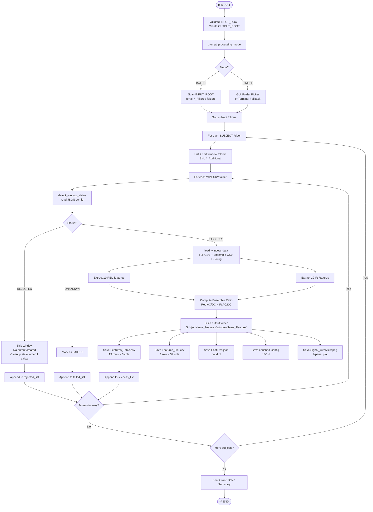

```markdown
# Step 5: PPG Feature Extraction — Batch-Aware + Rejection-Safe

> Extracts 19 morphological and physiological features per PPG channel (IR + Red) from
> filtered signal windows, producing structured CSV, JSON, and diagnostic plots —
> automatically skipping pipeline-rejected windows and cleaning stale outputs.

This script is the numerical bridge between raw waveforms and machine learning. It reads
the cleaned, filtered PPG signals produced by Step 4, computes 19 carefully selected
features from both the IR and Red channels, and organises everything into a flat
39-column feature vector per window. It operates in either BATCH mode (processing every
subject folder automatically) or SINGLE mode (interactive folder picker), and is fully
aware of the rejection status assigned by the upstream signal processing pipeline —
rejected windows are silently skipped and any stale output from previous runs is cleaned
up automatically.

| Metric | Value |
|---|---|
| Lines of Code | ~700 |
| Features Extracted | 19 per channel × 2 channels + 1 combined = 39 output columns |
| Processing Modes | BATCH (all subjects) + SINGLE (one folder) |
| Output Files Per Window | 4 structured files + 1 diagnostic plot |
| Rejected Window Handling | Detected via JSON status flag — no output created, stale folders removed |
| Typical Processing Time | 2–5 seconds per window on a standard laptop |

---

## 📋 Table of Contents

1. [Title & TL;DR](#step-5-ppg-feature-extraction--batch-aware--rejection-safe)
2. [Table of Contents](#-table-of-contents)
3. [Quick Start](#-quick-start)
4. [Background & Motivation](#-background--motivation)
5. [Pipeline / Process Overview](#-pipeline--process-overview)
6. [Features & Capabilities](#-features--capabilities)
7. [Installation & Prerequisites](#-installation--prerequisites)
8. [Input Data Format](#-input-data-format)
9. [Output Structure](#-output-structure)
10. [Usage Examples](#-usage-examples)
11. [Detailed Methodology — The 19 Features](#-detailed-methodology--the-19-features)
12. [Hyperparameter Reference](#-hyperparameter-reference)
13. [Key Functions & Architecture](#-key-functions--architecture)
14. [Quality Assessment](#-quality-assessment)
15. [Troubleshooting & Tuning Guide](#-troubleshooting--tuning-guide)

---

## ⚡ Quick Start

Ensure Step 4 (Automated Signal Processing) has already run and produced output in
`04_Filtered/` before running this script.

```bash
# Step 1 — Install dependencies
pip install numpy pandas scipy matplotlib

# Step 2 — Edit the two path constants at the top of the script
#           INPUT_ROOT  → folder containing your *_Filtered subject folders
#           OUTPUT_ROOT → folder where *_Features output will be written

# Step 3 — Run the script
python step5_feature_extraction.py

# Step 4 — Choose processing mode when prompted
#   1 = BATCH  (process all subject folders inside INPUT_ROOT)
#   2 = SINGLE (pop-up folder picker for one subject)

# Step 5 — Review terminal output and check 05_Features/ for results
```

**Expected first-run terminal output:**

```
======================================================================
🧠 EXTRACTING FEATURES (BATCH AWARE + REJECTED SAFE)
======================================================================

======================================================================
  SELECT FEATURE EXTRACTION MODE
======================================================================
  1) BATCH  — Process ALL subject folders inside:
              C:\...\04_Filtered
  2) SINGLE — Pop up dialog to choose ONE subject folder
======================================================================
  Enter choice [1 or 2]: 1

📦 BATCH MODE — found 3 subject folder(s) to process:
   • Subject01_Filtered
   • Subject02_Filtered
   • Subject03_Filtered

======================================================================
📁 SUBJECT: Subject01_Filtered
======================================================================
✅ Found 5 window folders

----------------------------------------------------------------------
🔄 [1/5] Subject01_Win1_..._Filtered
----------------------------------------------------------------------
✅ Saved successfully
📁 Window output: C:\...\05_Features\Subject01_Features\..._Feature
💾 Table CSV:     ..._Features_Table.csv
💾 Flat CSV:      ..._Features_Flat.csv
💾 Features JSON: ..._Features.json
🖼️  Signal Plot:  ..._Signal_Overview.png
```

> ⚠️ If you see `FileNotFoundError`, `KeyError: sampling_rate_fs`, or all-NaN features,
> see the [Troubleshooting & Tuning Guide](#-troubleshooting--tuning-guide) section.

---

## 🧠 Background & Motivation

### The Problem

After Step 4, each PPG window exists as a set of waveform arrays — time-series of
amplitude values for both the IR and Red channels. Machine learning models cannot learn
directly from raw waveforms of variable length. They require fixed-length numerical
feature vectors where each column has a consistent physical meaning across all subjects
and windows.

### Why This Script Exists

This script solves the representation problem: it translates variable-length cleaned
waveforms into a fixed 39-column numerical fingerprint per window. Each feature captures
a different physiological or signal property — heart rate, waveform shape, signal
complexity, energy distribution, and optical ratios — giving the downstream XGBoost
model a rich and diverse set of inputs to learn glucose-relevant patterns from. Without
this step, Step 6 through Step 9 cannot run.

### Where It Fits in the Pipeline

```
Step 1-3 : Raw Collection → Verification → Windowing
Step 4   : Signal Processing & Filtering
           └── Output: 04_Filtered/*_Filtered/ folders
                       (Full CSV + Ensemble CSV + Config JSON per window)
                                    │
                                    ▼
         ╔══════════════════════════════════════╗
         ║  Step 5 : Feature Extraction         ║  ← YOU ARE HERE
         ║  step5_feature_extraction.py         ║
         ║  Input : 04_Filtered/                ║
         ║  Output: 05_Features/                ║
         ╚══════════════════════════════════════╝
                                    │
                                    ▼
Step 6   : Per-Subject Feature Averaging
Step 7   : Feature Engineering (ratio/difference features)
Step 8   : Data Cleaning + Train/Test Split + Scaling
Step 9   : XGBoost Model Training + Evaluation
```

---

## 🔄 Pipeline / Process Overview

### ASCII Flowchart

```
START
  │
  ├─► Validate INPUT_ROOT exists
  ├─► Create OUTPUT_ROOT if missing
  │
  ├─► prompt_processing_mode()
  │         │
  │         ├── "1" → BATCH: scan INPUT_ROOT for all *_Filtered folders
  │         └── "2" → SINGLE: GUI picker or terminal fallback
  │
  └─► For each SUBJECT folder:
            │
            ├─► List all subfolders, sort by Win index
            ├─► Skip *_Additional folders
            │
            └─► For each WINDOW folder:
                      │
                      ├─► detect_window_status()
                      │         │
                      │         ├── REJECTED ──► Skip (no output created)
                      │         │               Cleanup stale output if exists
                      │         │               Append to rejected_list
                      │         │
                      │         ├── UNKNOWN  ──► Mark as FAILED
                      │         │               Append to failed_list
                      │         │
                      │         └── SUCCESS  ──► load_window_data()
                      │                         (Full CSV + Ensemble CSV + Config JSON)
                      │                               │
                      │                    ┌──────────┴──────────┐
                      │                    ▼                     ▼
                      │             RED channel            IR channel
                      │             19 features            19 features
                      │                    └──────────┬──────────┘
                      │                               ▼
                      │                    Ensemble Ratio (combined)
                      │                               │
                      │                    Build output folder
                      │                               │
                      │               ┌───────────────┼───────────────┐
                      │               ▼               ▼               ▼
                      │        Table CSV         Flat CSV        Features JSON
                      │        (19 rows)         (1 row,         (flat dict)
                      │                          39 cols)
                      │               │
                      │               ▼
                      │        Enriched Config JSON + Signal Plot (4 panels)
                      │               │
                      │               └──► Append to success_list
                      │
            └─► Print subject summary (success / rejected / failed counts)
  │
  └─► Print GRAND BATCH SUMMARY across all subjects
        END
```

### Mermaid Flowchart



### Stage Summary Table

| # | Stage | What It Does |
|---|---|---|
| 1 | Mode Selection | Terminal prompt selects BATCH or SINGLE processing mode |
| 2 | Folder Discovery | Finds all `*_Filtered` subject folders; sorts windows by index |
| 3 | Status Detection | Reads JSON config to classify each window as SUCCESS / REJECTED / UNKNOWN |
| 4 | Stale Cleanup | Removes old output folder if a window has transitioned to REJECTED |
| 5 | Data Loading | Loads Full CSV, Ensemble CSV, and Config JSON for SUCCESS windows |
| 6 | RED Feature Extraction | Computes all 19 features from the Red PPG channel |
| 7 | IR Feature Extraction | Computes all 19 features from the IR PPG channel |
| 8 | Combined Feature | Computes Ensemble Ratio (cross-channel optical ratio) |
| 9 | Output Saving | Writes Table CSV, Flat CSV, JSON, enriched Config, and 4-panel plot |
| 10 | Batch Summary | Aggregates and prints grand totals across all subjects and windows |

> **Suggested Diagram to Create:**
> A feature dependency diagram showing which input signal (Full CSV columns vs Ensemble
> CSV columns) feeds which of the 19 features. Use two input boxes on the left
> (Full CSV in blue, Ensemble CSV in green), arrows pointing to feature boxes in the
> centre, and two output channel boxes on the right (Red, IR). Tool: draw.io.
> Size: A3 landscape. This works well as Figure 1 in the Feature Engineering chapter
> of your thesis.

---

## ✅ Features & Capabilities

### Core Functionality

- Computes **19 features per channel** across both IR and Red PPG channels, plus one
  cross-channel combined feature, producing a **39-column flat feature vector** per window
- Supports **BATCH mode** — walks the entire `04_Filtered/` directory and processes
  every subject folder without manual intervention
- Supports **SINGLE mode** — opens a GUI folder picker with automatic terminal fallback
  if tkinter is unavailable
- **REJECTED window detection** — reads the `status` field from the upstream pipeline
  JSON config; skipped windows produce no output and leave no stale folders
- **Stale output cleanup** — if a window was SUCCESS in a previous run but is now
  REJECTED, the old output folder is automatically deleted to keep results consistent
- **File replacement tracking** — reports before/after file sizes for every file
  overwritten during a re-run

### Quality Assurance Features

- `safe_array()` removes all `NaN` and `Inf` values before any computation — no feature
  function ever receives corrupt input
- `safe_ratio()` guards every division operation, returning `np.nan` instead of raising
  `ZeroDivisionError`
- Every feature function returns `np.nan` on failure rather than raising an exception —
  a bad window produces NaN-filled rows, not a crash
- Per-window `try/except` in the main loop isolates failures — one bad window never
  stops the rest of the batch from processing

### Configurability

- Two path constants (`INPUT_ROOT`, `OUTPUT_ROOT`) at the top of the file — the only
  changes needed for a new machine or dataset
- Peak detection sensitivity controlled by `min_distance` and `prominence` — tunable
  for different heart rate ranges or signal strengths
- Shannon entropy bin count and Welch segment length are adjustable for different
  sampling rates

### Output Traceability

- Enriched config JSON preserves all upstream metadata (sampling rate, filter
  parameters, ensemble beat statistics) and appends the newly computed feature values
  in the same file
- 4-panel signal plot saved alongside CSVs allows visual verification that features
  were computed on the correct signal segment
- Window title in plots identifies the exact source window by name

### Failure Handling

- Windows with missing CSV files but a SUCCESS JSON status are classified as UNKNOWN
  and treated as FAILED — no partial output is written
- Whole-subject failures are caught at the subject level, so a corrupt subject folder
  does not abort the remaining batch
- All failures and rejections are reported in the grand summary with truncated reason
  strings for readability

---

## 🛠️ Installation & Prerequisites

### System Requirements

| Requirement | Minimum | Recommended |
|---|---|---|
| Python | 3.8 | 3.10+ |
| Operating System | Windows 10, Ubuntu 20.04, macOS 11 | Windows 11, Ubuntu 22.04 |
| RAM | 4 GB | 8 GB (for large batch runs) |
| Disk Space | 500 MB per subject | 2 GB free |
| Display | Required for SINGLE mode GUI picker | Any resolution |

### Python Dependencies

| Library | Minimum Version | Purpose |
|---|---|---|
| `numpy` | 1.21.0 | Array operations, signal math, NaN handling |
| `pandas` | 1.3.0 | CSV reading and writing, DataFrame construction |
| `scipy` | 1.7.0 | Peak detection, Welch PSD, peak widths, statistics |
| `matplotlib` | 3.4.0 | 4-panel signal overview plot generation |
| `tkinter` | stdlib | GUI folder picker for SINGLE mode (built into Python) |

All other imports (`os`, `re`, `json`, `shutil`, `traceback`, `pathlib`) are Python
standard library — no installation needed.

### Virtual Environment Setup

**Windows:**

```bash
python -m venv ppg_env
ppg_env\Scripts\activate
pip install numpy pandas scipy matplotlib
```

**Linux / macOS:**

```bash
python3 -m venv ppg_env
source ppg_env/bin/activate
pip install numpy pandas scipy matplotlib
```

### Verification Command

```bash
python -c "import numpy, pandas, scipy, matplotlib; print('All dependencies OK')"
```

Expected output:

```
All dependencies OK
```

---

## 📥 Input Data Format

This script reads the output produced by Step 4 (Automated Signal Processing). Each
subject has one `*_Filtered` folder containing multiple window subfolders. Each window
subfolder must contain exactly three files.

### Expected Folder Structure

```
04_Filtered/
├── Subject01_Filtered/
│   ├── Subject01_Win1_2024_Filtered/
│   │   ├── Subject01_Win1_2024_Filtered_Full.csv
│   │   ├── Subject01_Win1_2024_Filtered_Ensemble.csv
│   │   └── Subject01_Win1_2024_Filtered_Configuration.json
│   ├── Subject01_Win2_2024_Filtered/
│   │   └── ... (same three files)
│   └── Subject01_Additional/          ← skipped automatically
│       └── ...
├── Subject02_Filtered/
│   └── ...
└── Subject03_Filtered/
    └── ...
```

### File 1 — `*_Filtered_Full.csv`

Contains the full-length filtered signal for the entire window. Required columns:

| Column | Type | Description |
|---|---|---|
| `Time_s` | Float | Time axis in seconds (also accepted as `Time`) |
| `Red_AC_HighPass` | Float | Red channel pulsatile component (high-pass filtered) |
| `IR_AC_HighPass` | Float | IR channel pulsatile component (high-pass filtered) |
| `Red_DC_LowPass` | Float | Red channel baseline / DC component (low-pass filtered) |
| `IR_DC_LowPass` | Float | IR channel baseline / DC component (low-pass filtered) |
| `Red_Normalized` | Float | Red AC signal normalized to [0, 1] range |
| `IR_Normalized` | Float | IR AC signal normalized to [0, 1] range |

**Sample snippet:**

```csv
Time_s,Red_AC_HighPass,IR_AC_HighPass,Red_DC_LowPass,IR_DC_LowPass,Red_Normalized,IR_Normalized
0.000,120.3,-88.1,98432.0,112045.0,0.412,0.389
0.0025,118.7,-90.2,98430.1,112041.3,0.408,0.385
0.005,115.2,-93.4,98428.5,112038.7,0.401,0.379
```

### File 2 — `*_Filtered_Ensemble.csv`

Contains the ensemble-averaged single beat template for both channels. Required columns:

| Column | Type | Description |
|---|---|---|
| `Time_Red_s` | Float | Time axis for Red ensemble beat (seconds) |
| `Red_Ensemble_Avg` | Float | Ensemble-averaged Red beat waveform |
| `Red_VPG` | Float | First derivative of Red ensemble (velocity plethysmogram) |
| `Red_SDPPG` | Float | Second derivative of Red ensemble (acceleration plethysmogram) |
| `Time_IR_s` | Float | Time axis for IR ensemble beat (seconds) |
| `IR_Ensemble_Avg` | Float | Ensemble-averaged IR beat waveform |
| `IR_VPG` | Float | First derivative of IR ensemble |
| `IR_SDPPG` | Float | Second derivative of IR ensemble |

**Sample snippet:**

```csv
Time_Red_s,Red_Ensemble_Avg,Red_VPG,Red_SDPPG,Time_IR_s,IR_Ensemble_Avg,IR_VPG,IR_SDPPG
0.000,0.021,0.003,0.001,0.000,0.019,0.002,0.001
0.0025,0.045,0.012,0.004,0.0025,0.041,0.011,0.003
0.005,0.089,0.021,0.007,0.005,0.082,0.019,0.006
```

### File 3 — `*_Filtered_Configuration.json`

JSON config produced by Step 4. Must contain:

```json
{
  "metadata": {
    "status": "SUCCESS",
    "sampling_rate_fs": 400
  },
  "ensemble_RED": { "..." : "..." },
  "ensemble_IR":  { "..." : "..." }
}
```

**For REJECTED windows**, the JSON contains:

```json
{
  "metadata": {
    "status": "REJECTED",
    "sampling_rate_fs": 400
  },
  "rejection": {
    "overall_reason": "Insufficient valid beats detected in IR channel",
    "IR_channel": { "valid_beats": 2, "required": 4 },
    "RED_channel": { "valid_beats": 5, "required": 4 }
  }
}
```

> **Note:** The script supports both `lowercase` keys (new pipeline format:
> `metadata`, `sampling_rate_fs`) and `Title_Case` keys (old format: `Metadata`,
> `Sampling_Rate_FS`) for backward compatibility.

### File Naming Convention

Window folders must follow this pattern for the `Win` index parser to work correctly:

```
{SubjectName}_Win{N}_{anything}_Filtered/
```

Example: `Subject01_Win3_2024Jan_Filtered/`

The `Win{N}` segment is used to sort windows in chronological order before processing.

---

## 📤 Output Structure

For each successfully processed window, the script creates a dedicated subfolder inside
a subject-level `*_Features` folder.

### Complete Output Folder Tree

```
05_Features/
├── Subject01_Features/
│   ├── Subject01_Win1_2024_Feature/
│   │   ├── Subject01_Win1_2024_Feature_Features_Table.csv
│   │   ├── Subject01_Win1_2024_Feature_Features_Flat.csv
│   │   ├── Subject01_Win1_2024_Feature_Features.json
│   │   ├── Subject01_Win1_2024_Filtered_Configuration.json
│   │   └── Subject01_Win1_2024_Feature_Signal_Overview.png
│   ├── Subject01_Win2_2024_Feature/
│   │   └── ... (same five files)
│   └── Subject01_Win3_2024_Feature/
│       └── ...
├── Subject02_Features/
│   └── ...
└── Subject03_Features/
    └── ...
```

> **Note:** REJECTED windows produce NO output folder. If a window was previously
> SUCCESS and is now REJECTED on re-run, its old output folder is automatically deleted.

### Output File Descriptions

#### 1. `*_Features_Table.csv` — Human-readable feature table

19 rows (one per feature) × 3 columns. Designed for quick review and thesis tables.

```csv
Feature,Red_Value,IR_Value
Skewness,0.4521,0.3987
Kurtosis,2.8834,2.7102
Shannon Entropy,4.2341,4.1892
Spectral Entropy,3.8821,3.7654
pulse width,0.2103,0.2087
PPI,0.8412,0.8398
systolic amplitude,0.5621,0.5498
BPM,71.3,71.4
HRV,32.41,31.98
TEO Mean,0.00412,0.00398
TEO std dev,0.00123,0.00119
1st_Derivative_Mean,0.00021,0.00019
2nd_Derivative_Mean,0.00003,0.00002
2nd_Derivative_Skewness,0.1823,0.1741
Harmonic ratio,3.4521,3.3987
Ensemble ratio,0.9823,
Rise time,0.1021,0.0998
Decay time,0.6891,0.6754
Dicrotic notch,0.3412,0.3298
```

#### 2. `*_Features_Flat.csv` — Machine learning-ready flat row

1 row × 39 columns. This is the file consumed by Step 6 (per-subject averaging).
Each feature is prefixed with `Red_` or `IR_`, except `Ensemble ratio` which appears
once.

```csv
Red_Skewness,IR_Skewness,Red_Kurtosis,IR_Kurtosis,...,Ensemble ratio
0.4521,0.3987,2.8834,2.7102,...,0.9823
```

#### 3. `*_Features.json` — Flat feature dictionary

Same content as the Flat CSV but as a JSON key-value dictionary. Used by downstream
scripts that prefer JSON over CSV.

```json
{
    "Red_Skewness": 0.4521,
    "IR_Skewness": 0.3987,
    "Red_Kurtosis": 2.8834,
    "IR_Kurtosis": 2.7102,
    "Ensemble ratio": 0.9823
}
```

#### 4. `*_Filtered_Configuration.json` — Enriched upstream config

A copy of the Step 4 configuration JSON with the computed features appended under the
`extracted_features` key. This makes each window folder self-contained — all processing
history and results in one file.

#### 5. `*_Signal_Overview.png` — 4-panel diagnostic plot

| Panel | Title | Signals Shown | Purpose |
|---|---|---|---|
| 1 | DC Component (Low Pass Filtered) | Red DC, IR DC | Verify baseline stability |
| 2 | AC Component (High Pass Filtered) | Red AC, IR AC | Verify pulsatile signal quality |
| 3 | Normalized Signal (0 to 1 Scaled) | Red Norm, IR Norm | Inspect waveform shape |
| 4 | Ensemble Average (Cleaned Single Beat) | Red Avg, IR Avg | Verify template quality |

> **Suggested Diagram to Create:**
> A folder tree card diagram styled like a file explorer, showing the `05_Features/`
> root with two subject folders expanded, each showing three window subfolders and five
> output files per window. Use yellow for folder icons, blue for CSV files, orange for
> JSON files, and green for PNG files. Tool: draw.io or PowerPoint SmartArt.
> Size: A4 portrait. This works well as a Data Artefact figure in the thesis
> Implementation chapter.

---

## 💡 Usage Examples

### Example 1 — Standard BATCH Run (All Subjects)

The most common use case: process every subject folder in `INPUT_ROOT` in one command.

```bash
python step5_feature_extraction.py
```

```
======================================================================
🧠 EXTRACTING FEATURES (BATCH AWARE + REJECTED SAFE)
======================================================================
  Enter choice [1 or 2]: 1

📦 BATCH MODE — found 3 subject folder(s) to process:
   • Subject01_Filtered
   • Subject02_Filtered
   • Subject03_Filtered

======================================================================
📁 SUBJECT: Subject01_Filtered
======================================================================
✅ Found 5 window folders

----------------------------------------------------------------------
🔄 [1/5] Subject01_Win1_2024_Filtered
----------------------------------------------------------------------
✅ Saved successfully
📁 Window output:   ...\Subject01_Features\Subject01_Win1_2024_Feature
💾 Table CSV:       Subject01_Win1_2024_Feature_Features_Table.csv
💾 Flat CSV:        Subject01_Win1_2024_Feature_Features_Flat.csv
💾 Features JSON:   Subject01_Win1_2024_Feature_Features.json
🖼️  Signal Plot:    Subject01_Win1_2024_Feature_Signal_Overview.png

----------------------------------------------------------------------
🔄 [2/5] Subject01_Win2_2024_Filtered
----------------------------------------------------------------------
⚠️  REJECTED by signal processing pipeline — SKIPPED (no output created)
   Reason: Insufficient valid beats detected in IR channel

======================================================================
🎯 GRAND TOTALS
======================================================================
  Subjects processed           : 3
  ✅ Successful windows         : 12
  ⚠️  Rejected windows (skipped): 3
  ❌ Failed windows             : 0
  📂 Output root               : C:\...\05_Features
======================================================================

🎉 Feature extraction complete.
```

---

### Example 2 — SINGLE Mode (One Subject, GUI Picker)

Use this when you want to process just one subject without modifying the script.

```bash
python step5_feature_extraction.py
```

```
  Enter choice [1 or 2]: 2
```

A folder picker dialog opens. Navigate to and select a `*_Filtered` folder
(e.g., `Subject02_Filtered`). If the GUI fails:

```
⚠️  GUI dialog failed: no display name and no $DISPLAY environment variable
    Falling back to manual path entry.

📁 Default base path: C:\...\04_Filtered
    Type folder path (or press Enter to cancel):
    C:\...\04_Filtered\Subject02_Filtered

📁 SINGLE MODE — selected: C:\...\Subject02_Filtered
```

Processing then continues exactly as BATCH mode but for one subject only.

---

### Example 3 — Re-Running Over Existing Output (Replacement Tracking)

When you re-run after changing a hyperparameter, the script detects and overwrites
existing files, reporting before/after sizes.

```
----------------------------------------------------------------------
🔄 [1/5] Subject01_Win1_2024_Filtered
----------------------------------------------------------------------
♻️  Existing folder removed and will be recreated fresh:
   📁 ...\Subject01_Win1_2024_Feature

✅ Saved successfully
```

If only individual files are replaced (folder exists but files changed):

```
♻️ REPLACED 3 EXISTING FILE(S) in:
   📁 ...\Subject01_Win1_2024_Feature
   --------------------------------------------------------
   1. Subject01_Win1_2024_Feature_Features_Table.csv
      ↳ Old size: 1.24 KB  →  New size: 1.24 KB
   2. Subject01_Win1_2024_Feature_Features_Flat.csv
      ↳ Old size: 0.89 KB  →  New size: 0.91 KB
   3. Subject01_Win1_2024_Feature_Features.json
      ↳ Old size: 2.11 KB  →  New size: 2.13 KB
```

---

### Example 4 — Tuning Peak Detection for Weak Signals

If your output CSVs show `NaN` for `PPI`, `BPM`, and `HRV`, the peak detector is not
finding enough peaks. Locate `detect_ppg_peaks()` and lower the prominence threshold:

```python
# Default (10% of std — good for clean signals)
prominence = max(0.01, 0.10 * np.std(x0))

# Tuned for weak signals (5% of std — more sensitive)
prominence = max(0.005, 0.05 * np.std(x0))
```

Also consider lowering the minimum distance for high heart rate subjects (>120 BPM):

```python
# Default — allows up to ~180 BPM
min_distance = max(1, int(0.33 * fs))

# For tachycardia subjects (>150 BPM)
min_distance = max(1, int(0.25 * fs))
```

After changing, re-run the script. Replacement tracking will confirm the files were
updated.

---

## 🔬 Detailed Methodology — The 19 Features

This section documents every feature extracted by the script: what it measures, the
mathematics behind it, why it was selected, how it relates to blood glucose, and which
input signal it is computed from.

---

### Feature Group A — Statistical Complexity Features

These features quantify the unpredictability and complexity of the PPG signal. Blood
glucose changes affect vascular tone and autonomic nervous system regulation, which both
manifest as changes in signal complexity.

---

#### Feature 1 — Shannon Entropy

**Purpose:** Measures the information content or unpredictability of the amplitude
distribution of the full normalized PPG signal.

**Input signal:** `Red_Normalized` / `IR_Normalized` (full window)

**Mathematics:**

The signal amplitude values are binned into a 64-bin histogram. The probability of each
bin is:

```
p_i = count_i / total_count
```

Shannon Entropy is then:

```
H = -Σ p_i × log₂(p_i)    (summed over all non-empty bins)
```

A perfectly regular signal (same amplitude every sample) gives H = 0. A maximally
random signal gives H = log₂(64) = 6 bits. Real PPG signals fall between these extremes.

**Why this feature:** Entropy is robust to amplitude scaling and does not require peak
detection — it works even on signals where beats are not clearly separated. It captures
the overall orderliness of the waveform shape across the whole window.

**Relationship to blood glucose:**
Elevated blood glucose reduces arterial compliance — vessels become stiffer. Stiffer
vessels produce more uniform, less complex pressure waveforms. As glucose rises, PPG
waveform complexity tends to decrease, which manifests as lower Shannon Entropy.
Additionally, hyperglycaemia affects autonomic nervous system (ANS) regulation —
reduced ANS variability further decreases signal entropy. Studies in diabetic cohorts
consistently report lower PPG entropy compared to normoglycaemic subjects.

**Key hyperparameter:** `bins=64` — increasing bins gives finer resolution but requires
longer signals for reliable probability estimation.

**Output:** Single float per channel (typical range: 3.5 – 5.5 bits)

---

#### Feature 2 — Spectral Entropy

**Purpose:** Measures the complexity of the frequency composition of the PPG signal —
how spread out the signal's power is across frequencies.

**Input signal:** `Red_Normalized` / `IR_Normalized` (full window)

**Mathematics:**

The Power Spectral Density (PSD) is estimated using Welch's method:

```
PSD = Welch(x, fs=fs, nperseg=min(256, len(x)))
```

The PSD values are normalized to form a probability distribution:

```
p_i = PSD_i / Σ PSD_i
```

Spectral Entropy is then computed identically to Shannon Entropy but over the frequency
domain:

```
H_spec = -Σ p_i × log₂(p_i)
```

A signal with power concentrated at one frequency (e.g., a pure sine at heart rate)
gives low spectral entropy. A signal with energy spread broadly across frequencies gives
high spectral entropy.

**Why Welch's method:** Welch's periodogram averages multiple overlapping FFT segments,
which reduces variance in the PSD estimate compared to a single FFT — important for
short, noisy PPG windows where a single FFT would be highly variable.

**Relationship to blood glucose:**
Healthy PPG signals have power concentrated at the fundamental heart rate frequency and
its harmonics. Diabetic vascular changes and glucose-related autonomic neuropathy cause
additional low-frequency components to appear (vasomotion, respiration coupling),
spreading the spectral power. Higher blood glucose correlates with higher spectral
entropy due to this broadening effect. The Red channel spectral entropy is particularly
sensitive because the Red wavelength penetrates shallower tissue layers where
microvascular glucose effects are more pronounced.

**Key hyperparameter:** `nperseg=min(256, len(x))` — shorter segments improve frequency
resolution for short windows but reduce spectral smoothing.

**Output:** Single float per channel (typical range: 3.0 – 5.0 bits)

---

### Feature Group B — Waveform Shape Features (Ensemble Beat)

These features describe the morphology of the cleaned ensemble-averaged beat template.
Because the ensemble beat averages out noise and motion artifacts, morphological features
extracted from it are far more reproducible than those from individual beats.

---

#### Feature 3 — Skewness

**Purpose:** Measures the asymmetry of the ensemble beat's amplitude distribution —
whether the waveform leans toward the systolic rise or the diastolic decay.

**Input signal:** `Red_Ensemble_Avg` / `IR_Ensemble_Avg`

**Mathematics:**

Skewness is the normalized third central moment:

```
Skewness = [1/N × Σ(x_i - μ)³] / σ³
```

Where μ is the mean amplitude and σ is the standard deviation. The unbiased
(Fisher-corrected) version is used (`bias=False` in scipy).

- Positive skewness: waveform tail extends toward higher amplitudes (slow decay
  dominates)
- Negative skewness: waveform rises slowly and drops sharply
- A typical healthy PPG beat has slight positive skewness due to the longer diastolic
  decay compared to the rapid systolic rise

**Why ensemble signal:** Computing skewness on the raw noisy signal mixes waveform
asymmetry with noise asymmetry. The ensemble beat isolates true morphological asymmetry.

**Relationship to blood glucose:**
The PPG waveform shape is directly determined by arterial stiffness and peripheral
vascular resistance. Chronic hyperglycaemia causes advanced glycation end-products
(AGEs) to cross-link collagen in vessel walls, increasing arterial stiffness. Stiffer
arteries produce a faster systolic rise and a modified dicrotic notch, changing the
overall beat asymmetry. Skewness has been shown to shift systematically with arterial
stiffness indices, making it an indirect glucose indicator. Higher glucose tends to
reduce positive skewness as the diastolic tail is shortened by faster wave reflection
from stiffer peripheral vessels.

**Output:** Single float per channel (typical range: −0.5 to +1.5)

---

#### Feature 4 — Kurtosis

**Purpose:** Measures the peakedness of the ensemble beat — how sharp or flat the main
systolic peak is relative to a normal distribution.

**Input signal:** `Red_Ensemble_Avg` / `IR_Ensemble_Avg`

**Mathematics:**

Kurtosis is the normalized fourth central moment (Fisher definition, excess kurtosis):

```
Kurtosis = [1/N × Σ(x_i - μ)⁴] / σ⁴  -  3
```

The `-3` term makes a normal distribution have kurtosis = 0. Positive excess kurtosis
(leptokurtic) means a sharper, more peaked waveform. Negative excess kurtosis
(platykurtic) means a flatter, broader waveform.

**Why Fisher definition:** The `fisher=True, bias=False` parameters in scipy produce
excess kurtosis with small-sample correction, which is more appropriate for short
ensemble beats (typically 100–400 samples).

**Relationship to blood glucose:**
Peak sharpness of the PPG systolic wave reflects the speed and intensity of cardiac
ejection combined with the reflectance properties of the peripheral vasculature.
Arterial stiffening from chronic hyperglycaemia alters the augmentation index (the
ratio of the reflected wave to the incident wave), which modifies peak shape. Higher
glucose is associated with broader, less peaked systolic waveforms (lower kurtosis)
because wave reflections arrive earlier and merge with the incident wave, flattening
the peak. This feature therefore encodes information about both cardiac function and
peripheral vascular compliance simultaneously.

**Output:** Single float per channel (typical range: −1.0 to +5.0)

---

#### Feature 5 — Pulse Width

**Purpose:** Measures the temporal width of the systolic peak at half its maximum height
(full-width at half-maximum, FWHM).

**Input signal:** `Red_Ensemble_Avg` / `IR_Ensemble_Avg` + `Time_Red_s` / `Time_IR_s`

**Mathematics:**

The peak index is found as `argmax(x)`. SciPy's `peak_widths()` then finds the
horizontal distance across the peak at the specified relative height:

```
width_samples = peak_widths(x, [peak_idx], rel_height=0.5)[0]
```

Converted to seconds using the mean time step:

```
pulse_width_seconds = width_samples × mean(diff(time_axis))
```

**Why rel_height=0.5:** The half-maximum width is a standard definition (FWHM) used
across engineering and biomedical signal processing. It is less sensitive to noise at
the very tip of the peak or at the baseline compared to other threshold levels.

**Relationship to blood glucose:**
Pulse width is directly related to left ventricular ejection time and arterial
compliance. A stiffer arterial tree (caused by sustained hyperglycaemia) reduces the
time the vessel wall can absorb the pulse, narrowing the systolic peak. Conversely,
diabetic autonomic neuropathy can cause heart rate to increase (reducing cycle length
and pulse width). Studies have found that pulse width measured from PPG is correlated
with pulse transit time and augmentation index — both of which are established arterial
stiffness markers that vary with glucose.

**Key hyperparameter:** `rel_height=0.5` — change to `0.75` for narrower width
measurement closer to the peak tip.

**Output:** Float in seconds per channel (typical range: 0.15 – 0.35 s)

---

#### Feature 6 — Systolic Amplitude

**Purpose:** Measures the peak-to-trough amplitude of the ensemble beat, representing
the strength of the pulsatile blood volume change.

**Input signal:** `Red_Ensemble_Avg` / `IR_Ensemble_Avg`

**Mathematics:**

```
systolic_amplitude = max(x) - min(x)
```

This is the total excursion of the ensemble waveform from its lowest point (diastolic
trough) to its highest point (systolic peak).

**Why this simple measure:** More complex amplitude normalizations depend on accurate
DC baseline estimation, which varies between subjects. The simple peak-to-trough measure
on the ensemble beat (which is already baseline-corrected by the ensemble averaging
process) is reproducible and not confounded by slow baseline drift.

**Relationship to blood glucose:**
Systolic amplitude is a proxy for the AC component of the PPG signal, which reflects
the pulsatile blood volume change per heartbeat. Blood viscosity increases with elevated
glucose (due to glycated haemoglobin and altered red blood cell deformability), reducing
the effective stroke volume reaching peripheral tissue and therefore reducing the AC
amplitude. Additionally, increased peripheral vascular resistance from chronic
hyperglycaemia reduces the pulsatile flow amplitude. Lower systolic amplitude is loosely
associated with higher blood glucose, though this relationship is confounded by
haematocrit and individual vascular anatomy.

**Output:** Float per channel in arbitrary but internally consistent amplitude units

---

#### Feature 7 — Rise Time

**Purpose:** Measures the time from the diastolic foot (minimum before the peak) to the
systolic peak of the ensemble beat.

**Input signal:** `Red_Ensemble_Avg` / `IR_Ensemble_Avg` + time axis

**Mathematics:**

```
foot_idx  = argmin(x[0 : peak_idx + 1])
rise_time = time_axis[peak_idx] - time_axis[foot_idx]
```

The foot is found as the minimum in the signal from the start up to and including the
systolic peak. This correctly identifies the diastolic trough that precedes the systolic
upstroke, even when the signal has pre-systolic features.

**Relationship to blood glucose:**
Rise time reflects the rate of ventricular pressure rise (dP/dt) transmitted to the
peripheral vasculature. In a healthy compliant artery, the systolic upstroke is steep
(short rise time). Arterial stiffening from hyperglycaemia-related collagen cross-linking
alters the vessel's ability to transmit the pressure wave efficiently, changing rise time
depending on wave reflection geometry. Rise time is also influenced by peripheral
vasomotion changes caused by glucose-induced endothelial dysfunction. It has been
identified as one of the stronger morphological predictors of vascular age in several
PPG-based studies.

**Output:** Float in seconds per channel (typical range: 0.05 – 0.20 s)

---

#### Feature 8 — Decay Time

**Purpose:** Measures the time from the systolic peak to the next diastolic foot (trough
after the peak), representing the duration of the diastolic runoff phase.

**Input signal:** `Red_Ensemble_Avg` / `IR_Ensemble_Avg` + time axis

**Mathematics:**

```
foot_after_idx = peak_idx + argmin(x[peak_idx:])
decay_time     = time_axis[foot_after_idx] - time_axis[peak_idx]
```

The post-peak minimum is found by searching only the portion of the signal after the
systolic peak, ensuring the algorithm correctly identifies the diastolic decay rather
than the pre-systolic foot.

**Relationship to blood glucose:**
Decay time reflects the rate of diastolic pressure runoff, which is determined by
peripheral vascular resistance and arterial compliance. Chronically elevated glucose
increases peripheral resistance through multiple mechanisms (endothelial dysfunction,
smooth muscle hyperresponsiveness, increased vascular tone). Higher resistance slows the
diastolic runoff, lengthening the decay time. Decay time is also related to the diastolic
time fraction — the proportion of the cardiac cycle spent in diastole — which affects
coronary perfusion. This feature therefore encodes information about both peripheral
vascular health and cardiac efficiency.

**Output:** Float in seconds per channel (typical range: 0.40 – 0.80 s)

---

#### Feature 9 — Dicrotic Notch

**Purpose:** Identifies the timing of the dicrotic notch — the secondary minimum in the
PPG waveform that appears after the systolic peak, corresponding to aortic valve closure.

**Input signal:** `Red_Ensemble_Avg` / `IR_Ensemble_Avg` + time axis

**Mathematics:**

The algorithm inverts the signal and finds local minima after the systolic peak:

```
inv               = -x
minima            = find_peaks(inv)[0]
minima_after_peak = minima[minima > peak_idx]
notch_idx         = minima_after_peak[0]   # first minimum after systolic peak
```

If no local minimum is found after the peak (e.g., monotonic decay), the script falls
back to the global minimum of the post-peak signal. The result is returned as the time
value at that index.

**Relationship to blood glucose:**
The dicrotic notch timing is one of the most physiologically informative PPG features.
It marks the moment of aortic valve closure and the beginning of the reflected pulse
wave returning from the periphery. In healthy compliant vessels, the notch appears
relatively late in the cardiac cycle. In arterial stiffness — which is directly worsened
by chronic hyperglycaemia — the pulse wave velocity increases, so the reflected wave
returns earlier. An earlier dicrotic notch is a well-established marker of arterial
stiffness. The augmentation index (ratio of secondary to primary systolic peak, which
depends on notch timing) is commonly used as a glucose-correlated feature. This script
reports the absolute notch timing in seconds, which captures the same physiological
information.

**Output:** Float in seconds per channel (typical range: 0.20 – 0.50 s from signal
start)

---

### Feature Group C — Heart Rate & Variability Features

These features are computed from the full-length normalized signal across the entire
window, giving a statistically more stable estimate than single-beat metrics.

---

#### Feature 10 — PPI (Peak-to-Peak Interval)

**Purpose:** Measures the mean time interval between consecutive heartbeat peaks across
the full window — equivalent to the RR interval in ECG.

**Input signal:** `Red_Normalized` / `IR_Normalized` (full window)

**Mathematics:**

Peaks are detected using:

```
peaks = find_peaks(
            x - mean(x),
            distance   = max(1, int(0.33 × fs)),
            prominence = max(0.01, 0.10 × std(x))
        )
```

PPI is then the mean of the inter-peak distances converted to seconds:

```
PPI = mean(diff(peaks) / fs)    [seconds]
```

The `0.33 × fs` minimum distance corresponds to a maximum heart rate of approximately
180 BPM — a physiologically safe upper bound.

**Relationship to blood glucose:**
Acute hyperglycaemia activates the sympathetic nervous system, increasing heart rate and
reducing PPI. Chronic hyperglycaemia causes autonomic neuropathy, which reduces heart
rate variability and can increase resting heart rate. PPI from PPG closely approximates
the cardiac RR interval when measured at peripheral sites, making it a valid proxy for
heart rate. Glucose-induced changes in cardiac autonomic function are measurable through
PPI, particularly when combined with HRV.

**Output:** Float in seconds per channel (typical range: 0.55 – 1.10 s at 55–110 BPM)

---

#### Feature 11 — BPM (Beats Per Minute)

**Purpose:** Converts the mean PPI to heart rate in beats per minute — the most
intuitive expression of cardiac rhythm.

**Input signal:** Derived from PPI (same signal as Feature 10)

**Mathematics:**

```
BPM = 60.0 / mean(PPI)
```

If the mean beat period is 0.8 seconds, then `60 / 0.8 = 75 BPM`.

**Relationship to blood glucose:**
Heart rate is regulated by the sinoatrial node under autonomic nervous system control.
Elevated blood glucose acutely increases sympathetic tone, raising heart rate.
Chronically, diabetic autonomic neuropathy causes resting tachycardia due to
parasympathetic denervation of the heart. Studies have found that resting heart rate is
significantly higher in poorly controlled diabetic subjects compared to normoglycaemic
controls, making BPM a relevant feature despite being a relatively coarse measure.
The combination of BPM with HRV provides more discriminative power than either alone.

**Output:** Float per channel (typical range: 55 – 110 BPM)

---

#### Feature 12 — HRV (Heart Rate Variability — SDNN)

**Purpose:** Measures beat-to-beat variability in the peak intervals — a marker of
autonomic nervous system health.

**Input signal:** `Red_Normalized` / `IR_Normalized` (full window)

**Mathematics:**

SDNN (Standard Deviation of Normal-to-Normal intervals) is the most widely used
short-term HRV metric:

```
PPI_array = diff(peaks) / fs              [array of inter-peak intervals in seconds]
HRV_SDNN  = std(PPI_array, ddof=1) × 1000    [milliseconds]
```

The multiplication by 1000 converts from seconds to milliseconds, which is the standard
unit for clinical HRV reporting. `ddof=1` applies Bessel's correction for unbiased
standard deviation estimation from a small sample.

**Why SDNN over other HRV metrics:** SDNN is computable from as few as 3 peaks
(2 intervals), making it practical for short 10–30 second PPG windows. RMSSD (another
common HRV metric) is more sensitive to high-frequency autonomic changes but requires
more beats for stable estimation.

**Relationship to blood glucose:**
HRV is the most direct non-invasive measure of cardiac autonomic function. Reduced HRV
is one of the earliest signs of diabetic autonomic neuropathy, often detectable years
before clinical symptoms appear. Both acute hyperglycaemia (oxidative stress reducing
sinus node variability) and chronic neuropathy (vagal denervation) suppress HRV.
Multiple studies have demonstrated that SDNN-based HRV is significantly lower in
subjects with elevated HbA1c compared to normoglycaemic controls, making this one of the
most physiologically grounded features in the entire feature set for glucose estimation.

**Output:** Float in milliseconds per channel (typical range: 15 – 80 ms for short
windows)

---

### Feature Group D — Signal Energy Features

These features use the Teager Energy Operator (TEO), which captures the instantaneous
energy of a signal by combining amplitude and frequency information — unlike simple
power measures that only capture amplitude.

---

#### Feature 13 — TEO Mean

**Purpose:** Measures the mean instantaneous energy of the full normalized PPG signal,
capturing the combined effect of signal amplitude and oscillation speed.

**Input signal:** `Red_Normalized` / `IR_Normalized` (full window)

**Mathematics:**

The Teager Energy Operator is defined for discrete signals as:

```
Ψ[n] = x[n]² - x[n-1] × x[n+1]
```

For a signal of length N, this produces N−2 energy values. The TEO Mean is:

```
TEO_Mean = mean(Ψ[1 : N-1])
```

The key property of TEO is that for a sinusoid `x[n] = A·cos(ωn)`, the operator gives
approximately `A² × sin²(ω)`, which depends on BOTH amplitude A and frequency ω.
A standard power measure would only give `A²/2`, losing all frequency information.

**Relationship to blood glucose:**
Because TEO encodes both amplitude and instantaneous frequency of the PPG signal, it is
sensitive to changes in both the pulse strength (AC amplitude) and the rate of change
of the waveform (related to heart rate and waveform steepness). Glucose-induced changes
in vascular tone alter the PPG waveform's rate of rise and fall (changing the effective
instantaneous frequency of the signal), which TEO captures. Additionally, signal energy
correlates with perfusion quality — reduced peripheral perfusion in hyperglycaemia
reduces both amplitude and the rate of change, lowering TEO Mean.

**Output:** Float per channel (typical range: 0.001 – 0.010 for normalized signals)

---

#### Feature 14 — TEO Standard Deviation

**Purpose:** Measures the variability of the instantaneous energy across the window —
how consistently energetic the signal is from beat to beat.

**Input signal:** `Red_Normalized` / `IR_Normalized` (full window)

**Mathematics:**

Using the same TEO values as Feature 13:

```
TEO_StdDev = std(Ψ[1 : N-1], ddof=1)
```

High TEO StdDev means the signal energy fluctuates significantly between beats —
indicating irregular heartbeats, motion artifacts, or physiologically variable
perfusion. Low TEO StdDev means the signal is energetically consistent across beats.

**Relationship to blood glucose:**
TEO StdDev complements TEO Mean by capturing the temporal consistency of vascular
perfusion. Diabetic subjects often exhibit increased beat-to-beat variability in
peripheral perfusion due to compromised microvascular regulation (impaired vasomotion).
This manifests as higher TEO StdDev even when TEO Mean may not change dramatically.
The combination of TEO Mean and TEO StdDev together provides information about both the
average perfusion state and its stability — a feature pair that is more discriminative
for glucose than either measure alone.

**Output:** Float per channel (typical range: 0.0005 – 0.005)

---

### Feature Group E — Derivative-Based Features (VPG and SDPPG)

These features are computed from the first and second derivatives of the ensemble beat,
called the Velocity Plethysmogram (VPG) and the Second Derivative of PPG (SDPPG or
Acceleration Plethysmogram). These derivatives amplify subtle waveform shape changes
that are invisible in the raw signal but physiologically meaningful.

---

#### Feature 15 — 1st Derivative Mean (VPG Mean)

**Purpose:** Measures the mean rate of change of the ensemble beat — the average slope
of the waveform across the entire beat cycle.

**Input signal:** `Red_VPG` / `IR_VPG` (pre-computed in Step 4)

**Mathematics:**

The VPG is the first derivative of the ensemble PPG beat `E[t]`:

```
VPG[t] = dE/dt ≈ (E[t+1] - E[t-1]) / (2 × dt)   [central difference]
```

The feature is:

```
VPG_Mean = mean(VPG)
```

Over a complete cardiac cycle, the VPG should integrate to approximately zero (the
signal returns to its starting value). A non-zero mean VPG indicates either an
incomplete beat cycle or a systematic drift in the ensemble waveform.

**Relationship to blood glucose:**
The VPG is particularly sensitive to the rate of the systolic upstroke, which is
directly controlled by myocardial contractility and arterial compliance. Glucose-related
arterial stiffening changes the slope of the systolic rise. The mean of the VPG across
the full beat cycle reflects the balance between positive slope (systolic rise) and
negative slope (diastolic fall), which shifts with changes in systolic-to-diastolic
timing ratios. In practice, VPG Mean is most useful as a normalizer for the second
derivative features below.

**Output:** Float per channel (typical range: −0.001 to +0.001 for normalized ensemble
beats)

---

#### Feature 16 — 2nd Derivative Mean (SDPPG Mean)

**Purpose:** Measures the mean acceleration of the ensemble beat waveform — how rapidly
the rate of change itself is changing.

**Input signal:** `Red_SDPPG` / `IR_SDPPG` (pre-computed in Step 4)

**Mathematics:**

The SDPPG is the second derivative of the ensemble PPG beat:

```
SDPPG[t] = d²E/dt² ≈ (E[t+1] - 2×E[t] + E[t-1]) / dt²   [central difference]
```

The feature is:

```
SDPPG_Mean = mean(SDPPG)
```

The SDPPG waveform is classically described by five characteristic waves (a, b, c, d, e)
whose relative amplitudes encode arterial stiffness. The mean summarizes the overall
balance of these waves.

**Relationship to blood glucose:**
The SDPPG (acceleration plethysmogram) is one of the most studied PPG-derived features
for vascular ageing and arterial stiffness assessment. The ageing index derived from
the SDPPG is defined as `(b - c - d - e) / a` where a–e are the five characteristic
wave amplitudes. This index correlates strongly with arterial stiffness measured by
pulse wave velocity, which in turn correlates with HbA1c and long-term glycaemic
control. The mean SDPPG captures a simplified version of this information without
requiring reliable identification of all five waves (which fails for noisy signals).
Elevated glucose tends to shift the SDPPG Mean toward more negative values as the
b-wave (associated with early systolic deceleration) is enhanced by stiffer vessels.

**Output:** Float per channel (typical range: −0.0005 to +0.0005)

---

#### Feature 17 — 2nd Derivative Skewness (SDPPG Skewness)

**Purpose:** Measures the asymmetry of the SDPPG waveform — whether acceleration events
are skewed toward the early or late part of the beat.

**Input signal:** `Red_SDPPG` / `IR_SDPPG`

**Mathematics:**

Using the same skewness formula as Feature 3, applied to the SDPPG array:

```
SDPPG_Skewness = [1/N × Σ(SDPPG_i - μ)³] / σ³
```

**Relationship to blood glucose:**
While SDPPG Mean captures the central tendency of acceleration, SDPPG Skewness captures
whether high-acceleration events are concentrated in the systolic or diastolic phase.
In healthy subjects with compliant arteries, the large positive acceleration (the a-wave)
in early systole is balanced by the negative acceleration (b-wave) shortly after,
producing near-zero SDPPG skewness. Arterial stiffening from hyperglycaemia alters the
timing and magnitude of these waves, breaking this symmetry. SDPPG Skewness therefore
encodes information about which phase of the cardiac cycle is most affected by the
glucose-related vascular changes — information that is complementary to SDPPG Mean.

**Output:** Float per channel (typical range: −0.5 to +0.5)

---

### Feature Group F — Spectral Structure Feature

---

#### Feature 18 — Harmonic Ratio

**Purpose:** Measures the dominance of the fundamental heartbeat frequency relative to
all other frequency components in the ensemble beat — a measure of spectral purity.

**Input signal:** `Red_Ensemble_Avg` / `IR_Ensemble_Avg`

**Mathematics:**

The real FFT is computed on the mean-subtracted ensemble beat:

```
x_centred       = x - mean(x)
spectrum        = |rfft(x_centred)|²          [power spectrum]
spectrum[0]     = 0                            [zero DC component]
fundamental_idx = argmax(spectrum[1:]) + 1    [strongest frequency component]
fundamental_pwr = spectrum[fundamental_idx]
remaining_pwr   = sum(spectrum) - fundamental_pwr
harmonic_ratio  = fundamental_pwr / remaining_pwr
```

A high harmonic ratio means the signal energy is dominated by the fundamental heartbeat
frequency — a clean, periodic signal. A low harmonic ratio means significant energy is
present at other frequencies — noise, harmonics, or physiological complexity.

**Why ensemble beat:** Computing harmonic ratio on the raw noisy signal confounds
cardiac harmonics with noise harmonics. The ensemble beat suppresses noise so the
harmonic ratio purely reflects the periodicity of the cardiac waveform.

**Relationship to blood glucose:**
The spectral purity of the PPG waveform is affected by both signal noise and genuine
physiological complexity. Glucose-related changes in autonomic function and vascular
tone introduce additional frequency components into the PPG signal (respiratory
coupling, Mayer waves, vasomotion). These reduce the dominance of the fundamental
cardiac frequency and lower the harmonic ratio. Additionally, microvascular dysfunction
in diabetes increases the non-cardiac components of the optical PPG signal (capillary
refill oscillations, thermoregulatory blood flow), further reducing spectral purity.
Harmonic ratio has been used as a signal quality index and as a physiological feature in
multiple PPG-based cardiovascular studies.

**Output:** Float per channel (typical range: 1.5 – 8.0, higher = more periodic)

---

### Feature Group G — Cross-Channel Combined Feature

---

#### Feature 19 — Ensemble Ratio (Red/IR AC-DC Ratio)

**Purpose:** Computes the ratio of the Red channel's AC-to-DC ratio over the IR
channel's AC-to-DC ratio — a PPG-based optical ratio analogous to the R-value used in
pulse oximetry for SpO₂ estimation.

**Input signals:** `Red_Ensemble_Avg` (AC), `Red_DC_LowPass` (DC),
`IR_Ensemble_Avg` (AC), `IR_DC_LowPass` (DC)

**Mathematics:**

Step 1 — Compute AC amplitude and DC mean for each channel:

```
Red_AC    = max(Red_Ensemble) - min(Red_Ensemble)
Red_DC    = mean(Red_DC_LowPass)
Red_ratio = Red_AC / Red_DC

IR_AC     = max(IR_Ensemble) - min(IR_Ensemble)
IR_DC     = mean(IR_DC_LowPass)
IR_ratio  = IR_AC / IR_DC
```

Step 2 — Compute the ratio of ratios:

```
Ensemble_Ratio = Red_ratio / IR_ratio
```

This is directly analogous to the R-value in pulse oximetry:

```
R = (Red_AC / Red_DC) / (IR_AC / IR_DC)
```

In clinical SpO₂ meters, R is empirically related to oxygen saturation through a lookup
table. Here, R (called Ensemble Ratio) is used as a feature for glucose estimation
rather than SpO₂.

**Why the ratio of ratios:** Using the ratio of ratios rather than the raw AC or DC
values alone normalizes for inter-subject variation in skin pigmentation, sensor contact
pressure, and absolute optical path length. Two subjects with different skin tones will
have very different raw AC values but similar AC/DC ratios if their vascular physiology
is similar. This makes the Ensemble Ratio a more physiologically comparable feature
across subjects than absolute amplitude measures.

**Relationship to blood glucose:**
The Ensemble Ratio is the most theoretically motivated feature in the set for glucose
estimation. Blood glucose affects optical absorption at both the Red (660 nm) and IR
(940 nm) wavelengths differently. Glucose itself has specific absorption properties in
the near-infrared range. More importantly, glucose-related changes in blood viscosity,
haematocrit, and red blood cell aggregation alter the scattering and absorption of both
wavelengths differently. The ratio cancels out common-mode effects (sensor positioning,
skin colour) and isolates the differential optical absorption change between channels.
Multiple published non-invasive glucose estimation approaches using PPG are
fundamentally based on this ratio-of-ratios principle, though with additional wavelengths
and calibration steps. In this pipeline, the Ensemble Ratio serves as the single most
direct optical glucose correlate in the feature vector.

**Output:** Single float (not per-channel — one combined feature).
Typical range: 0.85 – 1.15 for healthy subjects.

---

### Complete Feature Reference Table

| # | Feature Name | Group | Input Signal | Channel | Glucose Link |
|---|---|---|---|---|---|
| 1 | Shannon Entropy | Statistical | Full Normalized | Red + IR | Lower with higher glucose (reduced complexity) |
| 2 | Spectral Entropy | Statistical | Full Normalized | Red + IR | Higher with higher glucose (spectral broadening) |
| 3 | Skewness | Waveform Shape | Ensemble Beat | Red + IR | Reduced positive skew with arterial stiffening |
| 4 | Kurtosis | Waveform Shape | Ensemble Beat | Red + IR | Lower kurtosis (flatter peak) with higher glucose |
| 5 | Pulse Width | Waveform Shape | Ensemble Beat | Red + IR | Changes with ejection time and arterial compliance |
| 6 | Systolic Amplitude | Waveform Shape | Ensemble Beat | Red + IR | Lower amplitude with reduced peripheral perfusion |
| 7 | Rise Time | Waveform Shape | Ensemble Beat | Red + IR | Altered by arterial stiffness and wave reflection |
| 8 | Decay Time | Waveform Shape | Ensemble Beat | Red + IR | Longer with higher peripheral vascular resistance |
| 9 | Dicrotic Notch | Waveform Shape | Ensemble Beat | Red + IR | Earlier notch indicates increased arterial stiffness |
| 10 | PPI | Heart Rate | Full Normalized | Red + IR | Shorter with sympathetic activation from glucose |
| 11 | BPM | Heart Rate | Full Normalized | Red + IR | Higher in autonomic neuropathy |
| 12 | HRV (SDNN) | Heart Rate | Full Normalized | Red + IR | Lower HRV is earliest diabetic neuropathy sign |
| 13 | TEO Mean | Signal Energy | Full Normalized | Red + IR | Lower with reduced peripheral perfusion |
| 14 | TEO Std Dev | Signal Energy | Full Normalized | Red + IR | Higher with microvascular instability |
| 15 | 1st Derivative Mean | Derivative | Ensemble VPG | Red + IR | Reflects systolic upstroke rate changes |
| 16 | 2nd Derivative Mean | Derivative | Ensemble SDPPG | Red + IR | Encodes SDPPG ageing index (arterial stiffness) |
| 17 | 2nd Derivative Skewness | Derivative | Ensemble SDPPG | Red + IR | Captures phase shift in acceleration waveform |
| 18 | Harmonic Ratio | Spectral | Ensemble Beat | Red + IR | Lower with microvascular dysfunction |
| 19 | Ensemble Ratio | Cross-channel | Ensemble + DC | Combined | Direct optical R-value analog for glucose |

---

## ⚙️ Hyperparameter Reference

### File I/O Parameters

| Parameter | Default | Description |
|---|---|---|
| `INPUT_ROOT` | `C:\...\04_Filtered` | Root directory containing `*_Filtered` subject folders. Change this to your Step 4 output path before running. |
| `OUTPUT_ROOT` | `C:\...\05_Features` | Root directory where `*_Features` output folders are written. Created automatically if it does not exist. |

### Peak Detection Parameters

| Parameter | Default | Description |
|---|---|---|
| `min_distance` | `max(1, int(0.33 × fs))` | Minimum samples between detected peaks. At 400 Hz this is 132 samples (~180 BPM max). Lower to `0.25 × fs` for tachycardia subjects above 150 BPM. |
| `prominence` | `max(0.01, 0.10 × std(x))` | Minimum peak height above surrounding signal. At 10% of std this rejects noise while detecting real beats. Lower to `0.05 × std` for weak or low-amplitude signals. |

### Entropy Parameters

| Parameter | Default | Description |
|---|---|---|
| `bins` | `64` | Number of histogram bins for Shannon Entropy. More bins give finer amplitude resolution but require longer signals. Reduce to 32 for windows shorter than 5 seconds. |
| `nperseg` | `min(256, len(x))` | Welch PSD segment length for Spectral Entropy. Longer segments give better frequency resolution. Auto-capped at signal length to avoid errors on short windows. |

### Morphology Parameters

| Parameter | Default | Description |
|---|---|---|
| `rel_height` | `0.5` | Fraction of peak height at which pulse width is measured (FWHM = 50%). Standard biomedical definition. Change to 0.75 for narrower measurement closer to the peak tip. |

### HRV Calculation Parameters

| Parameter | Default | Description |
|---|---|---|
| `ddof` | `1` | Degrees-of-freedom correction for std in HRV (Bessel's correction). Always 1 for unbiased estimation from finite samples. Do not change. |
| HRV unit multiplier | `× 1000` | Converts SDNN from seconds to milliseconds. Standard clinical HRV reporting unit. |

### Window Status Detection

| Parameter | Default | Description |
|---|---|---|
| `status` key (JSON) | `"SUCCESS"` | Pipeline status field in config JSON. If missing (old pipeline format), defaults to SUCCESS for backward compatibility. Valid values: `"SUCCESS"`, `"REJECTED"`. |

### Ensemble Ratio Parameters

| Parameter | Default | Description |
|---|---|---|
| AC definition | `max - min` of ensemble | Peak-to-trough amplitude on the ensemble beat. Robust to baseline offset because ensemble beat is already baseline-corrected. |
| DC definition | `mean` of DC LowPass signal | Full-window low-pass filtered signal mean. Provides stable DC estimate for the AC/DC normalization across the whole recording window. |

---

## 🏗️ Key Functions & Architecture

### Main Imports

```python
import os                           # Folder listing, path operations, basename extraction
import re                           # Regex for Win index extraction and suffix stripping
import json                         # Reading and writing config JSON files
import shutil                       # Recursive folder deletion for stale output cleanup
import traceback                    # Full traceback printing for unexpected batch failures
from pathlib import Path            # Object-oriented cross-platform path manipulation
import tkinter as tk                # GUI window base for SINGLE mode folder picker
from tkinter import filedialog      # askdirectory() dialog widget

import numpy as np                  # Array math, NaN handling, signal operations
import pandas as pd                 # CSV reading into DataFrames and writing output CSVs
import matplotlib.pyplot as plt     # 4-panel signal overview plot generation and saving
from scipy.signal import (
    find_peaks,                     # Systolic peak detection with distance and prominence
    welch,                          # Welch PSD estimation for spectral entropy
    peak_widths                     # FWHM pulse width measurement
)
from scipy.stats import skew, kurtosis   # Statistical shape features (bias-corrected)
from scipy.fft import rfft               # Real FFT for harmonic ratio computation
```

### Functions Grouped by Category

#### Safety Helpers

```python
def safe_array(x)
    # Converts input to float NumPy array and strips all NaN and Inf values before
    # passing to any feature computation function

def safe_ratio(num, den, default=np.nan)
    # Returns num/den; returns default if denominator is zero or either value is
    # non-finite — guards all division operations across the script
```

#### Entropy Features

```python
def shannon_entropy_signal(x, bins=64)
    # Computes histogram-based Shannon entropy of the signal amplitude distribution

def spectral_entropy_signal(x, fs, nperseg=None)
    # Computes Welch PSD-based spectral entropy of the signal frequency distribution
```

#### Peak Detection and Heart Rate

```python
def detect_ppg_peaks(x, fs)
    # Detects systolic peaks in normalized PPG using prominence and minimum inter-peak
    # distance constraints; returns array of peak indices

def peak_interval_bpm_hrv(x, fs)
    # Returns dict with PPI (mean interval in seconds), BPM (heart rate),
    # HRV (SDNN in ms), and Num_Peaks (count of detected peaks)
```

#### Signal Energy

```python
def teo_signal(x)
    # Computes the Teager Energy Operator sequence: Ψ[n] = x[n]² - x[n-1]·x[n+1]

def teo_features(x)
    # Returns dict with TEO Mean and TEO std dev from the full TEO sequence
```

#### Waveform Morphology

```python
def pulse_width_feature(signal, time_axis=None)
    # Measures FWHM of the dominant peak; returns seconds if time_axis provided,
    # else returns sample count

def systolic_amplitude(signal)
    # Returns max - min of the ensemble signal as the pulsatile amplitude measure

def rise_time(signal, time_axis=None)
    # Returns time from diastolic foot to systolic peak (systolic upstroke duration)

def decay_time(signal, time_axis=None)
    # Returns time from systolic peak to the next diastolic foot (runoff duration)

def find_dicrotic_notch(signal, time_axis=None)
    # Finds the first local minimum after the systolic peak (dicrotic notch timing)
```

#### Spectral Feature

```python
def harmonic_ratio(signal)
    # Computes ratio of fundamental frequency power to all remaining spectral power
    # using real FFT on the mean-subtracted ensemble beat
```

#### Cross-Channel Combined Feature

```python
def ensemble_ac_dc_ratio(ens_signal, dc_signal)
    # Returns tuple (AC/DC ratio, AC amplitude, DC mean) for one channel

def ensemble_ratio_feature(red_ens, red_dc, ir_ens, ir_dc)
    # Returns dict with Red and IR AC/DC ratios plus the ratio-of-ratios
    # (Ensemble ratio = Red_ratio / IR_ratio)
```

#### Naming and Path Helpers

```python
def remove_trailing_filtered(name)
    # Strips '_Filtered' suffix from folder or file names using regex substitution

def remove_trailing_window(name)
    # Strips '_WinN' pattern suffix from names using regex substitution

def derive_window_base_name(file_ensemble, file_full)
    # Derives the clean base name for output files from input CSV filenames

def derive_subject_base_name(folder_path, file_ensemble, file_full)
    # Derives the subject-level name used for the output *_Features folder

def find_required_files(window_folder)
    # Scans a window folder and returns (file_full, file_ensemble, file_config)
    # matched by their filename suffixes

def load_window_data(window_folder)
    # Loads all three required files for a SUCCESS window; returns two DataFrames,
    # config dict, three filenames, and the sampling rate as a float

def get_win_index_from_folder(folder_path)
    # Extracts the integer Win index from the folder name for chronological sorting;
    # returns 999999 if no Win index pattern is found
```

#### Window Status and Quality

```python
def detect_window_status(window_folder)
    # Reads config JSON and classifies window as SUCCESS, REJECTED, or UNKNOWN;
    # returns status dict with reason string and per-channel rejection details

def build_filtered_configuration_summary(cfg, flat_features)
    # Builds enriched config JSON combining all upstream metadata sections with the
    # newly computed feature values appended under 'extracted_features'
```

#### File Tracking

```python
def check_existing_file(file_path)
    # Returns dict with exists flag, absolute path, and file size in bytes and KB

def report_replaced_files(replaced_list, output_folder_path)
    # Prints formatted report of all replaced files with before/after KB sizes
```

#### Visualization

```python
def save_signal_plot(df_full, df_ens, output_folder_path, base_name)
    # Generates and saves 4-panel signal overview PNG showing DC, AC, Normalized,
    # and Ensemble signals for both Red and IR channels; returns plot file path
```

#### Orchestration

```python
def prompt_processing_mode()
    # Prints mode selection menu and returns 1 (BATCH) or 2 (SINGLE) from terminal

def collect_subject_folders(mode)
    # Returns sorted list of subject folder Paths based on selected mode;
    # BATCH scans INPUT_ROOT, SINGLE opens GUI picker or terminal fallback

def process_window(folder_path)
    # Runs full status detection and feature extraction for ONE window folder;
    # returns status dict with SUCCESS / REJECTED / FAILED and all output paths

def process_subject_folder(subject_folder)
    # Iterates all window folders inside one subject folder in Win-index order;
    # returns per-subject summary dict with success, rejected, and failed lists

def main()
    # Entry point: validates paths, creates OUTPUT_ROOT, selects mode, processes
    # all subjects, and prints the grand batch summary
```

> **Suggested Diagram to Create:**
> A vertical function call hierarchy tree starting from `main()` at the top, branching
> to `collect_subject_folders()` and `process_subject_folder()`, then to
> `process_window()`, and fanning out to the 19 individual feature functions at the
> bottom. Use colour coding: grey = orchestration, blue = I/O and naming,
> green = feature computation, orange = quality and status, red = safety helpers.
> Tool: draw.io or PlantUML. Size: A3 portrait. This works well as the Software
> Architecture figure in the thesis Implementation chapter.

---

## 📊 Quality Assessment

### How Window Status is Determined

Before any feature computation begins, `detect_window_status()` reads the
`metadata.status` field from the window's Configuration JSON and classifies the window:

| JSON Status Value | Script Classification | Action Taken |
|---|---|---|
| `"SUCCESS"` | SUCCESS | Full feature extraction proceeds normally |
| `"REJECTED"` | REJECTED | Window skipped; no output created; stale folder cleaned |
| Missing key (old format) | SUCCESS (default) | Backward-compatible; extraction proceeds |
| JSON unreadable / corrupt | UNKNOWN | Treated as FAILED; no output created |
| SUCCESS but CSV files missing | UNKNOWN | Treated as FAILED; partial output avoided |

### NaN Propagation Strategy

Every feature function is designed to return `np.nan` when computation is not possible
rather than raising an exception. The cascade works as follows:

```
safe_array(x)
    → removes NaN/Inf values, may return empty array
         │
         ▼
Feature function
    → checks: len(x) < minimum required threshold
    → returns np.nan if signal is too short or degenerate
         │
         ▼
Feature value stored in dict as np.nan
         │
         ▼
DataFrame row → NaN written to CSV
    → readable and handled correctly by pandas in Step 6 onwards
```

This means a window with partially corrupt data produces a feature row with some valid
values and some NaN — rather than crashing the whole batch. Downstream steps (Step 6
onwards) handle NaN values explicitly through imputation or exclusion.

### Stale Output Cleanup Logic

When a window is classified as REJECTED, the script checks whether an output folder
already exists from a previous run (when the window may have been SUCCESS). If found,
the stale folder and all its contents are deleted using `shutil.rmtree()` before
returning the REJECTED result — ensuring the `05_Features/` directory always reflects
the current pipeline state and never contains results for windows that have since been
rejected upstream.

### Sample Terminal Output — Mixed Batch

```
======================================================================
📌 FINAL BATCH SUMMARY
======================================================================

📁 Subject01_Filtered
   ✅ Success : 4
   ⚠️  Rejected: 1
   ❌ Failed  : 0
   ── Rejected windows (skipped, no output) ──
      • Subject01_Win3_2024_Filtered
        Reason: Insufficient valid beats in IR channel (found 2, need 4)

📁 Subject02_Filtered
   ✅ Success : 3
   ⚠️  Rejected: 0
   ❌ Failed  : 1
   ── Failed windows ──
      • Subject02_Win5_2024_Filtered
        Reason: Missing *_Filtered_Full.csv

======================================================================
🎯 GRAND TOTALS
======================================================================
  Subjects processed           : 2
  ✅ Successful windows         : 7
  ⚠️  Rejected windows (skipped): 1
  ❌ Failed windows             : 1
  📊 Total files replaced      : 0
  📁 Folders with replacements : 0
  📂 Output root               : C:\...\05_Features
======================================================================

🎉 Feature extraction complete.
```

---

## 🔧 Troubleshooting & Tuning Guide

### Common Symptoms Table

| Symptom | Likely Cause | Parameter / Action to Adjust |
|---|---|---|
| `PPI`, `BPM`, `HRV` all NaN | Peak detector finds fewer than 2 peaks | Lower `prominence` from `0.10 × std` to `0.05 × std` inside `detect_ppg_peaks()` |
| All 39 features are NaN | Signal too short, all-zero, or all-constant | Verify Step 4 Full CSV has more than 20 rows and non-constant values in all 6 signal columns |
| `FileNotFoundError: Missing *_Filtered_Full.csv` | Step 4 did not complete for this window | Re-run Step 4 for the affected subject and window |
| `ValueError: Sampling rate not found` | Config JSON uses unrecognised key format | Script handles both `sampling_rate_fs` and `Sampling_Rate_FS`; if still failing, add the key manually to the JSON |
| GUI folder picker does not open | Headless server, no display, or tkinter missing | Script automatically falls back to terminal path entry — type the full folder path when prompted |
| Output folder is empty after run | Write permission denied on `OUTPUT_ROOT` | Check folder permissions; on Windows try running as Administrator |
| Stale REJECTED folder not cleaned | OS file lock from Excel or VS Code | Close all applications with the folder open and re-run the script |
| `Ensemble ratio` is NaN | DC mean is zero or near-zero in DC columns | Verify `Red_DC_LowPass` and `IR_DC_LowPass` columns in Full CSV are non-zero; check Step 4 low-pass filter settings |
| `Harmonic ratio` is NaN | Ensemble signal shorter than 8 samples | Check ensemble beat length in Step 4 output; lower minimum beats threshold in Step 4 if needed |
| Windows processed out of chronological order | Folder name does not contain `_WinN_` pattern | Rename folders to include `_Win1_`, `_Win2_` etc.; or modify `get_win_index_from_folder()` regex |
| `_Additional` folder contents processed | Folder name does not end exactly with `_Additional` | Check for typos or extra characters in the Additional folder name |
| `Dicrotic notch` all NaN | Ensemble beat monotonically decays with no local minimum after peak | Physiologically normal for some subjects; accept NaN and handle via imputation in Step 8 |
| Script crashes at subject level | Unexpected folder structure inside `*_Filtered` folder | Check terminal traceback; verify all subfolders are valid window folders or named `_Additional` |
| `Skewness` or `Kurtosis` NaN | Ensemble signal has fewer than 3 samples | Ensemble beat too short — Step 4 beat segmentation needs review |
| `TEO Mean` very close to zero | Signal amplitude extremely small after normalization | Check that `Red_Normalized` and `IR_Normalized` are properly scaled in Step 4; values should span 0 to 1 |

### Step-by-Step Debugging Workflow

```
Step 1 — Verify Step 4 output structure
   Open INPUT_ROOT and navigate into one *_Filtered window folder.
   Confirm exactly these three files exist:
     ✓ *_Filtered_Full.csv
         Must have columns: Time_s, Red_AC_HighPass, IR_AC_HighPass,
         Red_DC_LowPass, IR_DC_LowPass, Red_Normalized, IR_Normalized
     ✓ *_Filtered_Ensemble.csv
         Must have columns: Time_Red_s, Red_Ensemble_Avg, Red_VPG, Red_SDPPG,
         Time_IR_s, IR_Ensemble_Avg, IR_VPG, IR_SDPPG
     ✓ *_Filtered_Configuration.json
         Must contain: metadata.status and metadata.sampling_rate_fs

Step 2 — Inspect the JSON status field
   Open the Configuration JSON and verify:
     "metadata": { "status": "SUCCESS", "sampling_rate_fs": 400 }
   If status is "REJECTED" the window is correctly skipped — expected behaviour.
   If sampling_rate_fs is missing, add it manually to match your sensor rate.
   If the JSON is malformed, validate it at jsonlint.com and fix syntax errors.

Step 3 — Check signal content in the Full CSV
   Open *_Filtered_Full.csv in Excel or pandas.
   Verify Red_Normalized and IR_Normalized are non-constant.
   Values should pulse between 0 and 1. A flat line produces NaN for all
   peak-based and entropy features.

Step 4 — Run SINGLE mode on one known-good window
   Select mode 2, pick a window folder manually.
   Watch the terminal for specific error messages — these are more visible in
   single-window mode than buried in a long batch run.

Step 5 — Inspect the NaN pattern in the output Features_Table CSV
   Open *_Features_Table.csv after a run:
   • Only PPI / BPM / HRV NaN    → peak detection problem → lower prominence
   • Only Ensemble ratio NaN     → DC signal problem → check DC columns
   • Only morphology NaN         → ensemble beat too short → check Step 4
   • All features NaN            → signal is unusable → fix upstream in Step 4

Step 6 — Adjust peak detection sensitivity and re-run
   Edit detect_ppg_peaks() in the script:
     prominence = max(0.005, 0.05 * np.std(x0))   # lowered from 0.10 to 0.05
   Re-run in SINGLE mode on the same window.
   If peaks are now detected, BPM / PPI / HRV will appear in the re-generated CSV.
   Replacement tracking in the terminal confirms the file was updated.
```

### Tuning Tips for Edge Cases

**Short windows (fewer than 5 seconds at 400 Hz = fewer than 2000 samples):**
- Reduce Shannon entropy `bins` from 64 to 32 — shorter signals need fewer bins for
  stable probability estimates
- Spectral entropy `nperseg` auto-caps at signal length — no manual change needed
- HRV will be unreliable with fewer than 5 detected beats — accept NaN for HRV on
  very short windows and handle via imputation in Step 8

**High heart rate subjects (BPM above 120, PPI below 0.5 s):**
- Lower `min_distance` from `0.33 × fs` to `0.25 × fs` inside `detect_ppg_peaks()`
- After changing, verify that BPM values in the output table are physiologically
  plausible and not doubled due to missed peaks

**Low-amplitude signals (systolic amplitude below 0.05 on normalized scale):**
- Lower `prominence` from `0.10 × std` to `0.05 × std`
- If signal quality was borderline in Step 4, consider whether the window should have
  been REJECTED upstream — patching detection thresholds here may produce unreliable
  features that weaken the model

**When to accept NaN features vs when to re-tune:**
- Accept NaN for `Dicrotic notch` if ensemble beats are clean but physiologically lack
  a visible notch — handle via median imputation in Step 8
- Re-tune if `PPI`, `BPM`, and `HRV` are NaN — these are fundamental features and
  their absence significantly weakens the glucose model
- Accept NaN for `Harmonic ratio` and `Spectral Entropy` if the ensemble beat has fewer
  than 8 samples — this is a Step 4 beat segmentation issue that should be fixed at
  the source rather than patched here
- Never accept NaN for `Ensemble ratio` in a production dataset — this is the most
  theoretically grounded optical glucose feature and should always be computable if the
  DC columns in the Full CSV are correct; if it is NaN, investigate the DC signal
  before proceeding to Step 6
```