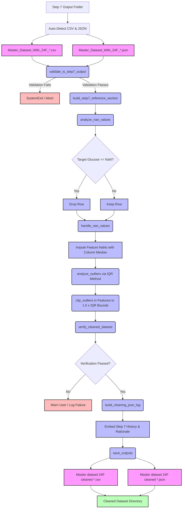

# Step 8 (Sub-task 1 & 2): Data Cleaning Pipeline (NaN & Outlier Handling)

> Automated preprocessing tool that prepares the engineered 24-feature PPG dataset for machine learning models by resolving missing values (NaN) through an asymmetric strategy and clipping statistical outliers using the Interquartile Range (IQR) method.

---

## TL;DR

This tool represents **Step 8 (Sub-task 1 & 2)** of the PPG-based glucose estimation data pipeline. It acts as the mathematical gatekeeper between feature engineering (Step 7) and data split/scaling (Step 8 Sub-task 3 & 4). The script performs two consecutive operations to ensure dataset cleanliness without compromising clinical targets:
1. **Asymmetric NaN Resolution**: Drops rows where the target glucose value is missing, and imputes missing feature values using the column-specific median.
2. **IQR-Based Outlier Clipping**: Clips feature values that lie beyond the bounds determined by $1.5 \times \text{IQR}$ (Interquartile Range) to their respective boundaries, while leaving the target clinical glucose values untouched.

**Quick Stats:**
- **Lines of Code**: ~1,380 lines of clean Python
- **Calculations**: Double-pass statistics (pre-cleaning analysis and post-cleaning verification)
- **Outlier Threshold**: $1.5 \times \text{IQR}$ (Standard Tukey boxplot boundary)
- **Target Variable Protection**: Clinical glucose values are strictly excluded from outlier modification
- **Traceability**: Embeds the full JSON log history from Step 7 (Code 08) and Step 6 (Code 07) inside a unified Step 8 log file
- **Typical Runtime**: < 2 seconds on standard hardware

---

## Table of Contents

1. [TL;DR](#tldr)
2. [Quick Start](#quick-start)
3. [Background & Motivation](#background--motivation)
4. [The Two Sub-Tasks](#the-two-sub-tasks)
5. [Mermaid Data Flow Diagram](#mermaid-data-flow-diagram)
6. [Features & Capabilities](#features--capabilities)
7. [Installation & Prerequisites](#installation--prerequisites)
8. [Input Data Format](#input-data-format)
9. [Output Structure](#output-structure)
10. [Detailed Mathematical Formulation](#detailed-mathematical-formulation)
11. [Configuration Reference](#configuration-reference)
12. [Code Architecture & Function Directory](#code-architecture--function-directory)
13. [Verification & Data Auditing](#verification--data-auditing)
14. [Troubleshooting & FAQ](#troubleshooting--faq)
15. [Next Step in Pipeline](#next-step-in-pipeline)
16. [References](#references)

---

## Quick Start

### Minimum Steps to Run

1. **Activate Environment**: Ensure your virtual environment containing the necessary data-science libraries is active.
   ```bash
   # Windows PowerShell
   .venv\Scripts\Activate.ps1
   # Linux / macOS
   source .venv/bin/activate
   ```
2. **Install Dependencies**: Ensure dependencies are installed (numpy, pandas, openpyxl, and tkinter).
   ```bash
   pip install pandas numpy openpyxl
   ```
3. **Configure Paths**: Open `Cleaned_dataset_without_NaN_and_outliers_Creation_code09.py` in your editor and update the user settings block at the top:
   ```python
   # Set this to the parent directory where Step 7 output folders are saved
   INPUT_ROOT  = Path(r"C:\Users\YourName\Documents\fyp\05_Data_Storage\08_Data_set_with_24_features")
   
   # Set this to the folder where you want Step 8 cleaned outputs to be saved
   OUTPUT_ROOT = Path(r"C:\Users\YourName\Documents\fyp\05_Data_Storage\09_Cleaned_dataset_without_(NaN_&_outliers)")
   ```
4. **Execute**: Run the script from your terminal:
   ```bash
   python Cleaned_dataset_without_NaN_and_outliers_Creation_code09.py
   ```
5. **Interactive Folder Browser**: A dialog box will appear. Select the specific timestamped Step 7 output folder (e.g., `Master_Dataset_With_24F_2026-06-21_14-40-15`) you wish to clean.
6. **Verify Clean Output**: Check the target directory in `OUTPUT_ROOT` for a new folder containing the cleaned master CSV and JSON audit log.

### Expected First Run Terminal Output

Upon launching the tool, the following interactive flow will execute:

```text
======================================================================
🧹 STEP 8 (Sub-task 1 & 2): DATA CLEANING PIPELINE
   Sub-task 1: Handle NaN Values (Median Imputation)
   Sub-task 2: Handle Outliers (IQR Clipping)
======================================================================

🔍 Scanning for latest Step 7 output folder...

────────────────────────────────────────────────────────────
🔍 STEP 7 OUTPUT FOLDER AUTO-DETECTION REPORT
────────────────────────────────────────────────────────────
   📁 Found 1 Step 7 output folder(s) in:
       C:\Users\DELL\Documents\GitHub\fyp\05_Data_Storage\08_Data_set_with_24_features

   ✅ LATEST (most recently modified):
      📁 Master_Dataset_With_24F_2026-06-21_14-40-15
         Last modified : 2026-06-21 14:40:18
         Has CSV       : ✅ Master_Dataset_With_24F_2026-06-21_14-40-15.csv
         Has JSON      : ✅ Master_Dataset_With_24F_2026-06-21_14-40-15.json

   ℹ️  The folder browser will open at the root folder.
       Please select the Step 7 folder listed above.
────────────────────────────────────────────────────────────
📂 Opening folder selector at: C:\Users\DELL\Documents\GitHub\fyp\05_Data_Storage\08_Data_set_with_24_features
[GUI Pop-up Message Box displays folder instructions...]
[User navigates and selects folder: Master_Dataset_With_24F_2026-06-21_14-40-15]
📁 Selected folder : Master_Dataset_With_24F_2026-06-21_14-40-15
   Full path       : C:\Users\DELL\Documents\GitHub\fyp\05_Data_Storage\08_Data_set_with_24_features\Master_Dataset_With_24F_2026-06-21_14-40-15

────────────────────────────────────────────────────────────
🔍 AUTO-DETECTING FILES INSIDE FOLDER
────────────────────────────────────────────────────────────
   📄 CSV found  : Master_Dataset_With_24F_2026-06-21_14-40-15.csv
   📄 JSON found : Master_Dataset_With_24F_2026-06-21_14-40-15.json

────────────────────────────────────────────────────────────
📥 LOADING INPUT FILES
────────────────────────────────────────────────────────────
✅ Loaded CSV: Master_Dataset_With_24F_2026-06-21_14-40-15.csv
   📊 Shape: 75 rows × 25 columns
✅ Loaded JSON: Master_Dataset_With_24F_2026-06-21_14-40-15.json
   📊 Top-level keys: 10

📋 Input columns (25):
    1. IR_Skewness
    2. IR_Kurtosis
    ...
   25. Glucose level (mg/dl)  ← TARGET

   ✅ Feature count verified: 24 features + 1 target

────────────────────────────────────────────────────────────
🔍 VALIDATING SELECTED FOLDER IS STEP 7 OUTPUT
────────────────────────────────────────────────────────────
   ✅ Step 7 output validation passed.
   📊 Columns   : 25
   📊 Rows      : 75
   📄 JSON step : STEP 7

────────────────────────────────────────────────────────────
📋 BUILDING STEP 7 PIPELINE CROSS-REFERENCE
────────────────────────────────────────────────────────────
   ✅ Step 7 cross-reference built successfully.
      Step 7 execution    : 2026-06-21 14:40:18
      Total features      : 24
      Total columns       : 25
      Step 6 reference    : ✅ Found (full pipeline chain preserved)

────────────────────────────────────────────────────────────
🔍 SUB-TASK 1: NaN ANALYSIS
────────────────────────────────────────────────────────────
   ✅ IR_Skewness: No NaN
   ✅ IR_Kurtosis: No NaN
   ⚠️ IR_HRV: 2 NaN(s) at rows [12, 45]
   🩸 Glucose level (mg/dl): 1 NaN(s) at rows [3]  ← TARGET

   📊 Total NaN cells: 3 / 1875 (0.16%)
   📊 Columns with NaN: 2
   📊 Columns clean: 23

   🚨 TARGET column has NaN at 1 row(s)!
      These rows will be DROPPED entirely (cannot train without glucose label).

────────────────────────────────────────────────────────────
🔧 SUB-TASK 1: NaN HANDLING
────────────────────────────────────────────────────────────

   🗑️ DROPPING 1 row(s) with NaN target (glucose):
      Row 3: glucose = NaN → DROPPED
      ✅ Dropped 1 row(s). New shape: 74 rows × 25 columns

   🔧 IMPUTING NaN in feature columns using MEDIAN:
      ⚠️ IR_HRV:
         NaN count: 2
         Median value used: 32.410000
         Imputed at row(s): [12, 45]

   🔍 Post-cleaning NaN verification: 0 NaN(s) remaining
   ✅ All NaN values successfully handled.

────────────────────────────────────────────────────────────
🔍 SUB-TASK 2: OUTLIER ANALYSIS (IQR Method, Multiplier=1.5)
────────────────────────────────────────────────────────────
   ✅ IR_Skewness: No outliers  [bounds: -0.124500 to 1.845000]
   ⚠️ Diff_Spectral_Entropy:
      Q1=-0.045000  Q3=0.082000  IQR=0.127000
      Bounds: [-0.235500, 0.272500]
      Above (1): rows [8] → values [0.342000]
   ...

   📊 Total outliers detected: 3
   📊 Columns with outliers: 2
   📊 Columns clean: 22

────────────────────────────────────────────────────────────
✂️ SUB-TASK 2: OUTLIER CLIPPING
────────────────────────────────────────────────────────────
   ✂️ Diff_Spectral_Entropy [row 8]: 0.342000 → 0.272500 (clipped DOWN to upper bound)
   ...
   📊 Total values clipped: 3

   🔍 Post-clipping outlier verification:
      Remaining outliers (re-calculated): 0
      ✅ All outliers successfully clipped.

────────────────────────────────────────────────────────────
🔍 FINAL VERIFICATION
────────────────────────────────────────────────────────────
   ✅ Column count: 25 (original: 25)
   ✅ Column names preserved: True
   ✅ No NaN remaining: 0 NaN(s)
   📊 Rows: 74 (original: 75, dropped: 1)
   ✅ Target column valid: True
   ✅ All features numeric: True

   📊 Cleaned dataset statistics:
      Shape: 74 rows × 25 columns
      Features: 24
      Target: Glucose level (mg/dl)
      Glucose range: 72.0 - 245.0 mg/dL
      Glucose mean:  118.4 mg/dL
      Glucose std:   38.2 mg/dL

   ✅ ALL CHECKS PASSED

────────────────────────────────────────────────────────────
📊 BEFORE vs AFTER COMPARISON
────────────────────────────────────────────────────────────

   Column                                Before Min    After Min   Before Max    After Max
   ───────────────────────────────────────────────────────────────────────────────────────
   IR_Skewness                            -0.114500    -0.114500     1.792500     1.792500
   IR_HRV                                 15.420000    15.420000    62.450000     62.450000
   Diff_Spectral_Entropy                  -0.214000    -0.214000     0.342000     0.272500 ←
   ...

────────────────────────────────────────────────────────────
📝 BUILDING COMPREHENSIVE JSON LOG
────────────────────────────────────────────────────────────
   ✅ JSON log structure built with 9 top-level sections.

────────────────────────────────────────────────────────────
💾 SAVING OUTPUTS
────────────────────────────────────────────────────────────
💾 Saved cleaned dataset : Master dataset 24F cleaned 2026-06-21 14-50-22.csv
   📊 Size: 18.24 KB
💾 Saved cleaning log    : Master dataset 24F cleaned 2026-06-21 14-50-22.json
   📊 Size: 64.12 KB

🆕 All output files are newly created.

📁 Output folder: C:\Users\DELL\Documents\GitHub\fyp\05_Data_Storage\09_Cleaned_dataset_without_(NaN_&_outliers)\Master dataset 24F cleaned 2026-06-21 14-50-22

======================================================================
📌 DATA CLEANING PIPELINE — FINAL SUMMARY
======================================================================

   📥 Input folder : Master_Dataset_With_24F_2026-06-21_14-40-15
      CSV          : Master_Dataset_With_24F_2026-06-21_14-40-15.csv
      JSON         : Master_Dataset_With_24F_2026-06-21_14-40-15.json
      Shape        : 75 rows × 25 columns

   📤 Output folder: Master dataset 24F cleaned 2026-06-21 14-50-22
      CSV          : Master dataset 24F cleaned 2026-06-21 14-50-22.csv
      JSON         : Master dataset 24F cleaned 2026-06-21 14-50-22.json
      Shape        : 74 rows × 25 columns

   🧹 Sub-task 1 — NaN Handling:
      Total NaN found           : 3
      Rows dropped (target NaN) : 1
      Values imputed (median)   : 2
      Imputation method         : Median

   ✂️  Sub-task 2 — Outlier Clipping:
      IQR multiplier            : 1.5
      Total outliers detected   : 3
      Total values clipped      : 3
      Target column touched     : No

   ✅ Verification : ALL PASSED

   📁 Output folder : C:\Users\DELL\Documents\GitHub\fyp\05_Data_Storage\09_Cleaned_dataset_without_(NaN_&_outliers)\Master dataset 24F cleaned 2026-06-21 14-50-22
   📄 Dataset CSV   : Master dataset 24F cleaned 2026-06-21 14-50-22.csv
   📄 JSON Log      : Master dataset 24F cleaned 2026-06-21 14-50-22.json

✅ Data cleaning pipeline completed successfully!
   → Output is ready for Step 8 Sub-task 3 & 4
     (Train/Test Split + RobustScaler Normalization)
======================================================================
```

### Common First-Time Issues

| Problem | Symptom / Error | Cause | Quick Fix |
|---|---|---|---|
| **No Step 7 folders found** | Report prints: "No 'Master_Dataset_With_24F' folders found" | `INPUT_ROOT` is set incorrectly or Code 08 was not run | Double-check that `INPUT_ROOT` matches the path where Code 08 saves its output. |
| **Empty file browser** | Execution stops or file picker does not load files | Folder structure is empty or permissions block tkinter | Verify that Python has desktop permissions and can open GUI popups on Windows. |
| **Column count mismatch** | Abort message: "Column count mismatch... Expected 25" | The selected CSV has a different column structure (e.g., raw Master with 32 columns) | Ensure you selected the output folder from Code 08 (`Master_Dataset_With_24F`), not Step 7 (`MasterDataset_..._Features`). |
| **Target column missing** | Abort message: "Target column... not found" | Column name was changed in Excel sheet or Step 7 config | Check that `TARGET_COLUMN` is set to `"Glucose level (mg/dl)"` in the script configuration. |

---

## Background & Motivation

### The "Garbage In, Garbage Out" Problem in Machine Learning

Machine learning models, including decision-tree-based algorithms like XGBoost, are highly sensitive to the quality of their input matrices. In clinical research projects collecting photoplethysmography (PPG) signals to estimate blood glucose levels, data collection occurs under varying real-world conditions. These conditions inevitably introduce anomalies:

- **Signal Dropouts**: Temporary sensor disconnection or finger slippage yields incomplete data sequences that translate to missing values (`NaN`) during feature extraction.
- **Autonomic Alterations**: Sudden movement or shivering can generate spikes in heart rate variability (HRV) features or amplitude measures. These appear as severe outliers in the feature matrix.
- **Clinical Data Omissions**: Failure to log a finger-stick blood glucose reading during a data collection session results in a row with missing target labels.

If these anomalies are passed directly to model training without systematic preprocessing:
1. **Model Crashes**: Training modules in Scikit-Learn will fail to compile, raising `ValueError: Input contains NaN, infinity or a value too large for dtype('float64')`.
2. **Distorted Scaling**: Scale values will be skewed. Standard normalization techniques (like Z-score or MinMax) are heavily influenced by outliers, which squeezes normal-range values into a narrow, indistinguishable band.
3. **Loss Function Corruption**: Outlying targets skew regression loss functions (such as Mean Squared Error), forcing the model to fit noise instead of physiological trends.

---

### The Asymmetric Cleaning Rationale

This script addresses missing values and outliers using an **asymmetric strategy**—meaning it treats the predictor variables (features) differently from the target variable (labels).

```
                            ┌───────────────────────────┐
                            │      INPUT DATASET        │
                            └─────────────┬─────────────┘
                                          │
                    ┌─────────────────────┴─────────────────────┐
                    ▼                                           ▼
       ┌─────────────────────────┐                 ┌─────────────────────────┐
       │     FEATURE COLUMNS     │                 │   TARGET LABELS (Glu)   │
       └────────────┬────────────┘                 └────────────┬────────────┘
                    │                                           │
         ┌──────────┴──────────┐                     ┌──────────┴──────────┐
         ▼                     ▼                     ▼                     ▼
    [NaN Values]         [Outlier Values]       [NaN Values]         [Outlier Values]
         │                     │                     │                     │
         ▼                     ▼                     ▼                     ▼
  Impute w/ Median       Clip w/ IQR Bounds       Drop Row          Do Not Touch
 (Non-skewed center)    (Limit extreme range) (Cannot predict)    (Preserve clinical)
```

#### 1. Why Impute Features but Drop Target NaNs?
- **Features**: A missing feature value (e.g., a missing `IR_HRV` value due to transient artifact) represents a partial loss of information. Rather than throwing away the entire record—which is highly wasteful in small clinical datasets (typically $N < 100$)—we replace the missing cell using the column's **median**.
- **Target**: The target variable `Glucose level (mg/dl)` is the ground truth. If a record has no reference glucose label, the row cannot be used for supervised learning. Imputing a target label would introduce arbitrary bias. Therefore, rows with missing targets are dropped.

#### 2. Why Median Imputation Over Mean or Mode?
PPG morphological features (such as Shannon entropy, Teager Energy metrics, and derivative skews) do not follow a clean Gaussian distribution. They are often heavily skewed. Using the arithmetic mean would pull the imputed value toward the tail of the distribution, creating a biased representation. The median represents the true statistical center of skewed distributions and remains robust against pre-existing outliers.

#### 3. Why Clip Feature Outliers but Leave Target Outliers Untouched?
- **Feature Clipping**: Feature outliers can distort downstream scaling and model fitting. However, deleting rows with outliers would critically reduce our sample size. By **clipping** (capping the value at the upper or lower statistical boundary), we eliminate the disruptive effect of extreme values while preserving the rest of the subject's feature information.
- **Target Preservation**: The glucose values are real clinical readings from blood meters. An extremely high glucose value (e.g., 260 mg/dL) or low value (e.g., 65 mg/dL) represents a real physiological state (hyperglycemia or hypoglycemia) that the model must learn to predict. Modifying or clipping the target glucose values would corrupt the clinical ground truth.

---

## Mermaid Data Flow Diagram

The following Mermaid diagram traces the data flow through the cleaning pipeline, showing how Step 7 output files are transformed into clean Step 8 files, while preserving the full JSON logging history:



---

## Features & Capabilities

### Core Preprocessing
- **Sequential Cleaning Flow**: Executes NaN correction followed by outlier adjustments on the newly clean data to prevent outliers from contaminating median calculations.
- **Tukey Outlier Clipping**: Employs the standard statistical $1.5 \times \text{IQR}$ range to detect outliers. Rather than deleting records, it clips the outliers to the upper and lower boundaries:
  $$\text{Lower Bound} = Q_1 - 1.5 \times \text{IQR}$$
  $$\text{Upper Bound} = Q_3 + 1.5 \times \text{IQR}$$
- **Clinical Target Exclusion**: Strictly screens target variables from outlier capping. The model remains trained on raw, unmodified biological ranges.

### Verification & Validation Checks
- **Structure Validation**: Confirms the input folder is a verified Step 7 output, asserting the presence of the required 25 columns and matching target attributes.
- **Post-Preprocessing Audit**: Re-calculates NaN occurrences and outlier bounds after clipping, verifying that no NaNs remain.
- **Float Comparison Integrity**: Executes a cell-by-cell validation using a tight numerical tolerance ($10^{-9}$) to ensure that non-outlier feature values are preserved without corruption.

### Traceability & Audit Trails
- **Continuous Logging Chain**: Embeds Step 7's metadata and the original Step 6 parameters into the new Step 8 JSON log, preserving a complete audit trail.
- **File Audit Reports**: Computes pre-existing and post-existing file sizes during re-runs to keep a record of changes.
- **Chronological File Management**: Automatically creates unique, timestamped directories for each execution, preventing accidental data loss.

---

## Installation & Prerequisites

### System Requirements

- **Operating System**: Windows 10/11, macOS, or Linux.
- **Python Version**: Python 3.8 to 3.12.
- **Libraries**: Built using standard Scientific Python packages (NumPy, Pandas) and standard libraries (Tkinter, Pathlib, Json).

### Python Packages

Ensure your environment includes the following packages:

| Package | Version | Purpose |
|---|---|---|
| `pandas` | $\ge 1.3.0$ | Dataframe representation, CSV parsing, and Excel support. |
| `numpy` | $\ge 1.20.0$ | Vectorized math, NaN masking, and percentile calculations. |
| `openpyxl` | $\ge 3.0.0$ | Engine used by Pandas to read Step 7 Excel sheets. |
| `tkinter` | Standard Library | Displays native directory dialogues for folder selection. |

### Environment Setup

Create and configure your virtual environment:

```bash
# Navigate to project root
cd C:\Users\DELL\Documents\GitHub\fyp

# Create environment
python -m venv .venv

# Activate environment (Windows)
.venv\Scripts\activate

# Install dependencies
pip install numpy pandas openpyxl
```

---

## Input Data Format

The script processes the output folder generated by Step 7 (Code 08). The input folder must contain exactly one CSV file and one JSON configuration file.

### Folder Tree Structure

```text
C:\Users\DELL\Documents\GitHub\fyp\05_Data_Storage\08_Data_set_with_24_features\
└── Master_Dataset_With_24F_2026-06-21_14-40-15\
    ├── Master_Dataset_With_24F_2026-06-21_14-40-15.csv
    └── Master_Dataset_With_24F_2026-06-21_14-40-15.json
```

### Expected Input CSV Columns

The CSV file must contain exactly 25 columns (24 features + 1 target glucose column):

```text
1.  IR_Skewness
2.  IR_Kurtosis
3.  IR_Shannon Entropy
4.  IR_Spectral Entropy
5.  IR_pulse width
6.  IR_PPI
7.  IR_systolic amplitude
8.  IR_BPM
9.  IR_HRV
10. IR_TEO Mean
11. IR_TEO std dev
12. IR_1st_Derivative_Mean
13. IR_2nd_Derivative_Mean
14. IR_2nd_Derivative_Skewness
15. IR_Harmonic ratio
16. IR_Rise time
17. IR_Decay time
18. IR_Dicrotic notch
19. Ratio_systolic_amplitude
20. Ratio_TEO_Mean
21. Diff_2nd_Derivative_Mean
22. Diff_Spectral_Entropy
23. Diff_Dicrotic_notch
24. Ensemble ratio
25. Glucose level (mg/dl)  ← Target Variable
```

---

## Output Structure

The script outputs a timestamped directory containing the cleaned CSV file and a comprehensive JSON log.

### Output Folder Tree

```text
C:\Users\DELL\Documents\GitHub\fyp\05_Data_Storage\09_Cleaned_dataset_without_(NaN_&_outliers)\
└── Master dataset 24F cleaned 2026-06-21 14-50-22\
    ├── Master dataset 24F cleaned 2026-06-21 14-50-22.csv
    └── Master dataset 24F cleaned 2026-06-21 14-50-22.json
```

### Cleaned CSV Format

The output CSV retains the same 25 columns. Outlier values in features 1 through 24 are clipped to their respective bounds, and rows containing a `NaN` target are dropped.

---

### Output JSON Log Schema

The generated JSON log provides complete documentation of the cleaning process:

```json
{
    "pipeline_info": {
        "pipeline_name": "Data Cleaning: NaN Handling + Outlier Clipping",
        "pipeline_step": "STEP 8 (Sub-task 1 & 2)",
        "execution_timestamp": "2026-06-21 14-50-22",
        "execution_date_readable": "2026-06-21 14:50:22",
        "previous_step": "STEP 7 (Feature Engineering)"
    },
    "step7_pipeline_reference": {
        "status": "found",
        "step7_log_file": "C:\\...\\Master_Dataset_With_24F_2026-06-21_14-40-15.json",
        "pipeline_provenance": {
            "step7_execution_date": "2026-06-21 14:40:18",
            "step7_input_master_csv": "C:\\...\\06_Averaged_Features_MASTER_Dataset.csv"
        }
    },
    "dataset_shape_summary": {
        "input_rows": 75,
        "input_columns": 25,
        "output_rows": 74,
        "output_columns": 25,
        "rows_dropped": 1,
        "columns_unchanged": true,
        "feature_count": 24,
        "target_column": "Glucose level (mg/dl)"
    },
    "sub_task_1_nan_handling": {
        "nan_analysis": {
            "total_nan_count": 3,
            "columns_with_nan": [
                {
                    "column": "IR_HRV",
                    "nan_count": 2,
                    "nan_row_indices": [12, 45],
                    "is_target": false
                },
                {
                    "column": "Glucose level (mg/dl)",
                    "nan_count": 1,
                    "nan_row_indices": [3],
                    "is_target": true
                }
            ]
        },
        "nan_handling": {
            "rows_dropped_due_to_target_nan": [
                {
                    "row_index": 3,
                    "reason": "Target column (Glucose level) is NaN..."
                }
            ],
            "feature_imputations": [
                {
                    "column": "IR_HRV",
                    "nan_count": 2,
                    "median_value_used": 32.41,
                    "nan_row_indices": [12, 45]
                }
            ]
        }
    },
    "sub_task_2_outlier_handling": {
        "outlier_analysis": {
            "total_outliers_detected": 3,
            "columns_with_outliers": [
                {
                    "column": "Diff_Spectral_Entropy",
                    "q1": -0.045,
                    "q3": 0.082,
                    "iqr": 0.127,
                    "lower_bound": -0.2355,
                    "upper_bound": 0.2725,
                    "total_outliers": 1,
                    "outliers_above": [
                        {
                            "row_index": 8,
                            "original_value": 0.342
                        }
                    ]
                }
            ]
        },
        "clipping_log": {
            "total_values_clipped": 3,
            "clipped_features": [
                {
                    "column": "Diff_Spectral_Entropy",
                    "clipped_values": [
                        {
                            "row_index": 8,
                            "original_value": 0.342,
                            "clipped_to": 0.2725,
                            "direction": "above_upper_bound"
                        }
                    ]
                }
            ]
        }
    },
    "verification_results": {
        "all_passed": true,
        "checks": [
            { "check": "column_count", "passed": true },
            { "check": "no_nan", "passed": true }
        ]
    }
}
```

---

## Detailed Mathematical Formulation

The script implements two primary mathematical algorithms for data cleaning: **Median Imputation** and **IQR-based Clipping**.

### 1. Median Imputation (Sub-task 1)

For feature columns containing missing values, the replacement value is calculated as the median of the non-missing values in that column.

Let $X_c = \{x_1, x_2, \dots, x_N\}$ represent the values in feature column $c$. The subset of valid, non-missing values is defined as:
$$X'_c = \{x_i \in X_c \mid x_i \neq \text{NaN}\}$$

We sort $X'_c$ in ascending order to obtain the ordered sequence:
$$Y_c = \{y_1, y_2, \dots, y_M\} \quad \text{where} \quad y_1 \le y_2 \le \dots \le y_M \quad \text{and} \quad M \le N$$

The imputation value $\tilde{y}_c$ is calculated as the median of the distribution:
$$\tilde{y}_c = \text{median}(Y_c) = \begin{cases} 
      y_{\frac{M+1}{2}} & \text{if } M \text{ is odd} \\
      \frac{1}{2}\left(y_{\frac{M}{2}} + y_{\frac{M}{2} + 1}\right) & \text{if } M \text{ is even}
   \end{cases}$$

Any missing value in column $c$ is replaced:
$$\text{For each } x_i \in X_c, \quad \text{if } x_i = \text{NaN} \implies x_i \leftarrow \tilde{y}_c$$

---

### 2. Interquartile Range (IQR) Outlier Clipping (Sub-task 2)

Outliers are identified and adjusted using the Interquartile Range (IQR) method.

For each feature column $c$, the first quartile ($Q_1$) and third quartile ($Q_3$) are calculated from the non-missing values:
$$Q_1(c) = 25\text{th percentile of } X'_c$$
$$Q_3(c) = 75\text{th percentile of } X'_c$$

The Interquartile Range is defined as the difference between these quartiles:
$$\text{IQR}(c) = Q_3(c) - Q_1(c)$$

Using a standard multiplier of $1.5$, the lower and upper bounds for outlier detection are established:
$$\text{LB}(c) = Q_1(c) - 1.5 \times \text{IQR}(c)$$
$$\text{UB}(c) = Q_3(c) + 1.5 \times \text{IQR}(c)$$

For each value $x_i$ in feature column $c$, the clipping operation is defined as:
$$x'_i = \text{clip}(x_i, \text{LB}(c), \text{UB}(c)) = \begin{cases}
      \text{LB}(c) & \text{if } x_i < \text{LB}(c) \\
      \text{UB}(c) & \text{if } x_i > \text{UB}(c) \\
      x_i & \text{if } \text{LB}(c) \le x_i \le \text{UB}(c)
   \end{cases}$$

This capping process ensures that extreme values are adjusted to the boundary limits without removing the corresponding rows from the dataset.

---

## Configuration Reference

The configuration parameters are defined in the user settings section at the top of the script:

| Parameter | Type | Default Value | Description |
|---|---|---|---|
| `INPUT_ROOT` | `Path` | `Path(r"C:\Users\DELL\Documents\GitHub\fyp\05_Data_Storage\08_Data_set_with_24_features")` | The directory scanned for Step 7 output folders. |
| `OUTPUT_ROOT` | `Path` | `Path(r"C:\Users\DELL\Documents\GitHub\fyp\05_Data_Storage\09_Cleaned_dataset_without_(NaN_&_outliers)")` | The destination directory where cleaned outputs are saved. |
| `TARGET_COLUMN` | `str` | `"Glucose level (mg/dl)"` | The target column name (glucose readings). Rows are dropped if this is `NaN`. |
| `IQR_MULTIPLIER` | `float` | `1.5` | The multiplier used to calculate the lower and upper bounds for outlier clipping. |
| `STEP7_FOLDER_IDENTIFIER` | `str` | `"Master_Dataset_With_24F"` | The directory name pattern checked during the validation scan. |
| `STEP7_JSON_PIPELINE_STEP_ID` | `str` | `"STEP 7"` | The pipeline step identifier verified inside the Step 7 JSON file. |

---

## Code Architecture & Function Directory

The script is structured as a single-file pipeline with modular helper functions.

### Import Inventory

The script imports the following libraries:
- `os`: Interacts with the operating system.
- `json`: Parses and exports configuration and log files.
- `traceback`: Extracts stack traces during execution failures.
- `pathlib.Path`: Manages file path operations.
- `datetime.datetime`: Generates formatted timestamps.
- `tkinter`: Renders directory selection dialogues.
- `numpy` (as `np`): Performs array manipulation and percentile calculations.
- `pandas` (as `pd`): Manages tabular data operations.

---

### Function Reference

#### 1. `find_latest_step7_output_folder(root_path)`
- **Role**: Scans `INPUT_ROOT` for folders matching `STEP7_FOLDER_IDENTIFIER` to identify the most recently modified run.
- **Parameters**: 
  - `root_path` (`Path`): Path to search.
- **Returns**: A dictionary containing detection results, metadata, and contents for each folder found.

#### 2. `print_step7_folder_detection_report(detection_result)`
- **Role**: Formats and prints a terminal report summarizing the detected Step 7 output folders.
- **Parameters**: 
  - `detection_result` (`dict`): The dictionary returned by `find_latest_step7_output_folder`.
- **Returns**: `None`.

#### 3. `popup_folder_selector(initial_dir)`
- **Role**: Opens a Tkinter dialog box requesting the user to select the Step 7 output folder.
- **Parameters**: 
  - `initial_dir` (`Path`): The default directory opened by the folder browser.
- **Returns**: `Path`: Path to the selected folder.
- **Raises**: `SystemExit` if the selection is cancelled.

#### 4. `find_csv_and_json_in_folder(folder_path)`
- **Role**: Searches the selected folder and returns the paths to the CSV and JSON files.
- **Parameters**: 
  - `folder_path` (`Path`): Path to the selected directory.
- **Returns**: `tuple(Path, Path)`: Paths to the discovered CSV and JSON files.
- **Raises**: `FileNotFoundError` if either file type is missing.

#### 5. `validate_is_step7_output(folder_path, df, json_data)`
- **Role**: Assures that the selected folder is a valid Step 7 output before processing.
- **Parameters**: 
  - `folder_path` (`Path`): The directory path.
  - `df` (`pd.DataFrame`): The loaded dataset.
  - `json_data` (`dict`): The parsed JSON log.
- **Returns**: A dictionary containing validation checks, warnings, and errors.

#### 6. `build_step7_reference_section(step7_json_data, step7_json_path, step7_csv_path)`
- **Role**: Extracts metadata and configurations from the Step 7 JSON to build a cross-reference section for Step 8.
- **Parameters**: 
  - `step7_json_data` (`dict`): Raw Step 7 JSON data.
  - `step7_json_path` (`Path`): Path to the Step 7 JSON log.
  - `step7_csv_path` (`Path`): Path to the Step 7 CSV file.
- **Returns**: `dict`: A cross-reference dictionary containing Step 7 provenance details.

#### 7. `load_csv(file_path)`
- **Role**: Parses a CSV file into a Pandas DataFrame and prints basic dimension details.
- **Parameters**: 
  - `file_path` (`Path`): Path to the target CSV.
- **Returns**: `pd.DataFrame`.

#### 8. `load_json(file_path)`
- **Role**: Parses a JSON file into a dictionary.
- **Parameters**: 
  - `file_path` (`Path`): Path to the target JSON.
- **Returns**: `dict`.

#### 9. `check_existing_file(file_path)`
- **Role**: Checks if a file exists and returns its size. Used to audit file replacements.
- **Parameters**: 
  - `file_path` (`Path`): Path to check.
- **Returns**: `dict` containing existence status and file size.

#### 10. `analyze_nan_values(df)`
- **Role**: Performs a column-by-column scan to count missing values and identify columns containing `NaN`.
- **Parameters**: 
  - `df` (`pd.DataFrame`): The input dataset.
- **Returns**: `dict`: Detailed breakdown of missing values.

#### 11. `handle_nan_values(df, nan_analysis)`
- **Role**: Implements the asymmetric NaN handling strategy (dropping rows with target NaNs and imputing feature NaNs with column medians).
- **Parameters**: 
  - `df` (`pd.DataFrame`): The input dataset.
  - `nan_analysis` (`dict`): The dictionary returned by `analyze_nan_values`.
- **Returns**: `tuple(pd.DataFrame, dict)`: Cleaned DataFrame and handling logs.

#### 12. `analyze_outliers(df)`
- **Role**: Computes quartiles, IQR, and bounds for feature columns, reporting values that exceed these limits.
- **Parameters**: 
  - `df` (`pd.DataFrame`): The dataset (after NaN handling).
- **Returns**: `dict`: Outlier statistics.

#### 13. `clip_outliers(df, outlier_analysis)`
- **Role**: Clips feature values that exceed the calculated upper and lower IQR boundaries.
- **Parameters**: 
  - `df` (`pd.DataFrame`): The dataset.
  - `outlier_analysis` (`dict`): The outlier statistics.
- **Returns**: `tuple(pd.DataFrame, dict)`: Clipped DataFrame and clipping logs.

#### 14. `verify_cleaned_dataset(cleaned_df, original_df)`
- **Role**: Performs a final validation check on the cleaned dataset to ensure structure and target columns are correct.
- **Parameters**: 
  - `cleaned_df` (`pd.DataFrame`): The cleaned dataset.
  - `original_df` (`pd.DataFrame`): The raw dataset before preprocessing.
- **Returns**: `dict`: Verification results.

#### 15. `build_cleaning_json_log(...)`
- **Role**: Aggregates metadata, statistics, logs, and references into a unified Step 8 JSON dictionary.
- **Parameters**: Multiple metrics and logs gathered during execution.
- **Returns**: `dict`: The unified log.

#### 16. `save_outputs(cleaned_df, json_log, output_folder, timestamp_str)`
- **Role**: Saves the cleaned CSV and JSON logs into a timestamped directory, and prints a size comparison if files were replaced.
- **Parameters**: 
  - `cleaned_df` (`pd.DataFrame`): Cleaned dataset.
  - `json_log` (`dict`): Final log dict.
  - `output_folder` (`Path`): Parent output path.
  - `timestamp_str` (`str`): Formatting string.
- **Returns**: `tuple(Path, Path, Path)`: Paths to saved files and folder.

#### 17. `main()`
- **Role**: Orchestrates the entire pipeline, executing folder detection, validation, NaN handling, outlier clipping, and data export.
- **Parameters**: None.
- **Returns**: `None`.

---

## Verification & Data Auditing

The script performs several automated validation checks before exporting data:

### 1. Structural Integrity Check
Checks that the dataset shape matches expectations. The column count must remain exactly 25, and column names must match the input file exactly.
$$\text{Columns}_{\text{cleaned}} = \text{Columns}_{\text{original}} \quad \text{and} \quad \text{Header}_{\text{cleaned}} \equiv \text{Header}_{\text{original}}$$

### 2. Missing Values Audit
Verifies that no missing values remain in either the feature columns or the target columns.
$$\sum_{c=1}^{C} \sum_{i=1}^{R} \mathbb{I}(x_{i,c} == \text{NaN}) = 0 \quad \text{where} \quad \mathbb{I} \text{ is the indicator function}$$

### 3. Feature Range Validation
Iterates through all feature columns and compares the new min and max boundaries. If values were clipped, the new boundary must align with the calculated limits:
$$\text{If } \min(X_c) < \text{LB}(c) \implies \min(X'_c) == \text{LB}(c)$$
$$\text{If } \max(X_c) > \text{UB}(c) \implies \max(X'_c) == \text{UB}(c)$$
Non-outlier values are verified using a tight tolerance ($10^{-9}$) to confirm they were not modified:
$$|x_{i,c} - x'_{i,c}| < 10^{-9} \quad \text{for all } x_{i,c} \in [\text{LB}(c), \text{UB}(c)]$$

### 4. Target Column Audit
Confirms that target glucose values were not modified or scaled during the outlier clipping process:
$$y'_i \equiv y_i \quad \text{for all } i \in R_{\text{cleaned}}$$

---

## Troubleshooting & FAQ

### Frequently Encountered Issues

#### 1. Why do outliers sometimes remain after clipping?
After clipping outliers, the overall shape of the feature distribution changes. When the script runs its post-clipping check, it recalculates the first quartile ($Q_1$), third quartile ($Q_3$), and IQR based on the adjusted values. Because the variance has decreased, these boundaries contract, which can occasionally label newly adjusted boundary values as outliers. This is expected behavior and a normal mathematical result of single-pass clipping. The values have been successfully capped to the original boundaries.

#### 2. What happens if Tkinter raises a "no display name" error?
If you are running the script in a headless Linux environment, Tkinter may fail to open the folder browser. The script will catch the error and display an instructions message in the terminal. If the window fails to open, verify that you are running Python locally with window manager privileges.

#### 3. Where are the dropped rows logged?
Dropped rows (such as rows missing target glucose values) are detailed under `sub_task_1_nan_handling.nan_handling.rows_dropped_due_to_target_nan` in the output JSON log. The log records the original row index, the reason for dropping, and a copy of the features in that row prior to exclusion.

#### 4. Can I use a multiplier other than 1.5 for outlier detection?
Yes. You can adjust the outlier threshold by changing the `IQR_MULTIPLIER` parameter in the configuration settings. Using a larger multiplier (e.g., `3.0`) will target only extreme outliers, while a smaller multiplier (e.g., `1.0`) will clip values closer to the median. The default value of `1.5` is the standard statistical configuration.

---

## Next Step in Pipeline

Once the dataset is cleaned, proceed to **Step 8 (Sub-task 3 & 4)**, implemented in `Train_Test_Split_and_Robust_Scaling_Code10.py`:

```
┌──────────────────────────────────────┐
│  Step 8 (Sub-task 1 & 2): THIS SCRIPT│  ← Prepares clean, unscaled master matrix
└──────────────────┬───────────────────┘
                   │
                   ▼
┌──────────────────────────────────────┐
│  Step 8 (Sub-task 3 & 4): Code 10    │  ← Splits data and scales features
└──────────────────┬───────────────────┘
                   │
                   ▼
┌──────────────────────────────────────┐
│  Step 9: XGBoost Model Training      │  ← Train and evaluate model
└──────────────────────────────────────┘
```

Code 10 will import this cleaned dataset, perform a subject-stratified Train/Test split, fit a `RobustScaler` on the training partition, and scale the test partition using those parameters to prevent data leakage.

---

## References

1. Tukey, J. W. (1977). *Exploratory Data Analysis*. Addison-Wesley.
2. Pedregosa, F., et al. (2011). Scikit-learn: Machine Learning in Python. *Journal of Machine Learning Research*, 12, 2825-2830.
3. Elgendi, M. (2012). On the Analysis of Photoplethysmogram Signals. *Current Cardiology Reviews*, 8(1), 14-25.
4. McKinney, W. (2010). Data Structures for Statistical Computing in Python. *Proceedings of the 9th Python in Science Conference*, 51-56.