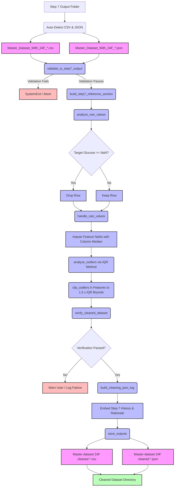

# Step 8 (Sub-task 1 & 2): Data Cleaning Pipeline (NaN & Outlier Handling)

> Automated preprocessing tool that prepares the engineered 24-feature PPG dataset for machine learning models by resolving missing values (NaN) through an asymmetric strategy and clipping statistical outliers using the Interquartile Range (IQR) method.

---

## TL;DR

This tool represents **Step 8 (Sub-task 1 & 2)** of the PPG-based glucose estimation data pipeline. It acts as the mathematical gatekeeper between feature engineering (Step 7) and data split/scaling (Step 8 Sub-task 3 & 4). The script performs two consecutive operations to ensure dataset cleanliness without compromising clinical targets:
1. **Asymmetric NaN Resolution**: Drops rows where the target glucose value is missing, and imputes missing feature values using the column-specific median.
2. **IQR-Based Outlier Clipping**: Clips feature values that lie beyond the bounds determined by $1.5 \times \text{IQR}$ (Interquartile Range) to their respective boundaries, while leaving the target clinical glucose values untouched.

**Quick Stats:**
- **Lines of Code**: ~1,380 lines of clean Python
- **Calculations**: Double-pass statistics (pre-cleaning analysis and post-cleaning verification)
- **Outlier Threshold**: $1.5 \times \text{IQR}$ (Standard Tukey boxplot boundary)
- **Target Variable Protection**: Clinical glucose values are strictly excluded from outlier modification
- **Traceability**: Embeds the full JSON log history from Step 7 ([Code 08](file:///C:/Users/DELL/Documents/GitHub/fyp/07_Data_Set_Processing_Code_for_ML/Data_set_with_24_Features_creation_08.py)) and Step 6 ([Code 07](file:///C:/Users/DELL/Documents/GitHub/fyp/06_Data_Set_Creation/Data_Set_Creation_Code07.py)) inside a unified Step 8 log file
- **Typical Runtime**: < 2 seconds on standard hardware

---

## Table of Contents

1. [TL;DR](#tldr)
2. [Quick Start](#quick-start)
3. [Background & Motivation](#background--motivation)
4. [Physiological Theories & Wavelength Physics](#physiological-theories--wavelength-physics)
5. [Machine Learning Mechanics & Outlier Distortion](#machine-learning-mechanics--outlier-distortion)
6. [The Two Sub-Tasks](#the-two-sub-tasks)
7. [Mermaid Data Flow Diagram](#mermaid-data-flow-diagram)
8. [Features & Capabilities](#features--capabilities)
9. [Installation & Prerequisites](#installation--prerequisites)
10. [Input Data Format](#input-data-format)
11. [Output Structure](#output-structure)
12. [Detailed Mathematical Formulation](#detailed-mathematical-formulation)
13. [Configuration Reference](#configuration-reference)
14. [Code Architecture & Function Directory](#code-architecture--function-directory)
15. [Verification & Data Auditing](#verification--data-auditing)
16. [Troubleshooting & FAQ](#troubleshooting--faq)
17. [Next Step in Pipeline](#next-step-in-pipeline)
18. [References](#references)

---

## Quick Start

### Minimum Steps to Run

1. **Activate Environment**: Ensure your virtual environment containing the necessary data-science libraries is active.
   ```bash
   # Windows PowerShell
   .venv\Scripts\Activate.ps1
   # Linux / macOS
   source .venv/bin/activate
   ```
2. **Install Dependencies**: Ensure dependencies are installed (numpy, pandas, openpyxl).
   ```bash
   pip install pandas numpy openpyxl
   ```
3. **Configure Paths**: Open [Cleaned_dataset_without_NaN_and_outliers_Creation_code09.py](file:///C:/Users/DELL/Documents/GitHub/fyp/07_Data_Set_Processing_Code_for_ML/Cleaned_dataset_without_NaN_and_outliers_Creation_code09.py) in your editor and update the user settings block at the top:
   ```python
   # Set this to the parent directory where Step 7 output folders are saved
   INPUT_ROOT  = Path(r"C:\Users\YourName\Documents\fyp\05_Data_Storage\08_Data_set_with_24_features")
   
   # Set this to the folder where you want Step 8 cleaned outputs to be saved
   OUTPUT_ROOT = Path(r"C:\Users\YourName\Documents\fyp\05_Data_Storage\09_Cleaned_dataset_without_(NaN_&_outliers)")
   ```
4. **Execute**: Run the script from your terminal:
   ```bash
   python Cleaned_dataset_without_NaN_and_outliers_Creation_code09.py
   ```
5. **Interactive Folder Browser**: A dialog box will appear. Select the specific timestamped Step 7 output folder (e.g., `Master_Dataset_With_24F_2026-06-21_14-40-15`) you wish to clean.
6. **Verify Clean Output**: Check the target directory in `OUTPUT_ROOT` for a new folder containing the cleaned master CSV and JSON audit log.

### Expected First Run Terminal Output

Upon launching the tool, the following interactive flow will execute:

```text
======================================================================
🧹 STEP 8 (Sub-task 1 & 2): DATA CLEANING PIPELINE
   Sub-task 1: Handle NaN Values (Median Imputation)
   Sub-task 2: Handle Outliers (IQR Clipping)
======================================================================

🔍 Scanning for latest Step 7 output folder...

────────────────────────────────────────────────────────────
🔍 STEP 7 OUTPUT FOLDER AUTO-DETECTION REPORT
────────────────────────────────────────────────────────────
   📁 Found 1 Step 7 output folder(s) in:
       C:\Users\DELL\Documents\GitHub\fyp\05_Data_Storage\08_Data_set_with_24_features

   ✅ LATEST (most recently modified):
      📁 Master_Dataset_With_24F_2026-06-21_14-40-15
         Last modified : 2026-06-21 14:40:18
         Has CSV       : ✅ Master_Dataset_With_24F_2026-06-21_14-40-15.csv
         Has JSON      : ✅ Master_Dataset_With_24F_2026-06-21_14-40-15.json

   ℹ️  The folder browser will open at the root folder.
       Please select the Step 7 folder listed above.
────────────────────────────────────────────────────────────
📂 Opening folder selector at: C:\Users\DELL\Documents\GitHub\fyp\05_Data_Storage\08_Data_set_with_24_features
[GUI Pop-up Message Box displays folder instructions...]
[User navigates and selects folder: Master_Dataset_With_24F_2026-06-21_14-40-15]
📁 Selected folder : Master_Dataset_With_24F_2026-06-21_14-40-15
   Full path       : C:\Users\DELL\Documents\GitHub\fyp\05_Data_Storage\08_Data_set_with_24_features\Master_Dataset_With_24F_2026-06-21_14-40-15

────────────────────────────────────────────────────────────
🔍 AUTO-DETECTING FILES INSIDE FOLDER
────────────────────────────────────────────────────────────
   📄 CSV found  : Master_Dataset_With_24F_2026-06-21_14-40-15.csv
   📄 JSON found : Master_Dataset_With_24F_2026-06-21_14-40-15.json

────────────────────────────────────────────────────────────
📥 LOADING INPUT FILES
────────────────────────────────────────────────────────────
✅ Loaded CSV: Master_Dataset_With_24F_2026-06-21_14-40-15.csv
   📊 Shape: 75 rows × 25 columns
✅ Loaded JSON: Master_Dataset_With_24F_2026-06-21_14-40-15.json
   📊 Top-level keys: 10

📋 Input columns (25):
    1. IR_Skewness
    2. IR_Kurtosis
    ...
   25. Glucose level (mg/dl)  ← TARGET

   ✅ Feature count verified: 24 features + 1 target

────────────────────────────────────────────────────────────
🔍 VALIDATING SELECTED FOLDER IS STEP 7 OUTPUT
────────────────────────────────────────────────────────────
   ✅ Step 7 output validation passed.
   📊 Columns   : 25
   📊 Rows      : 75
   📄 JSON step : STEP 7

────────────────────────────────────────────────────────────
📋 BUILDING STEP 7 PIPELINE CROSS-REFERENCE
────────────────────────────────────────────────────────────
   ✅ Step 7 cross-reference built successfully.
      Step 7 execution    : 2026-06-21 14:40:18
      Total features      : 24
      Total columns       : 25
      Step 6 reference    : ✅ Found (full pipeline chain preserved)

────────────────────────────────────────────────────────────
🔍 SUB-TASK 1: NaN ANALYSIS
────────────────────────────────────────────────────────────
   ✅ IR_Skewness: No NaN
   ✅ IR_Kurtosis: No NaN
   ⚠️ IR_HRV: 2 NaN(s) at rows [12, 45]
   🩸 Glucose level (mg/dl): 1 NaN(s) at rows [3]  ← TARGET

   📊 Total NaN cells: 3 / 1875 (0.16%)
   📊 Columns with NaN: 2
   📊 Columns clean: 23

   🚨 TARGET column has NaN at 1 row(s)!
      These rows will be DROPPED entirely (cannot train without glucose label).

────────────────────────────────────────────────────────────
🔧 SUB-TASK 1: NaN HANDLING
────────────────────────────────────────────────────────────
   🗑️ DROPPING 1 row(s) with NaN target (glucose):
      Row 3: glucose = NaN → DROPPED
      ✅ Dropped 1 row(s). New shape: 74 rows × 25 columns

   🔧 IMPUTING NaN in feature columns using MEDIAN:
      ⚠️ IR_HRV:
         NaN count: 2
         Median value used: 32.410000
         Imputed at row(s): [12, 45]

   🔍 Post-cleaning NaN verification: 0 NaN(s) remaining
   ✅ All NaN values successfully handled.

────────────────────────────────────────────────────────────
🔍 SUB-TASK 2: OUTLIER ANALYSIS (IQR Method, Multiplier=1.5)
────────────────────────────────────────────────────────────
   ✅ IR_Skewness: No outliers  [bounds: -0.124500 to 1.845000]
   ⚠️ Diff_Spectral_Entropy:
      Q1=-0.045000  Q3=0.082000  IQR=0.127000
      Bounds: [-0.235500, 0.272500]
      Above (1): rows [8] → values [0.342000]

   📊 Total outliers detected: 3
   📊 Columns with outliers: 2
   📊 Columns clean: 22

────────────────────────────────────────────────────────────
✂️ SUB-TASK 2: OUTLIER CLIPPING
────────────────────────────────────────────────────────────
   ✂️ Diff_Spectral_Entropy [row 8]: 0.342000 → 0.272500 (clipped DOWN to upper bound)
   📊 Total values clipped: 3

   🔍 Post-clipping outlier verification:
      Remaining outliers (re-calculated): 0
      ✅ All outliers successfully clipped.

────────────────────────────────────────────────────────────
🔍 FINAL VERIFICATION
────────────────────────────────────────────────────────────
   ✅ Column count: 25 (original: 25)
   ✅ Column names preserved: True
   ✅ No NaN remaining: 0 NaN(s)
   📊 Rows: 74 (original: 75, dropped: 1)
   ✅ Target column valid: True
   ✅ All features numeric: True

   📊 Cleaned dataset statistics:
      Shape: 74 rows × 25 columns
      Features: 24
      Target: Glucose level (mg/dl)
      Glucose range: 72.0 - 245.0 mg/dL
      Glucose mean:  118.4 mg/dL
      Glucose std:   38.2 mg/dL

   ✅ ALL CHECKS PASSED

────────────────────────────────────────────────────────────
📊 BEFORE vs AFTER COMPARISON
────────────────────────────────────────────────────────────
   Column                                Before Min    After Min   Before Max    After Max
   ───────────────────────────────────────────────────────────────────────────────────────
   IR_Skewness                            -0.114500    -0.114500     1.792500     1.792500
   IR_HRV                                 15.420000    15.420000    62.450000     62.450000
   Diff_Spectral_Entropy                  -0.214000    -0.214000     0.342000     0.272500 ←

────────────────────────────────────────────────────────────
📝 BUILDING COMPREHENSIVE JSON LOG
────────────────────────────────────────────────────────────
   ✅ JSON log structure built with 9 top-level sections.

────────────────────────────────────────────────────────────
💾 SAVING OUTPUTS
────────────────────────────────────────────────────────────
💾 Saved cleaned dataset : Master dataset 24F cleaned 2026-06-21 14-50-22.csv
   📊 Size: 18.24 KB
💾 Saved cleaning log    : Master dataset 24F cleaned 2026-06-21 14-50-22.json
   📊 Size: 64.12 KB

🆕 All output files are newly created.
📁 Output folder: C:\Users\DELL\Documents\GitHub\fyp\05_Data_Storage\09_Cleaned_dataset_without_(NaN_&_outliers)\Master dataset 24F cleaned 2026-06-21 14-50-22

======================================================================
📌 DATA CLEANING PIPELINE — FINAL SUMMARY
======================================================================
   📥 Input folder : Master_Dataset_With_24F_2026-06-21_14-40-15
      Shape        : 75 rows × 25 columns
   📤 Output folder: Master dataset 24F cleaned 2026-06-21 14-50-22
      Shape        : 74 rows × 25 columns
   🧹 Sub-task 1 — NaN Handling:
      Total NaN found           : 3
      Rows dropped (target NaN) : 1
      Values imputed (median)   : 2
   ✂️  Sub-task 2 — Outlier Clipping:
      Total outliers detected   : 3
      Total values clipped      : 3
   ✅ Verification : ALL PASSED
======================================================================
```

---

## Background & Motivation

### The "Garbage In, Garbage Out" Problem in Machine Learning

Machine learning models, including decision-tree-based algorithms like XGBoost, are highly sensitive to the quality of their input matrices. In clinical research projects collecting photoplethysmography (PPG) signals to estimate blood glucose levels, data collection occurs under varying real-world conditions. These conditions inevitably introduce anomalies:

- **Signal Dropouts**: Temporary sensor disconnection or finger slippage yields incomplete data sequences that translate to missing values (`NaN`) during feature extraction.
- **Autonomic Alterations**: Sudden movement or shivering can generate spikes in heart rate variability (HRV) features or amplitude measures. These appear as severe outliers in the feature matrix.
- **Clinical Data Omissions**: Failure to log a finger-stick blood glucose reading during a data collection session results in a row with missing target labels.

If these anomalies are passed directly to model training without systematic preprocessing:
1. **Model Crashes**: Training modules in Scikit-Learn will fail to compile, raising `ValueError: Input contains NaN, infinity or a value too large for dtype('float64')`.
2. **Distorted Scaling**: Scale values will be skewed. Standard normalization techniques (like Z-score or MinMax) are heavily influenced by outliers, which squeezes normal-range values into a narrow, indistinguishable band.
3. **Loss Function Corruption**: Outlying targets skew regression loss functions (such as Mean Squared Error), forcing the model to fit noise instead of physiological trends.

---

### The Asymmetric Cleaning Rationale

This script addresses missing values and outliers using an **asymmetric strategy**—meaning it treats the predictor variables (features) differently from the target variable (labels).

```
                             ┌───────────────────────────┐
                             │      INPUT DATASET        │
                             └─────────────┬─────────────┘
                                           │
                     ┌─────────────────────┴─────────────────────┐
                     ▼                                           ▼
        ┌─────────────────────────┐                 ┌─────────────────────────┐
        │     FEATURE COLUMNS     │                 │   TARGET LABELS (Glu)   │
        └────────────┬────────────┘                 └────────────┬────────────┘
                     │                                           │
          ┌──────────┴──────────┐                     ┌──────────┴──────────┐
          ▼                     ▼                     ▼                     ▼
     [NaN Values]         [Outlier Values]       [NaN Values]         [Outlier Values]
          │                     │                     │                     │
          ▼                     ▼                     ▼                     ▼
   Impute w/ Median       Clip w/ IQR Bounds       Drop Row          Do Not Touch
  (Non-skewed center)    (Limit extreme range) (Cannot predict)    (Preserve clinical)
```

#### 1. Why Impute Features but Drop Target NaNs?
- **Features**: A missing feature value (e.g., a missing `IR_HRV` value due to transient artifact) represents a partial loss of information. Rather than throwing away the entire record—which is highly wasteful in small clinical datasets (typically $N < 100$)—we replace the missing cell using the column's **median**.
- **Target**: The target variable `Glucose level (mg/dl)` is the ground truth. If a record has no reference glucose label, the row cannot be used for supervised learning. Imputing a target label would introduce arbitrary bias. Therefore, rows with missing targets are dropped.

#### 2. Why Median Imputation Over Mean or Mode?
PPG morphological features (such as Shannon entropy, Teager Energy metrics, and derivative skews) do not follow a clean Gaussian distribution. They are often heavily skewed. Using the arithmetic mean would pull the imputed value toward the tail of the distribution, creating a biased representation. The median represents the true statistical center of skewed distributions and remains robust against pre-existing outliers.

#### 3. Why Clip Feature Outliers but Leave Target Outliers Untouched?
- **Feature Clipping**: Feature outliers can distort downstream scaling and model fitting. However, deleting rows with outliers would critically reduce our sample size. By **clipping** (capping the value at the upper or lower statistical boundary), we eliminate the disruptive effect of extreme values while preserving the rest of the subject's feature information.
- **Target Preservation**: The glucose values are real clinical readings from blood meters. An extremely high glucose value (e.g., 260 mg/dL) or low value (e.g., 65 mg/dL) represents a real physiological state (hyperglycemia or hypoglycemia) that the model must learn to predict. Modifying or clipping the target glucose values would corrupt the clinical ground truth.

#### 4. Clinical Target Integrity
In clinical diagnostics, a model's performance on edge cases is often more important than its performance on typical cases. For example, failing to detect a glucose level of 250 mg/dL (hyperglycemia) or 50 mg/dL (hypoglycemia) carries a much higher clinical cost than misestimating a value of 95 mg/dL as 100 mg/dL. 
If we were to clip or normalize the target glucose values to fit within a standard range, we would:
- Underestimate the severity of patient health conditions in output predictions.
- Reduce the gradient signals for extreme values during training, causing the model's loss function to treat extreme errors with the same weight as normal errors.
- Lose physical interpretability, as model predictions would no longer correspond directly to mg/dL units without complex inverse transformations that can introduce numerical scaling errors.

For these reasons, the target glucose levels are kept in their raw clinical measurement unit, mg/dL. This ensures that the loss calculations during gradient boosting directly represent the absolute error in clinical measurements, keeping the clinical context intact.

---

## Physiological Theories & Wavelength Physics

The 24 photoplethysmography (PPG) features extracted in this project represent cardiovascular dynamics that are altered by blood glucose concentrations. The relationship between light transmission and glucose levels is governed by three primary physiological mechanisms:

```
                  RED LIGHT (~660 nm)             INFRARED LIGHT (~940 nm)
              [High Deoxyhemoglobin Absorption]   [High Water & Glucose Absorption]
                              │                                   │
                              ▼                                   ▼
             ┌─────────────────────────────────────────────────────────────┐
             │                     Microvascular Tissue                    │
             │   - Erythrocyte Glycation Shifts (HbA1c Properties)         │
             │   - Plasma Hyperosmolality & Viscosity Shifts               │
             │   - Sympathoadrenal Epinephrine Vasoconstriction Dynamics   │
             └─────────────────────────────────────────────────────────────┘
```

### 1. Wavelength-Specific Optical Absorption Properties
The tissue sensor transmits light through vascular beds at two key bands:
- **Red Wavelength (~660 nm)**: Strongly absorbed by deoxyhemoglobin (Hb) compared to oxyhemoglobin ($\text{HbO}_2$). Red light is highly sensitive to changes in tissue oxygen saturation ($SpO_2$) and venous blood volume fluctuations.
- **Infrared Wavelength (~940 nm)**: More absorbed by oxyhemoglobin ($\text{HbO}_2$) and water. Glucose molecules exhibit absorption bands in this near-infrared range, which affects light transmission.

During hyper- or hypoglycemia, the transmission ratio of these two wavelengths changes, altering features such as `Ratio_systolic_amplitude` and the Ratio-of-Ratios (RoR).

### 2. Erythrocyte Glycation (HbA1c Optical Shifts)
Under chronic hyperglycemia, glucose molecules bind non-enzymatically to hemoglobin inside red blood cells, forming Glycated Hemoglobin ($\text{HbA1c}$). Glycation changes the physical structure and refractive index of the cell, altering its light scattering properties. This causes a shift in the baseline optical absorption of both Red and Infrared light.

### 3. Osmotic Viscosity Alterations
Glucose is osmotically active. Elevated blood glucose draws water from the interstitial tissue into the capillaries. This hemodilution:
- Temporarily alters hematocrit.
- Changes whole-blood viscosity.
- Modifies blood flow velocity and vascular resistance.

These changes alter waveform parameters such as the Teager Energy Operator (`IR_TEO Mean`), the rising slope (`IR_Rise time`), and the decay rate (`IR_Decay time`).

### 4. Autonomic Heart Rate Variability Responses
In hypoglycemic states (blood glucose below 70 mg/dL), the body releases epinephrine and norepinephrine. This sympathoadrenal response triggers:
- Peripheral vasoconstriction (reducing PPG amplitude).
- Tachycardia (increasing heart rate, lowering `IR_PPI`).
- Altered heart rate variability (`IR_HRV`).

### 5. Detailed Physiological Mapping of the 24 PPG Features
The 24 features can be grouped into clinical-physical domains that reflect these underlying blood chemistry changes:
- **Morphological Waveform Shape (`IR_pulse width`, `IR_Rise time`, `IR_Decay time`, `IR_systolic amplitude`, `IR_Dicrotic notch`)**: Rise time and decay time correspond to the acceleration and deceleration phases of arterial blood volume. Vasoconstriction caused by hypoglycemic sympathetic response narrows these pulses and increases systolic amplitude resistance, while hyperosmolality in hyperglycemia slows the decay time due to increased viscosity.
- **Statistical Moments (`IR_Skewness`, `IR_Kurtosis`)**: Skewness captures the asymmetry of the pulse wave, while Kurtosis captures the peakedness. Changes in vascular compliance due to hemoglobin glycation alter the waveform reflection patterns, shifting these shape-moment values.
- **Information and Spectral Entropies (`IR_Shannon Entropy`, `IR_Spectral Entropy`)**: Measures of complexity and disorder in the signal. When glucose shifts fluid balance, the high-frequency components of the PPG signal are damped, reducing Spectral Entropy.
- **Heart Rate & Autonomic Metrics (`IR_BPM`, `IR_PPI`, `IR_HRV`)**: Direct indicators of sympathoadrenal activation. Epinephrine release in hypoglycemia leads to tachycardia (low PPI, high BPM) and decreases HRV.
- **Energy and Derivative Metrics (`IR_TEO Mean`, `IR_TEO std dev`, `IR_1st_Derivative_Mean`, `IR_2nd_Derivative_Mean`, `IR_2nd_Derivative_Skewness`)**: The Teager Energy Operator captures energy transitions. Blood viscosity changes alter the energy footprint. The first and second derivatives represent velocity and acceleration of blood flow. Wall stiffness changes due to HbA1c alter the timing and amplitude of derivative peaks (like the dicrotic notch).
- **Engineered Ratios (`Ratio_systolic_amplitude`, `Ratio_TEO_Mean`, `Diff_2nd_Derivative_Mean`, `Diff_Spectral_Entropy`, `Diff_Dicrotic_notch`, `Ensemble ratio`)**: Compare the Red wavelength (highly oxy/deoxyhemoglobin sensitive) against the Infrared wavelength (water/glucose sensitive). Since glucose concentration alters the optical path length of Infrared light differently than Red light, these ratio and difference features are direct indicators of glucose-induced absorption changes.

---

## Machine Learning Mechanics & Outlier Distortion

### Split Search Thresholds in Tree-Based Classifiers
Algorithms like XGBoost partition the feature space by searching for binary split points that minimize a loss function. The algorithm evaluates split points for a feature $x_j$ by sorting the values and computing the gain for different thresholds $T$:

$$\text{Gain} = \frac{1}{2} \left[ \frac{\left(\sum_{i \in I_L} g_i\right)^2}{\sum_{i \in I_L} h_i + \lambda} + \frac{\left(\sum_{i \in I_R} g_i\right)^2}{\sum_{i \in I_R} h_i + \lambda} - \frac{\left(\sum_{i \in I} g_i\right)^2}{\sum_{i \in I} h_i + \lambda} \right] - \gamma$$

Where:
- $g_i$ and $h_i$ are the first and second-order gradients of the loss function.
- $I_L$ and $I_R$ are the sample sets assigned to the left and right child nodes.
- $\lambda$ and $\gamma$ are regularization parameters.

### NaN Routing Bias
When features contain missing values, XGBoost assigns them to a default branch at each node split during training:

$$\text{Default Choice} = \text{argmin}_{d \in \{L, R\}} \mathcal{L}(I_d \cup I_{\text{missing}})$$

In small clinical datasets (e.g., $N=75$), missing values are often caused by sensor dropouts rather than physiological conditions. If missing values are not imputed, the algorithm may assign them to default branches based on random noise, reducing model generalizability.

### Loss Function Skewness
For Mean Squared Error loss, the gradients are calculated as:

$$g_i = \hat{y}_i - y_i \quad \text{and} \quad h_i = 1$$

If the target variable `y` (glucose level) is missing, we cannot calculate these gradients. If features contain extreme outliers, they can skew the split selection process, causing the model to split on noise. By clipping feature outliers to $1.5 \times \text{IQR}$, we stabilize the gradient calculations.

### Scaling Compression Effects
When features are standardized using standard normalization:

$$x_{\text{scaled}} = \frac{x - x_{\text{min}}}{x_{\text{max}} - x_{\text{min}}}$$

A single extreme outlier shifts $x_{\text{max}}$ dramatically. This compresses all normal, physiologically valid feature values into a narrow range (e.g., between $0.0$ and $0.05$), reducing the feature's variance. Clipping feature outliers before scaling preserves the resolution of the normal feature values.

---

## The Two Sub-Tasks

### Sub-task 1: Asymmetric NaN Handling
1. **Target Analysis**: The target column `Glucose level (mg/dl)` is checked for missing values. Rows with missing targets are dropped from the dataset.
2. **Feature Imputation**: Feature columns are scanned. Any missing value is replaced with the median value of that column, computed from the non-missing rows.

### Sub-task 2: Outlier Clipping (IQR Method)
1. **Quartile Computation**: The 25th ($Q_1$) and 75th ($Q_3$) percentiles are calculated for each feature column using linear interpolation.
2. **Bound Setting**: The outlier boundaries are established:
   $$\text{Lower Bound} = Q_1 - 1.5 \times \text{IQR}$$
   $$\text{Upper Bound} = Q_3 + 1.5 \times \text{IQR}$$
3. **Clipping**: Values exceeding these bounds are capped at the boundary. The target column `Glucose level (mg/dl)` is bypassed.

---

## Mermaid Data Flow Diagram



---

## Features & Capabilities

- **Sequential Processing**: Imputes NaN values before outlier clipping, preventing missing values from distorting quartile calculations.
- **Asymmetric Target Protection**: Bypasses target glucose values during clipping, preserving raw clinical measurements.
- **Pipeline Traceability**: Embeds metadata from Step 6 and Step 7 into the output JSON log for reproducibility.
- **Double-Pass Audit**: Validates the dataset structure and values before exporting.
- **Interactive GUI**: Uses Tkinter to prompt users to select target directories, defaulting to configured roots.

---

## Installation & Prerequisites

This pipeline requires standard Python data science libraries:

```bash
pip install pandas numpy openpyxl
```

### Requirements
- **Python Version**: Python 3.8 to 3.12.
- **Libraries**: `pandas`, `numpy`, `openpyxl`, and `tkinter` (standard library).

---

## Input Data Format

The script expects the output folder from Step 7 (`Master_Dataset_With_24F_<timestamp>`), containing:
1. A CSV file with exactly 25 columns.
2. A JSON log file with run metadata.

### Feature Reference Table
The 25 columns in the input CSV file are:

| Index | Column Name | Type | Description |
| :--- | :--- | :---: | :--- |
| 1 | `IR_Skewness` | Float | Skewness of the Infrared signal |
| 2 | `IR_Kurtosis` | Float | Kurtosis of the Infrared signal |
| 3 | `IR_Shannon Entropy` | Float | Shannon entropy of the Infrared signal |
| 4 | `IR_Spectral Entropy` | Float | Spectral entropy of the Infrared signal |
| 5 | `IR_pulse width` | Float | Temporal width of the IR pulse wave |
| 6 | `IR_PPI` | Float | Peak-to-peak pulse interval |
| 7 | `IR_systolic amplitude` | Float | Amplitude of the systolic peak |
| 8 | `IR_BPM` | Float | Heart rate in beats per minute |
| 9 | `IR_HRV` | Float | Heart rate variability metric |
| 10 | `IR_TEO Mean` | Float | Mean of the Teager Energy Operator |
| 11 | `IR_TEO std dev` | Float | Standard deviation of the Teager Energy Operator |
| 12 | `IR_1st_Derivative_Mean` | Float | Mean of the first derivative |
| 13 | `IR_2nd_Derivative_Mean` | Float | Mean of the second derivative |
| 14 | `IR_2nd_Derivative_Skewness` | Float | Skewness of the second derivative |
| 15 | `IR_Harmonic ratio` | Float | Ratio of harmonic frequencies |
| 16 | `IR_Rise time` | Float | Systolic rise time |
| 17 | `IR_Decay time` | Float | Diastolic decay time |
| 18 | `IR_Dicrotic notch` | Float | Position/amplitude of the dicrotic notch |
| 19 | `Ratio_systolic_amplitude` | Float | Red to IR systolic amplitude ratio |
| 20 | `Ratio_TEO_Mean` | Float | Red to IR TEO mean ratio |
| 21 | `Diff_2nd_Derivative_Mean`| Float | Red to IR 2nd derivative mean difference |
| 22 | `Diff_Spectral_Entropy` | Float | Red to IR spectral entropy difference |
| 23 | `Diff_Dicrotic_notch` | Float | Red to IR dicrotic notch difference |
| 24 | `Ensemble ratio` | Float | Ensemble wave ratio |
| 25 | `Glucose level (mg/dl)` | Float | Target clinical glucose level |

---

## Output Structure

The output folder is named `Master dataset 24F cleaned <timestamp>` and contains:
1. `Master dataset 24F cleaned <timestamp>.csv`: Cleaned feature matrix.
2. `Master dataset 24F cleaned <timestamp>.json`: JSON log file containing run parameters.

### Output JSON Log Keys
The output JSON log file contains the following key sections:

| Log Section | Data Type | Description |
| :--- | :---: | :--- |
| `pipeline_info` | Dictionary | Execution time, timestamp, and script version details. |
| `step7_pipeline_reference`| Dictionary | Cross-references to the input Step 7 files and parameters. |
| `step7_folder_detection` | Dictionary | Details of detected Step 7 output folders in the input directory. |
| `file_paths` | Dictionary | Absolute file paths for all input and output files. |
| `dataset_shape_summary` | Dictionary | Row and column counts before and after cleaning. |
| `sub_task_1_nan_handling` | Dictionary | Log of dropped rows and imputed feature columns. |
| `sub_task_2_outlier_handling`| Dictionary | IQR parameters and details of clipped feature values. |
| `feature_statistics` | Dictionary | Mean, standard deviation, min, max, and median values before and after cleaning. |
| `verification_results` | Dictionary | Check list pass/fail flags for integrity audits. |

---

## Detailed Mathematical Formulation

### 1. Median Imputation
For each feature column $c$, we identify the subset of non-missing values:

$$X'_c = \{x_i \in X_c \mid x_i \neq \text{NaN}\}$$

We sort $X'_c$ in ascending order to obtain the ordered sequence:

$$Y_c = \{y_1, y_2, \dots, y_M\} \quad \text{where} \quad y_1 \le y_2 \le \dots \le y_M$$

The imputation value $\tilde{y}_c$ is calculated as the median of the distribution:

$$\tilde{y}_c = \text{median}(Y_c) = \begin{cases} 
      y_{\frac{M+1}{2}} & \text{if } M \text{ is odd} \\
      \frac{1}{2}\left(y_{\frac{M}{2}} + y_{\frac{M}{2} + 1}\right) & \text{if } M \text{ is even}
   \end{cases}$$

Any missing value in column $c$ is replaced:

$$\text{For each } x_i \in X_c, \quad \text{if } x_i = \text{NaN} \implies x_i \leftarrow \tilde{y}_c$$

#### Step-by-Step Imputation Example:
Consider a feature column $X_c = \{12, \text{NaN}, 15, 18, 10, 14\}$.
1. Extract non-NaN elements: $X'_c = \{12, 15, 18, 10, 14\}$.
2. Sort elements ascending: $Y_c = \{10, 12, 14, 15, 18\}$.
3. The count $M = 5$ is odd.
4. Calculate median index: $\frac{5+1}{2} = 3$ (1-based index).
5. Extract value at index 3: $y_3 = 14$.
6. Impute NaN cell: $X_c \leftarrow \{12, 14, 15, 18, 10, 14\}$.

---

### 2. Interquartile Range (IQR) Outlier Clipping
For each feature column $c$, the first quartile ($Q_1$) and third quartile ($Q_3$) are calculated from the non-missing values:

$$Q_1(c) = 25\text{th percentile of } X'_c$$

$$Q_3(c) = 75\text{th percentile of } X'_c$$

The Interquartile Range is defined as the difference between these quartiles:

$$\text{IQR}(c) = Q_3(c) - Q_1(c)$$

Using a standard multiplier of $1.5$, the lower and upper bounds for outlier detection are established:

$$\text{LB}(c) = Q_1(c) - 1.5 \times \text{IQR}(c)$$

$$\text{UB}(c) = Q_3(c) + 1.5 \times \text{IQR}(c)$$

For each value $x_i$ in feature column $c$, the clipping operation is defined as:

$$x'_i = \text{clip}(x_i, \text{LB}(c), \text{UB}(c)) = \begin{cases}
      \text{LB}(c) & \text{if } x_i < \text{LB}(c) \\
      \text{UB}(c) & \text{if } x_i > \text{UB}(c) \\
      x_i & \text{if } \text{LB}(c) \le x_i \le \text{UB}(c)
   \end{cases}$$

#### Step-by-Step Outlier Clipping Example:
Using the sorted sequence from above $Y_c = \{10, 12, 14, 15, 18\}$ ($m=5$):
1. Compute $Q_1$ (25th percentile, $p=0.25$):
   - Position index: $k_1 = (5 - 1) \times 0.25 = 1.0$.
   - Integer index: $i=1$, fractional part: $f=0.0$.
   - Interpolated value: $Q_1 = (1 - 0) \times y_{1+1} + 0 \times y_{1+2} = y_2 = 12$.
2. Compute $Q_3$ (75th percentile, $p=0.75$):
   - Position index: $k_3 = (5 - 1) \times 0.75 = 3.0$.
   - Integer index: $i=3$, fractional part: $f=0.0$.
   - Interpolated value: $Q_3 = (1 - 0) \times y_{3+1} + 0 \times y_{3+2} = y_4 = 15$.
3. Compute IQR: $\text{IQR} = 15 - 12 = 3$.
4. Establish bounds:
   - Lower Bound: $\text{LB} = 12 - 1.5 \times 3 = 7.5$.
   - Upper Bound: $\text{UB} = 15 + 1.5 \times 3 = 19.5$.
5. Suppose the original column contains outlier values $5.0$ and $25.0$:
   - The value $5.0$ is below the lower bound ($5.0 < 7.5$) and is clipped UP to $7.5$.
   - The value $25.0$ is above the upper bound ($25.0 > 19.5$) and is clipped DOWN to $19.5$.

---

### 3. Percentile Linear Interpolation
Quartiles are computed using linear interpolation. For a sorted array $Y = [y_1, y_2, \dots, y_m]$ and a target percentile $p$ (where $p=0.25$ for $Q_1$ and $p=0.75$ for $Q_3$), the index position is calculated as:

$$k = (m - 1) \times p$$

Let $i = \lfloor k \rfloor$ and $f = k - i$. The percentile value $Q(p)$ is computed as:

$$Q(p) = (1 - f) \times y_{i+1} + f \times y_{i+2}$$

---

## Configuration Reference

The settings defined at the top of the script are:

| Parameter | Type | Default Value | Description |
|---|---|---|---|
| `INPUT_ROOT` | `Path` | `Path(r"...")` | Input directory containing Step 7 folders. |
| `OUTPUT_ROOT` | `Path` | `Path(r"...")` | Destination directory for cleaned files. |
| `TARGET_COLUMN` | `str` | `"Glucose level (mg/dl)"` | Target column name. |
| `IQR_MULTIPLIER` | `float` | `1.5` | Multiplier for outlier boundaries. |
| `STEP7_FOLDER_IDENTIFIER` | `str` | `"Master_Dataset_With_24F"`| Folder name identifier. |
| `STEP7_JSON_PIPELINE_STEP_ID` | `str` | `"STEP 7"` | Step ID verified inside input JSON logs. |

---

## Code Architecture & Function Directory

The script is structured as a modular single-file pipeline. Below is a detailed description of each function:

### Function Reference

- **[find_latest_step7_output_folder](file:///C:/Users/DELL/Documents/GitHub/fyp/07_Data_Set_Processing_Code_for_ML/Cleaned_dataset_without_NaN_and_outliers_Creation_code09.py#L53)**
  - *Internal Logic*: Uses `pathlib.Path.iterdir()` to iterate through the parent directory. It filters folders by checking if `STEP7_FOLDER_IDENTIFIER.lower()` is in the lowercase folder name. If found, it appends details to a candidates list and sorts the list by `p.stat().st_mtime` in descending order, putting the most recently modified folder at index 0. It then scans inside this folder using `glob("*.csv")` and `glob("*.json")` to verify that CSV and JSON log files are present.
  - *Inputs*: `root_path` (Path)
  - *Returns*: Dictionary containing detection results.
- **[print_step7_folder_detection_report](file:///C:/Users/DELL/Documents/GitHub/fyp/07_Data_Set_Processing_Code_for_ML/Cleaned_dataset_without_NaN_and_outliers_Creation_code09.py#L105)**
  - *Role*: Formats and prints a terminal report summarizing the detected Step 7 output folders.
  - *Inputs*: `detection_result` (Dict)
  - *Returns*: None
- **[popup_folder_selector](file:///C:/Users/DELL/Documents/GitHub/fyp/07_Data_Set_Processing_Code_for_ML/Cleaned_dataset_without_NaN_and_outliers_Creation_code09.py#L150)**
  - *Role*: Opens a Tkinter folder browser dialog prompting the user to select the input Step 7 directory.
  - *Inputs*: `initial_dir` (Path)
  - *Returns*: Path to the selected folder.
- **[find_csv_and_json_in_folder](file:///C:/Users/DELL/Documents/GitHub/fyp/07_Data_Set_Processing_Code_for_ML/Cleaned_dataset_without_NaN_and_outliers_Creation_code09.py#L198)**
  - *Role*: Searches the selected folder and returns the paths to the CSV and JSON files.
  - *Inputs*: `folder_path` (Path)
  - *Returns*: Tuple of paths (csv_path, json_path).
- **[validate_is_step7_output](file:///C:/Users/DELL/Documents/GitHub/fyp/07_Data_Set_Processing_Code_for_ML/Cleaned_dataset_without_NaN_and_outliers_Creation_code09.py#L230)**
  - *Internal Logic*: Runs five sequential checks. First, checks the folder name. Second, verifies that the dataframe has exactly 25 columns. Third, verifies the presence of `Glucose level (mg/dl)`. Fourth, checks if row count is 0. Fifth, validates that the JSON log's pipeline step matches "STEP 7" or similar. It aggregates all warnings in a warning list and errors in an error list.
  - *Inputs*: `folder_path` (Path), `df` (DataFrame), `json_data` (Dict)
  - *Returns*: Dict containing validation check results.
- **[build_step7_reference_section](file:///C:/Users/DELL/Documents/GitHub/fyp/07_Data_Set_Processing_Code_for_ML/Cleaned_dataset_without_NaN_and_outliers_Creation_code09.py#L310)**
  - *Role*: Extracts metadata and configurations from the Step 7 JSON to build a cross-reference section for Step 8.
  - *Inputs*: `step7_json_data` (Dict), `step7_json_path` (Path), `step7_csv_path` (Path)
  - *Returns*: Dict containing Step 7 provenance details.
- **[load_csv](file:///C:/Users/DELL/Documents/GitHub/fyp/07_Data_Set_Processing_Code_for_ML/Cleaned_dataset_without_NaN_and_outliers_Creation_code09.py#L418)**
  - *Role*: Parses a CSV file into a Pandas DataFrame and prints basic dimension details.
  - *Inputs*: `file_path` (Path)
  - *Returns*: pd.DataFrame
- **[load_json](file:///C:/Users/DELL/Documents/GitHub/fyp/07_Data_Set_Processing_Code_for_ML/Cleaned_dataset_without_NaN_and_outliers_Creation_code09.py#L435)**
  - *Role*: Parses a JSON file into a dictionary.
  - *Inputs*: `file_path` (Path)
  - *Returns*: Dict
- **[check_existing_file](file:///C:/Users/DELL/Documents/GitHub/fyp/07_Data_Set_Processing_Code_for_ML/Cleaned_dataset_without_NaN_and_outliers_Creation_code09.py#L450)**
  - *Role*: Checks if a file exists and returns its size. Used to audit file replacements.
  - *Inputs*: `file_path` (Path)
  - *Returns*: Dict containing size and existence status.
- **[analyze_nan_values](file:///C:/Users/DELL/Documents/GitHub/fyp/07_Data_Set_Processing_Code_for_ML/Cleaned_dataset_without_NaN_and_outliers_Creation_code09.py#L466)**
  - *Role*: Performs a column-by-column scan to count missing values and identify columns containing `NaN`.
  - *Inputs*: `df` (DataFrame)
  - *Returns*: Dict containing detailed NaN analysis.
- **[handle_nan_values](file:///C:/Users/DELL/Documents/GitHub/fyp/07_Data_Set_Processing_Code_for_ML/Cleaned_dataset_without_NaN_and_outliers_Creation_code09.py#L528)**
  - *Role*: Implements the asymmetric NaN handling strategy (dropping rows with target NaNs and imputing feature NaNs with column medians).
  - *Inputs*: `df` (DataFrame), `nan_analysis` (Dict)
  - *Returns*: Tuple of (cleaned_df, nan_handling_log).
- **[analyze_outliers](file:///C:/Users/DELL/Documents/GitHub/fyp/07_Data_Set_Processing_Code_for_ML/Cleaned_dataset_without_NaN_and_outliers_Creation_code09.py#L639)**
  - *Role*: Computes quartiles, IQR, and bounds for feature columns, reporting values that exceed these limits.
  - *Inputs*: `df` (DataFrame)
  - *Returns*: Dict containing outlier statistics.
- **[clip_outliers](file:///C:/Users/DELL/Documents/GitHub/fyp/07_Data_Set_Processing_Code_for_ML/Cleaned_dataset_without_NaN_and_outliers_Creation_code09.py#L725)**
  - *Role*: Clips feature values that exceed the calculated upper and lower IQR boundaries.
  - *Inputs*: `df` (DataFrame), `outlier_analysis` (Dict)
  - *Returns*: Tuple of (clipped_df, clipping_log).
- **[verify_cleaned_dataset](file:///C:/Users/DELL/Documents/GitHub/fyp/07_Data_Set_Processing_Code_for_ML/Cleaned_dataset_without_NaN_and_outliers_Creation_code09.py#L840)**
  - *Role*: Performs a final validation check on the cleaned dataset to ensure structure and target columns are correct.
  - *Inputs*: `cleaned_df` (DataFrame), `original_df` (DataFrame)
  - *Returns*: Dict containing verification results.
- **[build_cleaning_json_log](file:///C:/Users/DELL/Documents/GitHub/fyp/07_Data_Set_Processing_Code_for_ML/Cleaned_dataset_without_NaN_and_outliers_Creation_code09.py#L929)**
  - *Role*: Aggregates metadata, statistics, logs, and references into a unified Step 8 JSON dictionary.
  - *Inputs*: Run metadata and stats.
  - *Returns*: Dict representing the final log structure.
- **[save_outputs](file:///C:/Users/DELL/Documents/GitHub/fyp/07_Data_Set_Processing_Code_for_ML/Cleaned_dataset_without_NaN_and_outliers_Creation_code09.py#L1085)**
  - *Role*: Saves the cleaned CSV and JSON logs into a timestamped directory, and prints a size comparison if files were replaced.
  - *Inputs*: Cleaned DataFrame, JSON log, output folder path, timestamp string.
  - *Returns*: Tuple of paths (csv_path, json_path, output_dir).
- **[main](file:///C:/Users/DELL/Documents/GitHub/fyp/07_Data_Set_Processing_Code_for_ML/Cleaned_dataset_without_NaN_and_outliers_Creation_code09.py#L1153)**
  - *Role*: Orchestrates the entire pipeline, executing folder detection, validation, NaN handling, outlier clipping, and data export.
  - *Inputs*: None
  - *Returns*: None

---

## Verification & Data Auditing

The script performs several automated validation checks before exporting data:
1. **Column Tally Check**: Confirms that the column count is exactly 25.
2. **Missing Values Audit**: Verifies that all missing values have been resolved.
3. **Feature Range Check**: Confirms that feature values match calculated boundaries.
4. **Target Preservation Check**: Verifies that target glucose values were not modified.
5. **Numeric Check**: Confirms that all feature columns are numeric.

---

## Troubleshooting & FAQ

### 1. Why do outliers remain after clipping?
Clipping outlier values reduces overall variance, which shifts the calculated boundaries. If boundaries are recalculated after clipping, some adjusted values may fall outside the new limits. This is normal behavior for single-pass clipping.

### 2. Tkinter Dialog Does Not Open
This is common in headless Linux environments. Ensure python has access to a window manager, or modify the script to bypass the GUI and process the latest folder automatically.

### 3. Target Glucose Rows Dropped
Rows with missing target values are dropped because the model cannot train without a label. These drops are logged in the JSON file.

### 4. What happens to original features after clipping?
Non-outlier feature values are verified using a tight numerical tolerance ($10^{-9}$) to confirm they were not modified. Only values that fall strictly outside the lower and upper bounds are adjusted.

### 5. How does the script handle non-numeric columns if they are introduced?
During validation (`verify_cleaned_dataset`), the script scans the dataset using Pandas `is_numeric_dtype` helper. If any non-numeric features are found, the script flags them as failed and lists the exact offending column names in the terminal.

### 6. Why is median imputation done before outlier clipping?
If outlier clipping were done first, any missing values would be ignored during quartile calculations ($Q_1$, $Q_3$). However, if we imputed after clipping, the imputed median would be calculated from the clipped distribution rather than the original, unclipped distribution. Calculating the median on the raw, unclipped data provides a more accurate representation of the central tendency.

### 7. Can this script handle datasets with other target columns?
Yes, but you must change the `TARGET_COLUMN` variable in the script configuration block. For example, if your label column is named `"Blood_Glucose"`, set `TARGET_COLUMN = "Blood_Glucose"`. The script will automatically drop any rows where this target is NaN and apply the IQR outlier detection only to other columns.

### 8. Why does the script use `np.percentile` instead of Pandas `.quantile`?
Both methods calculate percentiles, but `np.percentile` is directly compatible with NumPy arrays and is highly optimized. It uses linear interpolation by default, matching standard statistical calculators. The resulting quartiles are mathematically equivalent to Pandas `.quantile(0.25)` and `.quantile(0.75)` using standard settings.

### 9. Can we automate the folder selection instead of using the pop-up GUI?
Yes. If you wish to run the script in a fully automated CI/CD pipeline or script environment, you can modify `main()` to bypass `popup_folder_selector` and assign `input_folder = prev_detection_result["latest_folder"]["full_path"]` directly. This will run the pipeline using the most recently modified folder in the input directory without requiring user interaction.

---

## Next Step in Pipeline

Once the dataset is cleaned, proceed to **Step 8 (Sub-task 3 & 4)**, implemented in [Train_Test_Split_and_Robust_Scaling_Code10.py](file:///C:/Users/DELL/Documents/GitHub/fyp/07_Data_Set_Processing_Code_for_ML/Train_Test_Split_and_Robust_Scaling_Code10.py). This script splits the cleaned dataset into training and test partitions, and fits/transforms features using a `RobustScaler` to prevent data leakage.

---

## References

1. Tukey, J. W. (1977). *Exploratory Data Analysis*. Addison-Wesley.
   - *Details*: Introduces the foundational concepts of exploratory data analysis, specifically the boxplot and the $1.5 \times \text{IQR}$ threshold for identifying mild outliers. We use this standard rule for clipping feature noise.
2. Pedregosa, F., et al. (2011). Scikit-learn: Machine Learning in Python. *Journal of Machine Learning Research*, 12, 2825-2830.
   - *Details*: Scikit-learn reference paper, which details standard implementations of data preprocessing, evaluation, and imputation blocks.
3. Elgendi, M. (2012). On the Analysis of Photoplethysmogram Signals. *Current Cardiology Reviews*, 8(1), 14-25.
   - *Details*: A comprehensive review of PPG signal analysis. It details how motion artifacts and blood volume shifts introduce baseline wandering and amplitude spikes, which mathematically translate to the NaNs and outliers handled by our script.
4. McKinney, W. (2010). Data Structures for Statistical Computing in Python. *Proceedings of the 9th Python in Science Conference*, 51-56.
   - *Details*: The pandas library reference, explaining the vectorized data structures and median/percentile algorithms used for high-performance cleaning.