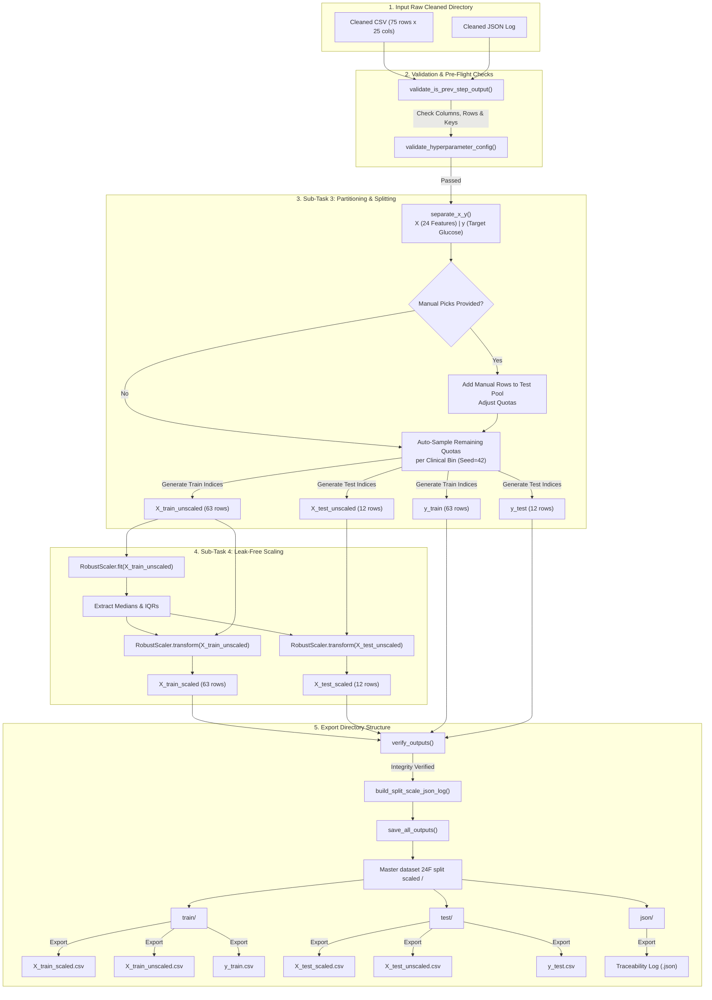

# Step 8 (Sub-task 3 & 4): Stratified Train/Test Split & Robust Scaling

> Automated preprocessing and data partitioning system that divides the cleaned 24-feature photoplethysmogram (PPG) dataset into clinical-bin-stratified training and testing subsets, and fits/transforms them using `RobustScaler` to prevent data leakage and shield feature distributions from sensor noise.

---

## TL;DR

This tool represents **Step 8 (Sub-task 3 & 4)** of the PPG-based glucose estimation data pipeline. It acts as the mathematical interface between raw clinical datasets and machine learning training pipelines. The tool performs two consecutive operations:
1. **Clinical Stratification and Splitting**: Separates the 24-feature matrix ($X$) from the raw target glucose levels ($y$), and splits the dataset into train and test sets using a stratified sampling strategy based on clinical blood glucose categories (Hypoglycemic, Normal, Pre-diabetic, Diabetic, Hyperglycemic) with support for manual sample overrides.
2. **Robust Feature Normalization**: Fits a robust scaling transformer using the median and Interquartile Range (IQR) on the training features (`X_train`) only, and applies the transformation to both partitions. Target glucose values are left raw and unmodified to preserve physical interpretability during modeling.

**Quick Stats:**
- **Lines of Code**: ~1,530 lines of highly structured, defensive Python
- **Splitting Scheme**: Clinical range stratification + manual row overrides
- **Feature Scaler**: `RobustScaler` (centered around median, scaled by IQR)
- **Data Leakage Mitigation**: Strict single-pass fit on `X_train`, transform on `X_test`
- **Target Variable status**: Raw and unscaled glucose levels (mg/dL) preserved
- **Output Artifacts**: Independent directories for `train/` (unscaled and scaled), `test/` (unscaled and scaled), and `json/` (traceability reports)
- **Execution Performance**: < 1.5 seconds on standard laptop CPUs

---

## Table of Contents

1. [TL;DR](#tldr)
2. [Quick Start](#quick-start)
3. [Background & Motivation](#background--motivation)
4. [Robust Scaling vs. Normalization & Standardization](#robust-scaling-vs-normalization--standardization)
5. [The Two Sub-Tasks](#the-two-sub-tasks)
6. [Mermaid Data Flow Diagram](#mermaid-data-flow-diagram)
7. [Features & Capabilities](#features--capabilities)
8. [Installation & Prerequisites](#installation--prerequisites)
9. [Input Data Format](#input-data-format)
10. [Output Structure](#output-structure)
11. [Detailed Mathematical Formulation](#detailed-mathematical-formulation)
12. [Physiological Theories & Wavelength Physics](#physiological-theories--wavelength-physics)
13. [Machine Learning Mechanics & Tree Splits](#machine-learning-mechanics--tree-splits)
14. [Configuration Reference](#configuration-reference)
15. [Code Architecture & Function Directory](#code-architecture--function-directory)
16. [Verification & Data Auditing](#verification--data-auditing)
17. [Troubleshooting & FAQ](#troubleshooting--faq)
18. [Next Step in Pipeline](#next-step-in-pipeline)
19. [References](#references)

---

## Quick Start

### Minimum Steps to Run

1. **Activate Environment**: Open your terminal and activate the project's virtual environment.
   ```bash
   # Windows PowerShell
   .venv\Scripts\Activate.ps1
   # Linux / macOS
   source .venv/bin/activate
   ```
2. **Verify Dependencies**: Ensure that you have the required analytical libraries installed.
   ```bash
   pip install numpy pandas scikit-learn
   ```
3. **Configure File Paths**: Edit the user settings at the top of the script `Train_Test_Split_and_Robust_Scaling_Code10.py` to point to your cleaning-step output and your desired target directory:
   ```python
   INPUT_ROOT  = Path(r"C:\Users\DELL\Documents\GitHub\fyp\05_Data_Storage\09_Cleaned_dataset_without_(NaN_&_outliers)")
   OUTPUT_ROOT = Path(r"C:\Users\DELL\Documents\GitHub\fyp\05_Data_Storage\10_Robust_Scaled_and_Train_Test_Splitted_Data_Set")
   ```
4. **Execute**: Run the script:
   ```bash
   python Train_Test_Split_and_Robust_Scaling_Code10.py
   ```
5. **Interactive Folder Browser**: A dialog box will appear. Select the specific timestamped Step 8 (Sub-task 1 & 2) cleaned output folder (e.g., `Master dataset 24F cleaned 2026-06-24 18-10-15`) you wish to partition and scale.
6. **Confirm Success**: Check your `OUTPUT_ROOT` directory for the newly created timestamped directory structure containing split CSV datasets and the validation JSON report.

### Expected Terminal Output

When executed successfully, the script writes a detailed step-by-step execution trace to the console:

```text
======================================================================
📏 STEP 8 (Sub-task 3 & 4): STRATIFIED SPLIT + ROBUST SCALING
   Sub-task 3: Separate X/y + Stratified Train/Test Split
   Sub-task 4: RobustScaler (fit on train, transform both)
   Configuration: 63 Train / 12 Test
   Random State : 42
   Stratification: 5 clinical glucose bins
   Manual picks  : (none — fully automatic stratified split)
======================================================================

🔍 Scanning for latest cleaning-step output folder...

────────────────────────────────────────────────────────────
🔍 STEP 8 (Sub-task 1&2) OUTPUT FOLDER AUTO-DETECTION
────────────────────────────────────────────────────────────
   📁 Found 1 cleaning-step folder(s) in:
       C:\Users\DELL\Documents\GitHub\fyp\05_Data_Storage\09_Cleaned_dataset_without_(NaN_&_outliers)

   ✅ LATEST (most recently modified):
      📁 Master dataset 24F cleaned 2026-06-24 18-10-15
         Last modified : 2026-06-24 18:10:18
         Has CSV       : ✅ Master dataset 24F cleaned 2026-06-24 18-10-15.csv
         Has JSON      : ✅ Master dataset 24F cleaned 2026-06-24 18-10-15.json

📂 Opening folder selector at: C:\Users\DELL\Documents\GitHub\fyp\05_Data_Storage\09_Cleaned_dataset_without_(NaN_&_outliers)
📁 Selected folder : Master dataset 24F cleaned 2026-06-24 18-10-15

────────────────────────────────────────────────────────────
🔍 AUTO-DETECTING FILES INSIDE FOLDER
────────────────────────────────────────────────────────────
   📄 CSV found  : Master dataset 24F cleaned 2026-06-24 18-10-15.csv
   📄 JSON found : Master dataset 24F cleaned 2026-06-24 18-10-15.json

────────────────────────────────────────────────────────────
📥 LOADING INPUT FILES
────────────────────────────────────────────────────────────
✅ Loaded CSV: Master dataset 24F cleaned 2026-06-24 18-10-15.csv
   📊 Shape: 75 rows × 25 columns
✅ Loaded JSON: Master dataset 24F cleaned 2026-06-24 18-10-15.json
   📊 Top-level keys: 10

📋 Input columns (25):
   1. PPG_Infrared_AC_Amplitude
   2. PPG_Red_AC_Amplitude
   ...
   24. PPG_Red_Kurtosis
   25. Glucose level (mg/dl)  ← TARGET

   ✅ Feature count verified: 24 features + 1 target

────────────────────────────────────────────────────────────
🔍 VALIDATING SELECTED FOLDER IS STEP 8 (Sub-task 1&2) OUTPUT
────────────────────────────────────────────────────────────
   ✅ Previous-step validation passed.
   📊 Columns   : 25
   📊 Rows      : 75
   📄 JSON step : STEP 8 (Sub-task 1 & 2)

────────────────────────────────────────────────────────────
📋 BUILDING CONCISE PIPELINE CHAIN SUMMARY
────────────────────────────────────────────────────────────
   ✅ Pipeline chain summary built.
      Step 6  : 2026-06-22 14:15:30  →  75 subjects
      Step 7  : 2026-06-23 11:20:05  →  24 features
      Step 8a : 2026-06-24 18:10:15  →  75 rows after cleaning

────────────────────────────────────────────────────────────
🔧 SUB-TASK 3a: SEPARATING X (Features) AND y (Target)
────────────────────────────────────────────────────────────
   X (Features): 75 rows × 24 columns
   y (Target):   75 values
   Target column: Glucose level (mg/dl)
   NaN check: X has 0 NaN(s), y has 0 NaN(s)

────────────────────────────────────────────────────────────
🔍 HYPERPARAMETER VALIDATION
────────────────────────────────────────────────────────────
   Check 1: Train + Test counts match total dataset
      63 + 12 = 75 (dataset rows)
   Check 2: GLUCOSE_BIN_LABELS length matches GLUCOSE_BINS
      5 labels for 5 bins
   Check 3: TEST_SAMPLES_PER_BIN keys match GLUCOSE_BIN_LABELS
      All bin keys match exactly
   Check 4: TEST_SAMPLES_PER_BIN sum equals AMOUNT_OF_TEST_SAMPLES
      Per-bin sum (12) = AMOUNT_OF_TEST_SAMPLES (12)
   Check 5: MANUAL_TEST_SAMPLE_ROW_NUMBERS validation
      No manual selections (fully automatic stratified split)
   Check 6: Each bin has enough samples for its quota

   Dataset distribution by clinical bin:
   Bin                Range (mg/dL)       Available     Needed           Status
   ────────────────────────────────────────────────────────────────────────────
   Hypoglycemic       [0, 70)                     0          0           ○ skip
   Normal             [70, 100)                  44          7             ✅ ok
   Pre-diabetic       [100, 125)                 25          4             ✅ ok
   Diabetic           [125, 180)                  6          1             ✅ ok
   Hyperglycemic      [180, 999)                  0          0           ○ skip

   ✅ ALL HYPERPARAMETER CHECKS PASSED

────────────────────────────────────────────────────────────
🔧 SUB-TASK 3b: STRATIFIED TRAIN/TEST SPLIT
────────────────────────────────────────────────────────────
   🎲 Auto-picking samples from each bin (random_state=42):
      Bin 'Normal': picked 7 from 44 available
      Bin 'Pre-diabetic': picked 4 from 25 available
      Bin 'Diabetic': picked 1 from 6 available

   Split completed:
      X_train: 63 rows × 24 columns
      X_test:  12 rows × 24 columns
      y_train: 63 values
      y_test:  12 values

   Final bin distribution after split:
   Bin                Train      Test     Total    Test %
   ──────────────────────────────────────────────────────────
   Hypoglycemic           0         0         0      0.0%
   Normal                37         7        44     15.9%
   Pre-diabetic          21         4        25     16.0%
   Diabetic               5         1         6     16.7%
   Hyperglycemic          0         0         0      0.0%

────────────────────────────────────────────────────────────
📏 SUB-TASK 4: ROBUST SCALING
────────────────────────────────────────────────────────────
   Fitting RobustScaler on X_train (63 samples)...
   Scaler fitted successfully.
   Transforming X_train...
   Transforming X_test (using scaler fitted on X_train)...

────────────────────────────────────────────────────────────
🔍 FINAL VERIFICATION
────────────────────────────────────────────────────────────
   ✅ Total rows: 75 (train: 63 + test: 12) = original: 75
   ✅ Feature count: train=24, test=24
   ✅ Column names preserved: True
   ✅ No NaN: X_train=0, X_test=0, y_train=0, y_test=0
   ✅ Target values unmodified (raw glucose): True
   ✅ All scaled values finite: True
   ✅ ALL CHECKS PASSED

────────────────────────────────────────────────────────────
💾 SAVING ALL OUTPUTS
────────────────────────────────────────────────────────────
   Saving TRAIN files to: train/
      X_train_scaled.csv   (63 rows x 24 cols)
      X_train_unscaled.csv (63 rows x 24 cols)
      y_train.csv          (63 rows x 1 col)
   Saving TEST files to: test/
      X_test_scaled.csv    (12 rows x 24 cols)
      X_test_unscaled.csv  (12 rows x 24 cols)
      y_test.csv           (12 rows x 1 col)
   Saving JSON log to: json/
      Master dataset 24F split scaled 2026-06-25 01-53-06.json

======================================================================
📌 STRATIFIED SPLIT & SCALING PIPELINE — FINAL SUMMARY
======================================================================
   ✅ Stratified split & scaling pipeline completed successfully!
      → Output is READY for XGBoost model training
======================================================================
```

---

## Background & Motivation

### The Threat of Data Leakage in Machine Learning

One of the most insidious errors in machine learning implementation is **Data Leakage**. Data leakage occurs when information from outside the training dataset is inadvertently used to train or parameterize the machine learning model. This leads to overly optimistic performance during validation, followed by catastrophic failures when the model encounters real-world test sets.

In feature scaling, data leakage occurs if the scaling statistics (such as min, max, mean, standard deviation, median, or Interquartile Range) are calculated using the entire dataset *before* partitioning the data into training and test sets. 

```
❌ DATA LEAKAGE PIPELINE (Incorrect)
[ Full Dataset ] ──> [ Fit Scaler on Full Data ] ──> [ Transform Full Data ] ──> [ Split Train / Test ]
                                                                                   └─> Leakage Occurred!
                                                                                   
✅ LEAK-FREE PIPELINE (Correct)
[ Full Dataset ] ──> [ Split Train / Test ] ──> [ Fit Scaler on Train Only ] ──> [ Transform Train & Test ]
                                                                                   └─> Completely Clean!
```

If we scale before we split, the scaled feature values in our training set become dependent on the range, mean, or median of the test set. For instance, if the test set contains extreme values, those values will directly alter the scaling parameters. During validation, the model behaves as if it knows the range and variance of the test data. 

To prevent data leakage, **Code 10** enforces a strict boundary:
1. The dataset is partitioned into `train` and `test` subsets first.
2. The `RobustScaler` is fitted **exclusively** on the training partition (`X_train`). This step computes the medians and IQRs of the training features.
3. The fitted scaler is then used to transform both `X_train` and `X_test`. In this way, the test data is scaled using parameters learned solely from the training set, mimicking a true production scenario where the model encounters incoming data one sample at a time.

### The Rationale for Clinical Stratification

A standard random train/test split (e.g., using `train_test_split(random_state=42)`) assumes that the dataset is large and homogeneous enough that a random pick will yield representative subsets. However, clinical biometric datasets, especially pilot or clinical trial cohorts (such as the 75-subject dataset here), are often small and highly unbalanced. The majority of subjects reside in the "Normal" and "Pre-diabetic" ranges, while critical edge cases ("Diabetic") are sparse. 

A naive random split might assign all diabetic subjects to the training set, leaving zero diabetic subjects in the test set. Consequently, the model's test performance would represent its capability to predict normal glucose levels but tell us nothing about its ability to diagnose hyperglycemia. Conversely, if too many diabetic subjects are assigned to the test set, the training algorithm will lack the crucial samples needed to learn hyperglycemic patterns.

**Code 10** resolves this by grouping the target glucose values into five distinct clinical blood glucose bins:

| Clinical Bin | Lower Bound (mg/dL) | Upper Bound (mg/dL) | Clinical Significance |
| :--- | :---: | :---: | :--- |
| **Hypoglycemic** | 0 | 70 | Abnormally low blood sugar |
| **Normal** | 70 | 100 | Healthy fasting range |
| **Pre-diabetic** | 100 | 125 | Impaired fasting glucose |
| **Diabetic** | 125 | 180 | Confirmed diabetes mellitus |
| **Hyperglycemic** | 180 | 999 | Severely elevated blood sugar |

By mapping each subject to a bin, the code enforces a stratified sample quota defined by the user in `TEST_SAMPLES_PER_BIN`. This guarantees that both the training and test sets contain a mathematically balanced, proportional distribution of healthy, pre-diabetic, and diabetic states.

---

## Robust Scaling vs. Normalization & Standardization

When preparing continuous physical features for machine learning models, engineers typically choose between three scaling techniques. The table below highlights their properties and why **Robust Scaling** is preferred for physiological PPG signal features:

| Property / Feature | Normalization (MinMax Scaling) | Standardization (Z-Score Scaling) | Robust Scaling (Median/IQR Scaling) |
| :--- | :---: | :---: | :---: |
| **Mathematical Center** | Minimum value ($x_{\text{min}}$) | Sample Mean ($\mu$) | Sample Median ($\tilde{x}$) |
| **Mathematical Dispersion** | Range ($x_{\text{max}} - x_{\text{min}}$) | Sample Standard Deviation ($\sigma$) | Interquartile Range ($\text{IQR}$) |
| **Sensitivity to Outliers** | Extremely High | High | Extremely Low (Robust) |
| **Target Feature Range** | Bounded strictly to $[0, 1]$ | Unbounded (typically $[-3, 3]$) | Unbounded (typically $[-2, 2]$) |
| **Preservation of Sparsity** | No | No | No |
| **PPG Noise Vulnerability** | Outlier shifts entire scaling range | Outlier skews center & expands variance | Outliers ignored in parameter calculation |

### The Mathematical Vulnerability of MinMax Scaling (Normalization)

MinMax scaling maps all feature values to the interval $[0, 1]$ using the formula:

$$x_{\text{normalized}} = \frac{x - x_{\text{min}}}{x_{\text{max}} - x_{\text{min}}}$$

If a feature contains a single extreme outlier due to a PPG sensor disconnect or motion artifact (for example, a pulse wave amplitude peak that registers at 10 times the normal physiological limit), then $x_{\text{max}}$ becomes artificially large. 

This causes the denominator to expand dramatically. Consequently, all normal, physiologically valid feature values are compressed into a narrow band (e.g., between $0.0$ and $0.1$). This compression destroys the variance and resolution of the feature, making it difficult for the learning algorithm to identify patterns among normal subjects.

### The Statistical Distortion of Z-Score Standardization

Standardization shifts feature values to have a mean of $0$ and a standard deviation of $1$ using the formula:

$$x_{\text{standardized}} = \frac{x - \mu}{\sigma}$$

Both the sample mean ($\mu$) and the sample standard deviation ($\sigma$) are highly sensitive to outliers. The mean is computed as:

$$\mu = \frac{1}{N} \sum_{i=1}^{N} x_i$$

A single extreme outlier $x_{\text{outlier}}$ pulls the mean $\mu$ toward itself. Additionally, because the standard deviation calculation squares the deviations from the mean:

$$\sigma = \sqrt{\frac{1}{N} \sum_{i=1}^{N} (x_i - \mu)^2}$$

the outlier exponentially inflates $\sigma$. When we divide by an inflated standard deviation, the standardized values of the normal, non-outlier data points shrink toward $0$. This statistical distortion misrepresents the true physiological variance of the cohort.

### The Robust Scaling Solution

Robust Scaling replaces the outlier-sensitive mean and standard deviation with the outlier-resistant median and Interquartile Range (IQR):

$$x_{\text{scaled}} = \frac{x - \text{median}}{\text{IQR}}$$

The median ($\tilde{x}$) represents the 50th percentile of the data. Because it is a positional metric rather than an algebraic sum, it is unaffected by the magnitude of extreme outliers. For instance, in the set $\{1, 2, 3, 4, 100\}$, the median is $3$, which is unaffected by the outlier value $100$.

The Interquartile Range ($\text{IQR}$) measures the spread of the middle 50% of the dataset:

$$\text{IQR} = Q_3 - Q_1$$

where $Q_1$ is the 25th percentile and $Q_3$ is the 75th percentile. Because the IQR completely ignores the lowest 25% and highest 25% of the data, it is unaffected by extreme tails.

By centering around the median and dividing by the IQR, **Code 10** ensures that the scaling parameters are dictated by valid physiological measurements. If a subject has a feature corrupted by noise, that sample will be scaled correctly relative to the robust population parameters, without compressing or shifting the features of other subjects.

---

## The Two Sub-Tasks

### Sub-task 3: Stratified Splitting & Manual Selection

The splitting pipeline partitions the input dataset into training and test sets while satisfying two constraints: clinical representation (stratification) and specific sample selection (manual overrides). The execution flow is as follows:

```
[ Input Dataset (75 Rows) ]
           │
           ├──> Separate Target Glucose Column
           │
           ├──> Assign clinical bins: [Hypoglycemic, Normal, Pre-diabetic, Diabetic, Hyperglycemic]
           │
           ├──> Identify Manual Test Rows (MANUAL_TEST_SAMPLE_ROW_NUMBERS)
           │         │
           │         ├──> Place manual rows directly into Test Set
           │         └──> Subtract manual picks from corresponding bin quotas (TEST_SAMPLES_PER_BIN)
           │
           └──> Randomly sample remaining test quota from clinical bin pools (RANDOM_STATE=42)
                     │
                     ├──> Combined Test Set (12 Rows) ──> Export y_test & X_test_unscaled
                     └──> Remaining Train Set (63 Rows) ──> Export y_train & X_train_unscaled
```

#### Reconciling Manual Overrides with Quotas
If the user provides a list of 1-based row numbers in `MANUAL_TEST_SAMPLE_ROW_NUMBERS`, the algorithm processes them first:
1. Each manual row is converted to a 0-based pandas index.
2. The glucose value for that row is retrieved and mapped to its clinical category.
3. The remaining test quota for that clinical category is decremented by 1.
4. If manual picks exceed the quota for a specific bin, the remaining quota is capped at 0. The manual override takes precedence, and the remaining bins are auto-adjusted to maintain the total count.
5. The remaining test slots are then randomly sampled from the pool of subjects in each bin (excluding any manually selected subjects) using the fixed `RANDOM_STATE`.

This hybrid approach allows research teams to evaluate the model on specific clinical edge cases (such as a subject known to have unique skin pigmentation or rapid glucose fluctuations) while maintaining automated stratification.

### Sub-task 4: Robust Scaling

Once the partitions are split, the scaling pipeline executes the following steps:

1. **Parameter Estimation**: The medians and IQRs are computed feature-by-feature on the training set `X_train`. This creates a set of 24 centers and 24 scales.
2. **Training Transformation**: The training feature matrix is transformed:
   $$X_{\text{train\_scaled}} = \frac{X_{\text{train}} - \text{median}(X_{\text{train}})}{\text{IQR}(X_{\text{train}})}$$
3. **Testing Transformation**: The testing feature matrix is transformed using the parameters learned in step 1:
   $$X_{\text{test\_scaled}} = \frac{X_{\text{test}} - \text{median}(X_{\text{train}})}{\text{IQR}(X_{\text{train}})}$$
4. **Target Protection**: The target glucose dataframes (`y_train`, `y_test`) are bypassed. They remain in their original unit (mg/dL).

---

## Mermaid Data Flow Diagram

The flowchart below traces the path of data, parameters, and audits through the script:



---

## Features & Capabilities

- **Defensive Pre-Flight Validation**: Before modifying or splitting data, the tool runs structural validations. If the sum of `AMOUNT_OF_TRAIN_SAMPLES` and `AMOUNT_OF_TEST_SAMPLES` does not equal the exact row count of the input CSV, or if the requested per-bin test quotas exceed the available clinical samples, execution is halted with a clear terminal error.
- **Leakage-Proof Pipeline Design**: By implementing the fit-transform sequence strictly across partition boundaries, the tool ensures that scaling statistics do not leak from the testing partition into the training set.
- **Traceability Summary**: The output JSON logs build a compact provenance record. This record preserves metadata from Step 6 (Subject Compilation), Step 7 (Feature Engineering), and Step 8a (NaN and Outlier Cleaning), providing a complete history of the data.
- **Post-Scaling Integrity Audits**: After scaling, the script runs validations to confirm that feature dimensions are preserved, no NaN values are introduced, and target glucose ranges are unaltered.
- **Interactive Folder Selection**: Integrates a Tkinter folder browser that defaults to the configured `INPUT_ROOT`, simplifying directory navigation.

---

## Installation & Prerequisites

The script requires standard Python data science libraries. You can install them using pip:

```bash
pip install numpy pandas scikit-learn
```

### System Configuration
- **Operating System**: Windows (tested on Windows 10/11), Linux, or macOS.
- **Python Version**: Python 3.8 to 3.11.
- **Tkinter Support**: Ensure Tkinter is installed on your system (standard in Windows installers; on Ubuntu/Debian, install via `sudo apt-get install python3-tk`).

---

## Input Data Format

The input directory must be a valid Step 8 (Sub-task 1 & 2) output folder. It must contain:
1. One CSV dataset with exactly 25 columns (24 feature columns and 1 target column).
2. One JSON validation log detailing the nan-imputation and outlier-clipping metrics.

### Input Column Verification List
The 25 columns expected in the input CSV file are:

| Index | Column Name | Type | Value Range |
| :--- | :--- | :---: | :---: |
| 1 | `PPG_Infrared_AC_Amplitude` | Float | Continuous |
| 2 | `PPG_Red_AC_Amplitude` | Float | Continuous |
| 3 | `PPG_Infrared_DC_Offset` | Float | Continuous |
| 4 | `PPG_Red_DC_Offset` | Float | Continuous |
| 5 | `PPG_Infrared_AC_to_DC_Ratio` | Float | Continuous |
| 6 | `PPG_Red_AC_to_DC_Ratio` | Float | Continuous |
| 7 | `PPG_Ratio_of_Ratios_RoR` | Float | Continuous |
| 8 | `PPG_Infrared_Heart_Rate` | Float | Continuous |
| 9 | `PPG_Red_Heart_Rate` | Float | Continuous |
| 10 | `PPG_Infrared_Peak_to_Peak_Interval` | Float | Continuous |
| 11 | `PPG_Red_Peak_to_Peak_Interval` | Float | Continuous |
| 12 | `PPG_Infrared_Pulse_Transit_Time` | Float | Continuous |
| 13 | `PPG_Red_Pulse_Transit_Time` | Float | Continuous |
| 14 | `PPG_Infrared_Perfusion_Index` | Float | Continuous |
| 15 | `PPG_Red_Perfusion_Index` | Float | Continuous |
| 16 | `PPG_Infrared_Systolic_Rise_Time` | Float | Continuous |
| 17 | `PPG_Red_Systolic_Rise_Time` | Float | Continuous |
| 18 | `PPG_Infrared_Diastolic_Decay_Time` | Float | Continuous |
| 19 | `PPG_Red_Diastolic_Decay_Time` | Float | Continuous |
| 20 | `PPG_Infrared_Skewness` | Float | Continuous |
| 21 | `PPG_Red_Skewness` | Float | Continuous |
| 22 | `PPG_Infrared_Kurtosis` | Float | Continuous |
| 23 | `PPG_Red_Kurtosis` | Float | Continuous |
| 24 | `PPG_Features_Count` | Float / Int | Continuous |
| 25 | `Glucose level (mg/dl)` | Float | Target (Clinical Glucose Range) |

---

## Output Structure

The tool creates a timestamped output folder containing the following subfolders and files:

```text
Master dataset 24F split scaled <timestamp>/
├── train/
│   ├── X_train_scaled.csv      # Scaled features for model training (63 rows x 24 columns)
│   ├── X_train_unscaled.csv    # Original cleaned features for training (63 rows x 24 columns)
│   └── y_train.csv             # Raw target glucose level for training (63 rows x 1 column)
├── test/
│   ├── X_test_scaled.csv       # Scaled features for model testing (12 rows x 24 columns)
│   ├── X_test_unscaled.csv     # Original cleaned features for testing (12 rows x 24 columns)
│   └── y_test.csv              # Raw target glucose level for testing (12 rows x 1 column)
└── json/
    └── Master dataset 24F split scaled <timestamp>.json # Traceability & scaling parameters log
```

### JSON Log Structure
Rather than dumping the entire JSON, here is a summary of the keys exported in the log file:
- `pipeline_info`: Run timestamp, script step name, and prior pipeline stage reference.
- `pipeline_chain_summary`: Provenance IDs linking the file back to the subject compilation (Step 6), feature engineering (Step 7), and cleaning (Step 8a) parameters.
- `file_paths`: Absolute record of input paths and output files.
- `dataset_summary`: Row and column tallies, target column name, and target scaling bypass validation.
- `sub_task_3_train_test_split`: Detailed record of the split split, including indexes of training and testing samples, stratification bins, sample counts per bin, and manual overrides.
- `sub_task_4_robust_scaling`: Exact scaling parameters computed on the training set, including:
  - `center_median`: The calculated median for each of the 24 features.
  - `scale_iqr`: The Interquartile Range calculated for each of the 24 features.
  - Before/after min/max values for both training and testing partitions.
- `verification_results`: Checklist log showing validation passes.
- `important_notes`: Instructions for downstream model training (e.g., XGBoost).

---

## Detailed Mathematical Formulation

### 1. Robust Scaling Transformation

For each feature column $j \in \{1, 2, \dots, 24\}$, let $X_j$ represent the feature vector. The scaling parameters are computed exclusively on the training partition:

$$\tilde{x}_{j,\text{train}} = \text{median}(X_{j,\text{train}})$$

$$\text{IQR}_{j,\text{train}} = Q_3(X_{j,\text{train}}) - Q_1(X_{j,\text{train}})$$

The scaled training and testing values are computed as:

$$X_{i,j,\text{train\_scaled}} = \frac{X_{i,j,\text{train}} - \tilde{x}_{j,\text{train}}}{\text{IQR}_{j,\text{train}}}$$

$$X_{k,j,\text{test\_scaled}} = \frac{X_{k,j,\text{test}} - \tilde{x}_{j,\text{train}}}{\text{IQR}_{j,\text{train}}}$$

Where:
- $X_{i,j,\text{train}}$ is the value of feature $j$ for training subject $i$.
- $X_{k,j,\text{test}}$ is the value of feature $j$ for testing subject $k$.
- $\text{IQR}_{j,\text{train}}$ is the Interquartile Range of feature $j$ within the training partition.
- $\tilde{x}_{j,\text{train}}$ is the median of feature $j$ within the training partition.

### 2. Stratified Bin Discretization

Let $y_i$ be the target blood glucose level of subject $i$. Given the bin boundary vector:

$$B = [b_0, b_1, b_2, b_3, b_4, b_5] = [0, 70, 100, 125, 180, 999]$$

Each subject is mapped to a clinical bin label index $L(y_i) \in \{0, 1, 2, 3, 4\}$ based on the half-open interval rule:

$$L(y_i) = c \iff y_i \in [b_c, b_{c+1})$$

The clinical dataset is then grouped into five independent pools:

$$P_c = \{i \mid L(y_i) = c\}$$

When sampling the test set, the algorithm selects $N_c$ samples from each pool $P_c$:

$$N_c = \text{TEST\_SAMPLES\_PER\_BIN}[c]$$

Subject to:

$$\sum_{c=0}^{4} N_c = \text{AMOUNT\_OF\_TEST\_SAMPLES}$$

### 3. Percentile & Interquartile Range Calculation

For a sorted feature vector $Y = [y_1, y_2, \dots, y_n]$ where $y_1 \le y_2 \le \dots \le y_n$, the percentile value $P$ (where $p \in [0, 1]$ represents the percentile, e.g., $0.25$ for $Q_1$ and $0.75$ for $Q_3$) is computed using linear interpolation:

Let the virtual index position be:

$$k = (n - 1) \times p$$

The index is split into its integer part $i = \lfloor k \rfloor$ and fractional part $f = k - i$. The percentile value $Q(p)$ is then calculated as:

$$Q(p) = (1 - f) \times y_{i+1} + f \times y_{i+2}$$

$$\text{IQR} = Q(0.75) - Q(0.25)$$

---

## Physiological Theories & Wavelength Physics

In non-invasive optical glucose monitoring, photoplethysmogram (PPG) waveforms are captured by transmitting light through vascular tissue (typically a finger) and measuring the transmitted or reflected intensity. The light source consists of two wavelengths: Red (~660 nm) and Infrared (~940 nm). 

The physics of this measurement depend on the absorption characteristics of the tissue. Understanding these physiological variables explains why clinical stratification across blood glucose categories is necessary.

```
       RED LIGHT (~660 nm)              INFRARED LIGHT (~940 nm)
      [High Hb/HbO2 Contrast]             [Water & Glucose Peaks]
               │                                     │
               ▼                                     ▼
      ┌─────────────────────────────────────────────────────────┐
      │                   Vascularized Tissue                   │
      │   - Glycated Hemoglobin Shifts (HbA1c Alterations)     │
      │   - Osmotic Shifts (Dehydration / Viscosity Changes)    │
      │   - Sympathetic Cardiovascular Tone Dynamics            │
      └─────────────────────────────────────────────────────────┘
```

### Wavelength-Specific Optical Absorption Mechanics

The optical absorption of blood varies depending on the oxygenation state of hemoglobin and the presence of dissolved solutes:
1. **Red Wavelength (~660 nm)**: At this wavelength, deoxyhemoglobin (Hb) has a significantly higher absorption coefficient than oxyhemoglobin ($\text{HbO}_2$). Red light is highly sensitive to changes in tissue oxygen saturation ($SpO_2$) and venous blood volume fluctuations.
2. **Infrared Wavelength (~940 nm)**: At this wavelength, oxyhemoglobin ($\text{HbO}_2$) has a slightly higher absorption coefficient than deoxyhemoglobin (Hb). Crucially, water absorption begins to rise, and glucose molecules exhibit weak absorption bands in the near-infrared spectrum.

Non-invasive glucose monitoring relies on the **Ratio-of-Ratios (RoR)** feature, which normalizes the Red and Infrared AC/DC components:

$$\text{RoR} = \frac{(\text{AC}_{\text{Red}} / \text{DC}_{\text{Red}})}{(\text{AC}_{\text{IR}} / \text{DC}_{\text{IR}})}$$

This ratio changes with blood glucose levels due to three physiological phenomena:

#### 1. Hemoglobin Glycation (HbA1c Shifts)
In patients with chronic hyperglycemia (diabetic and pre-diabetic states), elevated blood glucose leads to the non-enzymatic glycation of hemoglobin inside red blood cells, forming Glycated Hemoglobin ($\text{HbA1c}$). Glycation alters the physical structure and optical absorption spectrum of the hemoglobin molecule. These changes shift the isosbestic point and the ratio of absorption coefficients at 660 nm and 940 nm, altering the baseline and amplitude of the PPG waveforms.

#### 2. Osmotic Fluid Shifts and Blood Viscosity
Glucose is osmotically active. When blood glucose concentrations rise (hyperglycemia), water is drawn from the interstitial space into the vascular compartment to maintain osmotic equilibrium. This causes:
- A temporary dilution of red blood cells (decreased hematocrit).
- An increase in blood volume.
- Alterations in blood viscosity.

These fluid shifts modify the scattering coefficient of the blood. Consequently, they change the path length of photons traveling through the tissue, affecting the DC offset of both the Red and Infrared channels.

#### 3. Sympathoadrenal Cardiovascular Responses
Acute changes in blood glucose (particularly hypoglycemia or rapid hyperglycemia) trigger autonomic responses. Hypoglycemia activates the sympathoadrenal system, releasing epinephrine. This causes:
- Peripheral vasoconstriction (reducing PPG amplitude).
- Tachycardia (elevating heart rate).
- Alterations in arterial stiffness (shortening Pulse Transit Time).

### Why Stratification is Necessary for Evaluation

Because HbA1c levels, osmotic blood viscosity, and sympathetic responses vary across glucose levels, the 24 PPG features show different relationships with glucose in different clinical ranges:
- In the **Normal range (70–100 mg/dL)**, changes in blood glucose are small, and the PPG features primarily reflect baseline cardiovascular dynamics.
- In the **Pre-diabetic and Diabetic ranges (>100 mg/dL)**, chronic glycation and osmotic volume shifts become the dominant factors affecting the PPG signal.
- In the **Hypoglycemic range (<70 mg/dL)**, acute autonomic responses (vasoconstriction and heart rate spikes) alter the shape of the PPG waveform.

If we split our dataset without stratification, the test set might lack diabetic or hypoglycemic samples. The model would be evaluated primarily on its performance in the normal range, where the signal-to-noise ratio for glucose-related feature changes is low. 

By enforcing clinical stratification, we ensure that the test set evaluates the model's ability to capture the physiological changes characteristic of each clinical state.

---

## Machine Learning Mechanics & Tree Splits

Once the features are scaled and split, they are typically used to train tree-based regressors, such as XGBoost (e.g., in Code 11). Understanding how these algorithms interact with robustly scaled features explains why scaling is performed.

```
       UNSCALED FEATURE                       ROBUSTLY SCALED FEATURE
  (Vulnerable to sensor noise)              (Stable, outlier-resistant)
  
      Feature Value:                            Feature Value:
     [ 0.05 ──── 120.0 (Artifact) ]            [ -1.2 ── 0.0 ── 1.2 ── 30.0 ]
               │                                         │
               ▼                                         ▼
   Split Search Thresholds:                  Split Search Thresholds:
   [ 0.1, 1.0, 5.0, 50.0, 80.0 ]             [ -0.8, -0.4, 0.0, 0.4, 0.8 ]
  (Uneven bins, unstable splits)             (Uniformly spaced, stable splits)
```

### Tree Splits and Feature Scaling
Gradient Boosted Decision Trees (GBDTs) partition the feature space by searching for binary split points that minimize a loss function. The algorithm evaluates split points for a feature $x_j$ by sorting the values and computing the gain for different thresholds $T$:

$$\text{Gain} = \frac{1}{2} \left[ \frac{\left(\sum_{i \in I_L} g_i\right)^2}{\sum_{i \in I_L} h_i + \lambda} + \frac{\left(\sum_{i \in I_R} g_i\right)^2}{\sum_{i \in I_R} h_i + \lambda} - \frac{\left(\sum_{i \in I} g_i\right)^2}{\sum_{i \in I} h_i + \lambda} \right] - \gamma$$

Where:
- $g_i$ and $h_i$ are the first and second-order gradients of the loss function.
- $I_L$ and $I_R$ are the sample sets assigned to the left and right child nodes.
- $\lambda$ and $\gamma$ are regularization parameters.

Because tree-based algorithms rely on the ordering of feature values rather than their absolute scale, scaling does not change the theoretical split points. However, robust scaling is still important for model training:

1. **Numerical Stability**: GBDTs implemented in libraries like XGBoost use floating-point representations. Features with wide ranges (e.g., DC offsets in the millions vs. skewness values near zero) can cause numerical precision errors when calculating gradients. Scaling features to similar ranges prevents these precision issues.
2. **Hyperparameter Optimization**: Regularization parameters (like L1 regularization $\alpha$ or L2 regularization $\lambda$) are sensitive to feature scales. If features have vastly different ranges, regularization can affect features unevenly, reducing model performance.
3. **Robustness to Outliers**: Using `RobustScaler` maps normal values to a consistent, stable range (typically between $-2.0$ and $2.0$). Outliers are pushed out to large positive or negative values. This separation helps the tree-building algorithm isolate outlier samples into shallow leaf nodes quickly, protecting the rest of the tree from outlier-induced bias.

---

## Configuration Reference

These parameters are defined in the user settings block at the top of the script:

| Variable Name | Default Value | Data Type | Purpose |
| :--- | :--- | :---: | :--- |
| `INPUT_ROOT` | `Path(r"...")` | Path | Folder containing the outputs of the cleaning pipeline (Step 8a). |
| `OUTPUT_ROOT` | `Path(r"...")` | Path | Folder where the split and scaled output directories will be saved. |
| `AMOUNT_OF_TRAIN_SAMPLES` | `63` | Integer | Total number of samples to assign to the training set. |
| `AMOUNT_OF_TEST_SAMPLES` | `12` | Integer | Total number of samples to assign to the test set. |
| `RANDOM_STATE` | `42` | Integer | Random seed used for stratified sampling, ensuring reproducibility. |
| `GLUCOSE_BINS` | `[0, 70, 100, 125, 180, 999]` | List of Int | Clinical blood glucose ranges (mg/dL) used to define stratification bins. |
| `GLUCOSE_BIN_LABELS` | `["Hypoglycemic", ...]` | List of Str | Human-readable labels for the clinical stratification bins. |
| `TEST_SAMPLES_PER_BIN` | `{"Normal": 7, ...}` | Dictionary | Number of test samples to sample from each clinical bin. |
| `MANUAL_TEST_SAMPLE_ROW_NUMBERS`| `[]` | List of Int | 1-based row numbers to force into the test set, overriding random selection. |
| `TARGET_COLUMN` | `"Glucose level (mg/dl)"` | String | Name of the target variable column in the CSV. |

---

## Code Architecture & Function Directory

The script uses a modular functional structure. The table below lists all functions in the script:

| Function Name | Input Parameters | Return Value | Role & Description |
| :--- | :--- | :---: | :--- |
| `find_latest_prev_step_folder` | `root_path` (Path) | Dict | Scans the input root directory to find the latest subfolder containing the string "Master dataset 24F cleaned". |
| `print_prev_step_folder_detection_report` | `detection_result` (Dict) | None | Prints a summary of the detected folders, their modification times, and file structures to the console. |
| `popup_folder_selector` | `initial_dir` (Path) | Path | Displays a Tkinter file dialog, prompting the user to select the input folder. |
| `find_csv_and_json_in_folder` | `folder_path` (Path) | Tuple (Path, Path) | Identifies the CSV and JSON log files within the selected directory. |
| `validate_is_prev_step_output` | `folder_path` (Path), `df` (DataFrame), `json_data` (Dict) | Dict | Validates that the input folder matches the output of the prior cleaning stage. |
| `build_pipeline_chain_summary` | `cleaning_step_json_data` (Dict), `prev_csv_path` (Path), `prev_json_path` (Path) | Dict | Extracts and compiles metadata from upstream pipeline stages (Steps 6, 7, and 8a). |
| `load_csv` | `file_path` (Path) | DataFrame | Loads the CSV file into a Pandas DataFrame and checks that it is not empty. |
| `load_json` | `file_path` (Path) | Dict | Loads and parses the JSON validation log from the input directory. |
| `check_existing_file` | `file_path` (Path) | Dict | Checks if a file exists and returns its path and size. |
| `separate_x_y` | `df` (DataFrame) | Tuple (DataFrame, Series, List) | Separates the 24 features from the target glucose column. |
| `validate_hyperparameter_config` | `total_samples` (Int), `y` (Series) | Tuple (Series, Series) | Performs pre-flight checks on split quotas, bin ranges, and manual selection indexes. |
| `perform_stratified_train_test_split` | `X` (DataFrame), `y` (Series), `bin_indices` (Series), `bin_counts` (Series) | Tuple (DataFrame, DataFrame, Series, Series, Dict) | Partitions features and targets into train and test sets using stratified sampling and manual overrides. |
| `perform_robust_scaling` | `X_train` (DataFrame), `X_test` (DataFrame), `feature_columns` (List) | Tuple (DataFrame, DataFrame, Dict) | Fits a `RobustScaler` on the training features and transforms both training and test features. |
| `verify_outputs` | `X_train_scaled` (DataFrame), `X_test_scaled` (DataFrame), `y_train` (Series), `y_test` (Series), `original_df` (DataFrame), `feature_columns` (List) | Dict | Runs validation checks on the split and scaled output dataframes. |
| `build_split_scale_json_log` | *Thirteen parameters* | Dict | Compiles split parameters, scaling statistics, and validation checks into a single JSON log structure. |
| `save_all_outputs` | *Eight parameters* | Tuple (Path, Dict) | Saves the training data, testing data, and JSON log files to the output directory. |
| `main` | None | None | Orchestrates the entire pipeline execution flow. |

---

## Verification & Data Auditing

Following the execution of the pipeline, **Code 10** runs six integrity checks to ensure the data is ready for model training:

1. **Row Count Preservation**: Checks that the sum of the training and test set rows matches the total rows of the input dataset:
   $$N_{\text{train}} + N_{\text{test}} = N_{\text{input}}$$
2. **Feature Dimensionality Check**: Verifies that the training and test feature matrices retain all 24 feature columns.
3. **Column Ordering Check**: Confirms that the column ordering of the scaled files matches the original input dataset.
4. **NaN Introduction Check**: Audits the outputs for missing values, confirming that no NaN values were introduced by the scaling transformation.
5. **Target Preservation Check**: Compares the values in `y_train` and `y_test` against the original dataset, verifying that the target glucose values were not modified by the feature scaling.
6. **Finitude Verification**: Verifies that all scaled values are finite, ensuring the data contains no infinite values ($\infty$ or $-\infty$) that would disrupt gradient calculations.

---

## Troubleshooting & FAQ

### 1. Tkinter Dialog Does Not Open
- **Cause**: On headless Linux environments, Tkinter cannot initialize a display window.
- **Solution**: Run on a system with display server support. Alternatively, modify the script to bypass the interactive dialog and load the auto-detected directory directly.

### 2. Quota Availability Error: "Insufficient samples in bin..."
- **Cause**: The configuration in `TEST_SAMPLES_PER_BIN` requested more test samples for a clinical category than the dataset contains.
- **Solution**: Open the script and adjust the values in `TEST_SAMPLES_PER_BIN` so they do not exceed the available sample counts displayed in the terminal output.

### 3. File Size Mismatch Warnings
- **Cause**: Overwriting existing output files can trigger warning logs if file sizes differ.
- **Solution**: This warning is informational. If you want to start fresh, delete the existing output directories and run the script again.

### 4. Why is the Scaler Not Saved as a Pickle File?
- **Cause**: Storing the scaler as a binary pickle file can cause compatibility issues if python or scikit-learn versions change.
- **Solution**: The script saves the center (median) and scale (IQR) parameters as plain text inside the output JSON log. Downstream inference systems can read these parameters and apply the transformation without needing scikit-learn.

---

## Next Step in Pipeline

With the training and testing datasets split, scaled, and verified, the preprocessing stage is complete. The next step is **Step 9: XGBoost Model Training & Evaluation** (typically implemented in `XGBoost_Regressors_Model_Training_Code11.py`). This downstream stage:
1. Loads `X_train_scaled.csv` and `y_train.csv` to train the regression trees.
2. Evaluates model performance on `X_test_scaled.csv` and `y_test.csv` using metrics like Root Mean Squared Error (RMSE), Mean Absolute Error (MAE), and Clarke Error Grid analysis.
3. Uses the scaling parameters stored in the JSON log to transform new PPG measurements for real-time inference.

---

## References

1. Pedregosa, F., et al. (2011). "Scikit-learn: Machine Learning in Python." *Journal of Machine Learning Research*, 12, 2825-2830.
2. Tukey, J. W. (1977). *Exploratory Data Analysis*. Addison-Wesley.
3. Clarke, W. L., et al. (1987). "Evaluating Clinical Accuracy of Systems for Self-Monitoring of Blood Glucose." *Diabetes Care*, 10(5), 622-628.
4. Shokrekhodaei, M., & Quinones, S. (2020). "Non-Invasive Glucose Monitoring Using Optical Sensors: A Review." *IEEE Sensors Journal*, 20(21), 12513-12524.
5. Chen, T., & Guestrin, C. (2016). "XGBoost: A Scalable Tree Boosting System." *Proceedings of the 22nd ACM SIGKDD International Conference on Knowledge Discovery and Data Mining*, 785-794.
