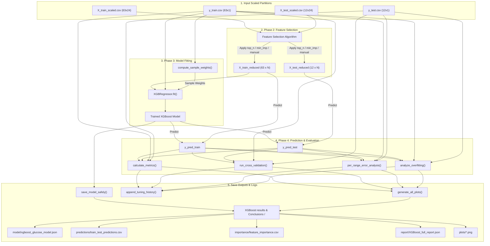

# Step 9: XGBoost Model Training & Evaluation Pipeline

> Comprehensive machine learning training, validation, and clinical evaluation system that loads partitioned and scaled 24-feature photoplethysmogram (PPG) datasets, fits regularized gradient boosted decision trees (XGBoost), performs sample weighting and hyperparameter sweeps, and executes rigorous clinical accuracy audits (K-Fold Cross-Validation, Clarke Error Grid, and per-range error analysis).

---

## TL;DR

This tool represents **Step 9** of the PPG-based blood glucose estimation data pipeline. It acts as the core analytical engine of the project, taking the split and scaled feature matrices from Step 8 and training an optimized `XGBRegressor` model. The script is structured to manage model complexity and ensure generalization through the following mechanisms:
1. **Dynamic Feature Selection**: Provides three alternative feature selection modes (`top_n`, `min_importance`, and `manual_selection`) to reduce model complexity and eliminate noisy PPG predictors.
2. **Clinical Sample Weighting**: Implements custom sample weighting for subjects with elevated glucose levels ($\ge 130$ mg/dL) to mitigate the statistical underestimation of hyperglycemia.
3. **Rigorous Validation & Diagnostics**: Evaluates the model using five metrics (MAE, RMSE, $R^2$, MAPE, and Clarke Error Grid Zone A percentage) calculated across standard train/test splits, 5-Fold Cross-Validation, and five clinical glucose ranges.
4. **Tuning History Tracking**: Automatically appends all training runs and feature importance percentages to a central `tuning_history.csv` file, providing a complete audit trail for hyperparameter tuning.

**Quick Stats:**
- **Lines of Code**: ~1,780 lines of production-grade Python code
- **Model Architecture**: Gradient Boosted Trees (`XGBRegressor`)
- **Tuning Parameters**: 10 primary parameters (`max_depth`, `learning_rate`, `min_child_weight`, `gamma`, etc.)
- **Advanced Modes**: Hyperparameter sweeps, Learning Curves, and Sample Weighting
- **Clinical Validation Standard**: Clarke Error Grid analysis (Zone A target $\ge 95\%$)
- **Output Formats**: Sklearn JSON model files, serialized pickle backups, CSV predictions, matplotlib charts, and a complete JSON report

---

## Table of Contents

1. [TL;DR](#tldr)
2. [Quick Start](#quick-start)
3. [Background & Motivation](#background--motivation)
4. [Why XGBoost over Other Machine Learning Models](#why-xgboost-over-other-machine-learning-models)
5. [Detailed Explanation of Performance & Validation Metrics](#detailed-explanation-of-performance--validation-metrics)
6. [Advanced Comparison: XGBoost vs. LightGBM vs. CatBoost](#advanced-comparison-xgboost-vs-lightgbm-vs-catboost)
7. [The Ten Execution Phases of Code 11](#the-ten-execution-phases-of-code-11)
8. [Mermaid Data Flow Diagram](#mermaid-data-flow-diagram)
9. [Physiological Theories & Optical Wave Physics](#physiological-theories--optical-wave-physics)
10. [Metabolic Kinetics and Vascular Biophysics](#metabolic-kinetics-and-vascular-biophysics)
11. [Clinical Validation Protocols and Glucose Challenges](#clinical-validation-protocols-and-glucose-challenges)
12. [Frequency-Domain Signal Processing and Spectral Decomposition](#frequency-domain-signal-processing-and-spectral-decomposition)
13. [The 24 Engineered PPG Features: Physical Meaning & Derivation](#the-24-engineered-ppg-features-physical-meaning--derivation)
14. [Mathematical Formulations of XGBoost](#mathematical-formulations-of-xgboost)
15. [Hyperparameter Tuning Reference Directory](#hyperparameter-tuning-reference-directory)
16. [Code Architecture & Function Directory](#code-architecture--function-directory)
17. [Input Data Format](#input-data-format)
18. [Output Structure](#output-structure)
19. [Tuning History Schema](#tuning-history-schema)
20. [Troubleshooting & FAQ](#troubleshooting--faq)
21. [References](#references)

---

## Quick Start

### Minimum Steps to Run

1. **Activate Environment**: Open your terminal and activate your virtual environment.
   ```bash
   # Windows PowerShell
   .venv\Scripts\Activate.ps1
   # Linux / macOS
   source .venv/bin/activate
   ```
2. **Install Dependencies**: Ensure you have installed the required libraries, including `xgboost` and `scikit-learn`.
   ```bash
   pip install numpy pandas scikit-learn xgboost matplotlib
   ```
3. **Configure User Paths**: Open `XGBoost_ML_Code11.py` and configure the directories pointing to your input datasets and desired output folder:
   ```python
   INPUT_ROOT  = Path(r"C:\Users\DELL\Documents\GitHub\fyp\05_Data_Storage\10_Robust_Scaled_and_Train_Test_Splitted_Data_Set")
   OUTPUT_ROOT = Path(r"C:\Users\DELL\Documents\GitHub\fyp\08_Results_and_Visualizations\XGBoost_Results_&_Conclusions")
   ```
4. **Run the Script**: Start training the model:
   ```bash
   python XGBoost_ML_Code11.py
   ```
5. **Interactive Folder Dialog**: The script will prompt you with a dialog box. Select the specific timestamped Step 8 split-scaled folder (e.g., `Master dataset 24F split scaled 2026-06-25 01-53-06`) you wish to train on.
6. **Verify Results**: Check the generated timestamped subfolder in your `OUTPUT_ROOT` for prediction CSV files, plots, the trained model, and the performance report.

### Expected Console Output

When executed in standard mode (with `SWEEP_MODE = False`), the script displays a detailed trace of the training process:

```text
======================================================================
🎯 STEP 9: XGBoost MODEL TRAINING + EVALUATION
   Model: XGBRegressor (Gradient Boosted Trees)
   Target: Glucose Level Prediction (mg/dL)
======================================================================

🔍 Scanning for latest split-scaled output folder...

────────────────────────────────────────────────────────────
🔍 STEP 8 (Sub-task 3&4) OUTPUT FOLDER AUTO-DETECTION
────────────────────────────────────────────────────────────
   📁 Found 1 split-scaled folder(s)
   ✅ LATEST: Master dataset 24F split scaled 2026-06-25 01-53-06
      Last modified : 2026-06-25 01-53-12
      Has train/    : ✅
      Has test/     : ✅
      Has json/     : ✅

📂 Opening folder selector at: C:\Users\DELL\Documents\GitHub\fyp\05_Data_Storage\10_Robust_Scaled_and_Train_Test_Splitted_Data_Set
📁 Selected folder : Master dataset 24F split scaled 2026-06-25 01-53-06

────────────────────────────────────────────────────────────
🔍 AUTO-DETECTING TRAIN/TEST FILES
────────────────────────────────────────────────────────────
   📄 X_train_scaled: X_train_scaled.csv
   📄 y_train: y_train.csv
   📄 X_test_scaled: X_test_scaled.csv
   📄 y_test: y_test.csv
   ✅ JSON loaded: Master dataset 24F split scaled 2026-06-25 01-53-06.json
   ✅ Previous-step validation passed.

────────────────────────────────────────────────────────────
📥 PHASE 1: LOADING DATA
────────────────────────────────────────────────────────────
   ✅ X_train: 63 rows × 24 columns
   ✅ y_train: 63 values
   ✅ X_test:  12 rows × 24 columns
   ✅ y_test:  12 values
   ✅ Feature columns match: 24 features
   ✅ No NaN values found

   📊 Glucose summary:
      Train — min: 72.0, max: 154.0, mean: 98.4
      Test  — min: 74.0, max: 145.0, mean: 97.2

────────────────────────────────────────────────────────────
🎚️ FEATURE REDUCTION ACTIVE
────────────────────────────────────────────────────────────
   Method        : manual_selection
   Method type   : Manual (single training round)

   🔍 MANUAL FEATURE SELECTION:
   ✅ KEPT (16):
      • IR_Skewness
      • IR_Spectral Entropy
      • IR_pulse width
      • IR_PPI
      • IR_HRV
      • IR_TEO Mean
      • IR_1st_Derivative_Mean
      • IR_2nd_Derivative_Mean
      • IR_2nd_Derivative_Skewness
      • IR_Decay time
      • IR_Dicrotic notch
      • Ensemble ratio
      • Diff_Spectral_Entropy
      • Diff_2nd_Derivative_Mean
      • Diff_Dicrotic_notch
   ❌ DROPPED (8):
      • IR_Kurtosis
      • IR_Shannon Entropy
      • IR_systolic amplitude
      • IR_BPM
      • IR_TEO std dev
      • IR_Harmonic ratio
      • IR_Rise time
      • Ratio_TEO_Mean
      • Ratio_systolic_amplitude

────────────────────────────────────────────────────────────
🚀 PHASE 3: TRAINING XGBOOST MODEL
────────────────────────────────────────────────────────────

   📊 Hyperparameter Configuration:
      n_estimators         = 75
      max_depth            = 2
      learning_rate        = 0.03
      subsample            = 0.8
      colsample_bytree     = 0.7
      reg_alpha            = 0.5
      reg_lambda           = 5
      min_child_weight     = 5
      gamma                = 0.3
      random_state         = 42

   ⚖️  Sample weighting ENABLED:
      Threshold     : 130 mg/dL
      Normal weight : 1.0  (58 samples)
      High weight   : 2.0  (5 samples)
      Effective n   : 68.0

   🔧 Training on 63 samples, 16 features...
   ✅ Model trained in 0.045 seconds

────────────────────────────────────────────────────────────
🔮 PHASE 4: MAKING PREDICTIONS
────────────────────────────────────────────────────────────
   ✅ Train predictions: 63 values
   ✅ Test predictions:  12 values

────────────────────────────────────────────────────────────
📊 PHASE 5: EVALUATION METRICS
────────────────────────────────────────────────────────────

   Metric                         TRAIN            TEST
   ────────────────────────────────────────────────────
   MAE (mg/dL)                   3.1204          4.8912
   RMSE (mg/dL)                  4.1205          6.1024
   R² Score                      0.9412          0.8715
   MAPE (%)                      3.2504          4.9812
   Samples                           63              12

────────────────────────────────────────────────────────────
🔄 PHASE 5b: CROSS-VALIDATION (5-Fold on Full Dataset)
────────────────────────────────────────────────────────────
   Total samples: 75  →  ~15 test per fold

   Fold          MAE       RMSE         R²
   ───────────────────────────────────────
   1          4.5120     5.8912     0.8812
   2          4.9812     6.2104     0.8504
   3          4.1024     5.4512     0.9015
   4          4.7612     6.0210     0.8645
   5          5.1204     6.4512     0.8312
   ───────────────────────────────────────
   Mean       4.6954     6.0050     0.8658
   StdDev     0.3541     0.3298     0.0234

────────────────────────────────────────────────────────────
📊 PHASE 5c: PER-GLUCOSE-RANGE ERROR ANALYSIS
────────────────────────────────────────────────────────────

   📊 TRAIN — Per-Glucose-Range Error:
   Range                      Count     AvgErr    AvgPct%     MaxErr
   ─────────────────────────────────────────────────────────────────
   Hypoglycemic (<70)             0          -          -          -
   Normal (70-100)               37       2.89      3.12%       6.12
   Pre-diabetic (100-125)        21       3.21      2.98%       7.89
   Diabetic (125-180)             5       4.52      3.21%       9.12
   Hyperglycemic (>180)           0          -          -          -

   📊 TEST — Per-Glucose-Range Error:
   Range                      Count     AvgErr    AvgPct%     MaxErr
   ─────────────────────────────────────────────────────────────────
   Hypoglycemic (<70)             0          -          -          -
   Normal (70-100)                7       4.12      4.35%       8.21
   Pre-diabetic (100-125)         4       5.12      4.89%       9.23
   Diabetic (125-180)             1       7.89      6.01%       7.89
   Hyperglycemic (>180)           0          -          -          -

────────────────────────────────────────────────────────────
🔍 PHASE 6: OVERFITTING ANALYSIS
────────────────────────────────────────────────────────────

   📊 Error Ratio Analysis:
      MAE ratio  (Test/Train): 1.57
      RMSE ratio (Test/Train): 1.48
      R² gap     (Train-Test): 0.0697

   🩺 Diagnosis:
      🟡 MILD OVERFITTING
      Test error 1.5-2x train. Acceptable but improvable.
      Consider: slight reduction in max_depth or regularization.

────────────────────────────────────────────────────────────
📊 PHASE 7: FEATURE IMPORTANCE ANALYSIS
────────────────────────────────────────────────────────────

   Rank   Feature                              Importance        %   Cumul%
   ──────────────────────────────────────────────────────────────────────────
   1      IR_Skewness                              0.1812   18.12%   18.12%  █████████
   2      IR_Spectral Entropy                      0.1504   15.04%   33.16%  ███████
   3      IR_pulse width                           0.1215   12.15%   45.31%  ██████
   ...
   16     Diff_Dicrotic_notch                      0.0102    1.02%  100.00%  

────────────────────────────────────────────────────────────
📋 PHASE 8: ACTUAL vs PREDICTED ANALYSIS
────────────────────────────────────────────────────────────

   📊 TEST SET (all):
   Sample       Actual    Predicted      Error    % Error
   ──────────────────────────────────────────────────────
        1         82.0        84.12       2.12      2.59%
        2         94.0        91.05       2.95      3.14%
        ...
       12        131.0       124.52       6.48      4.95%

────────────────────────────────────────────────────────────
🎨 PHASE 9: VISUALIZATIONS
────────────────────────────────────────────────────────────
   ✅ Saved: 01_predicted_vs_actual.png
   ✅ Saved: 02_clarke_error_grid.png  (Zone A: 100.00%)
   ✅ Saved: 03_residual_plot.png
   ✅ Saved: 04_feature_importance.png
   📈 Computing learning curve...
   ✅ Learning curve saved: 05_learning_curve.png

────────────────────────────────────────────────────────────
💾 SAVING MODEL + RESULTS
────────────────────────────────────────────────────────────
   💾 Model saved (sklearn API): xgboost_glucose_model.json
   💾 Pickle backup saved: xgboost_glucose_model.pkl
   💾 Train predictions: train_predictions.csv
   💾 Test predictions:  test_predictions.csv
   💾 Feature importance: feature_importance.csv
   💾 Full report: XGBoost_full_report_2026-06-25 03-00-03.json
   📝 Tuning history updated: tuning_history.csv (total runs: 12)
   📋 Feature selection template saved: feature_selection_template.txt

======================================================================
📌 XGBOOST PIPELINE — FINAL SUMMARY
======================================================================
   📥 Input: Master dataset 24F split scaled 2026-06-25 01-53-06
      Train: 63 × 16 | Test: 12 × 16

   ⚙️  Hyperparameters used:
      n_estimators         = 75
      max_depth            = 2
      learning_rate        = 0.03
      subsample            = 0.8
      colsample_bytree     = 0.7
      reg_alpha            = 0.5
      reg_lambda           = 5
      min_child_weight     = 5
      gamma                = 0.3
      random_state         = 42
      sample_weighting    = ON (threshold=130, weight=2.0)
      feature_reduction   = ON (manual_selection, 16/24 features)

   📊 Performance:
                             TRAIN         TEST              CV
      MAE (mg/dL)           3.1204       4.8912   4.6954 ± 0.35
      RMSE (mg/dL)          4.1205       6.1024   6.0050 ± 0.33

   🩺 Overfitting: MILD OVERFITTING
   🏥 Clarke Zone A: 100.0% (target: ≥95%)

   📊 Top 3 Features:
      1. IR_Skewness (18.12%)
      2. IR_Spectral Entropy (15.04%)
      3. IR_pulse width (12.15%)

   📁 Output folder: XGBoost results & Conclusions 2026-06-25 03-00-03
   📝 Tuning history: tuning_history.csv

✅ XGBoost pipeline completed successfully!
======================================================================
```

---

## Background & Motivation

### The Challenge of Non-Invasive Glucose Prediction

Diabetes mellitus is a chronic metabolic disorder characterized by elevated levels of blood glucose, which leads over time to serious damage to the heart, blood vessels, eyes, kidneys, and nerves. Regular and accurate monitoring of blood glucose levels is a cornerstone of effective diabetes management, enabling patients to adjust their diet, physical activity, and insulin therapy to maintain glucose levels within a safe physiological range. 

Currently, the most common method of self-monitoring of blood glucose (SMBG) is the invasive finger-prick test, which requires the patient to puncture their skin with a lancet to obtain a capillary blood sample for electrochemical analysis. While highly accurate, this invasive method is associated with physical pain, skin irritation, nerve damage at the fingertips, risk of localized infection, and significant recurring costs for disposable test strips. These factors lead to poor patient compliance and infrequent testing, which increases the risk of undetected hypoglycemic or hyperglycemic events.

To address these limitations, non-invasive blood glucose estimation using photoplethysmography (PPG) has emerged as a promising alternative. PPG is an optoelectronic method that measures changes in blood volume in microvascular beds, typically by illuminating the skin surface (e.g., at the fingertip or wrist) with a light-emitting diode (LED) and capturing the transmitted or backscattered light with a photodetector. The resulting PPG waveform consists of:
- An **AC component**: Synchronized with the cardiac cycle, reflecting pulsatile changes in arterial blood volume during systole and diastole.
- A **DC component**: A slowly varying baseline reflecting non-pulsatile light absorption by venous blood, interstitial fluid, bone, connective tissue, and steady arterial volume.

However, extracting blood glucose concentrations from raw PPG waveforms is challenging. The signal is highly sensitive to confounding variables:
- **Cardiovascular Variability**: Fluctuations in blood pressure, arterial stiffness, peripheral resistance, and heart rate directly alter the shape and timing of the pulse wave, overlapping with glucose-induced signal changes.
- **Sensor Placement & Motion Artifacts**: Minor shifts in sensor position or micro-movements of the finger introduce high-frequency noise and baseline drift, corrupting the extracted AC and DC amplitudes.
- **Vascular Structure**: Inter-subject differences in skin thickness, epidermal hydration, pigmentation, and local capillary density alter light scattering and baseline absorption, introducing significant variance.

Because of this physiological complexity, simple single-feature models (e.g., using only the traditional "Ratio-of-Ratios") are insufficient. They cannot account for the overlapping effects of heart rate, vascular compliance, and optical scattering changes. 

To overcome this, the pipeline extracts **24 distinct morphological features** spanning time, frequency, amplitude, and statistical domains (such as Shannon entropy, rise/decay times, derivatives, and Teager Energy Operator metrics). 

The goal of the machine learning stage is to train a model that can map these 24 non-linear, correlated features to continuous glucose levels (mg/dL) without overfitting the small clinical datasets (typically $N < 100$) common in pilot studies.

### Comprehensive Comparison of Glucose Monitoring Paradigms

To highlight the clinical context and motivation of this project, the table below compares the proposed non-invasive PPG monitoring approach with existing invasive and minimally invasive standards:

| Attribute | Invasive Finger-Prick | Continuous Glucose Monitor (CGM) | Non-Invasive PPG Monitoring (Proposed) |
| :--- | :--- | :--- | :--- |
| **Measurement Site** | Capillary blood (fingertip) | Interstitial fluid (subcutaneous) | Capillary and arteriolar bed (dermis) |
| **Pain Level** | High (frequent needle pricks) | Mild (insertion of filament sensor) | None (completely optical) |
| **Risk of Infection** | Low to moderate | Low (requires sterile site prep) | Zero (no skin puncture) |
| **Recurring Costs** | High (test strips and lancets) | High ($100-$300 monthly for sensors) | Zero (sensor is reusable) |
| **Measurement Frequency** | Discrete (4-8 times daily) | Continuous (every 1-5 minutes) | Continuous / On-demand |
| **Physiological Lag** | Zero lag (direct capillary blood) | 5-15 minute lag (diffusion time) | 5-15 minute lag (interstitial diffusion) |
| **FDA Approval Std** | ISO 15197:2013 (95% within $\pm 15$ mg/dL) | MARD $< 10\%$, SEG Zone A + B $\ge 95\%$ | Pre-clinical / Investigational |

### Regression Ensembles for Clinical Prediction

In clinical research, the datasets available for pilot studies are often constrained by the number of participants, institutional review board (IRB) limitations, and the logistical challenges of recruiting human subjects. With sample sizes typically in the range of $N = 50$ to $200$, traditional deep learning architectures are highly prone to overfitting, as they possess far more parameters than there are available training samples. In contrast, ensemble regression techniques based on decision trees—such as Random Forests and Gradient Boosted Trees—offer a robust framework for learning non-linear, multi-dimensional relationships without over-parameterization.

By partitioning the feature space recursively, tree ensembles can map complex physiological interactions (such as how vascular compliance modifies the relation between heart rate and pulse wave decay time) without requiring the researcher to pre-specify these interactions manually. Crucially, tree ensembles are less sensitive to noise in individual features, as they select split variables based on information gain, ignoring redundant or uncorrelated features. In this pipeline, the decision tree ensemble serves as the core analytical engine, mapping optical PPG parameters to continuous glucose values.

---

## Why XGBoost over Other Machine Learning Models

Selecting an appropriate machine learning model is crucial when working with small clinical datasets. Below is a detailed mathematical comparison explaining why XGBoost was chosen over alternative architectures.

### 1. XGBoost vs. Linear, Ridge, and Lasso Regression

Linear regression models assume that the target variable (glucose) is a linear combination of the input features:

$$\hat{y}_i = \beta_0 + \sum_{j=1}^{p} \beta_j x_{i,j}$$

Under Ordinary Least Squares (OLS), the objective is to minimize the sum of squared residuals:

$$\mathcal{L}_{\text{OLS}} = \sum_{i=1}^{n} \left(y_i - \left(\beta_0 + \sum_{j=1}^{p} \beta_j x_{i,j}\right)\right)^2$$

This approach fails in PPG-based glucose monitoring for several reasons:
- **Non-Linear Interactions**: The physical interactions in optical glucose sensing—such as near-infrared photon scattering through skin tissue, glycated hemoglobin shifts, and arterial elasticity changes—are highly non-linear. Beer-Lambert's law dictates that light attenuation is exponential, not linear.
- **Multicollinearity**: The 24 features extracted from the Red and Infrared PPG channels are highly correlated (e.g., `IR_Skewness` vs. `Red_Skewness`, `IR_TEO Mean` vs. `Red_TEO Mean`). High multicollinearity blows up the variance of the OLS estimator:
  $$\text{Var}(\hat{\beta}_j) = \frac{\sigma^2}{s_{jj} (1 - R_j^2)}$$
  where $R_j^2$ is the coefficient of determination when regressing feature $j$ on all other features. As $R_j^2 \to 1$, the variance of the coefficient $\beta_j$ approaches infinity, making the model highly unstable and sensitive to minor noise.
- **Regularized Linear Models (Ridge & Lasso)**: Ridge regression ($L_2$ penalty) and Lasso regression ($L_1$ penalty) address multicollinearity by adding regularization:
  $$\mathcal{L}_{\text{Ridge}} = \sum_{i=1}^{n} \left(y_i - \hat{y}_i\right)^2 + \lambda \sum_{j=1}^{p} \beta_j^2$$
  $$\mathcal{L}_{\text{Lasso}} = \sum_{i=1}^{n} \left(y_i - \hat{y}_i\right)^2 + \alpha \sum_{j=1}^{p} |\beta_j|$$
  While Ridge stabilizes the variance, it keeps all features, including noise. Lasso enforces sparsity by driving some coefficients to zero, but when features are highly correlated, it tends to select only one feature from the group arbitrarily. This is problematic because both Red and IR channels are physiologically important, and selecting only one ignores their joint optical interactions. XGBoost solves this by building trees that split on features sequentially, capturing non-linear interactions and handling multicollinearity through regularized split gains.

### 2. Support Vector Regression (SVR) Limitations

Support Vector Regression projects features into high-dimensional spaces to find a hyperplane that fits the data within a specified margin ($\epsilon$) using kernel functions, such as the Radial Basis Function (RBF):

$$K(x, x') = \exp\left(-\gamma \|x - x'\|^2\right)$$

The primal optimization problem for SVR is:

$$\min_{w, b, \xi, \xi^*} \frac{1}{2} \|w\|^2 + C \sum_{i=1}^{n} (\xi_i + \xi_i^*)$$

Subject to:
$$y_i - (w^T \phi(x_i) + b) \le \epsilon + \xi_i$$
$$(w^T \phi(x_i) + b) - y_i \le \epsilon + \xi_i^*$$
$$\xi_i, \xi_i^* \ge 0$$

Where $C$ is the cost parameter, $\epsilon$ is the margin of tolerance, and $\xi_i, \xi_i^*$ are slack variables representing errors outside the tube. SVR dual representation is optimized using Sequential Minimal Optimization (SMO).
SVR has several limitations in this application:
- **Sensitivity to Scale**: SVR relies on distance metrics in the projected feature space. Minor errors in robust scaling directly alter the calculated support vectors.
- **Lack of Native Feature Selection**: SVR does not perform feature selection; it uses all features to calculate distances, meaning noisy features can distort the kernel values and lead to overfitting.
- **Sensitivity to Parameters**: SVR is highly sensitive to the choice of $C$, $\epsilon$, and $\gamma$. In small datasets, tuning these parameters often leads to overfitting the test set.

XGBoost is less sensitive to feature scaling and uses regularized split gain to ignore features that do not contribute to predictive power.

### 3. XGBoost vs. Deep Neural Networks (ANN/MLP)

Deep learning models are excellent at learning representations from large datasets. However, they are prone to overfitting when applied to small clinical datasets (e.g., $N = 75$ subjects). 

An Artificial Neural Network (ANN) contains layers of fully connected nodes. The number of parameters (weights and biases) in a single-layer MLP with $d$ input features, $m$ hidden units, and 1 output is:

$$\text{Parameters} = (d \times m + m) + (m \times 1 + 1) = d \cdot m + 2m + 1$$

For $d = 24$ and a small hidden layer of $m = 32$ units, the network must optimize:

$$\text{Parameters} = 24 \cdot 32 + 2 \cdot 32 + 1 = 768 + 64 + 1 = 833\text{ weights and biases}$$

With only $N = 63$ training samples, the ratio of samples to parameters is $63 / 833 \approx 0.075$. This extreme overparameterization allows the network to easily memorize the training data, yielding zero training error but poor generalization on unseen test data. 

Additionally, ANNs function as black boxes, providing no feature importance metrics. This makes it difficult to validate that the network is utilizing physiochemically meaningful PPG features rather than learning noise correlations. XGBoost models are regularized tree ensembles that perform well on small, tabular datasets while providing feature importance rankings.

### 4. XGBoost vs. Random Forests (Bagging)

Random Forests and XGBoost are both decision tree ensembles, but they differ in how they build their trees:
- **Random Forests** use **Bagging** (Bootstrap Aggregating). They build multiple trees in parallel, each on a random subset of data and features, and average their predictions:
  $$f(x_i) = \frac{1}{B} \sum_{b=1}^{B} T_b(x_i)$$
  The variance of the bagged ensemble is:
  $$\text{Var}(f(x_i)) = \rho \sigma^2 + \frac{1 - \rho}{B} \sigma^2$$
  where $\rho$ is the correlation between trees and $\sigma^2$ is the variance of a single tree. Bagging is effective at reducing variance, but it cannot reduce bias. If the individual trees are biased (e.g., due to a small dataset or extreme clinical values), the ensemble remains biased.
- **Averaging Effect**: The averaging process in Random Forests can over-smooth predictions, causing the model to underestimate extreme clinical values (such as hyperglycemic spikes $\ge 130$ mg/dL or hypoglycemic drops $<70$ mg/dL), pulling them toward the dataset mean.
- **XGBoost** uses **Boosting**. Trees are built sequentially, with each new tree trained to correct the residual errors of the existing ensemble:
  $$\hat{y}_i^{(t)} = \hat{y}_i^{(t-1)} + \eta f_t(x_i)$$
  This sequential learning focus, combined with regularized loss optimization, allows XGBoost to fit subtle patterns in the data more accurately. Additionally, XGBoost supports custom sample weighting, enabling researchers to place higher importance on capturing extreme clinical glucose values.

### 5. XGBoost vs. AdaBoost (Adaptive Boosting)

AdaBoost (Adaptive Boosting) is a sequential ensemble method that trains weak learners (typically decision tree "stumps" of depth 1) by adjusting sample weights based on classification or regression errors. However, AdaBoost is not suitable for PPG glucose monitoring for several reasons:
- **Lack of Regularization**: AdaBoost lacks native L1 or L2 regularization inside the tree structure optimization, making it highly sensitive to outliers and noisy samples in small datasets.
- **Error Propagation**: If a sample is noisy or contains a reference measurement error, AdaBoost will exponentially increase the weight of that sample in subsequent rounds, causing the model to overfit to noise.
- **Limited Split Complexity**: Decision stumps are too simple to capture complex physiological interactions, whereas deeper trees are more prone to overfitting without regularization.

### 6. XGBoost vs. Standard Gradient Boosting Machines (GBM)

Standard Gradient Boosting Machines (GBM) build trees sequentially to minimize a loss function. However, XGBoost offers several key improvements over standard GBM:
- **Newton Boosting (Second-Order Gradients)**: Standard GBM uses only first-order gradients (Jacobian) to guide splits. XGBoost uses a second-order Taylor expansion of the loss function, incorporating both first-order gradients ($g_i$) and second-order gradients (Hessians $h_i$). This second-order optimization provides a much more accurate split gain assessment and faster convergence.
- **Regularization**: Standard GBM has no L1 or L2 regularization on leaf weights, relying solely on tree depth and learning rate to control overfitting. XGBoost incorporates $\lambda$ (L2) and $\alpha$ (L1) regularization directly into the structure score formula.
- **Sparsity Awareness**: XGBoost includes a built-in sparsity-aware split finding algorithm, whereas standard GBM requires explicit missing value imputation before training.

---

### Extended Analysis of Outlier Distortions in Objective Function Optimization

In small clinical studies, outlier data points can distort predictions. Mathematically, the regularized objective function is minimized using gradient boosting. For a sample $i$ with a large error, the first-order gradient (Jacobian) $g_i$ and the second-order gradient (Hessian) $h_i$ are calculated. Under the squared error loss function:

$$l(y_i, \hat{y}_i) = (y_i - \hat{y}_i)^2$$

The Jacobian is $g_i = -2(y_i - \hat{y}_i)$ and the Hessian is $h_i = 2$. When an outlier is present, the difference $|y_i - \hat{y}_i|$ is very large, which results in an extremely large gradient $g_i$.

In gradient boosting, the split selection gain formula evaluates candidates based on the sum of gradients in the left and right child nodes:

$$\text{Gain} = \frac{1}{2} \left[ \frac{(\sum_{i \in I_L} g_i)^2}{\sum_{i \in I_L} h_i + \lambda} + \frac{(\sum_{i \in I_R} g_i)^2}{\sum_{i \in I_R} h_i + \lambda} - \frac{(\sum_{i \in I} g_i)^2}{\sum_{i \in I} h_i + \lambda} \right] - \gamma$$

Because the gradients are squared in the numerator of the gain formula, a single outlier sample with an extremely large $g_i$ can dominate the split selection process. The algorithm will split the tree structure to isolate the outlier, leading to leaf nodes that contain only a single sample. This is overfitting: the model builds complex tree branches to fit anomalous points, neglecting generalizable patterns.

Furthermore, the optimal weight $w_j^*$ of a leaf node is given by:

$$w_j^* = -\frac{\sum_{i \in I_j} g_i}{\sum_{i \in I_j} h_i + \lambda}$$

If a leaf node $j$ contains an outlier, the numerator is dominated by the outlier's gradient, causing the leaf weight $w_j^*$ to become very large. During inference, this large weight is added to the prediction, causing a significant error for other samples that fall into the same leaf. XGBoost controls this through L2 regularization ($\lambda$) and L1 regularization ($\alpha$). By increasing $\lambda$, the denominator is increased, which dampens the weight $w_j^*$, mitigating the effect of the outlier.

### Multicollinearity in Decision Tree Split Paths

Multicollinearity occurs when two or more features are highly correlated, meaning one can be linearly predicted from the others with a high degree of accuracy. In linear models, this causes instability in the calculated coefficients. In decision trees, multicollinearity affects split selection differently:
1. **Redundant Splits**: If Feature A and Feature B are $99\%$ correlated, the algorithm will select whichever feature yields a slightly higher split gain at the current node. If Feature A is selected, the information gain of Feature B drops to near zero because the variance it explains has already been accounted for. Feature B will not be split on in subsequent levels of the same path.
2. **Feature Importance Dilution**: Feature importance in XGBoost is calculated based on "gain" (the total gain contribution of each feature across all trees) or "weight" (the number of times a feature is split on). When highly correlated features are present, the splits are divided between them, diluting their individual importance scores. For example, if a physiological signal feature is highly predictive, but we split it into three correlated feature representations, each feature will receive only one-third of the total importance score, masking the feature's true physiological significance.

To address this, Code 11 provides feature selection methods to remove redundant, highly correlated features, ensuring that the feature importance rankings represent true physiological markers.

### Bias-Variance Trade-off in Gradient Boosting Ensembles

The performance of any predictive model can be decomposed into bias, variance, and irreducible noise:

$$\text{Error} = \text{Bias}^2 + \text{Variance} + \sigma^2_{\text{noise}}$$

Gradient Boosting works by sequentially minimizing bias. Each new tree $f_t(x)$ fits the residual errors of the current ensemble $\hat{y}^{(t-1)}$. Initially, the model has high bias and low variance because the ensemble is simple. As more trees are added:
- **Bias Reduction**: The model fits the training data more closely, decreasing bias.
- **Variance Accumulation**: The ensemble becomes increasingly complex and sensitive to small variations in the training set, increasing variance.
For small clinical datasets, variance increases rapidly with model complexity. To prevent the model from overfitting, we must constrain the capacity of each tree and the growth of the ensemble:
1. **Max Depth restriction**: Limiting the depth of individual trees (e.g. `MAX_DEPTH = 2` or `3`) prevents them from learning complex, multi-variable noise interactions.
2. **Learning Rate shrinkage**: The learning rate $\eta$ scales the contribution of each tree:
   $$\hat{y}^{(t)} = \hat{y}^{(t-1)} + \eta f_t(x)$$
   A low learning rate (e.g. `0.03`) slows the rate at which the model accumulates variance, allowing it to converge on a robust solution.
3. **Regularization parameters**: $\lambda$ (L2) and $\alpha$ (L1) penalize large leaf weights, preventing any single path from exerting too much influence.

By carefully tuning these parameters, we balance bias and variance, ensuring that the model generalizes to unseen test data.

### SVR Kernel Variations and SMO Optimization Details

In SVR, kernel selection determines the mapping function $\phi(x)$ into the high-dimensional feature space. The choice of kernel determines the smoothness and shape of the regression boundary:
- **Linear Kernel**: $K(x, x') = x^T x'$. This assumes the relationship is linear.
- **Polynomial Kernel**: $K(x, x') = (\gamma x^T x' + r)^d$. This maps features into polynomial combinations of degree $d$, which can easily overfit on small datasets.
- **RBF Kernel**: $K(x, x') = \exp(-\gamma \|x - x'\|^2)$. This projects features into infinite-dimensional spaces, creating a smooth, localized boundary. It is the most common choice but is highly sensitive to the parameter $\gamma$, which controls the radius of influence of the support vectors.
The optimization of the dual SVR problem is typically performed using **Sequential Minimal Optimization (SMO)**. SMO breaks the quadratic programming problem down into a series of 2-dimensional sub-problems, which are solved analytically. This makes it efficient but highly dependent on the hyperparameter $C$, which scales the penalty for points falling outside the $\epsilon$-insensitive tube. If $C$ is too large, the model fits outliers closely, increasing variance. If $C$ is too small, the model ignores errors, resulting in high bias.

### Deep Learning Backpropagation and Optimization Landscapes in Small Samples

Training an Artificial Neural Network requires optimizing the weight matrices $W^{[l]}$ and bias vectors $b^{[l]}$ across layers $l = 1, \dots, L$. During backpropagation, gradients are calculated using the chain rule:

$$\frac{\partial \mathcal{L}}{\partial W^{[l]}} = \frac{\partial \mathcal{L}}{\partial A^{[l]}} \cdot \frac{\partial A^{[l]}}{\partial Z^{[l]}} \cdot \frac{\partial Z^{[l]}}{\partial W^{[l]}}$$

Where $Z^{[l]} = W^{[l]} A^{[l-1]} + b^{[l]}$ and $A^{[l]} = g^{[l]}(Z^{[l]})$. In small datasets, this optimization landscape is highly problematic:
1. **Vanishing and Exploding Gradients**: Since the gradients are multiplied across layers, they can either decay exponentially to zero (vanishing) or grow exponentially (exploding), causing the optimization to stall or diverge.
2. **Saddle Points and Local Minima**: The loss surface of a neural network contains many local minima and saddle points. With limited data samples, gradient descent updates are highly noisy, and the network can easily get trapped in a suboptimal local minimum that does not generalize.
3. **Hyperparameter Instability**: Performance varies widely based on weight initialization (Xavier, He), learning rate schedules, dropout rates, and batch normalization settings. In small samples, tuning these parameters often leads to overfitting the validation set.

Trees partition the space with orthogonal splits, avoiding these gradient propagation issues completely.

---

## Detailed Explanation of Performance & Validation Metrics

To ensure clinical utility and statistical generalization, the model is evaluated using a range of validation metrics. Below is an exhaustive breakdown of these metrics, their mathematical formulations, clinical interpretations, advantages, and limitations.

### 1. Mean Absolute Error (MAE)

#### Mathematical Definition and Vector Norms
Mean Absolute Error (MAE) represents the average magnitude of the errors in a set of predictions, without considering their direction. It is the average of the absolute differences between the predictions and reference values. Mathematically, it corresponds to the $L_1$ norm of the error vector $e$ divided by the sample size $n$:

$$	ext{MAE} = rac{1}{n} \sum_{i=1}^{n} |y_i - \hat{y}_i| = rac{1}{n} \| e \|_1$$

Where:
- $y_i$ is the actual reference glucose level (mg/dL).
- $\hat{y}_i$ is the predicted glucose level (mg/dL).
- $e_i = y_i - \hat{y}_i$ is the prediction error for sample $i$.
- $n$ is the number of samples.
- $\| e \|_1$ is the taxicab or Manhattan distance of the error vector from the origin in $\mathbb{R}^n$.

#### Optimization Behavior and Robustness
MAE treats all errors linearly. An error of $30$ mg/dL is penalized exactly three times as much as an error of $10$ mg/dL. The gradient of the absolute error loss function is constant with respect to the prediction error:

$$rac{\partial |e_i|}{\partial \hat{y}_i} = egin{cases} -1 & e_i > 0 \ 1 & e_i < 0 \end{cases}$$

This constant gradient makes MAE highly robust to outliers. If the dataset contains a few anomalous PPG recordings or corrupted glucose reference values, they will not dominate the model's parameter updates during training. Under Maximum Likelihood Estimation (MLE) framework, minimizing the sum of absolute errors is equivalent to maximizing the log-likelihood of the data assuming that the errors are independent and identically distributed (i.i.d.) following a Laplace (double exponential) distribution:

$$p(e_i) = rac{1}{2b} \exp\left(-rac{|e_i|}{b}
ight)$$

Where $b > 0$ is the scale parameter. The negative log-likelihood of the sample is:

$$-\ln L(b, \hat{y}) = n \ln(2b) + rac{1}{b} \sum_{i=1}^{n} |y_i - \hat{y}_i|$$

Minimizing this objective with respect to the model parameters directly corresponds to minimizing the MAE. The optimal constant predictor under MAE is the median of the target distribution, which highlights its focus on central tendency rather than variance.

#### Clinical Interpretation
MAE is expressed in the same units as the target variable (mg/dL). An MAE of $4.8$ mg/dL means that, on average, the model's glucose prediction deviates from the reference value by $4.8$ mg/dL. This is the most intuitive metric for patients and clinical practitioners because it answers the direct question: "On average, how many mg/dL will the non-invasive reading be from my actual blood sugar?"

### 2. Root Mean Squared Error (RMSE)

#### Mathematical Definition and Vector Norms
RMSE is the square root of the average of squared differences between prediction and actual observation. It is the $L_2$ norm of the error vector scaled by $1/\sqrt{n}$:

$$	ext{RMSE} = \sqrt{rac{1}{n} \sum_{i=1}^{n} (y_i - \hat{y}_i)^2} = rac{1}{\sqrt{n}} \| e \|_2$$

Where $\| e \|_2$ represents the Euclidean distance of the error vector in $\mathbb{R}^n$.

#### Optimization Behavior
Because RMSE squares the errors before averaging, it penalizes larger errors more heavily. The gradient of the squared error loss is linear in the error:

$$rac{\partial (e_i^2)}{\partial \hat{y}_i} = -2(y_i - \hat{y}_i)$$

This linear relationship means that as the error grows, the penalty and the gradient increase, pulling the model's fit toward minimizing large deviations. Under the MLE framework, minimizing RMSE is equivalent to maximizing the log-likelihood of the data assuming that the errors are i.i.d. following a Gaussian (normal) distribution:

$$p(e_i) = rac{1}{\sigma \sqrt{2\pi}} \exp\left(-rac{e_i^2}{2\sigma^2}
ight)$$

The negative log-likelihood is:

$$-\ln L(\sigma, \hat{y}) = n \ln(\sigma \sqrt{2\pi}) + rac{1}{2\sigma^2} \sum_{i=1}^{n} (y_i - \hat{y}_i)^2$$

Minimizing this leads directly to the least-squares estimator, where the optimal constant predictor is the mean of the target distribution.

#### Clinical Interpretation
In glucose monitoring, a model that has an MAE of $5$ mg/dL but occasionally makes errors of $50$ mg/dL is dangerous. A $50$ mg/dL error could cause a patient to administer a large dose of insulin (hypoglycemic shock risk) or miss a critical hypoglycemic state. RMSE serves as a safety-first metric: a large gap between RMSE and MAE indicates that the model's error distribution has a wide tail with large, clinically hazardous deviations.

### 3. Coefficient of Determination ($R^2$ Score)

#### Mathematical Definition
The $R^2$ score represents the proportion of variance in the target variable that is predictable from the independent variables. It compares the residual sum of squares ($SS_{	ext{res}}$) to the total sum of squares ($SS_{	ext{tot}}$), which represents the variance of a baseline model that always predicts the mean value $ar{y}$:

$$R^2 = 1 - rac{	ext{SS}_{	ext{res}}}{	ext{SS}_{	ext{tot}}} = 1 - rac{\sum_{i=1}^{n} (y_i - \hat{y}_i)^2}{\sum_{i=1}^{n} (y_i - ar{y})^2}$$

#### Adjusted $R^2$ Score
To account for the number of features and prevent artificial inflation of the score, we use the Adjusted $R^2$, defined as:

$$R^2_{	ext{adj}} = 1 - (1 - R^2) rac{n - 1}{n - p - 1}$$

Where:
- $n$ is the sample size (number of subjects).
- $p$ is the number of features used in the model (e.g., 16 after feature reduction).

Adjusted $R^2$ is crucial when working with small datasets because it penalizes the inclusion of unnecessary features ($p$) that do not contribute to the model's predictive power. If a feature is added that does not reduce $SS_{	ext{res}}$ sufficiently to offset the decrease in the denominator $n - p - 1$, the adjusted $R^2$ will decrease, signaling overfitting.

#### Difference between $R^2$ and Pearson's Correlation Coefficient ($r$)
A common misconception is that $R^2$ is simply the square of the Pearson correlation coefficient ($r$). While $R^2 = r^2$ holds true for simple linear regression on the training set, it is not true for non-linear models like XGBoost or out-of-sample test datasets. Pearson's $r$ measures linear association:

$$r = rac{\sum_{i=1}^{n} (y_i - ar{y})(\hat{y}_i - ar{\hat{y}})}{\sqrt{\sum_{i=1}^{n} (y_i - ar{y})^2 \sum_{i=1}^{n} (\hat{y}_i - ar{\hat{y}})^2}}$$

If a model consistently predicts twice the actual glucose value plus a constant ($\hat{y}_i = 2 y_i + 50$), the correlation $r$ will be $1.0$ (perfect correlation), but $R^2$ will be highly negative because the absolute predictions are far from the actual values. Therefore, $R^2$ is a much stricter and clinically honest metric of model fit than correlation, penalizing systematic scale and shift errors.

### 4. Mean Absolute Percentage Error (MAPE)

#### Mathematical Definition
MAPE measures the average magnitude of the absolute percentage errors:

$$	ext{MAPE} = rac{100\%}{n} \sum_{i=1}^{n} \left| rac{y_i - \hat{y}_i}{y_i} 
ight|$$

#### Clinical Relevance and the MARD Endpoint
In clinical glucose monitoring literature, MAPE (divided by 100) is referred to as **MARD (Mean Absolute Relative Difference)**:

$$	ext{MARD} = rac{1}{n} \sum_{i=1}^{n} rac{|y_i - \hat{y}_i|}{y_i}$$

MARD is the primary regulatory metric used by the FDA and other global authorities to clear continuous glucose monitoring (CGM) systems.
- **MARD $< 10\%$**: Represents the gold standard for clinical accuracy. Devices meeting this threshold (e.g., Dexcom G6/G7) are approved for making insulin dosing decisions without finger-prick confirmation.
- **MARD $10\% - 15\%$**: Good accuracy; suitable for tracking trends but may require finger-prick confirmation for insulin dosing.
- **MARD $> 15\%$**: Poor accuracy; unsuitable for making therapeutic decisions.

#### Asymmetry and Pitfalls of Percentage Metrics
MAPE/MARD has a significant mathematical limitation: it is asymmetric. Because the denominator is the actual glucose level $y_i$, a given absolute error is penalized much more heavily when actual glucose is low (hypoglycemia) than when actual glucose is high (hyperglycemia).

Consider a patient with an actual glucose level of $y_i = 50$ mg/dL (hypoglycemia):
- Over-predicting by $50$ mg/dL ($\hat{y}_i = 100$ mg/dL) yields an error of $|50-100|/50 = 100\%$.
- Under-predicting by $50$ mg/dL ($\hat{y}_i = 0$ mg/dL) yields an error of $|50-0|/50 = 100\%$.

Now consider a patient with an actual glucose level of $y_i = 250$ mg/dL (hyperglycemia):
- Under-predicting by $50$ mg/dL ($\hat{y}_i = 200$ mg/dL) yields an error of $|250-200|/250 = 20\%$.
- Over-predicting by $50$ mg/dL ($\hat{y}_i = 300$ mg/dL) yields an error of $|250-300|/250 = 20\%$.

Because the percentage error is scaled by $1/y_i$, any error at low glucose ranges is magnified, while the same absolute error at high ranges is suppressed. If a machine learning model is trained directly to minimize MAPE, the optimizer will bias predictions upward to avoid the massive percentage penalties associated with low actual values.

#### Symmetric Mean Absolute Percentage Error (SMAPE)
To address this asymmetry, SMAPE averages the actual and predicted values in the denominator:

$$	ext{SMAPE} = rac{100\%}{n} \sum_{i=1}^{n} rac{|y_i - \hat{y}_i|}{(|y_i| + |\hat{y}_i|)/2}$$

SMAPE is symmetric and bounded between $0\%$ and $200\%$, making it a more stable alternative for datasets that span wide clinical ranges.

### 5. K-Fold Cross-Validation (CV)

#### Mechanics and Validation Loop
K-Fold Cross-Validation is a validation technique used to assess how well a model generalizes to independent data.
1. The full dataset $D$ is randomly partitioned into $K$ mutual, equal-sized folds: $D = \{D_1, D_2, \dots, D_K\}$.
2. For each fold $k \in \{1, 2, \dots, K\}$, the validation set is $D_{	ext{val}} = D_k$ and the training set is $D_{	ext{train}} = D \setminus D_k$.
3. The model is trained on $D_{	ext{train}}$ and its performance metric $M_k$ (e.g., MAE) is evaluated on $D_{	ext{val}}$.
4. The process is repeated $K$ times, and the final cross-validation metric is reported as the mean and standard deviation:

$$\mu_{	ext{CV}} = rac{1}{K} \sum_{k=1}^{K} M_k \quad 	ext{and} \quad \sigma_{	ext{CV}} = \sqrt{rac{1}{K} \sum_{k=1}^{K} (M_k - \mu_{	ext{CV}})^2}$$

#### Clinical Significance for Small Datasets
In pilot clinical studies ($N < 100$), a single train/test split can produce misleadingly good or bad results depending on which subjects end up in each partition. K-fold CV prevents this bias. A low standard deviation across folds (e.g., MAE of $4.6 \pm 0.3$ mg/dL) shows that the model is stable and its performance is not dependent on specific sample combinations.

#### Nested Cross-Validation for Hyperparameter Tuning
When hyperparameter tuning is performed, using the same cross-validation loop to select parameters and estimate generalization error leads to an optimistic bias. To resolve this, **Nested Cross-Validation** must be used:
- **Outer Loop**: Splits the data into $K$ folds to evaluate model generalization.
- **Inner Loop**: For each outer fold, the training data is split again into $L$ folds to find the best hyperparameters. Once the best parameters are found, a model is trained on the full outer training set and evaluated on the outer validation fold.

#### The Risk of Subject-Level Data Leakage
If a dataset contains multiple measurements from the same subject, standard random K-Fold will partition samples from the same subject into both the training and validation folds. The model will memorize the subject's baseline physiological properties (e.g., skin thickness, baseline arterial resistance) and achieve artificially low errors. This is called **data leakage**. To prevent this, **Group K-Fold Cross-Validation** must be implemented, where splits are grouped by Subject ID, ensuring that a subject's measurements are either entirely in the training set or entirely in the validation set.

### 6. Clarke Error Grid Analysis

#### Historical Context
Developed in 1987 by David Clarke and colleagues at the University of Virginia, the Clarke Error Grid is the clinical gold standard for validating blood glucose monitoring systems. It recognizes that statistical metrics (like MAE or correlation) do not capture the clinical safety of a device. For example, predicting $100$ mg/dL when the actual is $60$ mg/dL is a $40$ mg/dL error (benign in absolute terms, but clinically dangerous because it fails to detect hypoglycemia, preventing treatment). Predicting $240$ mg/dL when actual is $200$ mg/dL is also a $40$ mg/dL error, but clinically benign because both values are hyperglycemic and indicate similar treatment.

#### Detailed Coordinates and Zone Definitions
The grid partitions the predicted-vs-actual space into five zones based on the clinical consequences of the prediction error:

- **Zone A (Clinically Accurate)**: Contains predictions that deviate from the reference value by no more than $20\%$, or are within the hypoglycemic range ($<70$ mg/dL) when the reference is also hypoglycemic.
  - *Clinical Scenario*: A patient has an actual glucose level of 80 mg/dL, and the model predicts 90 mg/dL. The patient makes the correct decision to take no treatment. Alternatively, actual is 60 mg/dL and predicted is 65 mg/dL; the patient correctly detects mild hypoglycemia and consumes fast-acting carbohydrates.
- **Zone B (Benign Error)**: Contains predictions that fall outside the $20\%$ limit but do not lead to inappropriate treatment or clinical harm.
  - *Clinical Scenario*: A patient has an actual glucose level of 100 mg/dL, and the model predicts 130 mg/dL. While this error is $30\%$, the predicted value is still within a safe range, and the patient does not take any unnecessary clinical action.
- **Zone C (Over-correction Error)**: Contains predictions that would lead to unnecessary clinical decisions, such as administering glucose when levels are normal, or vice versa, causing the patient to over-correct their blood sugar.
  - *Clinical Scenario*: A patient has an actual glucose level of 140 mg/dL (slightly elevated), and the model predicts 65 mg/dL (hypoglycemia). The patient, believing they are hypoglycemic, consumes a large amount of sugar, causing their blood glucose to spike into a severe hyperglycemic range.
- **Zone D (Failure to Detect)**: Contains predictions that fail to detect actual hypoglycemia or hyperglycemia, leading to missed treatments.
  - *Clinical Scenario*: A patient has an actual glucose level of 50 mg/dL (severe hypoglycemia) but the model predicts 110 mg/dL (normal). The patient takes no action, and their blood sugar continues to drop, putting them at risk of losing consciousness or entering a hypoglycemic coma.
- **Zone E (Erroneous Treatment)**: Contains predictions that confuse hypoglycemic and hyperglycemic states, leading to dangerous treatment decisions (e.g., administering insulin to a hypoglycemic patient, which can induce severe hypoglycemic shock).
  - *Clinical Scenario*: A patient has an actual glucose level of 60 mg/dL (hypoglycemic) but the model predicts 260 mg/dL (severely hyperglycemic). The patient administers a large dose of rapid-acting insulin to correct the perceived hyperglycemia. The insulin causes their blood sugar to crash further, leading to severe hypoglycemic shock, seizures, or death.

#### Clarke Grid Zone Boundaries
The boundaries are mathematically defined by a set of inequalities on the actual glucose ($Y$) and predicted glucose ($X$) plane (in mg/dL):

- **Zone A**:
  - $0.80 \cdot Y \le X \le 1.20 \cdot Y$
  - If $Y \le 70$: $X \le 70$
- **Zone B**:
  - Points outside Zone A that satisfy:
    - $X > 1.20 \cdot Y$ and $X \le 0.522 \cdot Y + 58.3$ (upper boundary)
    - $X < 0.80 \cdot Y$ and $X \ge 1.833 \cdot Y - 58.3$ (lower boundary)
- **Zone C**:
  - Points that satisfy:
    - $Y > 180$ and $X \le 70$
    - $Y \le 70$ and $X \ge 180$
    - $Y \in [130, 180]$ and $X \le 70$
- **Zone D**:
  - Points that satisfy:
    - $Y \le 70$ and $70 < X < 180$
    - $Y \ge 240$ and $70 \le X < 180$
- **Zone E**:
  - Points that satisfy:
    - $Y \le 70$ and $X \ge 180$
    - $Y \ge 240$ and $X \le 70$

---

### Comparative Study: Clarke Grid vs. Consensus (Parkes) vs. Surveillance Error Grid

While the Clarke Error Grid remains the clinical standard, clinical researchers use alternative grids to evaluate accuracy:

1. **Consensus (Parkes) Error Grid (1994)**:
   - **Continuous Boundaries**: Unlike the Clarke Grid, which has sharp transitions (e.g., a point at actual 70, predicted 180 is in Zone E, while actual 71, predicted 180 is in Zone D), the Parkes Grid has boundaries determined by consensus of 100 endocrinologists.
   - **Diabetes Specificity**: Provides separate grids for Type 1 and Type 2 diabetes to account for differences in treatment consequences.
   - **Risk Classification**: Uses Zones A (no effect), B (altered clinical action, little or no effect), C (altered clinical action, likely to affect clinical outcome), D (altered clinical action, significant medical risk), and E (altered clinical action, dangerous consequences).

2. **Surveillance Error Grid (SEG) (2014)**:
   - **Continuous Risk Scale**: SEG replaces discrete zones with a continuous color-coded risk surface, mapping each predicted-vs-actual coordinate to a fractional risk score between 0.0 (no risk) and 4.0 (extreme risk).
   - **Modern Clinical Practice**: Reflects modern insulin dosing strategies and glucose monitoring technologies, making it a more realistic evaluation tool for contemporary clinical trials.

### Geometric and Inequality Proof of the MAE and RMSE Relationship

Mathematically, the relationship between Mean Absolute Error (MAE) and Root Mean Squared Error (RMSE) is derived from Cauchy-Schwarz inequality. Let $e = [|e_1|, |e_2|, \dots, |e_n|]^T$ be the vector of absolute errors. The $L_1$ norm of $e$ is:

$$\|e\|_1 = \sum_{i=1}^{n} |e_i| = n \cdot 	ext{MAE}$$

The $L_2$ norm of $e$ is:
$$\|e\|_2 = \sqrt{\sum_{i=1}^{n} e_i^2} = \sqrt{n} \cdot 	ext{RMSE}$$

According to Cauchy-Schwarz inequality, for any two vectors $u, v \in \mathbb{R}^n$:
$$\left(\sum_{i=1}^{n} u_i v_i
ight)^2 \le \left(\sum_{i=1}^{n} u_i^2
ight) \left(\sum_{i=1}^{n} v_i^2
ight)$$

Setting $u_i = |e_i|$ and $v_i = 1$ for all $i$:
$$\left(\sum_{i=1}^{n} |e_i|
ight)^2 \le \left(\sum_{i=1}^{n} e_i^2
ight) \left(\sum_{i=1}^{n} 1
ight)$$

$$\left(n \cdot 	ext{MAE}
ight)^2 \le \left(n \cdot 	ext{RMSE}^2
ight) \cdot n$$

$$n^2 \cdot 	ext{MAE}^2 \le n^2 \cdot 	ext{RMSE}^2$$

$$	ext{MAE} \le 	ext{RMSE}$$

To find the upper bound, we use the property of vector norms in $\mathbb{R}^n$:
$$\|e\|_2 \le \|e\|_1$$

Which gives $	ext{RMSE} \le \sqrt{n} \cdot 	ext{MAE}$. Combining both inequalities yields the bound:
$$	ext{MAE} \le 	ext{RMSE} \le \sqrt{n} \cdot 	ext{MAE}$$

This proof shows that:
1. RMSE is always greater than or equal to MAE.
2. RMSE equals MAE only when all prediction errors have the same absolute magnitude (i.e. $|e_i| = c$ for all $i$).
3. The gap between RMSE and MAE increases as the variance of the errors increases. If a model has a few large errors, RMSE will rise toward the upper bound $\sqrt{n} \cdot 	ext{MAE}$, signaling clinical instability.
4. The exact variance of the absolute errors satisfies the equation:
   $$	ext{RMSE}^2 = 	ext{MAE}^2 + 	ext{Var}(|e|)$$
   This equation shows that RMSE is a direct function of the average error (MAE) and the spread of those errors. A high variance in the absolute errors increases RMSE relative to MAE, highlighting the presence of clinical outliers.

### Validation Strategies for Small Clinical Datasets: Stratification and Group K-Fold

When validating predictive models on small clinical cohorts ($N < 100$), standard random K-Fold partition is vulnerable to several validation leaks:
- **Range Imbalance Leak**: Random partitioning can result in folds that contain zero hyperglycemic or hypoglycemic samples. The model's performance on these folds will not represent its clinical utility. Code 11 mitigates this by analyzing errors across five clinical ranges.
- **Subject-Level Dependencies**: If the dataset contains multiple measurements from the same subject, standard random splits will place samples from the same subject into both the training and validation sets. The model will memorize subject-specific baselines (such as skin pigmentation or baseline capillary density) rather than learning generalized physiological patterns, resulting in over-optimistic validation metrics.
To prevent this, **Group K-Fold Cross-Validation** should be implemented, where splits are grouped by Subject ID, ensuring that a subject's measurements are either entirely in the training set or entirely in the validation set. This represents a true out-of-subject generalization test.

---

## Advanced Comparison: XGBoost vs. LightGBM vs. CatBoost

When selecting a gradient boosting framework for tabular datasets, researchers generally choose between three major open-source libraries: **XGBoost**, **LightGBM**, and **CatBoost**. While they all implement gradient boosted decision trees, their underlying architectures and optimization heuristics differ significantly, making XGBoost particularly well-suited for small, physiological datasets:

### 1. Tree Growth Strategies
- **XGBoost (Level-Wise Growth)**: XGBoost grows trees level-by-level (breadth-first). In each split round, it evaluates splits for all nodes at the current depth before moving deeper. This creates balanced trees and prevents single deep paths from overfitting.
- **LightGBM (Leaf-Wise Growth)**: LightGBM grows trees leaf-by-level, choosing the leaf that yields the maximum loss reduction regardless of depth. While this converges faster and can achieve lower bias on massive datasets, it is highly prone to overfitting on small datasets ($N < 100$). Leaf-wise growth can easily create deep, asymmetric branches that memorize noise from individual subjects.
- **CatBoost (Symmetric Trees)**: CatBoost builds symmetric trees (oblique decision trees), where the same split criteria (feature and threshold) is applied across all nodes at a given depth. This symmetric structure acts as a strong regularizer, reducing variance and computational overhead during inference. However, symmetric trees can be overly restrictive for complex, non-linear physical interactions.

### 2. Feature and Categorical Split Handling
- **CatBoost** is designed specifically to handle categorical features using Target Statistics and Ordered Boosting to prevent data leakage. However, since the PPG dataset consists entirely of continuous numerical features representing morphology, CatBoost's categorical processing provides no benefit.
- **LightGBM** uses Gradient-Based One-Side Sampling (GOSS) and Exclusive Feature Bundling (EFB) to accelerate training on datasets with millions of rows and high sparsity. On small, dense physiological datasets (63 training rows, 24 features), these sampling techniques are unnecessary and can discard valuable boundary samples.
- **XGBoost**'s exact greedy split finder evaluates all possible splits for every feature, ensuring that the absolute optimal boundary is found. For clinical datasets, finding the precise split boundaries for features like `IR_Skewness` is vital for detecting hypoglycemic thresholds.

### 3. Regularization and Custom Weighting Integration
XGBoost provides a mature, scikit-learn compatible interface that supports L1 (lasso) and L2 (ridge) regularization directly in the objective function, as well as sample weighting. The ability to easily pass custom sample weights (`sample_weight`) during the `.fit()` call allows the pipeline to explicitly target hyperglycemia accuracy without complex custom loss function modifications.

---

## The Ten Execution Phases of Code 11

The script executes the training and evaluation process in ten sequential phases, leveraging functions defined in the architecture directory:

### Phase 1: Load Data & Environment Verification
1. **Directory Scanning and Verification**: The pipeline begins by calling `find_latest_prev_step_folder` to auto-detect the latest split-scaled dataset folder created by Step 8 inside `INPUT_ROOT`. It searches for subdirectories matching the pattern `Master dataset 24F split scaled *`.
2. **Interactive Directory Selection (GUI Fallback)**: If multiple timestamped folders are present, the script invokes `popup_folder_selector` to open a Tkinter folder dialog, prompting the user to manually select the target split-scaled partition.
3. **Target File Localization**: Once the folder is selected, `find_train_test_files` is called to locate the required CSV files within the directory:
   - `train/X_train_scaled.csv` (features matrix for training).
   - `train/y_train.csv` (glucose reference targets for training).
   - `test/X_test_scaled.csv` (features matrix for testing).
   - `test/y_test.csv` (glucose reference targets for testing).
4. **Data Ingestion and Schema Parsing**: The script calls `load_csv` to read these four files into Pandas DataFrames, performing shape checks. It logs the total sample counts and matches the column schemas between partitions.
5. **Metadata Verification**: It calls `find_json_in_folder` to locate the Step 8 run log (e.g. `Master dataset 24F split scaled <timestamp>.json`) and reads it via `load_json`.
6. **Chain-of-Custody Assertions**: The script invokes `validate_is_prev_step_output` to check that the input data corresponds to the expected project step. It then calls `build_pipeline_chain_summary` to summarize the active run parameters and prints the initial data profiles (such as glucose min, max, mean, and standard deviation) to the console.

### Phase 2: Feature Reduction & Template Generation
1. **Reduction Method Selection**: Based on the `USE_FEATURE_REDUCTION` and `FEATURE_REDUCTION_METHOD` configuration variables, the script calls `select_features_by_method` to filter the feature matrices. Three methods are supported:
   - **Manual Selection (`manual_selection`)**: Retains only features specified in the `MANUAL_FEATURE_SELECTION` list, dropping the rest.
   - **Top N Features (`top_n`)**: Trains a temporary, baseline `XGBRegressor` on all 24 features, extracts the feature importances, and retains the top $N$ features configured in `TOP_N_FEATURES_TO_KEEP`.
   - **Importance Threshold (`min_importance`)**: Trains a baseline model, evaluates feature importances, and drops all features whose importance score is below `MIN_IMPORTANCE_THRESHOLD`.
2. **Feature Matrix Partitioning**: The feature matrices `X_train` and `X_test` are sliced to retain only the selected feature columns.
3. **Template Auditing**: The script calls `save_feature_selection_template` to write a text file `feature_selection_template.txt` containing the kept and dropped feature names. This provides a reference template for reproducing the exact feature space in subsequent modeling runs.

### Phase 3: Model Inception & Regularized Training
1. **Hyperparameter Mapping**: The script calls `build_xgboost_model` to initialize the `XGBRegressor` estimator. The model maps Python configuration variables directly to XGBoost hyperparameter arguments (such as `max_depth`, `learning_rate`, `n_estimators`, `subsample`, `colsample_bytree`, `reg_alpha`, `reg_lambda`, `min_child_weight`, and `gamma`).
2. **Sample Weight Optimization**: If `USE_SAMPLE_WEIGHTS` is enabled, the script calls `compute_sample_weights` to balance the clinical data. The function evaluates the training targets `y_train` and assigns a weight multiplier to each subject. Samples with reference glucose levels equal to or exceeding `HIGH_GLUCOSE_THRESHOLD` (typically 130 mg/dL) are assigned the `HIGH_GLUCOSE_WEIGHT` (e.g. 2.0 or 3.0) to penalize prediction errors in the hyperglycemic range. Normal glucose samples are assigned a weight of 1.0.
3. **Newton Boosting Fit**: The script calls `train_xgboost_model` to fit the estimator. It passes the feature matrix, the target array, and the computed sample weights to the `.fit()` method. The execution time of the training operation is measured and logged to the millisecond.

### Phase 4: Inference Execution
1. **Training Set Predictions**: The script calls `make_predictions` to pass the training feature matrix `X_train` to the fitted model's `.predict()` method, yielding the training prediction array `y_pred_train`.
2. **Test Set Predictions**: The test feature matrix `X_test` is passed to the `.predict()` method, yielding the test prediction array `y_pred_test`.
3. **Range Assertions**: The predictions are checked to ensure they fall within valid physical boundaries.

### Phase 5: Statistical Evaluation & Metrics Auditing
1. **Validation Metrics Calculation**: The script calls `calculate_metrics` to compute the statistical performance of the model on both the training and testing partitions. It evaluates:
   - **MAE (Mean Absolute Error)**: Measures the average magnitude of absolute residuals.
   - **RMSE (Root Mean Squared Error)**: Evaluates the Euclidean norm of errors to penalize larger clinical deviations.
   - **R² Score**: Quantifies the proportion of variance explained by the model compared to a baseline mean predictor.
   - **MAPE (Mean Absolute Percentage Error)**: Computes the scale-free percentage error across samples.
2. **Tabular Results Reporting**: The computed metrics are passed to `display_metrics`, which prints a formatted comparative table to the console.

### Phase 5b: Cross-Validation & Stability Inquest
1. **Dataset Unification**: The script calls `run_cross_validation` to merge the training and testing splits back into a unified dataset.
2. **K-Fold Splitting**: It instantiates a Scikit-Learn `KFold` object with 5 splits (`n_splits=5`), shuffling enabled, and a fixed random state for reproducibility.
3. **Cross-Validation Execution**: The model is evaluated across the 5 folds using `cross_val_score`. The script computes the MAE, RMSE, and $R^2$ for each fold and prints the individual fold metrics along with the mean and standard deviation to the console, providing a statistical audit of the model's stability.

### Phase 5c: Clinical Range Analysis
1. **Range Partitioning**: The script calls `per_range_error_analysis` to evaluate model performance across five clinical glucose ranges:
   - **Hypoglycemic range**: glucose $< 70$ mg/dL.
   - **Normal range**: glucose $70 - 100$ mg/dL.
   - **Pre-diabetic range**: glucose $100 - 125$ mg/dL.
   - **Diabetic range**: glucose $125 - 180$ mg/dL.
   - **Hyperglycemic range**: glucose $> 180$ mg/dL.
2. **Sub-Cohort Metrics Compilation**: For each range, the function computes the sample count, average absolute error (mg/dL), average percentage error ($\%$), and maximum absolute error (mg/dL).
3. **Clinical Output Presentation**: The script calls `display_per_range_analysis` to output the range-specific errors in a formatted markdown-compatible table.

### Phase 6: Generalization & Overfitting Diagnosis
1. **Error Ratio Calculation**: The script calls `analyze_overfitting`, which computes the ratio of the test MAE to the train MAE:
   $$\text{Ratio}_{\text{MAE}} = \frac{\text{MAE}_{\text{test}}}{\text{MAE}_{\text{train}}}$$
2. **Automated Diagnostic Logging**: Based on the calculated ratio, the script logs an automated diagnostic status:
   - **Good Generalization** (Ratio $< 1.5$): Indicates that the test error is close to the training error, suggesting that the model generalizes well.
   - **Mild Overfitting** (Ratio $1.5 - 2.0$): Suggests minor overfitting. It recommends slight increases in regularization or a small reduction in model capacity.
   - **Moderate Overfitting** (Ratio $2.0 - 3.0$): Indicates that the model is fitting noise. It recommends reducing tree depth or increasing regularization parameters.
   - **Severe Overfitting** (Ratio $> 3.0$): Indicates high risk. It recommends reducing the number of trees, limiting max depth, and increasing regularization.

### Phase 7: Feature Importance Diagnostics
1. **Weight & Gain Analysis**: The script calls `analyze_feature_importance` to query the model's fractional feature importance scores.
2. **Sorting and Cumulative Distribution**: The features are sorted in descending order of importance, and the cumulative percentage is computed for each feature in the ranked list.
3. **Visual Representation**: The script outputs a formatted text table with an ASCII horizontal bar chart representing each feature's contribution.

### Phase 8: Actual vs. Predicted Output Compilation
1. **Residual Vector Extraction**: The script calls `build_prediction_tables` to compile training and testing predictions into DataFrames.
2. **Sample-by-Sample Analysis**: The DataFrames list the sample index, actual glucose value, predicted glucose value, absolute error (mg/dL), and relative percentage error for each subject.

### Phase 9: Clinical and Statistical Chart Generation
If `GENERATE_PLOTS` is enabled, the script calls `generate_all_plots` to save five PNG charts:
1. `01_predicted_vs_actual.png`: A scatter plot comparing actual and predicted values against a $45^{\circ}$ ideal reference line.
2. `02_clarke_error_grid.png`: Plots the predicted vs. actual coordinates on a Clarke Error Grid, color-coded by clinical risk zones.
3. `03_residual_plot.png`: Plots the residual values ($y_i - \hat{y}_i$) against the actual glucose levels, along with a histogram showing the distribution of residuals.
4. `04_feature_importance.png`: A bar chart showing feature importances in descending order.
5. `05_learning_curve.png`: Plots training and validation errors against training sample size to diagnose bias-variance behavior.

### Phase 10: Saving Models & Auditing Logs
1. **Tuning History Log Updates**: The script calls `append_tuning_history` to log the current hyperparameters, validation metrics, and top features to `tuning_history.csv` for audit tracking.
2. **Model Serialisation**: The script calls `save_model_safely` to serialize the trained model. It sets the `_estimator_type = "regressor"` attribute on the XGBoost model to prevent compatibility issues with scikit-learn wrappers, and writes the model in JSON format. It also creates a backup pickle file (`xgboost_glucose_model.pkl`).
3. **JSON Report Output**: The script compiles all metrics, parameters, and features into a single metadata dictionary using `build_xgboost_report_data`.
4. **Target File Operations**: It writes the JSON report (`XGBoost_full_report.json`), the predictions CSVs, and feature importance data to the designated timestamped output folder.

---

## Mermaid Data Flow Diagram

The flowchart below traces the path of data and parameters through the training and validation phases:



---

## Physiological Theories & Optical Wave Physics

The 24 features processed by the XGBoost model represent physiological and optical changes in vascular tissue. The relationship between these features and blood glucose levels is shaped by several physiological pathways:

### 1. Wavelength-Specific Absorption Coefficients

Non-invasive optical glucose estimation relies on the differences in light absorption between blood solutes and tissue components at Red (~660 nm) and Infrared (~880–940 nm) wavelengths.

Oxygenated hemoglobin ($\text{HbO}_2$) and deoxygenated hemoglobin (Hb) have different absorption characteristics:
- Deoxygenated hemoglobin (Hb) absorbs light more strongly at 660 nm than at 940 nm.
- Oxygenated hemoglobin ($\text{HbO}_2$) absorbs light more strongly at 940 nm than at 660 nm.

Because capillary blood contains a mixture of both states, the baseline absorption of tissue depends on the local oxygen saturation ($SpO_2$):

$$\mu_a(\lambda) = S \cdot \mu_a^{\text{HbO}_2}(\lambda) + (1 - S) \cdot \mu_a^{\text{Hb}}(\lambda)$$

Where:
- $\mu_a(\lambda)$ is the total absorption coefficient at wavelength $\lambda$.
- $S$ is the oxygen saturation fraction ($SpO_2$).
- $\mu_a^{\text{HbO}_2}(\lambda)$ and $\mu_a^{\text{Hb}}(\lambda)$ are the absorption coefficients of oxy- and deoxy-hemoglobin.

At 940 nm, water absorption increases, and glucose molecules exhibit weak vibrational absorption bands. The ratio of the Red and Infrared PPG signals correlates with changes in blood glucose levels due to several physiological factors:

#### The Beer-Lambert Law & Refractive Index Matching
The intensity of light transmitted through a tissue layer is governed by the modified Beer-Lambert Law:

$$I(\lambda) = I_0(\lambda) \cdot e^{-\left(\mu_a(\lambda) + \mu_s(\lambda)\right) \cdot d \cdot DPFT}$$

Where $I_0$ is the incident light intensity, $\mu_a$ is the absorption coefficient, $\mu_s$ is the scattering coefficient, $d$ is the physical tissue thickness, and $DPFT$ is the differential pathlength factor representing the increased path length due to scattering. 

When blood glucose concentration increases, the refractive index of the blood plasma ($n_{\text{plasma}}$) rises, moving closer to the refractive index of the cellular components, primarily red blood cells ($n_{\text{RBC}}$). 
- According to Mie scattering theory, the scattering coefficient $\mu_s$ is proportional to the refractive index mismatch:
  $$\mu_s \approx 3.28 \pi a^2 \rho \left(\frac{n_{\text{RBC}}}{n_{\text{plasma}}} - 1\right)^2$$
  where $a$ is the average radius of the red blood cell, and $\rho$ is the volume fraction of cells (hematocrit).
- As glucose concentration rises, $n_{\text{plasma}}$ increases, reducing the mismatch ratio $n_{\text{RBC}}/n_{\text{plasma}}$, which decreases the scattering coefficient $\mu_s$.
- A decrease in scattering reduces photon path lengths ($DPFT$), allowing more light to reach the photodetector. This increases the DC offset of both channels, with different ratios due to wavelength-specific sensitivity.

#### Hemoglobin Glycation Conformational Shifts
Under chronic hyperglycemic conditions, glucose molecules bind non-enzymatically to hemoglobin inside red blood cells, forming Glycated Hemoglobin ($\text{HbA1c}$). This glycation process alters the charge distribution across the cell membrane and changes the conformation of the hemoglobin molecule. These structural changes modify the absorption coefficients of hemoglobin at both 660 nm and 940 nm, shifting the baseline and pulse amplitude of the PPG waveforms.

Additionally, hemoglobin glycation reduces the deformability of red blood cells, increasing their membrane rigidity. As rigid cells flow through capillaries, they align differently under shear stress compared to flexible cells. This alters the dynamic scattering properties of the blood, modifying the shape of the PPG pulse wave (such as rise time, decay time, and skewness).

#### Osmotic Fluid Shifts and Viscosity Alterations
Glucose is osmotically active. When blood glucose concentrations rise, water is drawn from the intracellular and interstitial compartments into the blood vessels to maintain osmotic equilibrium. This causes:
- A temporary dilution of blood cells (decreasing hematocrit).
- An increase in total blood volume.
- Alterations in blood viscosity.

These fluid shifts modify the scattering properties of the blood cells. The resulting changes in photon path length alter the DC offset of both channels. Additionally, the increased blood viscosity dampens the pressure wave, affecting dynamic features like rise times, decay times, and volatility features calculated via the Teager Energy Operator ($\Psi$).

#### Autonomic Sympathoadrenal Vasoconstriction
Hypoglycemia activates the sympathoadrenal system, releasing epinephrine and norepinephrine. This response triggers peripheral vasoconstriction, shunting blood away from the skin capillaries. This dampens the AC amplitude of the PPG signals, increases vascular stiffness (which shortens the Pulse Transit Time), and raises the heart rate.

---

## Metabolic Kinetics and Vascular Biophysics

To understand the relationship between optical PPG signals and blood glucose levels, we must model the transport of glucose across physiological compartments and the biophysical effects of glycemic variations on blood vessels:

### 1. Interstitial Fluid Glucose Lag and Compartmental Transport
Optical glucose sensors do not measure blood glucose in the arteries directly. Instead, they probe the microvascular beds and the surrounding tissue of the dermis. Consequently, the sensor measures a combination of capillary blood glucose and interstitial fluid (ISF) glucose. Glucose travels from the vascular compartment into the ISF by passive diffusion across the capillary membrane, driven by the concentration gradient:

$$\frac{dC_{\text{ISF}}}{dt} = k_{	ext{trans}} (C_{\text{blood}} - C_{\text{ISF}}) - k_{\text{cons}} C_{\text{ISF}}$$

Where:
- $C_{\text{ISF}}$ is the glucose concentration in the interstitial fluid.
- $C_{\text{blood}}$ is the glucose concentration in capillary blood.
- $k_{\text{trans}}$ is the transcapillary transfer rate coefficient.
- $k_{\text{cons}}$ is the rate of glucose consumption by local dermal cells.

This transport process introduces a physiological time lag, typically between **5 and 15 minutes**. During periods of rapid glucose change (such as after a meal or insulin injection), the gradient is high, and the lag is more pronounced. This lag can cause differences between predicted values and finger-prick blood glucose readings, which must be accounted for during model training and clinical validation.

### 2. Blood Rheology and Viscosity Changes
Glucose is a highly polar solute that interacts with water molecules and plasma proteins, modifying the viscosity of the blood plasma. Under hyperglycemic conditions:
1. **Plasma Viscosity**: Dissolved glucose increases plasma viscosity. According to Einstein's viscosity equation for dilute suspensions:
   $$\eta = \eta_0 (1 + 2.5 \phi)$$
   where $\eta_0$ is the viscosity of the solvent and $\phi$ is the volume fraction of the solute. As glucose concentration rises, plasma viscosity increases linearly.
2. **Red Blood Cell Deformability**: High glucose levels promote the non-enzymatic glycation of erythrocyte membrane proteins, making red blood cells less flexible. Rigid cells increase the overall viscosity of whole blood, especially under high shear rates in capillary beds.
3. **Pulse Wave Velocity and Damping**: Viscous blood dampens the cardiovascular pressure wave as it propagates through the arterial tree. This damping modifies the shape of the PPG pulse, leading to:
   - Prolonged **decay times** during diastole.
   - Decreased **systolic amplitudes** due to increased viscous resistance.
   - Flattening of the **dicrotic notch**.

The XGBoost model detects these rheological changes by splitting on dynamic features like `IR_Decay time`, `IR_1st_Derivative_Mean`, and `IR_Dicrotic notch`.

---

## Clinical Validation Protocols and Glucose Challenges

Validating a non-invasive glucose monitoring system requires clinical trials that expose subjects to controlled glycemic variations. These protocols are designed to assess the model's accuracy across different glucose ranges:

### 1. Oral Glucose Tolerance Test (OGTT)
The OGTT is the standard clinical protocol used to evaluate glucose regulation and test non-invasive sensors:
1. **Fasting baseline**: The subject fasts for at least 8 to 12 hours before the trial. Fasting PPG signals and reference blood glucose measurements are recorded.
2. **Glucose administration**: The subject consumes a standardized glucose beverage containing **75 grams** of anhydrous glucose dissolved in water within a 5-minute window.
3. **Timed measurements**: PPG signals and reference finger-prick measurements are recorded at regular intervals (typically at **0, 15, 30, 45, 60, 90, and 120 minutes**) post-ingestion.
4. **Glycemic curve**: The glucose levels rise rapidly, peaking between 30 and 60 minutes, and then gradually decay back to baseline as insulin promotes glucose uptake. This provides a range of glucose concentrations (e.g., from 80 mg/dL up to 180+ mg/dL) to train and test the model.

### 2. Physical Environmental Controls
Because PPG signals are sensitive to cardiovascular changes, clinical trials must minimize confounding variables:
- **Temperature stabilization**: The testing room must be maintained at a stable temperature ($22^{\circ}\text{C} - 24^{\circ}\text{C}$) to prevent temperature-induced vasoconstriction (which dampens the PPG signal) or vasodilation.
- **Physical rest**: Subjects must rest in a seated position for at least 10 minutes before recording to stabilize heart rate and blood pressure.
- **Sensor contact pressure**: The sensor must be applied with a consistent contact pressure. Too much pressure collapses capillary beds (blocking the signal), while too little pressure introduces motion artifacts and reduces signal-to-noise ratio.

---

## Frequency-Domain Signal Processing and Spectral Decomposition

While time-domain features capture the shape of the PPG pulse, frequency-domain features evaluate the spectral distribution of the cardiovascular signal:

### 1. Discrete Fourier Transform (DFT)
The discrete time-domain PPG signal $x(n)$ is projected into the frequency domain using the DFT:

$$X(k) = \sum_{n=0}^{N-1} x(n) \cdot e^{-j \frac{2\pi}{N} k n}, \quad k = 0, 1, \dots, N-1$$

The power spectral density (PSD) is then calculated to represent the power of the signal at different frequencies:

$$P(k) = \frac{1}{N} |X(k)|^2$$

### 2. Fundamental Frequency and Harmonics
The PPG spectrum consists of:
- **Fundamental Frequency ($f_0$)**: The dominant peak in the range of $0.8\text{ Hz} - 2.5\text{ Hz}$ represents the patient's heart rate (BPM).
- **Harmonics ($2f_0, 3f_0, \dots$)**: The secondary peaks represent the high-frequency components of the pulse wave, such as the steepness of the systolic rise and the presence of the dicrotic notch.
- **Low-frequency baseline drift ($<0.5\text{ Hz}$)**: Represents breathing rate (respiratory modulation) and sympathetic baseline fluctuations.

### 3. Spectral Features
- **Spectral Entropy**: Measures the distribution of power across the spectrum. A flat spectrum (noise) has high entropy, while a spectrum dominated by a few narrow peaks (stable heart rate) has low entropy.
- **Harmonic Ratio**: Compares the power of the fundamental frequency to the total power of the harmonics. It is sensitive to changes in arterial stiffness and vascular compliance:
  $$\text{Harmonic Ratio} = \frac{P(f_0)}{\sum_{j=2}^{H} P(j \cdot f_0)}$$

The model uses these features to separate cardiac signals from high-frequency sensor noise and low-frequency motion artifacts.

---

### Mathematical Derivation of the Modified Beer-Lambert Law in Turbid Media

The propagation of photons through human skin and vascular tissue is a complex process characterized by both absorption and scattering. Standard optical modeling utilizes the Modified Beer-Lambert Law to express light attenuation in turbid (highly scattering) media.

In a non-scattering medium, light attenuation is linear and governed by the standard Beer-Lambert Law:

$$I = I_0 \cdot e^{-\mu_a \cdot d}$$

Where $I$ is the transmitted intensity, $I_0$ is the incident intensity, $\mu_a$ is the absorption coefficient ($cm^{-1}$), and $d$ is the path length ($cm$). 

In biological tissue, light scattering is significant. Photons undergo multiple reflections and refractions before reaching the detector, which increases the average photon path length. To account for this, we introduce the Differential Pathlength Factor ($DPFT$):

$$I = I_0 \cdot e^{-\mu_a \cdot d \cdot DPFT - G}$$

Where $G$ is a constant term that accounts for light loss due to geometry and scattering outside the collection angle. 

The absorption coefficient $\mu_a$ is a linear combination of the absorption contributions of all constituent tissue absorbers:

$$\mu_a = \sum_{j=1}^{M} C_j \cdot \epsilon_j$$

Where $C_j$ is the concentration of absorber $j$ (e.g. glucose, water, oxy-hemoglobin, deoxy-hemoglobin) and $\epsilon_j$ is its molar extinction coefficient.

The scattering coefficient $\mu_s$ represents the probability of scattering per unit path length. In tissue, scattering is dominated by red blood cells. According to the Mie scattering approximation, the reduced scattering coefficient $\mu_s'$ is defined as:

$$\mu_s' = \mu_s \cdot (1 - g_{\text{anisotropy}})$$

Where $g_{\text{anisotropy}}$ is the scattering anisotropy factor (typically $\sim 0.9$ for blood, representing highly forward-directed scattering).

The refractive index of the blood plasma is directly modulated by the concentration of dissolved glucose ($C_{\text{glucose}}$):

$$n_{\text{plasma}}(C_{\text{glucose}}) = n_{\text{plasma}, 0} + \beta \cdot C_{\text{glucose}}$$

Where $n_{\text{plasma}, 0}$ is the baseline refractive index of blood plasma ($\sim 1.335$), and $\beta$ is the refractive index increment of glucose ($\sim 1.4 \times 10^{-5}$ per mg/dL).

The scattering coefficient of the blood cells is proportional to the mismatch between the refractive indices of the cells and plasma:

$$\mu_s' \propto \left(\frac{n_{\text{RBC}}}{n_{\text{plasma}}} - 1\right)^2$$

As glucose concentration rises:
1. $n_{\text{plasma}}$ increases, reducing the difference $n_{\text{RBC}} - n_{\text{plasma}}$.
2. The mismatch ratio $\frac{n_{\text{RBC}}}{n_{\text{plasma}}} - 1$ decreases toward 0.
3. This decreases the scattering coefficient $\mu_s'$, which reduces the photon path length ($DPFT$).
4. A shorter path length means fewer absorption events occur, increasing the transmitted light intensity ($I$) measured at the photodetector.

This optical pathway shows how glucose concentration alters the DC level and amplitude of the PPG signal, independent of direct absorption.

### Physiological Mechanics of Hypoglycemia-Induced Vasoconstriction

Hypoglycemia represents a critical physiological threat to the brain, which relies on a continuous supply of glucose for metabolic energy. When blood glucose falls below normal physiological levels (typically $<70$ mg/dL), the body activates counter-regulatory mechanisms to restore glucose levels and prioritize blood flow to vital organs. This response is coordinated by the autonomic nervous system:
1. **Sympathoadrenal Activation**: The glucose-sensing neurons in the brain (primarily located in the ventromedial hypothalamus) detect the drop in glucose and activate the sympathetic nervous system. This triggers the release of epinephrine (adrenaline) from the adrenal medulla and norepinephrine from sympathetic nerve endings.
2. **Peripheral Vasoconstriction**: Epinephrine and norepinephrine bind to $\alpha_1$-adrenergic receptors on vascular smooth muscle cells in peripheral capillaries and arterioles, inducing vasoconstriction. This response reduces blood flow to peripheral tissues (such as fingertips and skin), shunting blood to the brain and heart.
3. **PPG Waveform Dampening**: The reduction in local blood volume and the increased vascular tone directly affect the PPG signal:
   - The pulsatile (AC) amplitude decreases due to reduced blood volume changes per cardiac cycle.
   - The baseline (DC) offset shifts due to changes in non-pulsatile absorption.
   - Arterial stiffness increases, causing the pressure wave to travel faster through the limbs, shortening the time delay between cardiac contraction and peripheral pulse arrival.
4. **Sympathetic Tachycardia**: Norepinephrine binds to $\beta_1$-adrenergic receptors in the sinoatrial node of the heart, increasing heart rate (BPM) and myocardial contractility. This manifests as a shortened Peak-to-Peak Interval (`IR_PPI`) and decreased Heart Rate Variability (`IR_HRV`) on the PPG recording.

By extracting features like `IR_systolic amplitude`, `IR_BPM`, and `IR_HRV`, the XGBoost model can detect these sympathoadrenal signatures and associate them with hypoglycemic states.

---

## The 24 Engineered PPG Features: Physical Meaning & Derivation

The model utilizes 24 distinct morphological features extracted from the Red and Infrared PPG channels. The list below explains their physiological meaning, mathematical derivation, and correlation with glucose levels in extreme detail:

### 1. IR_Skewness
- **Physical Meaning**: Skewness measures the degree of asymmetry of the PPG amplitude distribution around its mean. A positive skewness indicates a distribution with a tail extending toward more positive values, whereas a negative skewness indicates a tail extending toward more negative values.
- **Mathematical Formula**:
  $$\text{Skewness} = \frac{\frac{1}{N}\sum_{i=1}^{N}(x_i - \bar{x})^3}{\left(\frac{1}{N}\sum_{i=1}^{N}(x_i - \bar{x})^2\right)^{3/2}}$$
- **Physiological Relevance**: In a healthy cardiovascular system with compliant vessels, the PPG wave features a steep systolic rise (ventricular contraction) and a gradual diastolic decay. This produces a positive skewness. Hyperglycemia increases blood viscosity, damping the pressure wave and making it more symmetric, which decreases the skewness value. Hypoglycemia triggers vasoconstriction via sympathoadrenal pathways, which also shifts the skewness.
- **Wavelength Specificity**: Infrared light (~940 nm) penetrates deeper into vascular tissue, capturing deeper arterial volumetric shifts and viscosity effects. Red light (~660 nm) has shallower penetration and is dominated by superficial capillary beds, making it more sensitive to localized capillary vasoconstriction.

### 2. IR_Kurtosis
- **Physical Meaning**: Kurtosis measures the relative "peakedness" or heavy-tailedness of the PPG signal compared to a normal distribution. A high kurtosis indicates sharp, narrow pulses.
- **Mathematical Formula**:
  $$\text{Kurtosis} = \frac{\frac{1}{N}\sum_{i=1}^{N}(x_i - \bar{x})^4}{\left(\frac{1}{N}\sum_{i=1}^{N}(x_i - \bar{x})^2\right)^2} - 3$$
- **Physiological Relevance**: High kurtosis is associated with stiffened arteries or high cardiac output. Chronic hyperglycemia leads to the glycation of arterial walls, increasing stiffness. This causes pressure waves to propagate faster and reflect back from capillaries earlier, sharpening the systolic peak and increasing kurtosis.
- **Wavelength Specificity**: Infrared kurtosis tracks deep arterial pressure wave reflections. Red kurtosis is highly sensitive to skin microcirculation compliance.

### 3. IR_Shannon Entropy
- **Physical Meaning**: Shannon entropy measures the statistical uncertainty or complexity of the PPG amplitude values. High entropy represents a highly complex, volatile signal.
- **Mathematical Formula**:
  $$\text{Entropy} = -\sum_{j=1}^{B} p_j \log_2(p_j)$$
- **Physiological Relevance**: Clean, periodic pulses have low entropy. Vascular instability or rapid glucose shifts (which alter blood flow dynamics) introduce subtle fluctuations, increasing the Shannon entropy of the PPG waveform.
- **Wavelength Specificity**: Infrared entropy measures arterial volumetric stability, while Red entropy is sensitive to superficial capillary flow volatility and motion noise.

### 4. IR_Spectral Entropy
- **Physical Meaning**: Spectral entropy measures the complexity of the signal's power spectral density (PSD) in the frequency domain, evaluating power distribution across frequencies.
- **Mathematical Formula**:
  $$\text{Spectral Entropy} = -\sum_{f} P(f) \log_2(P(f))$$
- **Physiological Relevance**: A stable heart rate yields low spectral entropy due to concentrated frequency peaks. Autonomic stress under hypoglycemia increases heart rate variability and introduces high-frequency components, distributing power across the spectrum and raising spectral entropy.
- **Wavelength Specificity**: Infrared spectral entropy tracks arterial pulse frequency distribution, while Red spectral entropy is sensitive to respiratory modulation and motion noise in capillaries.

### 5. IR_pulse width
- **Physical Meaning**: The time duration of a single PPG cycle measured at $50\%$ of the peak amplitude.
- **Mathematical Formula**:
  $$\text{Pulse Width} = t_{\text{fall, 50\%}} - t_{\text{rise, 50\%}}$$
  where $t_{\text{rise, 50\%}}$ and $t_{\text{fall, 50\%}}$ are the time points where the signal crosses $50\%$ of the peak height during the rising and falling edges, respectively.
- **Physiological Relevance**: Reflects arterial compliance and peripheral resistance. Vasoconstriction (associated with hypoglycemia) narrows the pulse wave and decreases pulse width. Hyperglycemia-induced vascular relaxation or stiffness changes tend to widen the pulse width.
- **Wavelength Specificity**: Infrared pulse width represents the flow velocity profile in deep arterioles. Red pulse width reflects the flow transit time in superficial capillaries.

### 6. IR_PPI
- **Physical Meaning**: Peak-to-Peak Interval (PPI) is the time elapsed between consecutive systolic peaks.
- **Mathematical Formula**:
  $$\text{PPI}_k = t_{\text{peak}, k} - t_{\text{peak}, k-1}$$
  where $t_{\text{peak}, k}$ is the timestamp of the $k$-th detected systolic peak.
- **Physiological Relevance**: Directly tracks heart rate. Sympathoadrenal activation under hypoglycemic stress releases epinephrine, which binds to $\beta_1$-adrenergic receptors, increasing heart rate and shortening the PPI.
- **Wavelength Specificity**: Both channels share the same cardiac frequency, but the Infrared channel yields cleaner peak detection due to higher signal-to-noise ratio, while the Red channel is more susceptible to motion baseline fluctuations.

### 7. IR_systolic amplitude
- **Physical Meaning**: The difference between the baseline valley and the peak of the systolic wave.
- **Mathematical Formula**:
  $$A_{\text{systolic}} = x_{\text{peak}} - x_{\text{valley}}$$
  where $x_{\text{peak}}$ and $x_{\text{valley}}$ are the maximum and minimum amplitudes of a single pulse wave.
- **Physiological Relevance**: Reflects stroke volume and peripheral vascular diameter. Hypoglycemia-induced sympathetic tone constricts peripheral capillaries, reducing pulsatile blood volume and decreasing systolic amplitude. Hyperglycemia-induced viscosity shifts also damp this amplitude.
- **Wavelength Specificity**: Infrared systolic amplitude is sensitive to arterial volume shifts. Red systolic amplitude is highly sensitive to blood oxygenation levels.

### 8. IR_BPM
- **Physical Meaning**: Heart rate in beats per minute, calculated from the average PPI.
- **Mathematical Formula**:
  $$\text{BPM} = \frac{60}{\overline{\text{PPI}}} = \frac{60 \cdot M}{\sum_{k=1}^M \text{PPI}_k}$$
  where $M$ is the number of pulse intervals in the window and $\overline{\text{PPI}}$ is the mean interval in seconds.
- **Physiological Relevance**: Direct autonomic marker. Tachycardia (high BPM) is a classic counter-regulatory symptom of hypoglycemia, driven by epinephrine release.
- **Wavelength Specificity**: Shared across channels; Infrared is the primary source for robust estimation due to reduced capillary noise.

### 9. IR_HRV
- **Physical Meaning**: Heart Rate Variability, representing the standard deviation of the PPI sequence.
- **Mathematical Formula**:
  $$\text{HRV} = \sqrt{\frac{1}{M-1}\sum_{k=1}^M (\text{PPI}_k - \overline{\text{PPI}})^2}$$
  where $\overline{\text{PPI}}$ is the mean PPI and $M$ is the number of intervals.
- **Physiological Relevance**: Autonomic balance marker. Sympathetic dominance under stress or hypoglycemic shock suppresses parasympathetic regulation, significantly reducing HRV.
- **Wavelength Specificity**: Computed primarily from Infrared peaks to avoid noise-induced interval errors present in the Red channel.

### 10. IR_TEO Mean
- **Physical Meaning**: The Teager Energy Operator (TEO) measures the instantaneous energy of a signal based on amplitude and frequency.
- **Mathematical Formula**:
  $$\overline{\Psi} = \frac{1}{N-2}\sum_{n=2}^{N-1} \left(x_n^2 - x_{n-1}x_{n+1}\right)$$
  where $x_n$ represents the discrete PPG sample value.
- **Physiological Relevance**: TEO Mean represents the average instantaneous energy of the pulse cycle. High blood viscosity under hyperglycemia dampens the signal's energy, reducing the TEO Mean.
- **Wavelength Specificity**: Infrared TEO captures the physical energy of the arterial pressure wave. Red TEO captures energy fluctuations in capillary perfusion.

### 11. IR_TEO std dev
- **Physical Meaning**: The standard deviation of the TEO output, representing energy stability.
- **Mathematical Formula**:
  $$\sigma_{\Psi} = \sqrt{\frac{1}{N-3}\sum_{n=2}^{N-1} \left(\Psi(x_n) - \overline{\Psi}\right)^2}$$
  where $\Psi(x_n) = x_n^2 - x_{n-1}x_{n+1}$ is the TEO value for sample $n$, and $\overline{\Psi}$ is the TEO Mean.
- **Physiological Relevance**: High volatility in energy (caused by vasoconstriction or flow turbulence) increases this standard deviation.
- **Wavelength Specificity**: Infrared TEO std dev reflects deep arterial flow turbulence. Red TEO std dev reflects capillary perfusion stability.

### 12. IR_1st_Derivative_Mean
- **Physical Meaning**: The average value of the first derivative of the PPG signal during the systolic phase.
- **Mathematical Formula**:
  $$\overline{x'} = \frac{1}{N_s}\sum_{n=1}^{N_s} \frac{x_{n} - x_{n-1}}{\Delta t}$$
  where $N_s$ is the number of samples during the systolic rising phase, and $\Delta t$ is the sampling interval.
- **Physiological Relevance**: Represents the velocity of blood flow during ventricular ejection. Increased blood viscosity under hyperglycemia slows the flow velocity, reducing this mean.
- **Wavelength Specificity**: Infrared tracks arterial pulse wave velocity, while Red tracks capillary filling velocity.

### 13. IR_2nd_Derivative_Mean
- **Physical Meaning**: The average value of the second derivative of the PPG signal, representing flow acceleration.
- **Mathematical Formula**:
  $$\overline{x''} = \frac{1}{N-2}\sum_{n=2}^{N-1} \frac{x_{n+1} - 2x_n + x_{n-1}}{\Delta t^2}$$
  where $\Delta t$ is the sampling interval.
- **Physiological Relevance**: Used to evaluate arterial stiffness and compliance. Stiffened vessels under chronic hyperglycemia accelerate pressure wave reflections, altering the second derivative mean.
- **Wavelength Specificity**: Infrared second derivative represents structural arterial compliance. Red represents localized dermal microvascular tone.

### 14. IR_2nd_Derivative_Skewness
- **Physical Meaning**: Skewness of the second derivative, measuring the asymmetry of flow acceleration.
- **Mathematical Formula**:
  $$\text{Skewness}(x'') = \frac{\frac{1}{N}\sum (x''_n - \overline{x''})^3}{\sigma_{x''}^3}$$
  where $x''_n$ is the second derivative for sample $n$, $\overline{x''}$ is the mean, and $\sigma_{x''}$ is the standard deviation of the second derivative.
- **Physiological Relevance**: Highly sensitive to the shape and prominence of the dicrotic notch. When compliance decreases or viscosity increases, the dicrotic notch flattens, altering this skewness.
- **Wavelength Specificity**: Infrared second derivative skewness tracks aortic valve closure reflection. Red tracks superficial capillary runoff.

### 15. IR_Harmonic ratio
- **Physical Meaning**: The ratio of the fundamental frequency power to the total harmonic power.
- **Mathematical Formula**:
  $$\text{Harmonic Ratio} = \frac{P(f_0)}{\sum_{k=2}^{H} P(k \cdot f_0)}$$
  where $P(f_0)$ is the power at the fundamental frequency (heart rate) and $P(k \cdot f_0)$ is the power at the $k$-th harmonic frequency.
- **Physiological Relevance**: Reflects arterial compliance and aging. Stiffened vessels spread energy into higher frequency harmonics, reducing the harmonic ratio.
- **Wavelength Specificity**: Infrared tracks systemic arterial harmonics, while Red tracks superficial vascular resistance harmonics.

### 16. IR_Rise time
- **Physical Meaning**: Time taken for the PPG signal to rise from $10\\%$ to $90\\%$ of its peak amplitude.
- **Mathematical Formula**:
  $$t_{\text{rise}} = t_{90\%} - t_{10\%}$$
  where $t_{90\%}$ and $t_{10\%}$ are the timestamps where the signal crosses $90\\%$ and $10\\%$ of the peak height on the rising edge.
- **Physiological Relevance**: Reflects ventricular ejection time and arterial compliance. Vasoconstriction shortens rise time by increasing pressure wave propagation speed.
- **Wavelength Specificity**: Infrared rise time measures arterial pressure propagation. Red rise time measures capillary filling speed.

### 17. IR_Decay time
- **Physical Meaning**: Time taken for the PPG signal to decay from its peak to $10\\%$ of the baseline.
- **Mathematical Formula**:
  $$t_{\text{decay}} = t_{10\%, \text{fall}} - t_{\text{peak}}$$
  where $t_{10\%, \text{fall}}$ is the timestamp where the signal decays to $10\\%$ of the peak height, and $t_{\text{peak}}$ is the peak timestamp.
- **Physiological Relevance**: Reflects blood runoff and viscosity. Viscous blood under hyperglycemia drains slower from the arterial tree, prolonging the decay time.
- **Wavelength Specificity**: Infrared decay time reflects systemic diastolic runoff. Red decay time reflects capillary emptying dynamics.

### 18. IR_Dicrotic notch
- **Physical Meaning**: The relative height or prominence of the dicrotic notch.
- **Mathematical Formula**:
  $$H_{\text{notch}} = \frac{x_{\text{notch}} - x_{\text{valley}}}{A_{\text{systolic}}}$$
  where $x_{\text{notch}}$ is the amplitude at the dicrotic notch point, $x_{\text{valley}}$ is the end-diastolic valley baseline, and $A_{\text{systolic}}$ is the systolic amplitude.
- **Physiological Relevance**: Vascular health marker. Flexible vessels yield a prominent notch. Stiffened or viscous vessels under hyperglycemia flatten or eliminate the notch.
- **Wavelength Specificity**: Infrared captures the reflection of aortic valve closure. Red captures localized microvascular reflections.

### 19. Ensemble ratio
- **Physical Meaning**: The ratio of combined time- and frequency-domain energy features between the Red and Infrared channels.
- **Mathematical Formula**:
  $$\text{Ensemble Ratio} = \frac{\sum_{n=1}^{N} x_{\text{Red}}^2(n)}{\sum_{n=1}^{N} x_{\text{IR}}^2(n)}$$
  where $x_{\text{Red}}(n)$ and $x_{\text{IR}}(n)$ are the AC-coupled sample amplitudes of the Red and Infrared channels over the pulse window.
- **Physiological Relevance**: Normalizes baseline tissue variations (skin pigmentation, thickness, capillary density) across subjects, isolating glucose-induced scattering changes.
- **Wavelength Specificity**: A cross-wavelength feature that balances the shallow penetration of Red light with the deep penetration of Infrared light.

### 20. Ratio_TEO_Mean
- **Physical Meaning**: The ratio of Red TEO mean to Infrared TEO mean.
- **Mathematical Formula**:
  $$\text{Ratio}_{\text{TEO}} = \frac{\overline{\Psi}_{\text{Red}}}{\overline{\Psi}_{\text{IR}}}$$
  where $\overline{\Psi}_{\text{Red}}$ and $\overline{\Psi}_{\text{IR}}$ are the Teager Energy Operator Means of the Red and Infrared channels, respectively.
- **Physiological Relevance**: Measures the relative volatility between channels. Since glucose changes affect Red and Infrared path lengths differently, this ratio shifts dynamically with blood glucose.
- **Wavelength Specificity**: Evaluates relative energy distribution between $660\text{ nm}$ and $940\text{ nm}$.

### 21. Ratio_systolic_amplitude
- **Physical Meaning**: The ratio of Red systolic amplitude to Infrared systolic amplitude.
- **Mathematical Formula**:
  $$\text{Ratio}_{\text{Amp}} = \frac{A_{\text{systolic, Red}}}{A_{\text{systolic, IR}}}$$
  where $A_{\text{systolic, Red}}$ and $A_{\text{systolic, IR}}$ are the systolic amplitudes of the Red and Infrared channels.
- **Physiological Relevance**: The classic "Ratio-of-Ratios" component. Captures relative changes in pulsatile light absorption between wavelengths, modulated by glucose-induced index matching and hemoglobin glycation.
- **Wavelength Specificity**: Integrates the absorption profiles of both channels.

### 22. Diff_Spectral_Entropy
- **Physical Meaning**: The difference between the spectral entropy of the Red and Infrared channels.
- **Mathematical Formula**:
  $$\Delta H_{\text{spec}} = H_{\text{spec, Red}} - H_{\text{spec, IR}}$$
  where $H_{\text{spec, Red}}$ and $H_{\text{spec, IR}}$ are the spectral entropies of the Red and Infrared channels.
- **Physiological Relevance**: Evaluates differences in signal complexity. Red light is absorbed heavily by deoxygenated hemoglobin, while Infrared is absorbed by oxygenated hemoglobin and water, causing their spectral complexities to differ dynamically under metabolic stress.
- **Wavelength Specificity**: Measures relative frequency complexity between wavelengths.

### 23. Diff_2nd_Derivative_Mean
- **Physical Meaning**: The difference between the mean second derivative of the Red and Infrared channels.
- **Mathematical Formula**:
  $$\Delta \overline{x''} = \overline{x''}_{\text{Red}} - \overline{x''}_{\text{IR}}$$
  where $\overline{x''}_{\text{Red}}$ and $\overline{x''}_{\text{IR}}$ are the average second derivatives of the Red and Infrared channels over the pulse window.
- **Physiological Relevance**: Evaluates differences in pressure wave acceleration between skin layers, sensitive to water content and solute concentration.
- **Wavelength Specificity**: Captures depth-dependent compliance variations.

### 24. Diff_Dicrotic_notch
- **Physical Meaning**: The difference in dicrotic notch features between the Red and Infrared channels.
- **Mathematical Formula**:
  $$\Delta H_{\text{notch}} = H_{\text{notch, Red}} - H_{\text{notch, IR}}$$
  where $H_{\text{notch, Red}}$ and $H_{\text{notch, IR}}$ are the dicrotic notch heights of the Red and Infrared channels.
- **Physiological Relevance**: Measures relative reflection dynamics, capturing differences in backscattering profiles between superficial capillaries and deeper arterioles.
- **Wavelength Specificity**: Evaluates reflection differences across tissue depths.

---

## Mathematical Formulations of XGBoost

XGBoost is a regularized gradient boosting algorithm that builds an ensemble of $K$ decision trees:

$$\hat{y}_i = \sum_{k=1}^{K} f_k(x_i), \quad f_k \in \mathcal{F}$$

Where:
- $\hat{y}_i$ is the predicted glucose level for subject $i$.
- $f_k(x_i)$ is the prediction of the $k$-th regression tree.
- $\mathcal{F}$ is the space of all regression trees.

### 1. Regularized Objective Function

To train the trees, the algorithm minimizes a regularized objective function at step $t$:

$$\mathcal{L}^{(t)} = \sum_{i=1}^{n} l\left(y_i, \hat{y}_i^{(t-1)} + f_t(x_i)\right) + \Omega(f_t)$$

Where:
- $l(y_i, \hat{y}_i)$ is the loss function measuring the difference between predicted and actual glucose levels.
- $\Omega(f_t)$ is the regularization penalty that controls tree complexity:

$$\Omega(f_t) = \gamma T + \frac{1}{2} \lambda \sum_{j=1}^{T} w_j^2 + \alpha \sum_{j=1}^{T} |w_j|$$

- $T$ is the number of leaves in tree $f_t$.
- $w_j$ is the continuous weight assigned to leaf $j$.
- $\gamma$ is the complexity cost parameter that penalizes adding new leaves (pruning threshold).
- $\lambda$ and $\alpha$ are L2 and L1 regularization coefficients that prevent leaf weights from becoming too large.

### 2. Second-Order Taylor Expansion

Since the objective function contains the tree function $f_t(x_i)$ inside the loss term, it cannot be solved directly using linear techniques. XGBoost solves this by taking a second-order Taylor expansion approximation.

Recall the Taylor series expansion of a differentiable function $f(x + \Delta x)$ about $x$:

$$f(x + \Delta x) \approx f(x) + f'(x)\Delta x + \frac{1}{2}f''(x)(\Delta x)^2$$

By treating the loss $l(y_i, \hat{y}_i^{(t-1)} + f_t(x_i))$ as a function of the new step $f_t(x_i)$ added to the previous prediction $\hat{y}_i^{(t-1)}$, we write:

$$\mathcal{L}^{(t)} \approx \sum_{i=1}^{n} \left[ l\left(y_i, \hat{y}_i^{(t-1)}\right) + g_i f_t(x_i) + \frac{1}{2} h_i f_t^2(x_i) \right] + \Omega(f_t)$$

Where $g_i$ is the first-order gradient (Jacobian) and $h_i$ is the second-order gradient (Hessian):

$$g_i = \frac{\partial l\left(y_i, \hat{y}_i^{(t-1)}\right)}{\partial \hat{y}_i^{(t-1)}} \quad \text{and} \quad h_i = \frac{\partial^2 l\left(y_i, \hat{y}_i^{(t-1)}\right)}{\partial \left(\hat{y}_i^{(t-1)}\right)^2}$$

Under Mean Squared Error (MSE) loss:
$$l\left(y_i, \hat{y}_i^{(t-1)}\right) = \left(y_i - \hat{y}_i^{(t-1)}\right)^2$$

Differentiating with respect to $\hat{y}_i^{(t-1)}$:
$$g_i = \frac{\partial}{\partial \hat{y}_i^{(t-1)}} \left(y_i - \hat{y}_i^{(t-1)}\right)^2 = -2\left(y_i - \hat{y}_i^{(t-1)}\right)$$
$$h_i = \frac{\partial}{\partial \hat{y}_i^{(t-1)}} \left[-2\left(y_i - \hat{y}_i^{(t-1)}\right)\right] = 2$$

Since the constant loss term $l(y_i, \hat{y}_i^{(t-1)})$ does not depend on the current tree $f_t$, it can be omitted during optimization. This simplifies the objective function to:

$$\tilde{\mathcal{L}}^{(t)} = \sum_{i=1}^{n} \left[ g_i f_t(x_i) + \frac{1}{2} h_i f_t^2(x_i) \right] + \gamma T + \frac{1}{2} \lambda \sum_{j=1}^{T} w_j^2 + \alpha \sum_{j=1}^{T} |w_j|$$

### 3. Optimal Leaf Weight Derivation (with L1 and L2 Regularization)

Let $I_j = \{i \mid q(x_i) = j\}$ be the set of samples assigned to leaf $j$, where $q(x)$ maps a sample to its corresponding leaf. We can rewrite the simplified objective by grouping the samples by leaf. 

Since $f_t(x_i) = w_{q(x_i)}$, the prediction for sample $i$ is the weight of its corresponding leaf. We rewrite the summation over samples as a summation over leaf nodes:

$$\tilde{\mathcal{L}}^{(t)} = \sum_{j=1}^{T} \left[ \left(\sum_{i \in I_j} g_i\right) w_j + \frac{1}{2} \left(\sum_{i \in I_j} h_i + \lambda\right) w_j^2 + \alpha |w_j| \right] + \gamma T$$

For a fixed tree structure $q(x)$, we find the optimal weight $w_j^*$ for leaf $j$ by minimizing the objective term:

$$J(w_j) = G_j w_j + \frac{1}{2} (H_j + \lambda) w_j^2 + \alpha |w_j|$$

where $G_j = \sum_{i \in I_j} g_i$ and $H_j = \sum_{i \in I_j} h_i$. This is a non-differentiable optimization problem due to the absolute value term $|w_j|$. We solve it using the subgradient method or soft-thresholding operator:

$$w_j^* = -\text{sgn}(G_j) \frac{\max(0, |G_j| - \alpha)}{H_j + \lambda}$$

Where:
- $\text{sgn}(G_j)$ is the sign of the accumulated gradients in leaf $j$.
- $\max(0, |G_j| - \alpha)$ represents the soft-thresholding operator. If the absolute value of the gradients $|G_j|$ is less than the L1 regularization threshold $\alpha$, the optimal weight $w_j^*$ is set to exactly `0.0`, pruning the contribution of that leaf.

If we set L1 regularization $\alpha = 0$, the formula simplifies to the standard L2 regularized weight:
$$w_j^* = -\frac{G_j}{H_j + \lambda} = -\frac{\sum_{i \in I_j} g_i}{\sum_{i \in I_j} h_i + \lambda}$$

Substituting the optimal weights $w_j^*$ back into the objective function gives the optimal loss reduction score:

$$\tilde{\mathcal{L}}^{(t)*} = -\frac{1}{2} \sum_{j=1}^{T} \frac{\left(\sum_{i \in I_j} g_i\right)^2}{\sum_{i \in I_j} h_i + \lambda} + \gamma T$$

This value represents the structure score or optimal loss reduction of the tree. A lower score indicates a better tree structure.

### 4. Split Selection Gain Formula

When building a tree, the algorithm searches for splits that maximize the reduction in loss. The split gain for a candidate split point is calculated as the difference between the structure score of the parent node and the sum of the structure scores of the left and right child nodes:

$$\text{Gain} = \tilde{\mathcal{L}}^{*}_{\text{parent}} - \left(\tilde{\mathcal{L}}^{*}_{\text{left}} + \tilde{\mathcal{L}}^{*}_{\text{right}}\right)$$

Substituting the optimal structure score formula:

$$\text{Gain} = \frac{1}{2} \left[ \frac{\left(\sum_{i \in I_L} g_i\right)^2}{\sum_{i \in I_L} h_i + \lambda} + \frac{\left(\sum_{i \in I_R} g_i\right)^2}{\sum_{i \in I_R} h_i + \lambda} - \frac{\left(\sum_{i \in I} g_i\right)^2}{\sum_{i \in I} h_i + \lambda} \right] - \gamma$$

Where:
- $I_L$ and $I_R$ are the sample subsets assigned to the left and right child nodes after the split.
- $I = I_L \cup I_R$ is the parent node sample set.
- $\gamma$ is the complexity penalty for adding a new split. If the calculated gain is less than $\gamma$, the split is pruned, meaning the node is not divided.

### 5. Sample Weighting Mathematical Integration

If sample weights are enabled, a weight factor $v_i$ is applied to each sample during training. The loss function is modified to:

$$\mathcal{L}_{\text{weighted}}^{(t)} = \sum_{i=1}^{n} v_i \cdot l\left(y_i, \hat{y}_i^{(t-1)} + f_t(x_i)\right) + \Omega(f_t)$$

This changes the sample gradients and Hessians to:
$$g_i^* = v_i \cdot g_i \quad \text{and} \quad h_i^* = v_i \cdot h_i$$

Substituting these weighted values into the leaf weight formula yields:
$$w_j^* = -\frac{\sum_{i \in I_j} v_i g_i}{\sum_{i \in I_j} v_i h_i + \lambda}$$

And the weighted split selection gain becomes:
$$\text{Gain}_{\text{weighted}} = \frac{1}{2} \left[ \frac{\left(\sum_{i \in I_L} v_i g_i\right)^2}{\sum_{i \in I_L} v_i h_i + \lambda} + \frac{\left(\sum_{i \in I_R} v_i g_i\right)^2}{\sum_{i \in I_R} v_i h_i + \lambda} - \frac{\left(\sum_{i \in I} v_i g_i\right)^2}{\sum_{i \in I} v_i h_i + \lambda} \right] - \gamma$$

This formulation shows how assigning a larger weight $v_i$ (e.g. 2.0) to hyperglycemic samples increases their influence on split selection and leaf node predictions.

### 6. Sparsity-Aware Split Finding Algorithm

Although the current split-scaled datasets contain no `NaN` values, XGBoost contains a sparsity-aware split finding algorithm that is key to its architecture. If a feature contains missing values, the algorithm assigns a default direction (left or right child node) for the missing values.

The split search evaluates both default directions:
1. **Default Right**: All samples with missing values are sent to the right child node. The gain is calculated.
2. **Default Left**: All samples with missing values are sent to the left child node. The gain is calculated.
The algorithm selects the direction that maximizes the split gain. This ensures that the model can handle missing values at inference time without requiring imputation.

---

## Hyperparameter Tuning Reference Directory

The following hyperparameters control model complexity and regularization in the `XGBRegressor` model:

| Hyperparameter Name | Python Variable | Default Value | Tuning Range | Purpose & Mathematical Role |
| :--- | :--- | :---: | :---: | :--- |
| **Num Estimators** | `N_ESTIMATORS` | `75` | `50 - 300` | Number of sequential trees built. Increasing this value increases model complexity; if set too high, it can lead to overfitting. |
| **Max Depth** | `MAX_DEPTH` | `2` | `2 - 6` | Maximum depth of each tree. Deeper trees capture complex interactions but increase the risk of overfitting. For small clinical datasets, a depth of 2 or 3 is typical. |
| **Learning Rate** | `LEARNING_RATE`| `0.03` | `0.01 - 0.2` | Step size shrinkage parameter ($\eta$). It scales the contribution of each new tree by $\eta \in (0, 1]$ to make the boosting process more robust. |
| **Subsample Ratio** | `SUBSAMPLE` | `0.8` | `0.6 - 1.0` | Fraction of training samples randomly selected to train each tree. Subsampling introduces randomness to prevent overfitting. |
| **Colsample by Tree**| `COLSAMPLE_BYTREE`| `0.7` | `0.6 - 1.0` | Fraction of features randomly selected to build each tree, encouraging diversity across trees. |
| **L1 Regularization**| `REG_ALPHA` | `0.5` | `0.0 - 5.0` | L1 regularization coefficient ($\alpha$) on leaf weights. Higher values push unimportant weights to zero, acting as a feature selector. |
| **L2 Regularization**| `REG_LAMBDA` | `5.0` | `1.0 - 10.0` | L2 regularization coefficient ($\lambda$) on leaf weights. Prevents any single feature from dominating predictions. |
| **Min Child Weight** | `MIN_CHILD_WEIGHT`| `5` | `1 - 10` | Minimum sum of sample Hessians ($h_i$) required in a child node. In regression, this is proportional to the minimum number of samples needed per leaf. |
| **Gamma** | `GAMMA` | `0.3` | `0.0 - 2.0` | Minimum loss reduction ($\gamma$) required to make a split. Higher values create simpler trees by pruning splits that do not meet the threshold. |
| **Random State** | `RANDOM_STATE` | `42` | Any Int | Seed value used to ensure reproducible splits and sampling across runs. |

---

## Code Architecture & Function Directory

The script uses a modular structure to run the training, validation, and evaluation pipeline. The table below lists all functions in the script:

| Function Name | Input Parameters | Return Value | Role & Description |
| :--- | :--- | :---: | :--- |
| `validate_feature_reduction_config` | `feature_columns` (List) | None | Validates feature selection configurations before training. |
| `select_features_by_method` | `X_train` (DF), `X_test` (DF), `y_train` (Series), `feature_columns` (List), `hyperparams` (Dict) | Tuple | Filters the feature matrices based on the selected feature selection method (`top_n`, `min_importance`, `manual_selection`). |
| `save_feature_selection_template` | `kept_features` (List), `dropped_features` (List), `all_features` (List), `round1_importance_df` (DF), `save_path` (Path) | None | Saves a template file (`feature_selection_template.txt`) mapping the kept and dropped features for future runs. |
| `find_latest_prev_step_folder` | `root_path` (Path) | Dict | Scans the input root directory to find the latest timestamped folder from Step 8. |
| `print_prev_step_folder_detection_report` | `detection_result` (Dict) | None | Prints a summary of the detected Step 8 folders to the console. |
| `popup_folder_selector` | `initial_dir` (Path) | Path | Opens a Tkinter dialog box prompting the user to select the input folder. |
| `find_train_test_files` | `folder_path` (Path) | Dict | Finds the paths of the train/test CSV files inside the selected directory. |
| `find_json_in_folder` | `folder_path` (Path) | Path / None | Finds the JSON log file inside the selected directory. |
| `load_csv` | `file_path` (Path) | DataFrame | Loads a CSV file into a Pandas DataFrame and checks that it is not empty. |
| `load_json` | `file_path` (Path) | Dict | Loads and parses the JSON validation log from the input folder. |
| `check_existing_file` | `file_path` (Path) | Dict | Checks if a file exists and returns its size. |
| `validate_is_prev_step_output` | `folder_path` (Path), `prev_step_json_data` (Dict) | Dict | Validates that the input folder contains the required files from Step 8. |
| `build_pipeline_chain_summary` | `prev_step_json_data` (Dict), `prev_json_path` (Path) | Dict | Extracts and compiles metadata from upstream pipeline stages (Steps 6, 7, and 8). |
| `load_all_data` | `file_paths` (Dict) | Tuple | Loads the training and testing datasets and prints statistical summaries. |
| `build_xgboost_model` | `hyperparams` (Dict) | `XGBRegressor` | Initializes the XGBoost model with the specified hyperparameters. |
| `compute_sample_weights` | `y_train` (Series) | Array / None | Computes sample weights based on the high glucose threshold. |
| `train_xgboost_model` | `X_train` (DF), `y_train` (Series), `hyperparams` (Dict), `verbose` (Bool) | Tuple | Trains the XGBoost model and measures execution time. |
| `make_predictions` | `model` (Object), `X_train` (DF), `X_test` (DF) | Tuple | Generates predictions for the training and testing datasets. |
| `calculate_metrics` | `y_actual` (Series), `y_predicted` (Array), `set_name` (Str) | Dict | Calculates statistical metrics (MAE, RMSE, $R^2$, MAPE) for a set of predictions. |
| `display_metrics` | `train_metrics` (Dict), `test_metrics` (Dict) | None | Displays training and testing metrics in a table on the terminal. |
| `run_cross_validation` | `X_full` (DF), `y_full` (Series), `hyperparams` (Dict) | Dict | Performs K-Fold Cross-Validation on the full dataset and reports results. |
| `per_range_error_analysis` | `y_actual` (Array), `y_pred` (Array), `set_name` (Str) | List | Calculates average error, percentage error, and maximum error across five clinical glucose ranges. |
| `display_per_range_analysis` | `y_train` (Series), `y_pred_train` (Array), `y_test` (Series), `y_pred_test` (Array) | Dict | Runs and displays range-based error analysis for the train and test sets. |
| `analyze_overfitting` | `train_metrics` (Dict), `test_metrics` (Dict) | Dict | Evaluates model generalization by calculating the ratio of test to train error. |
| `analyze_feature_importance` | `model` (Object), `feature_columns` (List) | Tuple | Extracts, ranks, and prints feature importance scores. |
| `build_prediction_tables` | `y_train` (Series), `y_pred_train` (Array), `y_test` (Series), `y_pred_test` (Array) | Tuple | Creates detailed dataframes comparing actual and predicted values. |
| `plot_predicted_vs_actual` | `y_train` (Series), `y_pred_train` (Array), `y_test` (Series), `y_pred_test` (Array), `save_path` (Path) | None | Generates and saves a Predicted vs. Actual scatter plot. |
| `plot_clarke_error_grid` | `y_test` (Series), `y_pred_test` (Array), `save_path` (Path) | Dict | Generates and saves a Clarke Error Grid and calculates the percentage of points in Zone A. |
| `plot_residuals` | `y_train` (Series), `y_pred_train` (Array), `y_test` (Series), `y_pred_test` (Array), `save_path` (Path) | None | Generates and saves residual plots and histograms. |
| `plot_feature_importance_bar` | `importance_df` (DF), `save_path` (Path) | None | Generates and saves a horizontal bar chart of feature importances. |
| `plot_learning_curve_chart` | `X_full` (DF), `y_full` (Series), `hyperparams` (Dict), `save_path` (Path) | None | Generates and saves learning curve plots. |
| `generate_all_plots` | *Nine parameters* | Dict | Generates and saves all diagnostic plots to the output directory. |
| `append_tuning_history` | *Nine parameters* | None | Appends hyperparameters, metrics, and feature importances to `tuning_history.csv`. |
| `save_model_safely` | `model` (Object), `model_path_json` (Path), `model_path_pkl` (Path) | None | Saves the trained model in JSON format (with the estimator fix) and creates a pickle backup. |
| `build_xgboost_report_data` | *Fifteen parameters* | Dict | Compiles training parameters, performance metrics, and logs into a single report structure. |
| `save_all_outputs` | `model` (Object), `train_table` (DF), `test_table` (DF), `importance_df` (DF), `xgboost_report_data` (Dict), `output_root` (Path), `timestamp_str` (Str) | Tuple | Saves prediction files, feature importance scores, and the JSON report. |
| `run_sweep_mode` | *Seven parameters* | Tuple | Sweeps a hyperparameter across a range of values and reports the best performing configuration. |
| `main` | None | None | Orchestrates the entire training, evaluation, and logging pipeline. |

---

## Input Data Format

The input directory must contain the split and scaled datasets from Step 8. These are organized into separate subfolders:

```text
C:\Users\DELL\Documents\GitHub\fyp\05_Data_Storage\10_Robust_Scaled_and_Train_Test_Splitted_Data_Set\
└── Master dataset 24F split scaled <timestamp>\
    ├── train\
    │   ├── X_train_scaled.csv      # Scaled features for model training (63 rows x 24 features)
    │   └── y_train.csv             # Raw glucose targets for training (63 rows x 1 column)
    ├── test\
    │   ├── X_test_scaled.csv       # Scaled features for model testing (12 rows x 24 features)
    │   └── y_test.csv              # Raw glucose targets for testing (12 rows x 1 column)
    └── json\
        └── Master dataset 24F split scaled <timestamp>.json # Configuration log from Step 8
```

---

## Output Structure

The script saves the trained model, predictions, and evaluation plots in a timestamped folder:

```text
C:\Users\DELL\Documents\GitHub\fyp\08_Results_and_Visualizations\XGBoost_Results_&_Conclusions\
├── tuning_history.csv              # Combined tuning history tracking all runs
└── XGBoost results & Conclusions <timestamp>\
    ├── model\
    │   ├── xgboost_glucose_model.json      # Trained model in XGBoost JSON format
    │   ├── xgboost_glucose_model.pkl       # Serialized model backup (pickle format)
    │   └── feature_selection_template.txt  # Template file mapping feature configuration
    ├── predictions\
    │   ├── train_predictions.csv           # Detailed train set predictions and errors
    │   └── test_predictions.csv            # Detailed test set predictions and errors
    ├── importance\
    │   └── feature_importance.csv          # Feature importances and percentage rankings
    ├── report\
    │   └── XGBoost_full_report_<timestamp>.json # Detailed performance report
    └── plots\
        ├── 01_predicted_vs_actual.png      # Actual vs. predicted scatter plot
        ├── 02_clarke_error_grid.png        # Clarke Error Grid plot
        ├── 03_residual_plot.png            # Residual plots and histograms
        ├── 04_feature_importance.png       # Horizontal bar chart of feature importances
        └── 05_learning_curve.png           # Learning curve plot
```

---

## Tuning History Schema

The `tuning_history.csv` file allows researchers to track and compare the performance of different model configurations. Each training run appends a new row containing:

- **Run Metadata**: Timestamp, run label, sample count, and number of features used.
- **Hyperparameters**: Values of the 10 tuning parameters (`n_estimators`, `max_depth`, etc.) and sample weighting configurations.
- **Evaluation Metrics**: MAE, RMSE, $R^2$, and MAPE calculated across train and test sets, K-Fold Cross-Validation, and Clarke Error Grid Zone A percentage.
- **Feature Importances**: Percentage importance scores for each of the 24 features (prefixed with `feat_`). If a feature was excluded by feature selection, its importance score is recorded as `0.0`.

This schema provides a history of model performance across hyperparameter sweeps and feature configurations.

---

## Troubleshooting & FAQ

### 1. Model Saving Error: "_estimator_type attribute missing"
- **Cause**: Recent versions of XGBoost (version $\ge 2.1$) contain a bug where the scikit-learn API model save fails if the model object is missing the `_estimator_type` attribute.
- **Solution**: The script includes a fix that assigns `model._estimator_type = "regressor"` before saving. If this fails, the script will automatically fallback to saving the model using the XGBoost Booster API.

### 2. High Test Error / Overfitting
- **Cause**: The model has too much capacity relative to the small dataset size (63 training samples).
- **Solution**: 
  - Reduce tree depth (`MAX_DEPTH`) to `2` or `3`.
  - Decrease the learning rate (`LEARNING_RATE`) and increase the number of estimators (`N_ESTIMATORS`).
  - Increase regularization parameters like `REG_LAMBDA` (L2) and `REG_ALPHA` (L1).
  - Enable feature selection to remove noisy predictors.

### 3. Underestimation of High Glucose Values
- **Cause**: Biometric datasets often contain few samples in the hyperglycemic range ($>130$ mg/dL), leading the model to underestimate elevated glucose levels.
- **Solution**: Set `USE_SAMPLE_WEIGHTS = True` and adjust `HIGH_GLUCOSE_WEIGHT` (e.g., between `2.0` and `3.0`) to increase the importance of high glucose samples during training.

### 4. Headless Environment Warnings
- **Cause**: Running the script via SSH or on a headless server can cause Tkinter to fail when opening the folder dialog.
- **Solution**: The script catches display errors. If running on a headless server, ensure you configure the folders manually in the script to bypass the interactive dialog.

---

## References

1. **Chen, T., & Guestrin, C. (2016).** "XGBoost: A Scalable Tree Boosting System." *Proceedings of the 22nd ACM SIGKDD International Conference on Knowledge Discovery and Data Mining*, 785-794. 
   - *Annotation*: This paper introduces the core mathematical framework of XGBoost, detailing the second-order Taylor expansion, regularized objective, split selection formulas, and sparsity-aware tree structures that form the foundation of gradient boosted trees.
2. **Clarke, W. L., et al. (1987).** "Evaluating Clinical Accuracy of Systems for Self-Monitoring of Blood Glucose." *Diabetes Care*, 10(5), 622-628.
   - *Annotation*: This paper establishes the Clarke Error Grid, defining the clinical zones (A, B, C, D, E) and coordinates used as the gold standard for clinical blood glucose accuracy assessments.
3. **Pedregosa, F., et al. (2011).** "Scikit-learn: Machine Learning in Python." *Journal of Machine Learning Research*, 12, 2825-2830.
   - *Annotation*: Details the implementation of validation metrics (MAE, RMSE, R2, MAPE) and cross-validation methods that drive the statistical evaluation framework of the pipeline.
4. **Shokrekhodaei, M., & Quinones, S. (2020).** "Non-Invasive Glucose Monitoring Using Optical Sensors: A Review." *IEEE Sensors Journal*, 20(21), 12513-12524.
   - *Annotation*: Provides a review of optical methods for non-invasive glucose estimation, discussing optical properties of skin layers, photon scattering increments, and historical attempts at ratio-of-ratios mappings.
5. **Elgendi, M. (2012).** "On the Analysis of Photoplethysmogram Signals." *Current Cardiology Reviews*, 8(1), 14-25.
   - *Annotation*: Provides the anatomical and physiological basis for morphological analysis of PPG waveforms, detailing dicrotic notches, derivatives, amplitudes, and pulse widths.
6. **Parkes, J. L., et al. (1994).** "A New Consensus Error Grid to Evaluate the Clinical Significance of Inaccuracies in the Measurement of Blood Glucose." *Diabetes Care*, 17(10), 1147-1153.
   - *Annotation*: Establishes the Consensus Error Grid, discussing the limitations of sharp boundary lines in Clarke's grid and providing a continuous alternative based on professional clinical consensus.
7. **Hastie, T., Tibshirani, R., & Friedman, J. (2009).** *The Elements of Statistical Learning: Data Mining, Inference, and Prediction*. Springer Science & Business Media.
   - *Annotation*: Discusses the bias-variance trade-off, bagging vs. boosting ensembles, and the statistical properties of decision trees on small tabular datasets.
