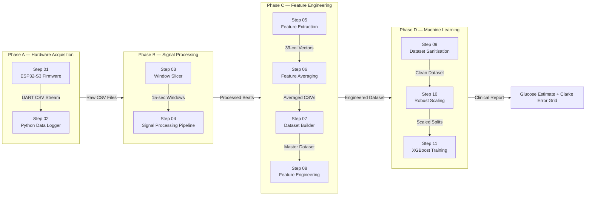
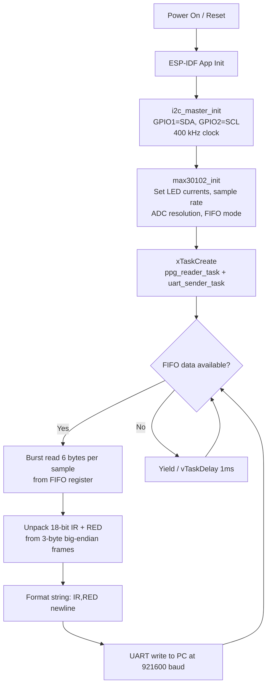
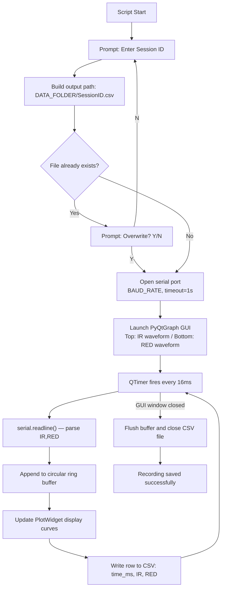
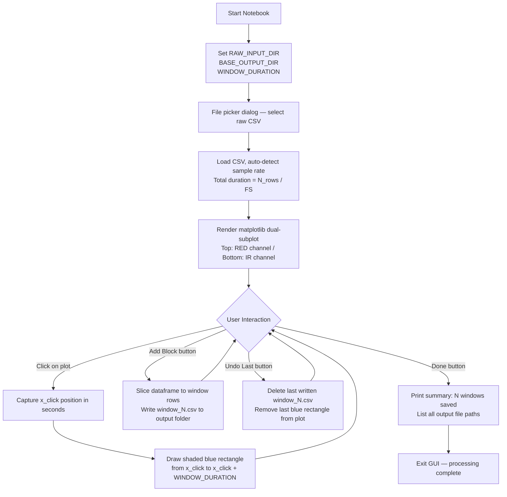
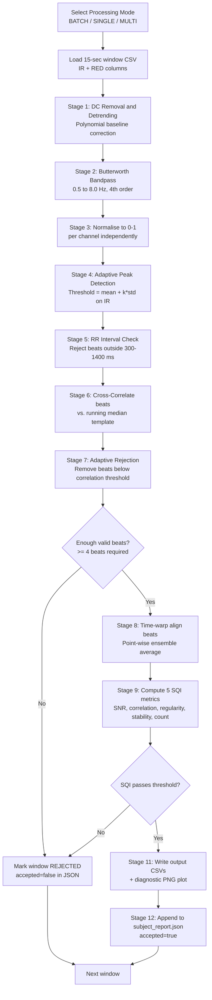
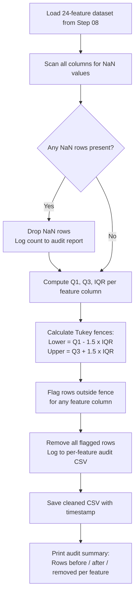
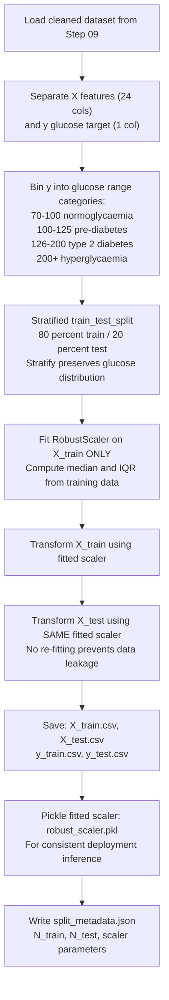
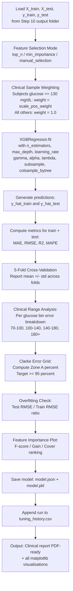

# Non-Invasive Blood Glucose Estimation — Complete Pipeline Flowchart

> A step-by-step visual guide mapping all **11 code stages** of the non-invasive blood glucose estimation pipeline — from embedded hardware signal acquisition through signal processing, feature engineering, and machine learning clinical evaluation.

---

## Table of Contents

1. [Pipeline Overview](#1-pipeline-overview)
2. [Phase Architecture Map](#2-phase-architecture-map)
3. [Master Pipeline Flowchart](#3-master-pipeline-flowchart)
4. [Detailed Step Breakdown](#4-detailed-step-breakdown)
   - [Step 01 — Embedded Signal Acquisition](#step-01--embedded-signal-acquisition)
   - [Step 02 — Real-Time Data Logging and Visualisation](#step-02--real-time-data-logging-and-visualisation)
   - [Step 03 — Manual Window Selection and Segmentation](#step-03--manual-window-selection-and-segmentation)
   - [Step 04 — Automated Signal Processing and Quality Assessment](#step-04--automated-signal-processing-and-quality-assessment)
   - [Step 05 — Morphological Feature Extraction](#step-05--morphological-feature-extraction)
   - [Step 06 — Per-Subject Feature Averaging and Consolidation](#step-06--per-subject-feature-averaging-and-consolidation)
   - [Step 07 — Feature-Glucose Metadata Fusion](#step-07--featureglucose-metadata-fusion)
   - [Step 08 — Three-Tier Feature Engineering and Dimensionality Reduction](#step-08--three-tier-feature-engineering-and-dimensionality-reduction)
   - [Step 09 — Dataset Sanitisation and Outlier Elimination](#step-09--dataset-sanitisation-and-outlier-elimination)
   - [Step 10 — Robust Scaling and Stratified Partitioning](#step-10--robust-scaling-and-stratified-partitioning)
   - [Step 11 — XGBoost Model Training, Tuning and Clinical Evaluation](#step-11--xgboost-model-training-tuning-and-clinical-evaluation)
5. [Data Schema Evolution](#5-data-schema-evolution)
6. [Technology Stack Summary](#6-technology-stack-summary)
7. [End-to-End Data Flow Reference](#7-end-to-end-data-flow-reference)
8. [Quick Reference Table](#8-quick-reference--all-11-steps-at-a-glance)

---

## 1. Pipeline Overview

The pipeline operates across **four major engineering phases**:

| Phase | Steps | Domain | Purpose |
|---|---|---|---|
| **Phase A — Hardware Acquisition** | Steps 01-02 | Embedded Systems + Python | Acquire raw optical PPG signals from a living finger |
| **Phase B — Signal Processing** | Steps 03-04 | DSP + Biomedical Signal Analysis | Clean, filter, and segment physiologically valid PPG waveforms |
| **Phase C — Feature Engineering** | Steps 05-08 | Numerical Computing + Data Science | Extract, aggregate, and engineer 24 biologically-meaningful predictors |
| **Phase D — Machine Learning** | Steps 09-11 | Applied ML + Clinical Validation | Train, tune, and clinically evaluate a blood glucose regression model |

**Pipeline Input:** A human fingertip placed on a MAX30102 optical sensor.

**Pipeline Output:** A blood glucose concentration estimate in mg/dL, validated against ISO 15197 clinical standards using the Clarke Error Grid.

---

## 2. Phase Architecture Map



---

## 3. Master Pipeline Flowchart

> **Full 11-Step Sequential Flow** — Tracing data from raw photons to clinical glucose predictions.

```mermaid
flowchart TD
    START(["Pipeline Start — Human Subject Measurement"])
    subgraph PA["PHASE A — Hardware Acquisition"]
        direction TB
        S01["STEP 01\n────────────────────────\nEmbedded Signal Acquisition\n────────────────────────\nFile: esp32_ppg_firmware.c\nLang: Embedded C\nHW: ESP32-S3 + MAX30102\n────────────────────────\nOUT: IR and RED UART stream\n     Format: IR,RED per line"]
        S02["STEP 02\n────────────────────────\nReal-Time Data Logging\nand Visualisation\n────────────────────────\nFile: data_logger_code02.py\nLang: Python\nLibs: PyQtGraph, pyserial\n────────────────────────\nIN:  UART serial stream\nOUT: Timestamped CSVs\n     time_ms, IR, RED"]
        S01 -->|"UART Serial IR,RED lines"| S02
    end
    subgraph PB["PHASE B — Signal Processing"]
        direction TB
        S03["STEP 03\n────────────────────────\nManual Window Selection\nand Segmentation\n────────────────────────\nFile: step3_window_slicer_code03.ipynb\nLang: Python Jupyter\nLibs: numpy, pandas, matplotlib\n────────────────────────\nIN:  Raw recording CSVs\nOUT: 15-second window CSVs"]
        S04["STEP 04\n────────────────────────\nAutomated Signal Processing\nand Quality Assessment\n────────────────────────\nFile: Automated_Signal_Processing_Code04.py\nLang: Python approx 3000 lines\nLibs: numpy, scipy, pandas\n────────────────────────\nIN:  15-sec window CSVs\nOUT: Ensemble-averaged beats\n     + 5 SQI quality metrics"]
        S03 -->|"Segmented 15-sec Windows"| S04
    end
    subgraph PC["PHASE C — Feature Engineering"]
        direction TB
        S05["STEP 05\n────────────────────────\nMorphological Feature Extraction\n────────────────────────\nFile: Feature_Extraction_Code05.py\nLang: Python approx 700 lines\nLibs: numpy, pandas, scipy\n────────────────────────\nIN:  Averaged beat CSVs\nOUT: 39-column feature vector\n     19 features x IR + RED + 1"]
        S06["STEP 06\n────────────────────────\nPer-Subject Feature Averaging\nand Consolidation\n────────────────────────\nFile: Average_Feature_Extraction_Code06.py\nLang: Python\nLibs: numpy, pandas\n────────────────────────\nIN:  Per-window feature CSVs\nOUT: One averaged row per subject"]
        S07["STEP 07\n────────────────────────\nFeature-Glucose Metadata Fusion\n────────────────────────\nFile: Data_Set_Creation_Code07.py\nLang: Python approx 430 lines\nLibs: pandas, openpyxl\n────────────────────────\nIN:  Feature CSVs + Excel metadata\nOUT: Labelled master dataset CSV"]
        S08["STEP 08\n────────────────────────\nThree-Tier Feature Engineering\nand Dimensionality Reduction\n────────────────────────\nFile: Data_set_with_24_Features_creation_08.py\nLang: Python approx 700 lines\nLibs: pandas, numpy\n────────────────────────\nIN:  Master dataset 30+ features\nOUT: 24-feature engineered dataset\n     18 IR + 5 ratio + 1 ensemble"]
        S05 -->|"39-column feature vectors"| S06
        S06 -->|"Per-subject averaged CSVs"| S07
        S07 -->|"Master dataset 30+ features"| S08
    end
    subgraph PD["PHASE D — Machine Learning"]
        direction TB
        S09["STEP 09\n────────────────────────\nDataset Sanitisation\nand Outlier Elimination\n────────────────────────\nFile: Cleaned_dataset_without_NaN_and_outliers_Creation_code09.py\nLang: Python\nLibs: pandas, numpy, scipy\n────────────────────────\nIN:  Raw 24-feature dataset\nOUT: Clean dataset\n     IQR fencing + NaN drop"]
        S10["STEP 10\n────────────────────────\nRobust Scaling\nand Stratified Partitioning\n────────────────────────\nFile: Train_Test_Split_and_Robust_Scaling_Code10.py\nLang: Python\nLibs: sklearn, pandas\n────────────────────────\nIN:  Cleaned 24-feature dataset\nOUT: X_train, X_test, y_train, y_test\n     RobustScaler normalised"]
        S11["STEP 11\n────────────────────────\nXGBoost Model Training\nTuning and Clinical Evaluation\n────────────────────────\nFile: XGBoost_ML_Code11.py\nLang: Python approx 1780 lines\nLibs: xgboost, sklearn, matplotlib\n────────────────────────\nIN:  Scaled train/test partitions\nOUT: Trained model .json + .pkl\n     MAE, RMSE, R2, MAPE\n     Clarke Error Grid Zone A 95pct\n     K-Fold CV + tuning_history.csv"]
        S09 -->|"NaN-free outlier-free dataset"| S10
        S10 -->|"Scaled train/test CSV partitions"| S11
    end
    END(["Clinical Output\nGlucose Estimate mg/dL\nClarke Error Grid — MAE, RMSE, R2, MAPE"])
    START --> PA
    PA -->|"Raw CSV files time_ms, IR, RED"| PB
    PB -->|"Processed beat CSV templates"| PC
    PC -->|"24-feature engineered dataset CSV"| PD
    PD --> END
    style START fill:#1a1a2e,stroke:#e94560,color:#fff
    style END   fill:#0d7a5f,stroke:#06d6a0,color:#fff
    style S01 fill:#1e293b,stroke:#e94560,color:#e2e8f0
    style S02 fill:#1e293b,stroke:#e94560,color:#e2e8f0
    style S03 fill:#162032,stroke:#3b82f6,color:#e2e8f0
    style S04 fill:#162032,stroke:#3b82f6,color:#e2e8f0
    style S05 fill:#1f1235,stroke:#a855f7,color:#e2e8f0
    style S06 fill:#1f1235,stroke:#a855f7,color:#e2e8f0
    style S07 fill:#1f1235,stroke:#a855f7,color:#e2e8f0
    style S08 fill:#1f1235,stroke:#a855f7,color:#e2e8f0
    style S09 fill:#1a2e1a,stroke:#22c55e,color:#e2e8f0
    style S10 fill:#1a2e1a,stroke:#22c55e,color:#e2e8f0
    style S11 fill:#162000,stroke:#f5a623,color:#e2e8f0
```



---

## 4. Detailed Step Breakdown

---

### Step 01 — Embedded Signal Acquisition

| Attribute | Details |
|---|---|
| **Professional Name** | Embedded Signal Acquisition |
| **File** | `01_Firmware_ESP32/main/esp32_ppg_firmware.c` |
| **Language** | Embedded C (ESP-IDF Framework) |
| **Hardware** | ESP32-S3 DevKitC + MAX30102 breakout module |
| **ADC Resolution** | 18-bit (262,144 discrete levels) |
| **Sample Rates** | 50 Hz / 100 Hz / 200 Hz / 400 Hz / 800 Hz / 1000 Hz / 1600 Hz / 3200 Hz |
| **Communication** | I2C at 400 kHz (sensor read) + UART at up to 921,600 baud (PC output) |
| **Architecture** | FreeRTOS task-based: ppg_reader_task + uart_sender_task |

**Purpose:**
This is the hardware foundation of the entire pipeline. The ESP32-S3 microcontroller continuously drives a MAX30102 dual-wavelength optical sensor and samples photocurrent at configurable rates. The MAX30102 emits Red (lambda ~660 nm) and Infrared (lambda ~880-940 nm) LEDs alternately and measures the reflected photocurrent absorbed by the fingertip capillary bed. The 18-bit ADC captures the photoplethysmographic waveform caused by cyclical changes in blood volume with each heartbeat.

**Physical Principle — Beer-Lambert Law:**
The optical attenuation through the finger tissue follows:

    I(t) = I0 * exp( -epsilon * c(t) * L )

Where `I0` is the incident LED intensity, `epsilon` is the molar extinction coefficient of haemoglobin (wavelength-dependent), `c(t)` is the instantaneous blood concentration (pulsatile), and `L` is the optical path length. Changes in blood glucose alter `c(t)` by modifying haemoglobin glycation (HbA1c) and plasma osmolarity, thereby modulating the detected photocurrent `I(t)` at both wavelengths.

**Key Processing:**
- Initialises I2C peripheral on GPIO 1 (SDA) and GPIO 2 (SCL)
- Configures MAX30102 via register writes: LED currents, sample averaging, FIFO thresholds, ADC range
- Reads FIFO data register burst at 400 kHz — 6 bytes per sample (3 bytes IR + 3 bytes RED)
- Formats output as IR,RED newline-delimited CSV over UART
- FreeRTOS semaphore synchronisation between read and send tasks

**Output Format:**
```
IR,RED
96512,82340
96518,82347
96501,82330
```

**Internal Logic Flowchart:**



---

### Step 02 — Real-Time Data Logging and Visualisation

| Attribute | Details |
|---|---|
| **Professional Name** | Real-Time Data Logging and Visualisation |
| **File** | `02_Python_Data_Logger/data_logger_code02.py` |
| **Language** | Python 3 (~150 lines) |
| **Libraries** | PyQt5, PyQtGraph, pyserial, numpy |
| **GUI Refresh Rate** | 60+ FPS (PyQtGraph hardware-accelerated) |
| **Output** | Timestamped CSV files — one per recording session |
| **Buffer** | Configurable circular ring buffer for display window |

**Purpose:**
Bridges the ESP32 firmware and the Python processing pipeline. The tool opens a serial connection to the ESP32, reads incoming IR,RED pairs, timestamps each sample with millisecond precision (system clock), displays both channels in real-time on a dual-panel GUI, and simultaneously writes every sample to a session CSV file. The live waveform display allows the researcher to verify signal quality — clean heartbeat peaks visible in both channels — before finalising the recording session.

**Key Processing:**
- Configures pyserial with matching baud rate (115200 or 921600) and COM port
- Uses PyQtGraph PlotWidget for hardware-accelerated waveform rendering at 60 FPS
- Rolling circular buffer ensures O(1) constant-time display window updates
- Appends time_ms, IR, RED rows to CSV during measurement — no data is lost
- Prompts for session ID on startup to auto-name the output file
- Overwrite protection with user prompt prevents accidental data loss

**Output Format:**
```
time_ms,IR,RED
0,96512,82340
8,96518,82347
16,96501,82330
```

**Internal Logic Flowchart:**



---

### Step 03 — Manual Window Selection and Segmentation

| Attribute | Details |
|---|---|
| **Professional Name** | Manual Window Selection and Segmentation |
| **File** | `03_Python_Data_Processing/step3_window_slicer_code03.ipynb` |
| **Language** | Python 3 (Jupyter Notebook, ~270 lines) |
| **Libraries** | numpy, pandas, matplotlib |
| **Window Duration** | Configurable (default: 15 seconds) |
| **Interaction Mode** | Click-to-position on matplotlib canvas |
| **Workflow** | Add Block / Undo Last / Done |

**Purpose:**
Transforms a long continuous PPG recording into precisely-timed fixed-duration windows. The researcher manually inspects both channels simultaneously and selects artifact-free segments that represent clean cardiac cycles during a stable physiological state. This manual curation step is critical: automated segmentation cannot reliably detect subtle motion artifacts, deep breathing transients, or sensor displacement events that contaminate specific segments of the recording.

**Key Processing:**
- Loads a raw CSV file via a file picker dialog box
- Renders RED (top subplot) and IR (bottom subplot) waveforms on a scrollable matplotlib canvas
- Click event handler captures the x-axis position as the window start time
- Draws a shaded blue rectangle from x_click to x_click + WINDOW_DURATION
- "Add Block" saves the selected segment as an individual window_N.csv file
- "Undo Last" removes the most-recent saved window and erases its rectangle
- "Done" finalises all selections, prints a summary, and exits the GUI

**Output Format per window:**
```
time_ms,IR,RED
0,96512,82340
8,96518,82347
...
```
Each file contains exactly `WINDOW_DURATION x sampling_rate` rows (e.g. 15s x 400Hz = 6000 rows).

**Internal Logic Flowchart:**



---

### Step 04 — Automated Signal Processing and Quality Assessment

| Attribute | Details |
|---|---|
| **Professional Name** | Automated Signal Processing and Quality Assessment |
| **File** | `04_Python_Signal_Processing_Pipeline/Automated_Signal_Processing_Code04.py` |
| **Language** | Python 3 (~3,000 lines) |
| **Libraries** | numpy, scipy, pandas, matplotlib |
| **Pipeline Stages** | 12 sequential processing stages |
| **Processing Modes** | BATCH / SINGLE / MULTI folder |
| **SQI Metrics** | 5 Signal Quality Index scores per window |
| **Processing Time** | Approximately 30 seconds per 15-second window |

**Purpose:**
The most computationally intensive and scientifically critical step in the pipeline. This 12-stage automated engine takes raw 15-second PPG windows and produces ensemble-averaged single-beat templates that represent the ideal cardiac waveform shape for that subject during that measurement. It applies Butterworth bandpass filtering, polynomial detrending, adaptive beat detection, morphological validation, iterative beat rejection, and time-warped ensemble averaging — then assigns a Signal Quality Index grade that determines whether the window should propagate to feature extraction or be flagged as rejected.

**The 12 Processing Stages:**

| Stage | Name | Method |
|---|---|---|
| 01 | DC Removal and Detrending | Subtract running mean, polynomial baseline correction |
| 02 | Bandpass Filtering | Butterworth 4th-order, 0.5 to 8.0 Hz passband |
| 03 | Normalisation | Min-max scale to [0, 1] per channel |
| 04 | Beat Detection | Adaptive threshold peak finder (IR channel primary) |
| 05 | RR Interval Validation | Reject beats with RR outside 300-1400 ms physiological bounds |
| 06 | Morphological Validation | Cross-correlate each beat against the median template |
| 07 | Adaptive Beat Rejection | Iteratively reject beats below correlation threshold |
| 08 | Ensemble Averaging | Time-warped alignment then point-wise mean of valid beats |
| 09 | SQI Computation | 5-metric score: SNR, correlation coefficient, peak regularity, amplitude stability, beat count |
| 10 | Window Accept or Reject | SQI threshold gates propagation to Step 05 |
| 11 | Output Generation | Write averaged beat CSVs + diagnostic PNG plot |
| 12 | Report Compilation | Append to per-subject JSON quality report |

**Signal Quality Index Metrics:**

| SQI Metric | Physical Interpretation | Target Threshold |
|---|---|---|
| SNR (dB) | Signal-to-noise ratio of cardiac peaks vs. baseline | > 15 dB |
| Correlation Coefficient | Mean Pearson r of each beat vs. ensemble template | > 0.85 |
| Peak Regularity | Coefficient of variation of inter-beat intervals | < 0.10 |
| Amplitude Stability | Standard deviation of peak amplitudes / mean | < 0.15 |
| Valid Beat Count | Number of beats that passed all rejection criteria | >= 4 |

**Output Structure:**
```
subject_001/
    window_001/
        ir_averaged_beat.csv         <- ensemble-averaged IR waveform
        red_averaged_beat.csv        <- ensemble-averaged RED waveform
        quality_metrics.json         <- includes accepted: true or false
        diagnostic_plot.png          <- beat overlay + averaging result
    window_002/
        ...
    subject_report.json              <- aggregate quality across all windows
```

**Internal Logic Flowchart:**



---

### Step 05 — Morphological Feature Extraction

| Attribute | Details |
|---|---|
| **Professional Name** | Morphological Feature Extraction |
| **File** | `05_Signal_Feature_Learning/Feature_Extraction_Code05.py` |
| **Language** | Python 3 (~700 lines) |
| **Libraries** | numpy, pandas, scipy |
| **Features Extracted** | 19 per channel (IR + RED) + 1 combined = 39-column output |
| **Processing Modes** | BATCH (all subjects) + SINGLE (folder picker) |
| **Rejected Windows** | Auto-detected via quality_metrics.json accepted flag — skipped silently |
| **Processing Time** | 2-5 seconds per window on a standard laptop |

**Purpose:**
Numerically characterises the shape, dynamics, and morphology of each ensemble-averaged PPG beat using 19 carefully selected mathematical features per optical channel. These features capture the biophysical signatures of blood glucose — including the optical absorption changes caused by haemoglobin glycation (HbA1c), osmotic viscosity shifts from hyperglycaemia, and arterial compliance alterations that modulate the PPG waveform shape, timing, and spectral content.

**Physiological Basis of Key Features:**

The PPG waveform contains two primary components:
1. **Systolic wave** — forward pressure wave from left ventricular ejection (upstroke)
2. **Diastolic wave / Dicrotic notch** — reflected pressure wave from peripheral vasculature (downstroke)

Blood glucose affects both components through three mechanisms:
- **Haemoglobin glycation (HbA1c):** Alters the oxygen-binding affinity of haemoglobin, shifting the infrared absorption coefficient at 940 nm and changing the systolic peak amplitude
- **Osmotic hyperosmolarity:** Elevated glucose raises plasma osmolarity, drawing water out of red blood cells, increasing blood viscosity, which slows the diastolic fall time and increases pulse width
- **Sympathoadrenal activation (hypoglycaemia):** Low glucose triggers catecholamine release, causing vasoconstriction and tachycardia, shortening RR intervals and altering the augmentation index

**The 19 Extracted Features per Channel:**

| No. | Feature Name | Physical Significance |
|---|---|---|
| 01 | Systolic Peak Amplitude | Maximum blood volume per beat — reduced by HbA1c-related absorption |
| 02 | Diastolic Notch Amplitude | Vascular reflection wave — altered by peripheral resistance changes |
| 03 | Pulse Amplitude (systolic minus diastolic) | Peripheral pulse pressure proxy |
| 04 | Systolic Rise Time | Speed of arterial upstroke — indicator of arterial stiffness |
| 05 | Diastolic Fall Time | Venous runoff rate — prolonged by osmotic viscosity |
| 06 | Pulse Width at 50% amplitude (FWHM) | Cardiac ejection interval — altered by hyperglycaemic viscosity |
| 07 | Area Under Curve (AUC) | Integrated blood volume per beat cycle |
| 08 | Systolic Area Fraction | Ratio of ejection phase energy to total |
| 09 | Diastolic Area Fraction | Ratio of relaxation phase energy to total |
| 10 | Peak-to-Peak Time | Pulse transit time approximation — aortic stiffness proxy |
| 11 | Skewness | Morphological asymmetry of the beat envelope |
| 12 | Kurtosis | Sharpness of the systolic peak — altered by arterial compliance |
| 13 | RMS Amplitude | Total signal energy per beat |
| 14 | 1st Derivative Peak (dPPG/dt) | Rate of systolic pressure rise |
| 15 | 2nd Derivative Peak (d2PPG/dt2) | Vascular wall acceleration — sensitive to arterial stiffness |
| 16 | Augmentation Index (AIx) | Ratio of reflected to incident wave amplitude — arterial stiffness |
| 17 | Reflectance Index (RI) | Diastolic-to-Systolic amplitude ratio |
| 18 | Pulse Decomposition Score | Multi-Gaussian component fit quality |
| 19 | Spectral Centroid (0.5-8 Hz) | Frequency-domain energy centre of the cardiac signal |

**Output Format per window per channel:**
```
subject_id,window_id,channel,feature_01,...,feature_19
S001,win001,IR,0.823,...,2.341
S001,win001,RED,0.741,...,2.198
```

---

### Step 06 — Per-Subject Feature Averaging and Consolidation

| Attribute | Details |
|---|---|
| **Professional Name** | Per-Subject Feature Averaging and Consolidation |
| **File** | `05_Signal_Feature_Learning/Average_Feature_Extraction_Code06.py` |
| **Language** | Python 3 |
| **Libraries** | numpy, pandas |
| **Operation** | Column-wise arithmetic mean across all accepted windows per subject |

**Purpose:**
Reduces the multiple per-window feature vectors for each subject into a single representative feature vector by computing the arithmetic mean across all accepted windows. This averaging step significantly improves the signal-to-noise ratio of the extracted features — transient physiological fluctuations or residual noise artifacts in individual windows cancel out through averaging, while the stable cross-session characteristics that correlate with blood glucose level are reinforced and made more consistent.

**Mathematical Operation:**

For subject s with W accepted windows and feature f, the consolidated feature value is:

    feature_mean(s, f) = (1/W) * sum_{w=1}^{W} feature(s, w, f)

**Why averaging improves ML performance:**
In a clinical PPG dataset, a subject may have 3-8 valid windows from a single measurement session. Each window's feature values vary due to breathing-induced baseline wander, subtle finger pressure changes, and cardiac rate variability. Averaging over W windows reduces the variance of each feature by a factor of approximately 1/sqrt(W), producing a more stable and representative predictor for the ML model.

**Key Processing:**
- Traverses all per-subject output folders from Step 05
- For each subject, collects only the accepted window feature rows (accepted flag = true from Step 04 JSON)
- Computes pandas DataFrame column-wise mean across W accepted window rows
- Outputs a single-row CSV per subject containing all 38 averaged feature values (19 IR + 19 RED)
- Logs the window count and acceptance rate per subject for traceability

**Output Format:**
```
subject_id,IR_feat_01,...,IR_feat_19,RED_feat_01,...,RED_feat_19
S001,0.823,...,2.341,0.741,...,2.198
S002,0.791,...,2.287,0.710,...,2.155
```

---

### Step 07 — Feature-Glucose Metadata Fusion

| Attribute | Details |
|---|---|
| **Professional Name** | Feature-Glucose Metadata Fusion |
| **File** | `06_Data_Set_Creation/Data_Set_Creation_Code07.py` |
| **Language** | Python 3 (~430 lines) |
| **Libraries** | pandas, openpyxl |
| **Processing Modes** | SINGLE / BATCH |
| **Metadata Format** | Excel (.xlsx) or CSV with subject_id and glucose_mg_dl columns |
| **Matching Strategy** | Case-insensitive, whitespace-stripped Subject ID matching |
| **Traceability** | Build log JSON with matched and unmatched subject lists |

**Purpose:**
Merges the engineered per-subject feature vectors from Step 06 with clinically-measured reference blood glucose values from a separately maintained metadata file. The reference glucose values were obtained from a finger-prick glucometer reading taken immediately before or during the PPG measurement session — forming the ground-truth label for supervised machine learning. This fusion step creates the complete labelled dataset where each row represents one measurement session with all PPG-derived predictors alongside the clinical glucose label.

**Key Processing:**
- Reads all per-subject averaged feature CSVs from the Step 06 output folder
- Loads the glucose metadata Excel workbook using openpyxl
- Normalises Subject IDs in both sources (strip whitespace, convert to lowercase)
- Performs pandas inner join: only subjects present in both the feature CSV folder and the Excel metadata are included in the output
- Records unmatched subjects (present in one source but not the other) to a build_log.json file
- Writes a consolidated master_dataset.csv with all matched subjects and their glucose labels

**Glucose Label Clinical Context:**
The glucometer readings span a physiological range of approximately 70 to 300 mg/dL. The distribution of glucose levels across subjects determines the difficulty of the regression task — a wide spread with sufficient subjects in each clinical range (normoglycaemia 70-100, pre-diabetes 100-125, diabetes 126-200, hyperglycaemia >200) is required for the XGBoost model to learn meaningful glucose-feature relationships at all blood glucose levels.

**Output Format:**
```
subject_id,IR_feat_01,...,IR_feat_19,RED_feat_01,...,RED_feat_19,glucose_mg_dl
S001,0.823,...,2.341,0.741,...,2.198,98.5
S002,0.791,...,2.287,0.710,...,2.155,142.0
S003,0.810,...,2.312,0.729,...,2.180,67.0
```

---

### Step 08 — Three-Tier Feature Engineering and Dimensionality Reduction

| Attribute | Details |
|---|---|
| **Professional Name** | Three-Tier Feature Engineering and Dimensionality Reduction |
| **File** | `07_Data_Set_Processing_Code_for_ML/Data_set_with_24_Features_creation_08.py` |
| **Language** | Python 3 (~700 lines) |
| **Libraries** | pandas, numpy |
| **Input** | Master dataset with 30+ raw feature columns |
| **Output** | 24 engineered features + 1 glucose target = 25 columns |
| **Integrity Check** | Floating-point verification to 1e-9 tolerance |

**Purpose:**
Applies scientifically-justified feature engineering to reduce the raw 30+ feature space to exactly 24 carefully chosen predictors. The reduction follows a three-tier classification system that preserves the most biologically-meaningful wavelength-specific information while eliminating redundant features and introducing inter-wavelength ratio features that encode glucose-induced optical property changes that are invisible to single-channel analysis. The final 24-feature set is the input to all downstream machine learning stages.

**The Three-Tier System:**

| Tier | Count | Description |
|---|---|---|
| **Tier 1 — IR Base Features** | 18 | Direct measurements from the IR channel (dominant wavelength for non-invasive glucose: HbA1c absorbs differentially at ~940 nm, and plasma glucose scattering is greater at IR wavelengths than at visible red) |
| **Tier 2 — Engineered RED/Ratio Features** | 5 | Mathematically derived inter-wavelength features: RED/IR amplitude ratios, area ratios, pulse width differences, spectral centroid differences — encoding Beer-Lambert optical cross-channel interactions that are uniquely sensitive to glucose concentration |
| **Tier 3 — Ensemble Metric** | 1 | A composite stability score combining spectral entropy and morphological consistency across both channels — acts as a data quality feature for the ML model |

**Key Tier 2 Engineered Features:**

| Feature Name | Formula | Physiological Meaning |
|---|---|---|
| amplitude_ratio | RED_systolic_peak / IR_systolic_peak | Sensitive to haemoglobin oxygenation state and HbA1c |
| area_ratio | RED_AUC / IR_AUC | Integrated optical absorption cross-channel ratio |
| rise_time_diff | RED_rise_time minus IR_rise_time | Differential wavelength-dependent vascular response timing |
| width_ratio | RED_FWHM / IR_FWHM | Comparative pulse width — proxy for blood viscosity changes |
| spectral_diff | RED_centroid minus IR_centroid | Frequency-domain wavelength separation metric |

---

### Step 09 — Dataset Sanitisation and Outlier Elimination

| Attribute | Details |
|---|---|
| **Professional Name** | Dataset Sanitisation and Outlier Elimination |
| **File** | `07_Data_Set_Processing_Code_for_ML/Cleaned_dataset_without_NaN_and_outliers_Creation_code09.py` |
| **Language** | Python 3 |
| **Libraries** | pandas, numpy, scipy |
| **NaN Strategy** | Complete-case analysis (row-wise listwise deletion) |
| **Outlier Method** | IQR-based Tukey fencing with configurable multiplier (default: 1.5x) |
| **Output** | Timestamped cleaned dataset CSV + per-feature audit report |

**Purpose:**
Prepares the engineered 24-feature dataset for machine learning by removing statistical anomalies that would degrade model performance and create spurious generalisability estimates. In the context of small clinical datasets (N less than 100 subjects), even a single extreme outlier can significantly distort XGBoost gradient computations — the second-order Taylor approximation used in each boosting round will produce an inflated Hessian h_i for an outlier point, causing the tree to allocate a disproportionate number of leaf splits to explain that single anomalous observation rather than the broader glucose-feature relationship.

**Outlier Detection — IQR Tukey Fence Method:**

For each feature column f, computed over all N subjects:

    Q1(f) = 25th percentile of column f
    Q3(f) = 75th percentile of column f
    IQR(f) = Q3(f) - Q1(f)
    Lower_fence(f) = Q1(f) - 1.5 * IQR(f)
    Upper_fence(f) = Q3(f) + 1.5 * IQR(f)

Any row where feature value x(i,f) falls outside [Lower_fence(f), Upper_fence(f)] for any feature f is flagged as an outlier and removed from the dataset.

**Percentile Interpolation for Small Datasets:**

For a dataset with N sorted values x(1) <= x(2) <= ... <= x(N), the p-th percentile is computed using linear interpolation between adjacent order statistics:

    rank = 1 + (p/100) * (N - 1)
    floor_rank = floor(rank)
    fraction = rank - floor_rank
    percentile = x(floor_rank) + fraction * (x(floor_rank + 1) - x(floor_rank))

This linear interpolation ensures smooth and stable quartile estimates even in small clinical datasets (N < 30 subjects), preventing discontinuous fence boundaries that would arise from naive quantile rounding.

**Why IQR Over Z-Score Outlier Detection:**
Z-score methods assume Gaussian distribution (z = (x - mu) / sigma) and use the mean mu as the centre. In a small clinical dataset, a single outlier inflates sigma and shifts mu, reducing the z-score of the outlier and making it harder to detect — a paradox known as masking. IQR-based fencing uses the median and quartiles, which are breakdown-resistant statistics that are unaffected by outliers, making the fence boundaries reliable even in heavily contaminated small samples.

**Key Processing:**
1. Load the 24-feature engineered dataset from Step 08
2. Scan all 24 feature columns and the glucose target for NaN values
3. Drop any row containing at least one NaN (complete-case analysis)
4. Compute per-column Q1, Q3, and IQR statistics
5. Apply Tukey fence: flag rows where any feature violates [Lower, Upper] bounds
6. Remove all flagged rows and log the removal reason per feature to audit CSV
7. Save the cleaned dataset as a new timestamped CSV file
8. Print audit summary: total rows removed, which features triggered removals

**Internal Logic Flowchart:**



---

### Step 10 — Robust Scaling and Stratified Partitioning

| Attribute | Details |
|---|---|
| **Professional Name** | Robust Scaling and Stratified Partitioning |
| **File** | `07_Data_Set_Processing_Code_for_ML/Train_Test_Split_and_Robust_Scaling_Code10.py` |
| **Language** | Python 3 |
| **Libraries** | scikit-learn, pandas, numpy |
| **Scaler** | RobustScaler — median and IQR-based normalisation |
| **Split Ratio** | Configurable (default: 80% train / 20% test) |
| **Split Strategy** | Stratified by glucose clinical range bins |
| **Leakage Prevention** | Scaler fitted on X_train only — applied to X_test without re-fitting |

**Purpose:**
Prepares the clean feature matrix for machine learning by applying RobustScaler normalisation and deterministically splitting into training and test partitions. RobustScaler is selected over StandardScaler and MinMaxScaler because it uses the median and interquartile range as its centering and scaling statistics respectively — making it inherently resistant to the clinical outliers that may survive the IQR fence in Step 09, particularly in extreme glucose measurements at the boundaries of the measurement range.

**Scaler Comparison — Why Robust Scaling:**

| Scaler | Centre Statistic | Scale Statistic | Outlier Effect | Suitability |
|---|---|---|---|---|
| StandardScaler | Mean (mu) | Std Dev (sigma) | ONE outlier shifts mu and inflates sigma, compressing all other values | Poor for small clinical N |
| MinMaxScaler | Minimum value | Range (Max - Min) | ONE extreme value captures the entire scaling range | Extremely poor for clinical data |
| RobustScaler | Median (Q50) | IQR (Q75 - Q25) | Outliers beyond the IQR boundary have zero effect on scale statistics | Recommended for small clinical N |

**Robust Scaling Mathematical Formula:**

For feature column f in sample i:

    x_scaled(i,f) = (x(i,f) - median_train(f)) / (Q3_train(f) - Q1_train(f))

Where `median_train(f)` and the IQR `Q3_train(f) - Q1_train(f)` are both computed exclusively from the training split X_train to prevent data leakage from the test set influencing the scaling parameters.

**Stratified Splitting Rationale:**
A simple random train/test split on a small dataset risks placing all hyperglycaemic subjects (glucose > 200 mg/dL) in the training set and none in the test set, or vice versa. Stratified splitting ensures that the proportion of subjects in each glucose range bin is approximately equal in both train and test partitions, giving a fair evaluation of model performance across the full clinical glucose range.

**Key Processing:**
1. Load the cleaned 24-feature dataset from Step 09
2. Separate feature matrix X (24 columns) and target vector y (glucose)
3. Bin y into glucose range categories: normoglycaemia (70-100), pre-diabetes (100-125), type 2 (126-200), hyperglycaemia (200+)
4. Stratified train_test_split with stratify=bins at the configured ratio
5. Fit RobustScaler on X_train only — compute median and IQR from training data
6. Transform X_train using fitted scaler
7. Transform X_test using the SAME fitted scaler (no re-fitting to prevent leakage)
8. Save all four partitions: X_train.csv, X_test.csv, y_train.csv, y_test.csv
9. Pickle the fitted scaler to robust_scaler.pkl for consistent inference-time scaling

**Output Structure:**
```
split_output/
    X_train.csv        <- Scaled training feature matrix (N_train x 24)
    X_test.csv         <- Scaled test feature matrix (N_test x 24)
    y_train.csv        <- Training glucose labels (N_train x 1)
    y_test.csv         <- Test glucose labels (N_test x 1)
    robust_scaler.pkl  <- Fitted RobustScaler for deployment inference
    split_metadata.json <- N_train, N_test, glucose range distribution
```

**Internal Logic Flowchart:**



---

### Step 11 — XGBoost Model Training, Tuning and Clinical Evaluation

| Attribute | Details |
|---|---|
| **Professional Name** | XGBoost Model Training, Tuning and Clinical Evaluation |
| **File** | `08_Machine_Learning_Models/XGBoost_ML_Code11.py` |
| **Language** | Python 3 (~1,780 lines) |
| **Libraries** | xgboost, scikit-learn, pandas, numpy, matplotlib |
| **Model Type** | XGBRegressor — gradient boosted decision trees |
| **Primary Tuning Parameters** | 10 hyperparameters |
| **Validation Metrics** | MAE, RMSE, R2, MAPE, 5-Fold CV, Clarke Error Grid |
| **Clinical Standard** | ISO 15197 — Clarke Error Grid Zone A >= 95% |
| **Output** | Trained model (.json + .pkl) + clinical report + tuning_history.csv |

**Purpose:**
The machine learning core of the entire pipeline. Loads the RobustScaler-normalised train/test partitions from Step 10, applies dynamic three-mode feature selection to reduce model complexity, trains a regularised XGBoost gradient boosted regression model with optional clinical sample weighting, and rigorously evaluates every prediction against five quantitative performance metrics and the Clarke Error Grid clinical standard. All training runs are appended to a persistent tuning_history.csv for complete experimental audit trailing.

**Why XGBoost over Alternative ML Models:**

| Model | Reason Rejected for This Task |
|---|---|
| Linear Regression / Ridge / Lasso | Cannot capture the non-linear glucose-to-PPG optical physics relationship; assumes linear additive feature effects |
| Support Vector Regression (SVR) | Kernel choice and epsilon-tube width are extremely sensitive to feature scale in small clinical datasets; no native feature importance |
| Random Forest | Parallel bagging (averaging independent trees) can over-smooth in small N datasets; XGBoost sequential boosting focuses on residual errors iteratively |
| Deep Learning (ANN / MLP) | Overfits severely at N < 100 subjects; black-box opacity prevents physiological interpretation; requires orders of magnitude more data |
| XGBoost | Handles small N with regularisation (L1 + L2 + gamma), provides feature importance rankings, focuses on residuals through gradient boosting, robust to feature correlations through subsampling |

**XGBoost Mathematical Foundations:**

The regularised objective at boosting round t is minimised by adding tree f_t:

    L(t) = sum_{i=1}^{N} l(y_i, y_hat_{i}^{(t-1)} + f_t(x_i)) + Omega(f_t)

Where the structural regularisation penalty on tree f_t is:

    Omega(f_t) = gamma * T + (1/2) * lambda * sum_{j=1}^{T} w_j^2 + alpha * sum_{j=1}^{T} |w_j|

T is the number of leaves, w_j is the leaf weight, gamma is the minimum split gain threshold, lambda is L2 regularisation, and alpha is L1 regularisation.

Applying a second-order Taylor expansion to the loss function around the previous prediction:

    L(t) approx sum_{i=1}^{N} [g_i * f_t(x_i) + (1/2) * h_i * f_t^2(x_i)] + Omega(f_t)

Where g_i = partial derivative of l(y_i, y_hat) (gradient) and h_i = second partial derivative (Hessian), both evaluated at y_hat_{i}^{(t-1)}.

The optimal leaf weight for leaf j (minimising the quadratic above) is:

    w_j* = -(sum_{i in I_j} g_i) / (sum_{i in I_j} h_i + lambda)

The gain from a candidate split of leaf I into left I_L and right I_R is:

    G_split = (1/2) * [ (sum_gL)^2 / (sum_hL + lambda) + (sum_gR)^2 / (sum_hR + lambda) - (sum_gI)^2 / (sum_hI + lambda) ] - gamma

A split is accepted only if G_split > 0. The gamma parameter therefore acts as a pre-pruning threshold.

**10 Primary Tuning Hyperparameters:**

| Parameter | Typical Range | Physiological Tuning Note |
|---|---|---|
| n_estimators | 50-500 | Boosting rounds — more rounds fit more complex glucose patterns but risk overfitting small N |
| max_depth | 2-6 | Tree depth — shallow trees (2-3) prevent overfitting on small clinical datasets |
| learning_rate | 0.01-0.3 | Step size shrinkage per round — lower values require more n_estimators |
| min_child_weight | 1-10 | Minimum Hessian sum in leaf — larger values force broader leaves, regularising on small N |
| gamma | 0.0-1.0 | Minimum split gain — non-zero gamma aggressively prunes trees |
| subsample | 0.5-1.0 | Row sampling fraction per tree — reduces overfitting through stochastic boosting |
| colsample_bytree | 0.5-1.0 | Feature sampling fraction — reduces correlation between trees |
| reg_alpha | 0.0-1.0 | L1 regularisation on leaf weights — promotes sparse solutions (feature selection) |
| reg_lambda | 0.0-2.0 | L2 regularisation on leaf weights — smooth weight shrinkage |
| scale_pos_weight | 1.0-5.0 | Clinical sample weight for hyperglycaemic subjects (glucose >= 130 mg/dL) |

**Performance Metrics — Detailed Definitions:**

**MAE (Mean Absolute Error):**

    MAE = (1/N) * sum_{i=1}^{N} |y_i - y_hat_i|

Interpretation: The average absolute prediction error in mg/dL. MAE treats all errors linearly regardless of direction. Clinical target: MAE < 10 mg/dL (ISO 15197 requires < 15 mg/dL for commercially approved glucose monitors).

**RMSE (Root Mean Squared Error):**

    RMSE = sqrt( (1/N) * sum_{i=1}^{N} (y_i - y_hat_i)^2 )

Interpretation: Penalises large prediction errors quadratically. In clinical context, a single 60 mg/dL prediction error is not merely 4x worse than a 15 mg/dL error — it is 16x more penalised by RMSE. This makes RMSE the critical safety metric for detecting extreme mispredictions. Clinical target: RMSE < 15 mg/dL.

**R2 (Coefficient of Determination):**

    R2 = 1 - (SS_res / SS_tot)
    SS_res = sum_{i=1}^{N} (y_i - y_hat_i)^2
    SS_tot = sum_{i=1}^{N} (y_i - mean(y))^2

Interpretation: Proportion of glucose variance captured by the model. R2 = 1.0 is perfect prediction; R2 = 0.0 means the model performs no better than predicting the mean glucose for every subject. Negative R2 means the model is worse than baseline. Clinical target: R2 > 0.85.

**MAPE (Mean Absolute Percentage Error):**

    MAPE = (100/N) * sum_{i=1}^{N} |y_i - y_hat_i| / y_i

Interpretation: Scale-neutral relative error expressed as a percentage. MAPE is asymmetric: a 10 mg/dL error at y_i = 70 mg/dL produces MAPE contribution of 14.3%, while the same 10 mg/dL error at y_i = 200 mg/dL produces only 5.0%. This makes MAPE more sensitive to errors in hypoglycaemic subjects — which is clinically appropriate since hypoglycaemic misdiagnosis carries greater immediate risk. Clinical target: MAPE < 10%.

**K-Fold Cross-Validation:**

The full cleaned dataset (N_clean subjects) is randomly partitioned into K = 5 mutually exclusive folds of equal size. In each of K iterations:
- Train the XGBoost model on K-1 = 4 folds
- Evaluate on the remaining 1 fold
- Record test fold MAE, RMSE, R2, MAPE

Final CV scores are reported as mean +/- standard deviation across all K folds. A small standard deviation indicates stable generalisation across different data partitions. The CV mean is a less optimistic performance estimate than a single train/test split because the model never trains on the evaluation fold.

**Clarke Error Grid Analysis:**

The Clarke Error Grid evaluates clinical accuracy of glucose predictions by plotting predicted values (y-axis) against reference glucometer values (x-axis) and classifying each data point into one of five clinical zones:

| Zone | Boundary Condition | Clinical Risk |
|---|---|---|
| Zone A | Within +/-20% of reference, or within 20 mg/dL for reference < 70 | Clinically safe — no treatment error |
| Zone B | Outside Zone A but no incorrect treatment decision | Acceptable — clinically benign deviation |
| Zone C | Prediction overcorrects: low predicted when high actual (or vice versa) | Dangerous — patient receives wrong treatment |
| Zone D | Prediction fails to detect hypo or hyperglycaemia | Critical — life-threatening delayed treatment |
| Zone E | Prediction leads to opposite treatment of what is needed | Fatal — directly harmful erroneous treatment |

Clinical target: Zone A >= 95% of all predictions (ISO 15197 requirement for commercial glucose monitors). Zone A + B >= 99% is considered acceptable for research-grade PPG-based estimation.

**The Ten Execution Phases:**

| Phase | Name | Key Output |
|---|---|---|
| 01 | Data Loading | Loaded X_train, X_test, y_train, y_test arrays |
| 02 | Feature Reduction | Reduced feature set (top_n / min_importance / manual_selection) |
| 03 | Sample Weighting | Weight vector: subjects with glucose >= 130 receive higher weight |
| 04 | Model Training | Fitted XGBRegressor with all regularisation parameters |
| 05 | Evaluation | Printed MAE, RMSE, R2, MAPE for train and test splits |
| 05b | K-Fold CV | Cross-validated mean +/- std for all four metrics |
| 05c | Clinical Range Analysis | Per-bin error table across glucose clinical ranges |
| 06 | Overfitting Analysis | Train/test metric ratios — flag if test RMSE > 1.3x train RMSE |
| 07 | Feature Importance | Ranked bar chart of feature F-scores / gain / cover |
| 08 | Predictions Table | Actual vs predicted table with per-subject absolute error |
| 09 | Visualisations | Scatter plot, residuals histogram, Clarke Error Grid PNG |
| 10 | Tuning History | Row appended to tuning_history.csv with all parameters and metrics |

**Internal Logic Flowchart:**



---

## 5. Data Schema Evolution

| After Step | Format Description | Feature Columns | Subject Rows |
|---|---|---|---|
| Step 01 | Raw photocurrent integers (IR, RED) | 2 | N_samples total (continuous stream) |
| Step 02 | Timestamped recording (time_ms, IR, RED) | 3 | N_samples per session |
| Step 03 | 15-second window segments | 3 | FS x 15 per window |
| Step 04 | Ensemble-averaged beat template (normalised IR + RED) | 2 | N_beat_samples per window |
| Step 05 | Feature vector per window per channel | 21 (19 features + 2 metadata) | N_windows x 2 channels |
| Step 06 | Per-subject averaged features (38 features) | 39 (38 features + subject_id) | N_subjects |
| Step 07 | Labelled master dataset with glucose label | 40 (38 features + subject_id + glucose) | N_subjects |
| Step 08 | 24-feature engineered dataset | 25 (24 features + glucose) | N_subjects |
| Step 09 | Cleaned dataset (NaN and outlier-free) | 25 | N_clean (N_clean <= N_subjects) |
| Step 10 | Scaled train/test partitions (4 separate CSV files) | X: 24 columns, y: 1 column | 80 percent / 20 percent split |
| Step 11 | Predictions + model + clinical metrics | predictions: 4 cols, model: serialised | Per subject + aggregate stats |

---

## 6. Technology Stack Summary

| Layer | Technology | Version | Role in Pipeline |
|---|---|---|---|
| Embedded Firmware | Embedded C (ESP-IDF) | v5.x | Real-time signal acquisition on microcontroller |
| Microcontroller | ESP32-S3 | Xtensa LX7 dual-core 240 MHz | Main processing unit |
| PPG Sensor | MAX30102 | — | Dual-wavelength optical heart rate sensor |
| Communication Protocol | UART | Up to 921600 baud | Firmware-to-PC data streaming |
| GUI Framework | PyQt5 + PyQtGraph | PyQt5 >= 5.15 | Real-time 60 FPS waveform visualisation |
| Serial Interface | pyserial | >= 3.5 | UART serial port communication |
| Scientific Computing | NumPy | >= 1.21 | Array operations, FFT, statistical functions |
| Data Manipulation | pandas | >= 1.3 | CSV / Excel I/O, DataFrame operations, joins |
| Signal Processing | SciPy | >= 1.7 | Butterworth filters, peak detection, interpolation |
| Visualisation | matplotlib | >= 3.4 | Static plots, Clarke Error Grid, residuals analysis |
| Machine Learning | XGBoost | >= 2.0 | Gradient boosted decision tree regression |
| ML Utilities | scikit-learn | >= 1.0 | RobustScaler, train_test_split, KFold, metrics |
| Notebook Environment | Jupyter Notebook | >= 6.x | Interactive windowing tool in Step 03 |
| Excel Reader | openpyxl | >= 3.0 | Reading glucose metadata Excel workbooks |

---

## 7. End-to-End Data Flow Reference

```mermaid
flowchart LR
    subgraph HW["Hardware Layer"]
        FINGER["Fingertip\nFinger capillary bed"]
        SENSOR["MAX30102 Sensor\nRed 660nm + IR 940nm LEDs"]
        MCU["ESP32-S3\n18-bit ADC FreeRTOS"]
    end
    subgraph ACQN["Acquisition Layer"]
        UART["UART Stream\nIR,RED CSV lines"]
        LOGGER["Python Logger\nTimestamped CSV"]
        SLICER["Window Slicer\n15-sec segments"]
    end
    subgraph DSP["Signal Processing Layer"]
        PROC["12-Stage Pipeline\nFilter + Detect + Average"]
        QA["Quality Assessment\n5 SQI metrics"]
    end
    subgraph FEAT["Feature Engineering Layer"]
        FE["Feature Extraction\n19 features per channel"]
        AVG["Feature Averaging\nPer-subject mean"]
        FUSE["Metadata Fusion\nGlucose labels added"]
        ENG["Feature Engineering\n24 curated features"]
    end
    subgraph ML["Machine Learning Layer"]
        CLEAN["Dataset Cleaning\nNaN + Outlier removal"]
        SCALE["Robust Scaling\n+ Train/Test Split"]
        XGB["XGBoost Training\nGradient Boosted Trees"]
        EVAL["Clinical Evaluation\nClarke Grid + K-Fold CV"]
    end
    FINGER -->|"Reflected photons"| SENSOR
    SENSOR -->|"18-bit ADC photocurrent"| MCU
    MCU -->|"UART CSV stream"| UART
    UART --> LOGGER
    LOGGER -->|"Raw CSV files"| SLICER
    SLICER -->|"15-sec windows"| PROC
    PROC --> QA
    QA -->|"Accepted beat templates"| FE
    FE -->|"39-column feature vectors"| AVG
    AVG -->|"Per-subject averaged CSV"| FUSE
    FUSE -->|"Labelled master dataset"| ENG
    ENG -->|"24-feature engineered dataset"| CLEAN
    CLEAN -->|"Sanitised dataset"| SCALE
    SCALE -->|"Scaled train + test splits"| XGB
    XGB -->|"Model + predictions"| EVAL
    EVAL --> RESULT["Blood Glucose Estimate mg/dL\nClarke Error Grid\nMAE, RMSE, R2, MAPE"]
```



---

## 8. Quick Reference — All 11 Steps at a Glance

| Step | Professional Name | Code File | Language | Primary Input | Primary Output |
|---|---|---|---|---|---|
| **01** | Embedded Signal Acquisition | `esp32_ppg_firmware.c` | Embedded C | Fingertip optical reflection | Raw IR, RED UART stream |
| **02** | Real-Time Data Logging and Visualisation | `data_logger_code02.py` | Python | UART serial data stream | Timestamped session CSV |
| **03** | Manual Window Selection and Segmentation | `step3_window_slicer_code03.ipynb` | Python Jupyter | Raw recording CSVs | 15-second artifact-free window CSVs |
| **04** | Automated Signal Processing and Quality Assessment | `Automated_Signal_Processing_Code04.py` | Python | Window CSVs | Ensemble-averaged beat templates + SQI |
| **05** | Morphological Feature Extraction | `Feature_Extraction_Code05.py` | Python | Averaged beat CSVs | 39-column feature vectors per window |
| **06** | Per-Subject Feature Averaging and Consolidation | `Average_Feature_Extraction_Code06.py` | Python | Per-window feature CSVs | Single averaged feature row per subject |
| **07** | Feature-Glucose Metadata Fusion | `Data_Set_Creation_Code07.py` | Python | Feature CSVs + Excel glucose metadata | Labelled master dataset CSV |
| **08** | Three-Tier Feature Engineering and Dimensionality Reduction | `Data_set_with_24_Features_creation_08.py` | Python | Master dataset 30+ features | 24-feature engineered dataset |
| **09** | Dataset Sanitisation and Outlier Elimination | `Cleaned_dataset_without_NaN_and_outliers_Creation_code09.py` | Python | 24-feature dataset | Clean NaN-free outlier-free dataset |
| **10** | Robust Scaling and Stratified Partitioning | `Train_Test_Split_and_Robust_Scaling_Code10.py` | Python | Clean 24-feature dataset | Scaled X_train, X_test, y_train, y_test |
| **11** | XGBoost Model Training, Tuning and Clinical Evaluation | `XGBoost_ML_Code11.py` | Python | Scaled train/test partitions | Glucose predictions, Clarke Error Grid, tuning history |

---

*Generated for: Non-Invasive Blood Glucose Estimation via PPG Signal Analysis — Final Year Project*

*Pipeline: 11 stages spanning 4 phases — Embedded C Hardware Acquisition to Python DSP to Feature Engineering to XGBoost Machine Learning*
