# Project Architecture

Below is the complete end-to-end architecture flowchart for the project, spanning from the edge hardware (ESP32) through the data processing pipeline, machine learning modeling, and the application layer (Backend and Frontend).

```mermaid
graph TD
    %% Styling
    classDef hardware fill:#f9d0c4,stroke:#333,stroke-width:2px,color:#000;
    classDef ingestion fill:#ffe6cc,stroke:#333,stroke-width:2px,color:#000;
    classDef processing fill:#dae8fc,stroke:#333,stroke-width:2px,color:#000;
    classDef ml fill:#e1d5e7,stroke:#333,stroke-width:2px,color:#000;
    classDef app fill:#d5e8d4,stroke:#333,stroke-width:2px,color:#000;
    
    subgraph Edge ["1. Edge Layer (Hardware)"]
        Code01[/"Code 01: ESP32 Firmware\n(Main C Code)"/]:::hardware
    end

    subgraph DataLog ["2. Data Ingestion"]
        Code02["Code 02: Data Logger\n(Python)"]:::ingestion
    end

    subgraph Processing ["3. Signal Processing & Feature Extraction"]
        Code03["Code 03: Window Slicer"]:::processing
        Code04["Code 04: Signal Processing Pipeline"]:::processing
        Code05["Code 05: Feature Extraction"]:::processing
        Code06["Code 06: Average Feature Extraction"]:::processing
    end

    subgraph DatasetPrep ["4. Dataset Preparation"]
        Code07["Code 07: Dataset Creation"]:::processing
        Code08["Code 08: 24 Features Creation"]:::processing
        Code09["Code 09: Clean Dataset\n(Remove NaN & Outliers)"]:::processing
        Code10["Code 10: Train/Test Split\n& Robust Scaling"]:::processing
    end

    subgraph ML ["5. Machine Learning"]
        Code11["Code 11: XGBoost ML Model"]:::ml
    end

    subgraph AppLayer ["6. Application Layer"]
        Backend{{"Backend API"}}:::app
        Frontend{{"Front-End Interface"}}:::app
    end

    %% Flow Definitions
    Code01 -- "Raw Sensor Data" --> Code02
    Code02 -- "Logged CSV Data" --> Code03
    Code03 -- "Windowed Segments" --> Code04
    Code04 -- "Filtered/Processed Signals" --> Code05
    Code05 -- "Extracted Features" --> Code06
    Code06 -- "Averaged Features" --> Code07
    Code07 -- "Initial Dataset" --> Code08
    Code08 -- "Dataset (24 Features)" --> Code09
    Code09 -- "Cleaned Dataset" --> Code10
    Code10 -- "Scaled & Split Data" --> Code11
    
    Code11 -. "Model Inference / Results" .-> Backend
    Backend <-->|"HTTP / REST API"| Frontend
```

